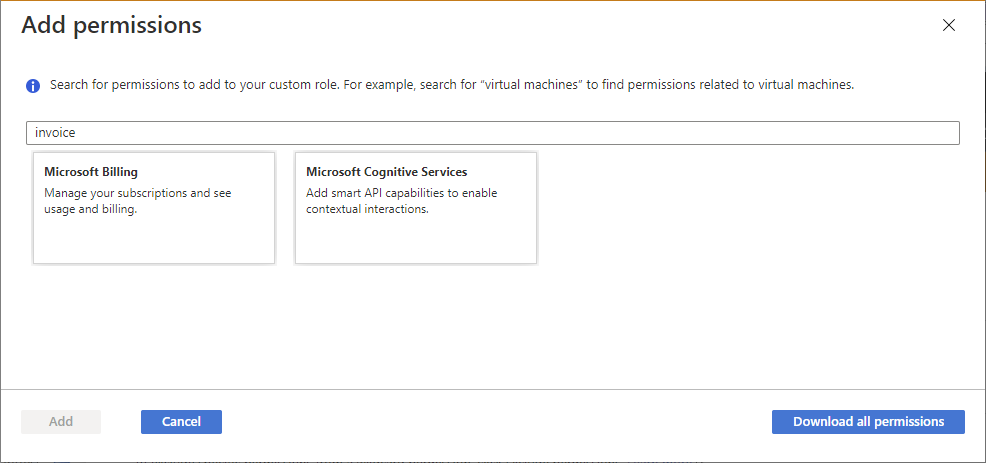
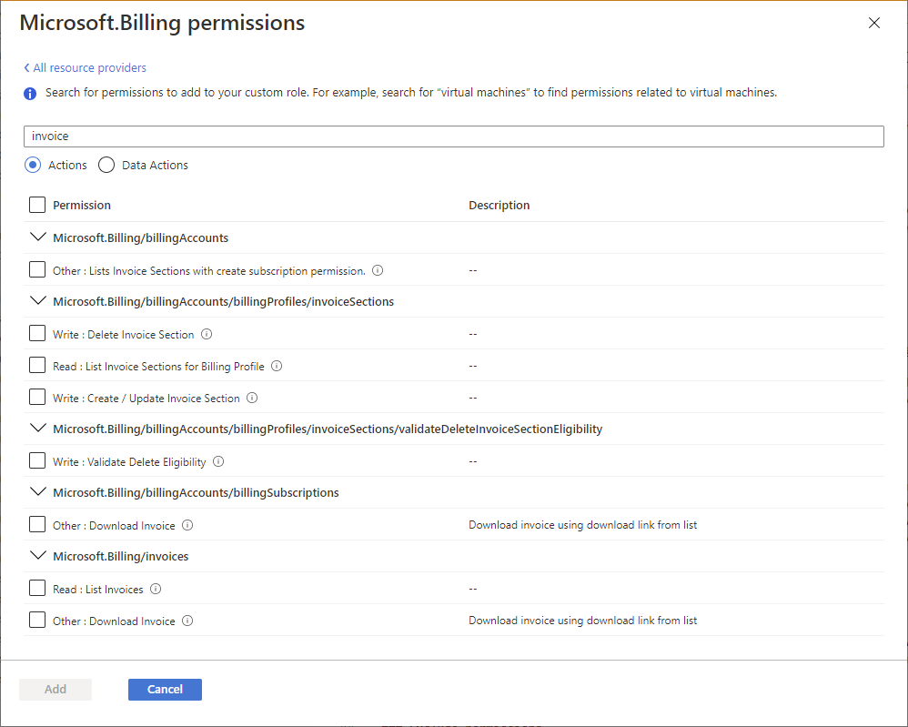

# Azure custom roles

If the [Azure built-in roles](built-in-roles.md) don't meet the specific needs of your organization, you can create your own custom roles. Just like built-in roles, you can assign custom roles to users, groups, and service principals at management group, subscription, and resource group scopes.

Custom roles can be shared between subscriptions that trust the same Microsoft Entra tenant. There is a limit of **5,000** custom roles per tenant. (For Microsoft Azure operated by 21Vianet, the limit is 2,000 custom roles.) Custom roles can be created using the Azure portal, Azure PowerShell, Azure CLI, or the REST API.

## Steps to create a custom role

Here are the basic steps to create a custom role.

1. Determine the permissions you need.

    When you create a custom role, you need to know the actions that are available to define your permissions. Typically, you start with an existing built-in role and then modify it for your needs. You will add the actions to the `Actions` or `NotActions` properties of the [role definition](role-definitions.md). If you have data actions, you will add those to the `DataActions` or `NotDataActions` properties.

    For more information, see the next section [How to determine the permissions you need](#how-to-determine-the-permissions-you-need).

1. Decide how you want to create the custom role.

    You can create custom roles using [Azure portal](custom-roles-portal.md), [Azure PowerShell](custom-roles-powershell.md), [Azure CLI](custom-roles-cli.md), or the [REST API](custom-roles-rest.md).

1. Create the custom role.

    The easiest way is to use the Azure portal. For steps on how to create a custom role using the Azure portal, see [Create or update Azure custom roles using the Azure portal](custom-roles-portal.md).

1. Test the custom role.

    Once you have your custom role, you have to test it to verify that it works as you expect. If you need to make adjustments later, you can update the custom role.

## How to determine the permissions you need

Azure has thousands of permissions that you can potentially include in your custom role. Here are some methods that can help you determine the permissions you will want to add to your custom role:

- Look at existing [built-in roles](built-in-roles.md).

    You might want to modify an existing role or combine permissions used in multiple roles.

- List the Azure services you want to grant access to.

- Determine the [resource providers that map to the Azure services](../azure-resource-manager/management/azure-services-resource-providers.md).

    Azure services expose their functionality and permissions through [resource providers](../azure-resource-manager/management/overview.md). For example, the Microsoft.Compute resource provider supplies virtual machine resources and the Microsoft.Billing resource provider supplies subscription and billing resources. Knowing the resource providers can help you narrow down and determine the permissions you need for your custom role.

    When you create a custom role using the Azure portal, you can also determine the resource providers by searching for keywords. This search functionality is described in [Create or update Azure custom roles using the Azure portal](custom-roles-portal.md#step-4-permissions).

    

- Search the [available permissions](resource-provider-operations.md) to find permissions you want to include.

    When you create a custom role using the Azure portal, you can search for permissions by keyword. For example, you can search for *virtual machine* or *billing* permissions. You can also download all of the permissions as a CSV file and then search this file. This search functionality is described in [Create or update Azure custom roles using the Azure portal](custom-roles-portal.md#step-4-permissions).

    

## Custom role example

The following shows what a custom role looks like as displayed using Azure PowerShell in JSON format. This custom role can be used for monitoring and restarting virtual machines.

```json
{
  "Name": "Virtual Machine Operator",
  "Id": "88888888-8888-8888-8888-888888888888",
  "IsCustom": true,
  "Description": "Can monitor and restart virtual machines.",
  "Actions": [
    "Microsoft.Storage/*/read",
    "Microsoft.Network/*/read",
    "Microsoft.Compute/*/read",
    "Microsoft.Compute/virtualMachines/start/action",
    "Microsoft.Compute/virtualMachines/restart/action",
    "Microsoft.Authorization/*/read",
    "Microsoft.ResourceHealth/availabilityStatuses/read",
    "Microsoft.Resources/subscriptions/resourceGroups/read",
    "Microsoft.Insights/alertRules/*",
    "Microsoft.Insights/diagnosticSettings/*",
    "Microsoft.Support/*"
  ],
  "NotActions": [],
  "DataActions": [],
  "NotDataActions": [],
  "AssignableScopes": [
    "/subscriptions/{subscriptionId1}",
    "/subscriptions/{subscriptionId2}",
    "/providers/Microsoft.Management/managementGroups/{groupId1}"
  ]
}
```

The following shows the same custom role as displayed using Azure CLI.

```json
[
  {
    "assignableScopes": [
      "/subscriptions/{subscriptionId1}",
      "/subscriptions/{subscriptionId2}",
      "/providers/Microsoft.Management/managementGroups/{groupId1}"
    ],
    "description": "Can monitor and restart virtual machines.",
    "id": "/subscriptions/{subscriptionId1}/providers/Microsoft.Authorization/roleDefinitions/88888888-8888-8888-8888-888888888888",
    "name": "88888888-8888-8888-8888-888888888888",
    "permissions": [
      {
        "actions": [
          "Microsoft.Storage/*/read",
          "Microsoft.Network/*/read",
          "Microsoft.Compute/*/read",
          "Microsoft.Compute/virtualMachines/start/action",
          "Microsoft.Compute/virtualMachines/restart/action",
          "Microsoft.Authorization/*/read",
          "Microsoft.ResourceHealth/availabilityStatuses/read",
          "Microsoft.Resources/subscriptions/resourceGroups/read",
          "Microsoft.Insights/alertRules/*",
          "Microsoft.Insights/diagnosticSettings/*",
          "Microsoft.Support/*"
        ],
        "dataActions": [],
        "notActions": [],
        "notDataActions": []
      }
    ],
    "roleName": "Virtual Machine Operator",
    "roleType": "CustomRole",
    "type": "Microsoft.Authorization/roleDefinitions"
  }
]
```

## Custom role properties

The following table describes what the custom role properties mean.

| Property | Required | Type | Description |
| --- | --- | --- | --- |
| `Name`</br>`roleName` | Yes | String | The display name of the custom role. While a role definition is a management group or subscription-level resource, a role definition can be used in multiple subscriptions that share the same Microsoft Entra tenant. This display name must be unique at the scope of the Microsoft Entra tenant. Can include letters, numbers, spaces, and special characters. Maximum number of characters is 512. |
| `Id`</br>`name` | Yes | String | The unique ID of the custom role. For Azure PowerShell and Azure CLI, this ID is automatically generated when you create a new role. |
| `IsCustom`</br>`roleType` | Yes | String | Indicates whether this is a custom role. Set to `true` or `CustomRole` for custom roles. Set to `false` or `BuiltInRole` for built-in roles. |
| `Description`</br>`description` | Yes | String | The description of the custom role. Can include letters, numbers, spaces, and special characters. Maximum number of characters is 2048. |
| `Actions`</br>`actions` | Yes | String[] | An array of strings that specifies the control plane actions that the role allows to be performed. For more information, see [Actions](role-definitions.md#actions). |
| `NotActions`</br>`notActions` | No | String[] | An array of strings that specifies the control plane actions that are excluded from the allowed `Actions`. For more information, see [NotActions](role-definitions.md#notactions). |
| `DataActions`</br>`dataActions` | No | String[] | An array of strings that specifies the data plane actions that the role allows to be performed to your data within that object. If you create a custom role with `DataActions`, that role can't be assigned at management group scope. For more information, see [DataActions](role-definitions.md#dataactions). |
| `NotDataActions`</br>`notDataActions` | No | String[] | An array of strings that specifies the data plane actions that are excluded from the allowed `DataActions`. For more information, see [NotDataActions](role-definitions.md#notdataactions). |
| `AssignableScopes`</br>`assignableScopes` | Yes | String[] | An array of strings that specifies the scopes that the custom role is available for assignment. Maximum number of `AssignableScopes` is 2,000. For more information, see [AssignableScopes](role-definitions.md#assignablescopes). |

Permission strings are case-insensitive. When you create your custom roles, the convention is to match the case that you see for permissions in [Azure resource provider operations](resource-provider-operations.md).

## Wildcard permissions

`Actions`, `NotActions`, `DataActions`, and `NotDataActions` support wildcards (`*`) to define permissions. A wildcard (`*`) extends a permission to everything that matches the action string you provide. For example, suppose that you wanted to add all the permissions related to Azure Cost Management and exports. You could add all of these action strings:

```
Microsoft.CostManagement/exports/action
Microsoft.CostManagement/exports/read
Microsoft.CostManagement/exports/write
Microsoft.CostManagement/exports/delete
Microsoft.CostManagement/exports/run/action
```

Instead of adding all of these strings, you could just add a wildcard string. For example, the following wildcard string is equivalent to the previous five strings. This would also include any future export permissions that might be added.

```
Microsoft.CostManagement/exports/*
```

> [!NOTE]
> It's recommended that you specify `Actions` and `DataActions` explicitly instead of using the wildcard (`*`) character. The additional access and permissions granted through future `Actions` or `DataActions` may be unwanted behavior using the wildcard.

## Who can create, delete, update, or view a custom role

Just like built-in roles, the `AssignableScopes` property specifies the scopes that the role is available for assignment. The `AssignableScopes` property for a custom role also controls who can create, delete, update, or view the custom role.

| Task | Action | Description |
| --- | --- | --- |
| Create/delete a custom role | `Microsoft.Authorization/ roleDefinitions/write` | Users that are granted this action on all the `AssignableScopes` of the custom role can create (or delete) custom roles for use in those scopes. For example, [Owners](built-in-roles.md#owner) and [User Access Administrators](built-in-roles.md#user-access-administrator) of management groups, subscriptions, and resource groups. |
| Update a custom role | `Microsoft.Authorization/ roleDefinitions/write` | Users that are granted this action on all the `AssignableScopes` of the custom role can update custom roles in those scopes. For example, [Owners](built-in-roles.md#owner) and [User Access Administrators](built-in-roles.md#user-access-administrator) of management groups, subscriptions, and resource groups. |
| View a custom role | `Microsoft.Authorization/ roleDefinitions/read` | Users that are granted this action at a scope can view the custom roles that are available for assignment at that scope. All built-in roles allow custom roles to be available for assignment. |

## Find role assignments to delete a custom role

Before you can delete a custom role, you must remove any role assignments that use the custom role. If you try to delete a custom role with role assignments, you get the message: `There are existing role assignments referencing role (code: RoleDefinitionHasAssignments)`.

Here are steps to help find the role assignments before deleting a custom role:

- List the [custom role definition](role-definitions-list.md).
- In the [AssignableScopes](role-definitions.md#assignablescopes) section, get the management groups, subscriptions, and resource groups.
- Iterate over the `AssignableScopes` and [list the role assignments](role-assignments-list-portal.md).
- [Remove the role assignments](role-assignments-remove.md) that use the custom role.
- [Delete the custom role](custom-roles-portal.md#delete-a-custom-role).

## Custom role limits

The following list describes the limits for custom roles.

- Each tenant can have up to **5000** custom roles.
- Microsoft Azure operated by 21Vianet can have up to 2000 custom roles for each tenant.
- You cannot set `AssignableScopes` to the root scope (`"/"`).
- You cannot use wildcards (`*`) in `AssignableScopes`. This wildcard restriction helps ensure a user can't potentially obtain access to a scope by updating the role definition.
- You can have only one wildcard in an action string.
- You can define only one management group in `AssignableScopes` of a custom role.
- Azure Resource Manager doesn't validate the management group's existence in the role definition's `AssignableScopes`.
- Custom roles with `DataActions` can't be assigned at the management group scope.
- You can create a custom role with `DataActions` and one management group in `AssignableScopes`. You can't assign the custom role at the management group scope itself; however, you can assign the custom role at the scope of the subscriptions within the management group. This can be helpful if you need to create a single custom role with `DataActions` that needs to be assigned in multiple subscriptions, instead of creating a separate custom role for each subscription.

For more information about custom roles and management groups, see [What are Azure management groups?](../governance/management-groups/overview.md#azure-custom-role-definition-and-assignment).

## Input and output formats

To create a custom role using the command line, you typically use JSON to specify the properties you want for the custom role. Depending on the tools you use, the input and output formats will look slightly different. This section lists the input and output formats depending on the tool.

### Azure PowerShell

To create a custom role using Azure PowerShell, you must provide following input.

```json
{
  "Name": "",
  "Description": "",
  "Actions": [],
  "NotActions": [],
  "DataActions": [],
  "NotDataActions": [],
  "AssignableScopes": []
}
```

To update a custom role using Azure PowerShell, you must provide the following input. Note that the `Id` property has been added. 

```json
{
  "Name": "",
  "Id": "",
  "Description": "",
  "Actions": [],
  "NotActions": [],
  "DataActions": [],
  "NotDataActions": [],
  "AssignableScopes": []
}
```

The following shows an example of the output when you list a custom role using Azure PowerShell and the [ConvertTo-Json](/powershell/module/microsoft.powershell.utility/convertto-json) command. 

```json
{
  "Name": "",
  "Id": "",
  "IsCustom": true,
  "Description": "",
  "Actions": [],
  "NotActions": [],
  "DataActions": [],
  "NotDataActions": [],
  "AssignableScopes": []
}
```

### Azure CLI

To create or update a custom role using Azure CLI, you must provide following input. This format is the same format when you create a custom role using Azure PowerShell.

```json
{
  "Name": "",
  "Description": "",
  "Actions": [],
  "NotActions": [],
  "DataActions": [],
  "NotDataActions": [],
  "AssignableScopes": []
}
```

The following shows an example of the output when you list a custom role using Azure CLI.

```json
[
  {
    "assignableScopes": [],
    "description": "",
    "id": "",
    "name": "",
    "permissions": [
      {
        "actions": [],
        "dataActions": [],
        "notActions": [],
        "notDataActions": []
      }
    ],
    "roleName": "",
    "roleType": "CustomRole",
    "type": "Microsoft.Authorization/roleDefinitions"
  }
]
```

### REST API

To create or update a custom role using the REST API, you must provide following input. This format is the same format that gets generated when you create a custom role using the Azure portal.

```json
{
  "properties": {
    "roleName": "",
    "description": "",
    "assignableScopes": [],
    "permissions": [
      {
        "actions": [],
        "notActions": [],
        "dataActions": [],
        "notDataActions": []
      }
    ]
  }
}
```

The following shows an example of the output when you list a custom role using the REST API.

```json
{
    "properties": {
        "roleName": "",
        "type": "CustomRole",
        "description": "",
        "assignableScopes": [],
        "permissions": [
            {
                "actions": [],
                "notActions": [],
                "dataActions": [],
                "notDataActions": []
            }
        ],
        "createdOn": "",
        "updatedOn": "",
        "createdBy": "",
        "updatedBy": ""
    },
    "id": "",
    "type": "Microsoft.Authorization/roleDefinitions",
    "name": ""
}
```

## Next steps

- [Tutorial: Create an Azure custom role using Azure PowerShell](tutorial-custom-role-powershell.md)
- [Tutorial: Create an Azure custom role using Azure CLI](tutorial-custom-role-cli.md)
- [Understand Azure role definitions](role-definitions.md)
- [Troubleshoot Azure RBAC](troubleshooting.md)
