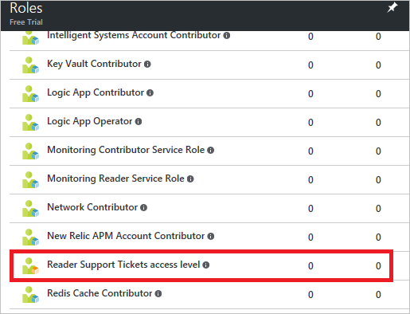
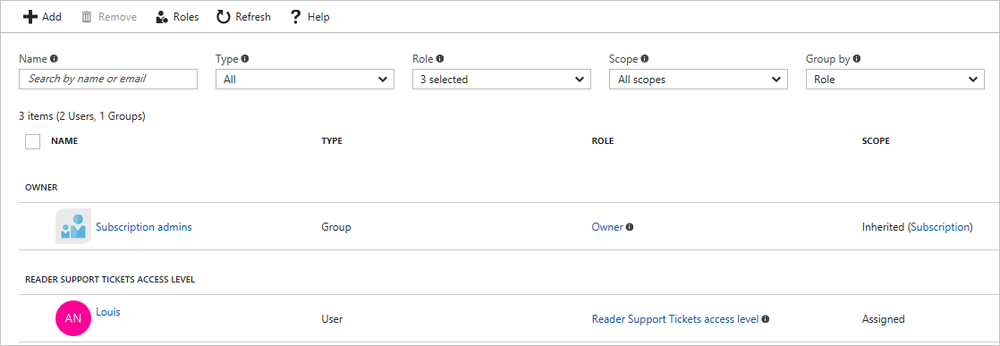
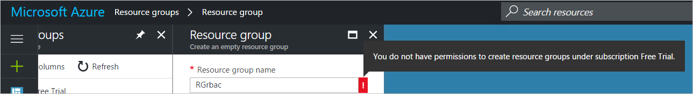
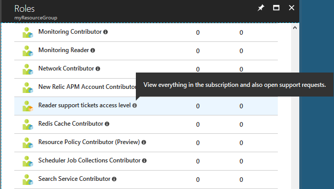

# Create custom roles in Azure

If the [built-in roles](built-in-roles.md) don't meet your specific access needs, you can create your own custom roles. Just like built-in roles, you can assign custom roles to users, groups, and service principals at subscription, resource group, and resource scopes. Custom roles are stored in an Azure Active Directory (Azure AD) tenant and can be shared across subscriptions. Custom roles can be created using Azure PowerShell, Azure CLI, or the REST API. This article describes an example of how to get started creating custom roles using PowerShell and Azure CLI.

## Create a custom role to open support requests using PowerShell

To create a custom role, you can start with a built-in role, edit it, and then create a new role. For this example, the built-in [Reader](built-in-roles.md#reader) role is customized to create a custom role named  "Reader support tickets access level". It allows the user to view everything in the subscription and also open support requests.

> [!NOTE]
> The only two built-in roles that allow a user to open support requests are [Owner](built-in-roles.md#owner) and [Contributor](built-in-roles.md#contributor). For a user to be able to open support requests, he must be assigned a role at the subscription scope, because all support requests are created based on an Azure subscription.

In PowerShell, use the [Get-AzureRmRoleDefinition](/powershell/module/azurerm.resources/get-azurermroledefinition) command to export the [Reader](built-in-roles.md#reader) role in JSON format.

```azurepowershell
Get-AzureRmRoleDefinition -Name "Reader" | ConvertTo-Json | Out-File C:\rbacrole2.json
```

The following shows the JSON output for the [Reader](built-in-roles.md#reader) role. A typical role is composed of three main sections, `Actions`, `NotActions`, and `AssignableScopes`. A role can also optionally include `DataActions` and `NotDataActions` (currently in preview). The `Actions` section lists all the permitted operations for the role. To exclude operations from `Actions`, you add them to `NotActions`. The effective permissions is computed by subtracting the `NotActions` operations from the `Actions` operations.

```json
{
    "Name":  "Reader",
    "Id":  "acdd72a7-3385-48ef-bd42-f606fba81ae7",
    "IsCustom":  false,
    "Description":  "Lets you view everything, but not make any changes.",
    "Actions":  [
                    "*/read"
                ],
    "NotActions":  [

                   ],
    "DataActions":  [

                    ],
    "NotDataActions":  [

                       ],
    "AssignableScopes":  [
                             "/"
                         ]
}
```

Next, you edit the JSON output to create your custom role. In this case, to create support tickets, the `Microsoft.Support/*` operation must be added. Each operation is made available from a resource provider. To get a list of the operations for a resource provider, you can use the [Get-AzureRmProviderOperation](/powershell/module/azurerm.resources/get-azurermprovideroperation) command or see [Azure Resource Manager resource provider operations](resource-provider-operations.md).

It's mandatory that the role contains the explicit subscription IDs where it is used. The subscription IDs are listed under `AssignableScopes`, otherwise you will not be allowed to import the role into your subscription.

Finally, you must set the `IsCustom` property to `true` to specify that this is a custom role.

```json
{
    "Name":  "Reader support tickets access level",
    "IsCustom":  true,
    "Description":  "View everything in the subscription and also open support requests.",
    "Actions":  [
                    "*/read",
                    "Microsoft.Support/*"
                ],
    "NotActions":  [

                   ],
    "DataActions":  [

                    ],
    "NotDataActions":  [

                       ],
    "AssignableScopes":  [
                             "/subscriptions/11111111-1111-1111-1111-111111111111"
                         ]
}
```

To create the new custom role, you use the [New-AzureRmRoleDefinition](/powershell/module/azurerm.resources/new-azurermroledefinition) command and provide the updated JSON role definition file.

```azurepowershell
New-AzureRmRoleDefinition -InputFile "C:\rbacrole2.json"
```

After running [New-AzureRmRoleDefinition](/powershell/module/azurerm.resources/new-azurermroledefinition), the new custom role is available in the Azure portal and can be assigned to users.






Users with this custom role can create new support requests.


Users with this custom role cannot perform other actions, such as create VMs or create resource groups.




## Create a custom role to open support requests using Azure CLI

The steps to create a custom role using Azure CLI are similar to using PowerShell, except that the JSON output is different.

For this example, you can start with the built-in [Reader](built-in-roles.md#reader) role. To list the actions of the [Reader](built-in-roles.md#reader) role, use the [az role definition list](/cli/azure/role/definition#az_role_definition_list) command.

```azurecli
az role definition list --name "Reader" --output json
```

```json
[
  {
    "additionalProperties": {},
    "assignableScopes": [
      "/"
    ],
    "description": "Lets you view everything, but not make any changes.",
    "id": "/subscriptions/11111111-1111-1111-1111-111111111111/providers/Microsoft.Authorization/roleDefinitions/acdd72a7-3385-48ef-bd42-f606fba81ae7",
    "name": "acdd72a7-3385-48ef-bd42-f606fba81ae7",
    "permissions": [
      {
        "actions": [
          "*/read"
        ],
        "additionalProperties": {},
        "dataActions": [],
        "notActions": [],
        "notDataActions": []
      }
    ],
    "roleName": "Reader",
    "roleType": "BuiltInRole",
    "type": "Microsoft.Authorization/roleDefinitions"
  }
]
```

Create a JSON file with the following format. The `Microsoft.Support/*` operation has been added in the `Actions` sections so that this user can open support requests while continuing to be a reader. You must add the subscription ID where this role will be used in the `AssignableScopes` section.

```json
{
    "Name":  "Reader support tickets access level",
    "IsCustom":  true,
    "Description":  "View everything in the subscription and also open support requests.",
    "Actions":  [
                    "*/read",
                    "Microsoft.Support/*"
                ],
    "NotActions":  [

                   ],
    "DataActions":  [

                    ],
    "NotDataActions":  [

                       ],
    "AssignableScopes": [
                            "/subscriptions/11111111-1111-1111-1111-111111111111"
                        ]
}
```

To create the new custom role, use the [az role definition create](/cli/azure/role/definition#az_role_definition_create) command.

```azurecli
az role definition create --role-definition ~/roles/rbacrole1.json
```

The new custom role is now available in the Azure portal and the process to use this role is the same as in the previous PowerShell section.




## See also
* [Manage role-based access control with AzurePowerShell](role-assignments-powershell.md)
* [Manage role-based access control with Azure CLI](role-assignments-cli.md)
* [Manage role-based access control with the REST API](role-assignments-rest.md)
