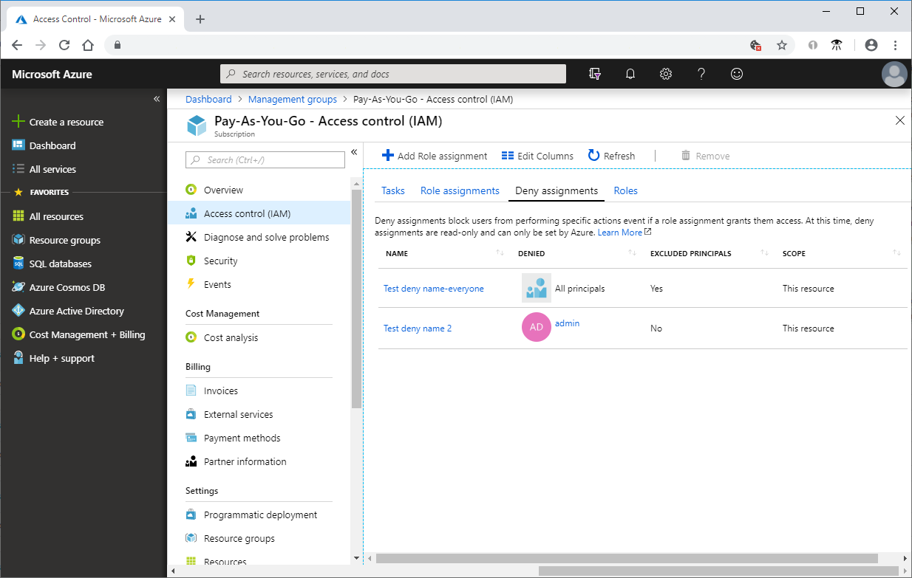
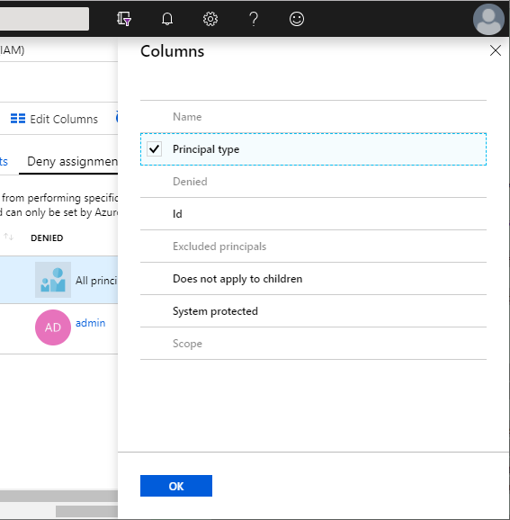
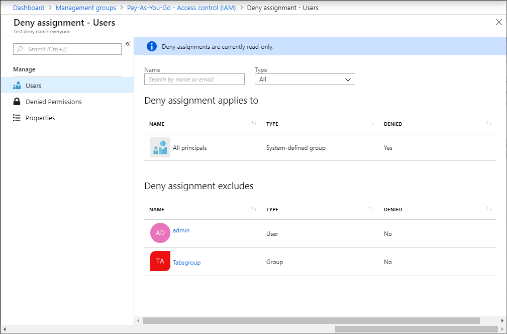
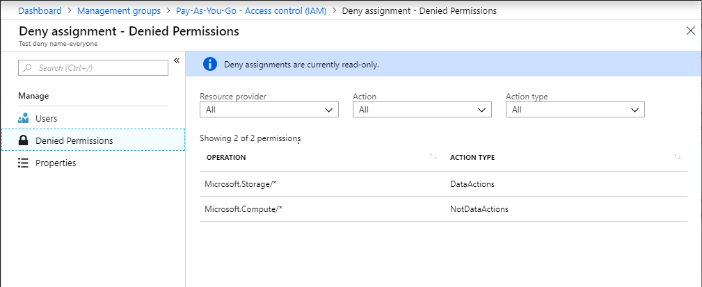
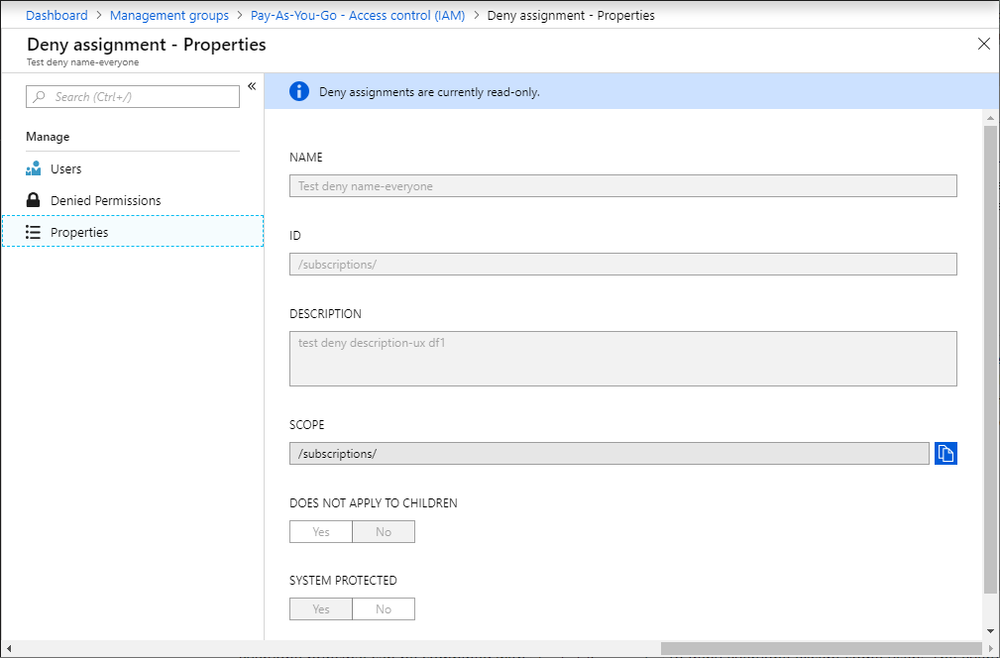

# List Azure deny assignments using the Azure portal

[Azure deny assignments](deny-assignments.md) block users from performing specific Azure resource actions even if a role assignment grants them access. This article describes how to list deny assignments using the Azure portal.

> [!NOTE]
> You can't directly create your own deny assignments. For information about how deny assignments are created, see [Azure deny assignments](deny-assignments.md).

## Prerequisites

To get information about a deny assignment, you must have:

- `Microsoft.Authorization/denyAssignments/read` permission, which is included in most [Azure built-in roles](built-in-roles.md).

## List deny assignments

Follow these steps to list deny assignments at the subscription or management group scope.

1. In the Azure portal, click **All services** and then **Management groups** or **Subscriptions**.

1. Click the management group or subscription you want to list.

1. Click **Access control (IAM)**.

1. Click the **Deny assignments** tab (or click the **View** button on the View deny assignments tile).

    If there are any deny assignments at this scope or inherited to this scope, they will be listed.

    

1. To display additional columns, click **Edit Columns**.

    

    |  |  |
    | --- | --- |
    | **Name** | Name of the deny assignment. |
    | **Principal type** | User, group, system-defined group, or service principal. |
    | **Denied**  | Name of the security principal that is included in the deny assignment. |
    | **Id** | Unique identifier for the deny assignment. |
    | **Excluded principals** | Whether there are security principals that are excluded from the deny assignment. |
    | **Does not apply to children** | Whether the deny assignment is inherited to subscopes. |
    | **System protected** | Whether the deny assignment is managed by Azure. Currently, always Yes. |
    | **Scope** | Management group, subscription, resource group, or resource. |

1. Add a checkmark to any of the enabled items and then click **OK** to display the selected columns.

## List details about a deny assignment

Follow these steps to list additional details about a deny assignment.

1. Open the **Deny assignments** pane as described in the previous section.

1. Click the deny assignment name to open the **Users** blade.

    

    The **Users** blade includes the following two sections.

    |  |  |
    | --- | --- |
    | **Deny assignment applies to**  | Security principals that the deny assignment applies to. |
    | **Deny assignment excludes** | Security principals that are excluded from the deny assignment. |

    **System-Defined Principal** represents all users, groups, service principals, and managed identities in an Azure AD directory.

1. To see a list of the permissions that are denied, click **Denied Permissions**.

    

    | Action type | Description |
    | --- | --- |
    | **Actions**  | Denied management operations. |
    | **NotActions** | Management operations excluded from denied management operation. |
    | **DataActions**  | Denied data operations. |
    | **NotDataActions** | Data operations excluded from denied data operation. |

    For the example shown in the previous screenshot, the following are the effective permissions:

    - All storage operations on the data plane are denied except for compute operations.

1. To see the properties for a deny assignment, click **Properties**.

    

    On the **Properties** blade, you can see the deny assignment name, ID, description, and scope. The **Does not apply to children** switch indicates whether the deny assignment is inherited to subscopes. The **System protected** switch indicates whether this deny assignment is managed by Azure. Currently, this is **Yes** in all cases.

## Next steps

* [Understand Azure deny assignments](deny-assignments.md)
* [List Azure deny assignments using Azure PowerShell](deny-assignments-powershell.md)
