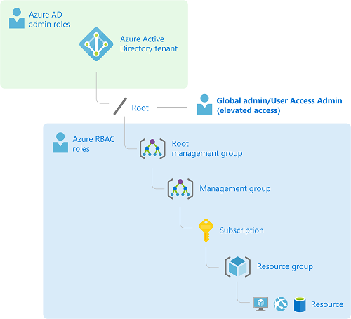
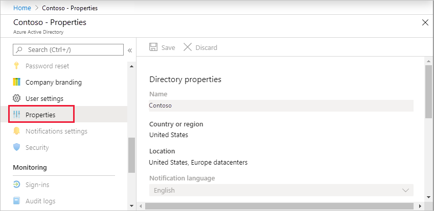
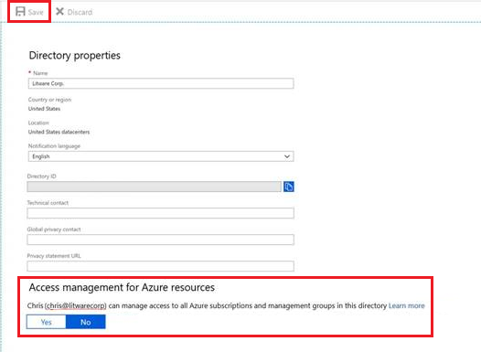
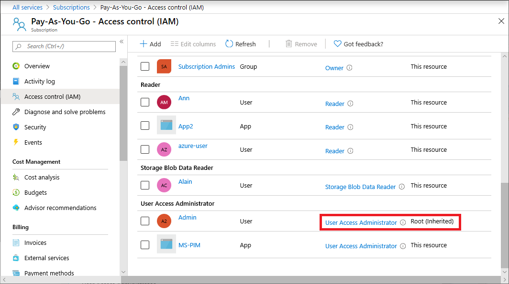
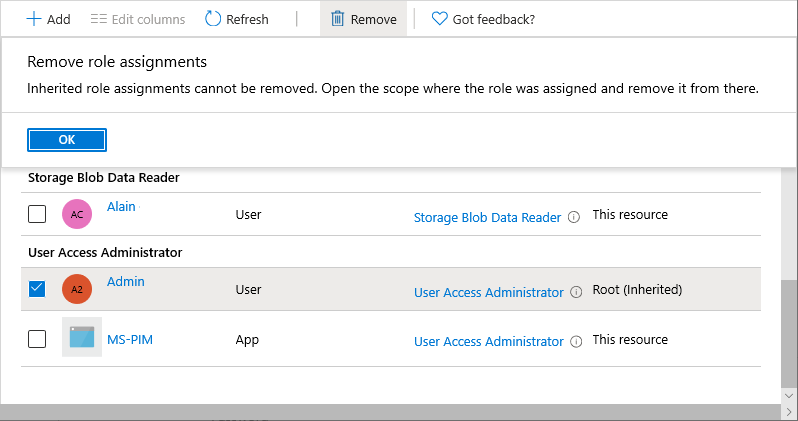

# Elevate access to manage all Azure subscriptions and management groups

As a Global Administrator in Azure Active Directory (Azure AD), you might not have access to all subscriptions and management groups in your directory. This article describes the ways that you can elevate your access to all subscriptions and management groups.

[!INCLUDE [gdpr-dsr-and-stp-note](../../includes/gdpr-dsr-and-stp-note.md)]

## Why would you need to elevate your access?

If you are a Global Administrator, there might be times when you want to do the following actions:

- Regain access to an Azure subscription or management group when a user has lost access
- Grant another user or yourself access to an Azure subscription or management group
- See all Azure subscriptions or management groups in an organization
- Allow an automation app (such as an invoicing or auditing app) to access all Azure subscriptions or management groups

## How does elevated access work?

Azure AD and Azure resources are secured independently from one another. That is, Azure AD role assignments do not grant access to Azure resources, and Azure role assignments do not grant access to Azure AD. However, if you are a [Global Administrator](../active-directory/roles/permissions-reference.md#global-administrator) in Azure AD, you can assign yourself access to all Azure subscriptions and management groups in your directory. Use this capability if you don't have access to Azure subscription resources, such as virtual machines or storage accounts, and you want to use your Global Administrator privilege to gain access to those resources.

When you elevate your access, you will be assigned the [User Access Administrator](built-in-roles.md#user-access-administrator) role in Azure at root scope (`/`). This allows you to view all resources and assign access in any subscription or management group in the directory. User Access Administrator role assignments can be removed using Azure PowerShell, Azure CLI, or the REST API.

You should remove this elevated access once you have made the changes you need to make at root scope.



## Azure portal

### Elevate access for a Global Administrator

Follow these steps to elevate access for a Global Administrator using the Azure portal.

1. Sign in to the [Azure portal](https://portal.azure.com) or the [Azure Active Directory admin center](https://aad.portal.azure.com) as a Global Administrator.

    If you are using Azure AD Privileged Identity Management, [activate your Global Administrator role assignment](../active-directory/privileged-identity-management/pim-how-to-activate-role.md).

1. Open **Azure Active Directory**.

1. Under **Manage**, select **Properties**.

   

1. Under **Access management for Azure resources**, set the toggle to **Yes**.

   

   When you set the toggle to **Yes**, you are assigned the User Access Administrator role in Azure RBAC at root scope (/). This grants you permission to assign roles in all Azure subscriptions and management groups associated with this Azure AD directory. This toggle is only available to users who are assigned the Global Administrator role in Azure AD.

   When you set the toggle to **No**, the User Access Administrator role in Azure RBAC is removed from your user account. You can no longer assign roles in all Azure subscriptions and management groups that are associated with this Azure AD directory. You can view and manage only the Azure subscriptions and management groups to which you have been granted access.

    > [!NOTE]
    > If you're using [Privileged Identity Management](../active-directory/privileged-identity-management/pim-configure.md), deactivating your role assignment does not change the **Access management for Azure resources** toggle to **No**. To maintain least privileged access, we recommend that you set this toggle to **No** before you deactivate your role assignment.
    
1. Click **Save** to save your setting.

   This setting is not a global property and applies only to the currently signed in user. You can't elevate access for all members of the Global Administrator role.

1. Sign out and sign back in to refresh your access.

    You should now have access to all subscriptions and management groups in your directory. When you view the Access control (IAM) pane, you'll notice that you have been assigned the User Access Administrator role at root scope.

   

1. Make the changes you need to make at elevated access.

    For information about assigning roles, see [Assign Azure roles using the Azure portal](role-assignments-portal.md). If you are using Privileged Identity Management, see [Discover Azure resources to manage](../active-directory/privileged-identity-management/pim-resource-roles-discover-resources.md) or [Assign Azure resource roles](../active-directory/privileged-identity-management/pim-resource-roles-assign-roles.md).

1. Perform the steps in the following section to remove your elevated access.

### Remove elevated access

To remove the User Access Administrator role assignment at root scope (`/`), follow these steps.

1. Sign in as the same user that was used to elevate access.

1. In the navigation list, click **Azure Active Directory** and then click **Properties**.

1. Set the **Access management for Azure resources** toggle back to **No**. Since this is a per-user setting, you must be signed in as the same user as was used to elevate access.

    If you try to remove the User Access Administrator role assignment on the Access control (IAM) pane, you'll see the following message. To remove the role assignment, you must set the toggle back to **No** or use Azure PowerShell, Azure CLI, or the REST API.

    

1. Sign out as Global Administrator.

    If you are using Privileged Identity Management, deactivate your Global Administrator role assignment.

    > [!NOTE]
    > If you're using [Privileged Identity Management](../active-directory/privileged-identity-management/pim-configure.md), deactivating your role assignment does not change the **Access management for Azure resources** toggle to **No**. To maintain least privileged access, we recommend that you set this toggle to **No** before you deactivate your role assignment.

## Azure PowerShell

[!INCLUDE [az-powershell-update](../../includes/updated-for-az.md)]

### List role assignment at root scope (/)

To list the User Access Administrator role assignment for a user at root scope (`/`), use the [Get-AzRoleAssignment](/powershell/module/az.resources/get-azroleassignment) command.

```azurepowershell
Get-AzRoleAssignment | where {$_.RoleDefinitionName -eq "User Access Administrator" `
  -and $_.SignInName -eq "<username@example.com>" -and $_.Scope -eq "/"}
```

```Example
RoleAssignmentId   : /providers/Microsoft.Authorization/roleAssignments/11111111-1111-1111-1111-111111111111
Scope              : /
DisplayName        : username
SignInName         : username@example.com
RoleDefinitionName : User Access Administrator
RoleDefinitionId   : 18d7d88d-d35e-4fb5-a5c3-7773c20a72d9
ObjectId           : 22222222-2222-2222-2222-222222222222
ObjectType         : User
CanDelegate        : False
```

### Remove elevated access

To remove the User Access Administrator role assignment for yourself or another user at root scope (`/`), follow these steps.

1. Sign in as a user that can remove elevated access. This can be the same user that was used to elevate access or another Global Administrator with elevated access at root scope.

1. Use the [Remove-AzRoleAssignment](/powershell/module/az.resources/remove-azroleassignment) command to remove the User Access Administrator role assignment.

    ```azurepowershell
    Remove-AzRoleAssignment -SignInName <username@example.com> `
      -RoleDefinitionName "User Access Administrator" -Scope "/"
    ```

## Azure CLI

### Elevate access for a Global Administrator

Use the following basic steps to elevate access for a Global Administrator using the Azure CLI.

1. Use the [az rest](/cli/azure/reference-index#az_rest) command to call the `elevateAccess` endpoint, which grants you the User Access Administrator role at root scope (`/`).

    ```azurecli
    az rest --method post --url "/providers/Microsoft.Authorization/elevateAccess?api-version=2016-07-01"
    ```

1. Make the changes you need to make at elevated access.

    For information about assigning roles, see [Assign Azure roles using the Azure CLI](role-assignments-cli.md).

1. Perform the steps in a later section to remove your elevated access.

### List role assignment at root scope (/)

To list the User Access Administrator role assignment for a user at root scope (`/`), use the [az role assignment list](/cli/azure/role/assignment#az_role_assignment_list) command.

```azurecli
az role assignment list --role "User Access Administrator" --scope "/"
```

```Example
[
  {
    "canDelegate": null,
    "id": "/providers/Microsoft.Authorization/roleAssignments/11111111-1111-1111-1111-111111111111",
    "name": "11111111-1111-1111-1111-111111111111",
    "principalId": "22222222-2222-2222-2222-222222222222",
    "principalName": "username@example.com",
    "principalType": "User",
    "roleDefinitionId": "/providers/Microsoft.Authorization/roleDefinitions/18d7d88d-d35e-4fb5-a5c3-7773c20a72d9",
    "roleDefinitionName": "User Access Administrator",
    "scope": "/",
    "type": "Microsoft.Authorization/roleAssignments"
  }
]

```

### Remove elevated access

To remove the User Access Administrator role assignment for yourself or another user at root scope (`/`), follow these steps.

1. Sign in as a user that can remove elevated access. This can be the same user that was used to elevate access or another Global Administrator with elevated access at root scope.

1. Use the [az role assignment delete](/cli/azure/role/assignment#az_role_assignment_delete) command to remove the User Access Administrator role assignment.

    ```azurecli
    az role assignment delete --assignee username@example.com --role "User Access Administrator" --scope "/"
    ```

## REST API

### Elevate access for a Global Administrator

Use the following basic steps to elevate access for a Global Administrator using the REST API.

1. Using REST, call `elevateAccess`, which grants you the User Access Administrator role at root scope (`/`).

   ```http
   POST https://management.azure.com/providers/Microsoft.Authorization/elevateAccess?api-version=2016-07-01
   ```

1. Make the changes you need to make at elevated access.

    For information about assigning roles, see [Assign Azure roles using the REST API](role-assignments-rest.md).

1. Perform the steps in a later section to remove your elevated access.

### List role assignments at root scope (/)

You can list all of the role assignments for a user at root scope (`/`).

- Call [GET roleAssignments](/rest/api/authorization/roleassignments/listforscope) where `{objectIdOfUser}` is the object ID of the user whose role assignments you want to retrieve.

   ```http
   GET https://management.azure.com/providers/Microsoft.Authorization/roleAssignments?api-version=2015-07-01&$filter=principalId+eq+'{objectIdOfUser}'
   ```

### List deny assignments at root scope (/)

You can list all of the deny assignments for a user at root scope (`/`).

- Call GET denyAssignments where `{objectIdOfUser}` is the object ID of the user whose deny assignments you want to retrieve.

   ```http
   GET https://management.azure.com/providers/Microsoft.Authorization/denyAssignments?api-version=2018-07-01-preview&$filter=gdprExportPrincipalId+eq+'{objectIdOfUser}'
   ```

### Remove elevated access

When you call `elevateAccess`, you create a role assignment for yourself, so to revoke those privileges you need to remove the User Access Administrator role assignment for yourself at root scope (`/`).

1. Call [GET roleDefinitions](/rest/api/authorization/roledefinitions/get) where `roleName` equals User Access Administrator to determine the name ID of the User Access Administrator role.

    ```http
    GET https://management.azure.com/providers/Microsoft.Authorization/roleDefinitions?api-version=2015-07-01&$filter=roleName+eq+'User Access Administrator'
    ```

    ```json
    {
      "value": [
        {
          "properties": {
      "roleName": "User Access Administrator",
      "type": "BuiltInRole",
      "description": "Lets you manage user access to Azure resources.",
      "assignableScopes": [
        "/"
      ],
      "permissions": [
        {
          "actions": [
            "*/read",
            "Microsoft.Authorization/*",
            "Microsoft.Support/*"
          ],
          "notActions": []
        }
      ],
      "createdOn": "0001-01-01T08:00:00.0000000Z",
      "updatedOn": "2016-05-31T23:14:04.6964687Z",
      "createdBy": null,
      "updatedBy": null
          },
          "id": "/providers/Microsoft.Authorization/roleDefinitions/18d7d88d-d35e-4fb5-a5c3-7773c20a72d9",
          "type": "Microsoft.Authorization/roleDefinitions",
          "name": "18d7d88d-d35e-4fb5-a5c3-7773c20a72d9"
        }
      ],
      "nextLink": null
    }
    ```

    Save the ID from the `name` parameter, in this case `18d7d88d-d35e-4fb5-a5c3-7773c20a72d9`.

1. You also need to list the role assignment for the directory administrator at directory scope. List all assignments at directory scope for the `principalId` of the directory administrator who made the elevate access call. This will list all assignments in the directory for the objectid.

    ```http
    GET https://management.azure.com/providers/Microsoft.Authorization/roleAssignments?api-version=2015-07-01&$filter=principalId+eq+'{objectid}'
    ```
    	
    >[!NOTE] 
    >A directory administrator should not have many assignments, if the previous query returns too many assignments, you can also query for all assignments just at directory scope level, then filter the results: 
    > `GET https://management.azure.com/providers/Microsoft.Authorization/roleAssignments?api-version=2015-07-01&$filter=atScope()`
    		
1. The previous calls return a list of role assignments. Find the role assignment where the scope is `"/"` and the `roleDefinitionId` ends with the role name ID you found in step 1 and `principalId` matches the objectId of the directory administrator. 
	
    Sample role assignment:
    
    ```json
    {
      "value": [
        {
          "properties": {
            "roleDefinitionId": "/providers/Microsoft.Authorization/roleDefinitions/18d7d88d-d35e-4fb5-a5c3-7773c20a72d9",
            "principalId": "{objectID}",
            "scope": "/",
            "createdOn": "2016-08-17T19:21:16.3422480Z",
            "updatedOn": "2016-08-17T19:21:16.3422480Z",
            "createdBy": "22222222-2222-2222-2222-222222222222",
            "updatedBy": "22222222-2222-2222-2222-222222222222"
          },
          "id": "/providers/Microsoft.Authorization/roleAssignments/11111111-1111-1111-1111-111111111111",
          "type": "Microsoft.Authorization/roleAssignments",
          "name": "11111111-1111-1111-1111-111111111111"
        }
      ],
      "nextLink": null
    }
    ```
    
    Again, save the ID from the `name` parameter, in this case 11111111-1111-1111-1111-111111111111.

1. Finally, Use the role assignment ID to remove the assignment added by `elevateAccess`:

    ```http
    DELETE https://management.azure.com/providers/Microsoft.Authorization/roleAssignments/11111111-1111-1111-1111-111111111111?api-version=2015-07-01
    ```

## Next steps

- [Understand the different roles](rbac-and-directory-admin-roles.md)
- [Assign Azure roles using the REST API](role-assignments-rest.md)
