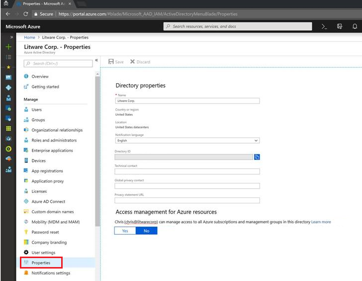

# Elevate access for a Global Administrator in Azure Active Directory

If you are a [Global Administrator](../active-directory/users-groups-roles/directory-assign-admin-roles.md#company-administrator) in Azure Active Directory (Azure AD), there might be times when you want to do the following:

- Regain access to an Azure subscription when a user has lost access
- Grant another user or yourself access to an Azure subscription
- See all Azure subscriptions in an organization
- Allow an automation app (such as an invoicing or auditing app) to access all Azure subscriptions

This article describes the different ways that you can elevate your access in Azure AD.

[!INCLUDE [gdpr-dsr-and-stp-note](../../includes/gdpr-dsr-and-stp-note.md)]

## Overview

Azure AD and Azure resources are secured independently from one another. That is, Azure AD role assignments do not grant access to Azure resources, and Azure role assignments do not grant access to Azure AD. However, if you are a Global Administrator in Azure AD, you can assign yourself access to all Azure subscriptions and management groups in your directory. Use this capability if you don't have access to Azure subscription resources, such as virtual machines or storage accounts, and you want to use your Global Administrator privilege to gain access to those resources.

When you elevate your access, you will be assigned the [User Access Administrator](built-in-roles.md#user-access-administrator) role in Azure at root scope (`/`). This allows you to view all resources and assign access in any subscription or management group in the directory. User Access Administrator role assignments can be removed using PowerShell.

You should remove this elevated access once you have made the changes you need to make at root scope.


## Azure portal

Follow these steps to elevate access for a Global Administrator using the Azure portal.

1. Sign in to the [Azure portal](https://portal.azure.com) or the [Azure Active Directory admin center](https://aad.portal.azure.com) as a Global Administrator.

1. In the navigation list, click **Azure Active Directory** and then click **Properties**.

   

1. Under **Access management for Azure resources**, set the switch to **Yes**.

   

   When you set the switch to **Yes**, you are assigned the User Access Administrator role in Azure RBAC at the root scope (/). This grants you permission to assign roles in all Azure subscriptions and management groups associated with this Azure AD directory. This switch is only available to users who are assigned the Global Administrator role in Azure AD.

   When you set the switch to **No**, the User Access Administrator role in Azure RBAC is removed from your user account. You can no longer assign roles in all Azure subscriptions and management groups that are associated with this Azure AD directory. You can view and manage only the Azure subscriptions and management groups to which you have been granted access.

1. Click **Save** to save your setting.

   This setting is not a global property and applies only to the currently logged in user.

1. Perform the tasks you need to make at the elevated access. When you are done, set the switch back to **No**.

## Azure PowerShell

### List role assignment at the root scope (/)

To list the User Access Administrator role assignment for a user at the root scope (`/`), use the [Get-AzureRmRoleAssignment](/powershell/module/azurerm.resources/get-azurermroleassignment) command.

```azurepowershell
Get-AzureRmRoleAssignment | where {$_.RoleDefinitionName -eq "User Access Administrator" `
  -and $_.SignInName -eq "<username@example.com>" -and $_.Scope -eq "/"}
```

```Example
RoleAssignmentId   : /providers/Microsoft.Authorization/roleAssignments/098d572e-c1e5-43ee-84ce-8dc459c7e1f0
Scope              : /
DisplayName        : username
SignInName         : username@example.com
RoleDefinitionName : User Access Administrator
RoleDefinitionId   : 18d7d88d-d35e-4fb5-a5c3-7773c20a72d9
ObjectId           : d65fd0e9-c185-472c-8f26-1dafa01f72cc
ObjectType         : User
```

### Remove a role assignment at the root scope (/)

To remove a User Access Administrator role assignment for a user at the root scope (`/`), use the [Remove-AzureRmRoleAssignment](/powershell/module/azurerm.resources/remove-azurermroleassignment) command.

```azurepowershell
Remove-AzureRmRoleAssignment -SignInName <username@example.com> `
  -RoleDefinitionName "User Access Administrator" -Scope "/"
```

## REST API

### Elevate access for a Global Administrator

Use the following basic steps to elevate access for a Global Administrator using the REST API.

1. Using REST, call `elevateAccess`, which grants you the User Access Administrator role at the root scope (`/`).

   ```http
   POST https://management.azure.com/providers/Microsoft.Authorization/elevateAccess?api-version=2016-07-01
   ```

1. Create a [role assignment](/rest/api/authorization/roleassignments) to assign any role at any scope. The following example shows the properties for assigning the {roleDefinitionID} role at the root scope (`/`):

   ```json
   { 
     "properties": {
       "roleDefinitionId": "providers/Microsoft.Authorization/roleDefinitions/{roleDefinitionID}",
       "principalId": "{objectID}",
       "scope": "/"
     },
     "id": "providers/Microsoft.Authorization/roleAssignments/64736CA0-56D7-4A94-A551-973C2FE7888B",
     "type": "Microsoft.Authorization/roleAssignments",
     "name": "64736CA0-56D7-4A94-A551-973C2FE7888B"
   }
   ```

1. While a User Access Administrator, you can also remove role assignments at the root scope (`/`).

1. Remove your User Access Administrator privileges until they're needed again.

### List role assignments at the root scope (/)

You can list all of the role assignments for a user at the root scope (`/`).

- Call [GET roleAssignments](/rest/api/authorization/roleassignments/listforscope) where `{objectIdOfUser}` is the object ID of the user whose role assignments you want to retrieve.

   ```http
   GET https://management.azure.com/providers/Microsoft.Authorization/roleAssignments?api-version=2015-07-01&$filter=principalId+eq+'{objectIdOfUser}'
   ```

### List deny assignments at the root scope (/)

You can list all of the deny assignments for a user at the root scope (`/`).

- Call GET denyAssignments where `{objectIdOfUser}` is the object ID of the user whose deny assignments you want to retrieve.

   ```http
   GET https://management.azure.com/providers/Microsoft.Authorization/denyAssignments?api-version=2018-07-01-preview&$filter=gdprExportPrincipalId+eq+'{objectIdOfUser}'
   ```

### Remove elevated access

When you call `elevateAccess`, you create a role assignment for yourself, so to revoke those privileges you need to remove the assignment.

1. Call [GET roleDefinitions](/rest/api/authorization/roledefinitions/get) where `roleName` equals User Access Administrator to determine the name ID of the User Access Administrator role.

	```http
	GET https://management.azure.com/providers/Microsoft.Authorization/roleDefinitions?api-version=2015-07-01&$filter=roleName+eq+'User Access Administrator'
	```

	```json
	{
	  "value": [
	    {
	      "properties": {
		"roleName": "User Access Administrator",
		"type": "BuiltInRole",
		"description": "Lets you manage user access to Azure resources.",
		"assignableScopes": [
		  "/"
		],
		"permissions": [
		  {
		    "actions": [
		      "*/read",
		      "Microsoft.Authorization/*",
		      "Microsoft.Support/*"
		    ],
		    "notActions": []
		  }
		],
		"createdOn": "0001-01-01T08:00:00.0000000Z",
		"updatedOn": "2016-05-31T23:14:04.6964687Z",
		"createdBy": null,
		"updatedBy": null
	      },
	      "id": "/providers/Microsoft.Authorization/roleDefinitions/18d7d88d-d35e-4fb5-a5c3-7773c20a72d9",
	      "type": "Microsoft.Authorization/roleDefinitions",
	      "name": "18d7d88d-d35e-4fb5-a5c3-7773c20a72d9"
	    }
	  ],
	  "nextLink": null
	}
	```

    Save the ID from the `name` parameter, in this case `18d7d88d-d35e-4fb5-a5c3-7773c20a72d9`.

2. You also need to list the role assignment for the directory administrator at directory scope. List all assignments at directory scope for the `principalId` of the directory administrator who made the elevate access call. This will list all assignments in the directory for the objectid.

	```http
	GET https://management.azure.com/providers/Microsoft.Authorization/roleAssignments?api-version=2015-07-01&$filter=principalId+eq+'{objectid}'
	```
	
	>[!NOTE] 
	>A directory administrator should not have many assignments, if the previous query returns too many assignments, you can also query for all assignments just at directory scope level, then filter the results: 
	> `GET https://management.azure.com/providers/Microsoft.Authorization/roleAssignments?api-version=2015-07-01&$filter=atScope()`
		
	2. The previous calls return a list of role assignments. Find the role assignment where the scope is `"/"` and the `roleDefinitionId` ends with the role name ID you found in step 1 and `principalId` matches the objectId of the directory administrator. 
	
	Sample role assignment:

    	```json
        {
          "value": [
            {
              "properties": {
                "roleDefinitionId": "/providers/Microsoft.Authorization/roleDefinitions/18d7d88d-d35e-4fb5-a5c3-7773c20a72d9",
                "principalId": "{objectID}",
                "scope": "/",
                "createdOn": "2016-08-17T19:21:16.3422480Z",
                "updatedOn": "2016-08-17T19:21:16.3422480Z",
                "createdBy": "93ce6722-3638-4222-b582-78b75c5c6d65",
                "updatedBy": "93ce6722-3638-4222-b582-78b75c5c6d65"
              },
              "id": "/providers/Microsoft.Authorization/roleAssignments/e7dd75bc-06f6-4e71-9014-ee96a929d099",
              "type": "Microsoft.Authorization/roleAssignments",
              "name": "e7dd75bc-06f6-4e71-9014-ee96a929d099"
            }
          ],
          "nextLink": null
        }
    	```
		
	Again, save the ID from the `name` parameter, in this case e7dd75bc-06f6-4e71-9014-ee96a929d099.

	3. Finally, Use the role assignment ID to remove the assignment added by `elevateAccess`:

	```http
	DELETE https://management.azure.com/providers/Microsoft.Authorization/roleAssignments/e7dd75bc-06f6-4e71-9014-ee96a929d099?api-version=2015-07-01
	```

## Next steps

- [Understand the different roles](rbac-and-directory-admin-roles.md)
- [Role-based access control with REST](role-assignments-rest.md)
