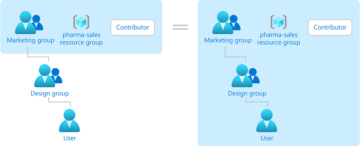
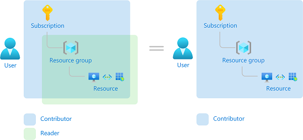
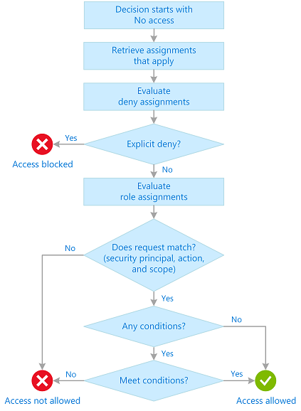
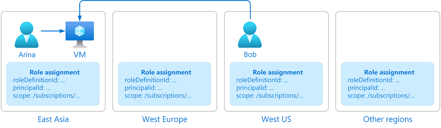

# What is Azure role-based access control (Azure RBAC)?

Access management for cloud resources is a critical function for any organization that is using the cloud. Azure role-based access control (Azure RBAC) helps you manage who has access to Azure resources, what they can do with those resources, and what areas they have access to.

Azure RBAC is an authorization system built on [Azure Resource Manager](../azure-resource-manager/management/overview.md) that provides fine-grained access management to Azure resources.

This video provides a quick overview of Azure RBAC.

>[!VIDEO https://www.youtube.com/embed/Dzhm-garKBM]

## What can I do with Azure RBAC?

Here are some examples of what you can do with Azure RBAC:

- Allow one user to manage virtual machines in a subscription and another user to manage virtual networks
- Allow a DBA group to manage SQL databases in a subscription
- Allow a user to manage all resources in a resource group, such as virtual machines, websites, and subnets
- Allow an application to access all resources in a resource group

## How Azure RBAC works

The way you control access to resources using Azure RBAC is to assign Azure roles. This is a key concept to understand – it's how permissions are enforced. A role assignment consists of three elements: security principal, role definition, and scope.

### Security principal

A *security principal* is an object that represents a user, group, service principal, or managed identity that is requesting access to Azure resources. You can assign a role to any of these security principals.

### Role definition

A *role definition* is a collection of permissions. It's typically just called a *role*. A role definition lists the actions that can be performed, such as read, write, and delete. Roles can be high-level, like owner, or specific, like virtual machine reader.

Azure includes several [built-in roles](built-in-roles.md) that you can use. For example, the [Virtual Machine Contributor](built-in-roles.md#virtual-machine-contributor) role allows a user to create and manage virtual machines. If the built-in roles don't meet the specific needs of your organization, you can create your own [Azure custom roles](custom-roles.md).

This video provides a quick overview of built-in roles and custom roles.

>[!VIDEO https://www.youtube.com/embed/I1mefHptRgo]

Azure has data actions that enable you to grant access to data within an object. For example, if a user has read data access to a storage account, then they can read the blobs or messages within that storage account.

For more information, see [Understand Azure role definitions](role-definitions.md).

### Scope

*Scope* is the set of resources that the access applies to. When you assign a role, you can further limit the actions allowed by defining a scope. This is helpful if you want to make someone a [Website Contributor](built-in-roles.md#website-contributor), but only for one resource group.

In Azure, you can specify a scope at four levels: [management group](../governance/management-groups/overview.md), subscription, [resource group](../azure-resource-manager/management/overview.md#resource-groups), or resource. Scopes are structured in a parent-child relationship. You can assign roles at any of these levels of scope.

For more information about scope, see [Understand scope](scope-overview.md).

### Role assignments

A *role assignment* is the process of attaching a role definition to a user, group, service principal, or managed identity at a particular scope for the purpose of granting access. Access is granted by creating a role assignment, and access is revoked by removing a role assignment.

The following diagram shows an example of a role assignment. In this example, the Marketing group has been assigned the [Contributor](built-in-roles.md#contributor) role for the pharma-sales resource group. This means that users in the Marketing group can create or manage any Azure resource in the pharma-sales resource group. Marketing users do not have access to resources outside the pharma-sales resource group, unless they are part of another role assignment.

You can assign roles using the Azure portal, Azure CLI, Azure PowerShell, Azure SDKs, or REST APIs.

For more information, see [Steps to assign an Azure role](role-assignments-steps.md).

## Groups

Role assignments are transitive for groups which means that if a user is a member of a group and that group is a member of another group that has a role assignment, the user will have the permissions in the role assignment.

## Multiple role assignments

So what happens if you have multiple overlapping role assignments? Azure RBAC is an additive model, so your effective permissions are the sum of your role assignments. Consider the following example where a user is granted the Contributor role at the subscription scope and the Reader role on a resource group. The sum of the Contributor permissions and the Reader permissions is effectively the Contributor role for the subscription. Therefore, in this case, the Reader role assignment has no impact.

## Deny assignments

Previously, Azure RBAC was an allow-only model with no deny, but now Azure RBAC supports deny assignments in a limited way. Similar to a role assignment, a *deny assignment* attaches a set of deny actions to a user, group, service principal, or managed identity at a particular scope for the purpose of denying access. A role assignment defines a set of actions that are *allowed*, while a deny assignment defines a set of actions that are *not allowed*. In other words, deny assignments block users from performing specified actions even if a role assignment grants them access. Deny assignments take precedence over role assignments.

For more information, see [Understand Azure deny assignments](deny-assignments.md).

## How Azure RBAC determines if a user has access to a resource

The following are the high-level steps that Azure RBAC uses to determine if you have access to a resource. These steps apply to Azure Resource Manager or data plane services integrated with Azure RBAC. This is helpful to understand if you are trying to troubleshoot an access issue.

1. A user (or service principal) acquires a token for Azure Resource Manager.

    The token includes the user's group memberships (including transitive group memberships).

1. The user makes a REST API call to Azure Resource Manager with the token attached.

1. Azure Resource Manager retrieves all the role assignments and deny assignments that apply to the resource upon which the action is being taken.

1. If a deny assignment applies, access is blocked. Otherwise, evaluation continues.

1. Azure Resource Manager narrows the role assignments that apply to this user or their group and determines what roles the user has for this resource.

1. Azure Resource Manager determines if the action in the API call is included in the roles the user has for this resource. If the roles include `Actions` that have a wildcard (`*`), the effective permissions are computed by subtracting the `NotActions` from the allowed `Actions`. Similarly, the same subtraction is done for any data actions.

    `Actions - NotActions = Effective management permissions`

    `DataActions - NotDataActions = Effective data permissions`

1. If the user doesn't have a role with the action at the requested scope, access is not allowed. Otherwise, any conditions are evaluated.

1. If the role assignment includes conditions, they are evaluated. Otherwise access is allowed.

1. If conditions are met, access is allowed. Otherwise access is not allowed.

The following diagram is a summary of the evaluation logic.

## Where is Azure RBAC data stored?

Role definitions, role assignments, and deny assignments are stored globally to ensure that you have access to your resources regardless of the region you created the resource.

When a role assignment or any other Azure RBAC data is deleted, the data is globally deleted. Principals that had access to a resource via Azure RBAC data will lose their access. 

## Why is Azure RBAC data global?

Azure RBAC data is global to ensure that customers can timely access resources regardless from where they are accessing. Azure RBAC is enforced by Azure Resource Manager, which has a global endpoint and requests are routed to the nearest region for speed and resilience. Therefore, Azure RBAC must be enforced in all regions and the data is replicated to all regions. For more information, see [Resiliency of Azure Resource Manager](../azure-resource-manager/management/overview.md#resiliency-of-azure-resource-manager).

Consider the following example. Arina creates a virtual machine in East Asia. Bob, who is a member of Arina's team, works in the United States. Bob needs to access the virtual machine that was created in East Asia. To grant Bob timely access to the virtual machine, Azure needs to globally replicate the role assignment that grants Bob access to the virtual machine from anywhere Bob is.

## License requirements

[!INCLUDE [Azure AD free license](../../includes/active-directory-free-license.md)]

## Next steps

- [Assign Azure roles using the Azure portal](role-assignments-portal.md)
- [Understand the different roles](rbac-and-directory-admin-roles.md)
- [Cloud Adoption Framework: Resource access management in Azure](/azure/cloud-adoption-framework/govern/resource-consistency/resource-access-management)
