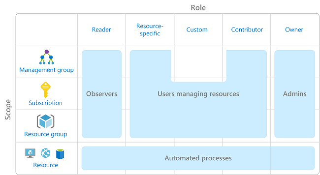
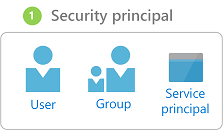
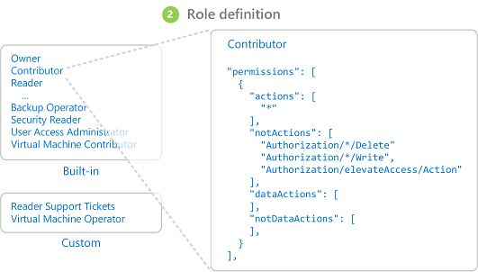
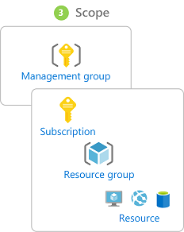
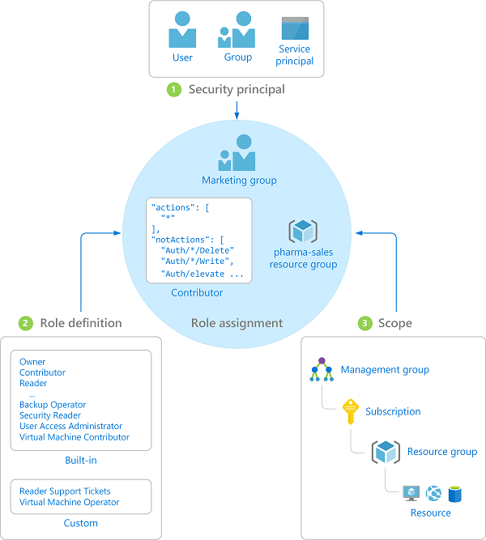

# What is role-based access control (RBAC)?

Access management for cloud resources is a critical function for any organization that is using the cloud. Role-based access control (RBAC) helps you manage who has access to Azure resources, what they can do with those resources, and what areas they have access to.

RBAC is an authorization system built on [Azure Resource Manager](../azure-resource-manager/resource-group-overview.md) that provides fine-grained access management of resources in Azure.

## What can I do with RBAC?

Here are some examples of what you can do with RBAC:

- Allow one user to manage virtual machines in a subscription and another user to manage virtual networks
- Allow a DBA group to manage SQL databases in a subscription
- Allow a user to manage all resources in a resource group, such as virtual machines, websites, and subnets
- Allow an application to access all resources in a resource group

## Best practice for using RBAC

Using RBAC, you can segregate duties within your team and grant only the amount of access to users that they need to perform their jobs. Instead of giving everybody unrestricted permissions in your Azure subscription or resources, you can allow only certain actions at a particular scope.

When planning your access control strategy, it's a best practice to grant users the least privilege to get their work done. The following diagram shows a suggested pattern for using RBAC.

## How RBAC works

The way you control access to resources using RBAC is to create role assignments. This is a key concept to understand – it’s how permissions are enforced. A role assignment consists of three elements: security principal, role definition, and scope.

### Security principal

A *security principal* is an object that represents a user, group, or service principal that is requesting access to Azure resources.

- User - An individual who has a profile in Azure Active Directory. You can also assign roles to users in other tenants. For information about users in other organizations, see [Azure Active Directory B2B](/azure/active-directory/active-directory-b2b-what-is-azure-ad-b2b).
- Group - A set of users created in Azure Active Directory. When you assign a role to a group, all users within that group have that role. 
- Service principal - A security identity used by applications or services to access specific Azure resources. You can think of it as a *user identity* (username and password or certificate) for an application.

### Role definition

A *role definition* is a collection of permissions. It's sometimes just called a *role*. A role definition lists the operations that can be performed, such as read, write, and delete. Roles can be high-level, like owner, or specific, like virtual machine reader.

Azure includes several [built-in roles](built-in-roles.md) that you can use. The following lists four fundamental built-in roles. The first three apply to all resource types.

- [Owner](built-in-roles.md#owner) - Has full access to all resources including the right to delegate access to others.
- [Contributor](built-in-roles.md#contributor) - Can create and manage all types of Azure resources but can’t grant access to others.
- [Reader](built-in-roles.md#reader) - Can view existing Azure resources.
- [User Access Administrator](built-in-roles.md#user-access-administrator) - Lets you manage user access to Azure resources.

The rest of the built-in roles allow management of specific Azure resources. For example, the [Virtual Machine Contributor](built-in-roles.md#virtual-machine-contributor) role allows a user to create and manage virtual machines. If the built-in roles don't meet the specific needs of your organization, you can create your own [custom roles](custom-roles.md).

Azure has introduced data operations (currently in preview) that enable you to grant access to data within an object. For example, if a user has read data access to a storage account, then they can read the blobs or messages within that storage account. For more information, see [Understand role definitions](role-definitions.md).

### Scope

*Scope* is the boundary that the access applies to. When you assign a role, you can further limit the actions allowed by defining a scope. This is helpful if you want to make someone a [Website Contributor](built-in-roles.md#website-contributor), but only for one resource group.

In Azure, you can specify a scope at multiple levels: [management group](../azure-resource-manager/management-groups-overview.md), subscription, resource group, or resource. Scopes are structured in a parent-child relationship.

When you grant access at a parent scope, those permissions are inherited to the child scopes. For example:

- If you assign the [Owner](built-in-roles.md#owner) role to a user at the management group scope, that user can manage everything in all subscriptions in the management group.
- If you assign the [Reader](built-in-roles.md#reader) role to a group at the subscription scope, the members of that group can view every resource group and resource in the subscription.
- If you assign the [Contributor](built-in-roles.md#contributor) role to an application at the resource group scope, it can manage resources of all types in that resource group, but not other resource groups in the subscription.

### Role assignments

A *role assignment* is the process of binding a role definition to a user, group, or service principal at a particular scope for the purpose of granting access. Access is granted by creating a role assignment, and access is revoked by removing a role assignment.

The following diagram shows an example of a role assignment. In this example, the Marketing group has been assigned the [Contributor](built-in-roles.md#contributor) role for the pharma-sales resource group. This means that users in the Marketing group can create or manage any Azure resource in the pharma-sales resource group. Marketing users do not have access to resources outside the pharma-sales resource group, unless they are part of another role assignment.

You can create role assignments using the Azure portal, Azure CLI, Azure PowerShell, Azure SDKs, or REST APIs. You can have up to 2000 role assignments in each subscription. To create and remove role assignments, you must have `Microsoft.Authorization/roleAssignments/*` permission. This permission is granted through the [Owner](built-in-roles.md#owner) or [User Access Administrator](built-in-roles.md#user-access-administrator) roles.

## Deny assignments

Previously, RBAC was an allow-only model with no deny, but now RBAC supports deny assignments in a limited way. Similar to a role assignment, a *deny assignment* binds a set of deny actions to a user, group, or service principal at a particular scope for the purpose of denying access. A role assignment defines a set of actions that are *allowed*, while a deny assignment defines a set of actions that *not allowed*. In other words, deny assignments block users from performing specified actions even if a role assignment grants them access. Deny assignments take precedence over role assignments.

Currently, deny assignments are **read-only** and can only be set by Azure. Even though you can't create your own deny assignments, you can list deny assignments because they could impact your effective permissions. To get information about a deny assignment, you must have the `Microsoft.Authorization/denyAssignments/read` permission, which is included in most [built-in roles](built-in-roles.md#owner). For more information, see [Understand deny assignments](deny-assignments.md).

## How RBAC determines if a user has access to a resource

The following are the high-level steps that RBAC uses to determine if you have access to a resource on the management plane. This is helpful to understand if you are trying to troubleshoot an access issue.

1. A user (or service principal) acquires a token for Azure Resource Manager.

    The token includes the user's group memberships (including transitive group memberships).

1. The user makes a REST API call to Azure Resource Manager with the token attached.

1. Azure Resource Manager retrieves all the role assignments and deny assignments that apply to the resource upon which the action is being taken.

1. Azure Resource Manager narrows the role assignments that apply to this user or their group and determines what roles the user has for this resource.

1. Azure Resource Manager determines if the action in the API call is included in the roles the user has for this resource.

1. If the user doesn’t have a role with the action at the requested scope, access is not granted. Otherwise, Azure Resource Manager checks if a deny assignment applies.

1. If a deny assignment applies, access is blocked. Otherwise access is granted.

## Next steps

- [Quickstart: Grant access for a user using RBAC and the Azure portal](quickstart-assign-role-user-portal.md)
- [Manage access using RBAC and the Azure portal](role-assignments-portal.md)
- [Understand the different roles in Azure](rbac-and-directory-admin-roles.md)
