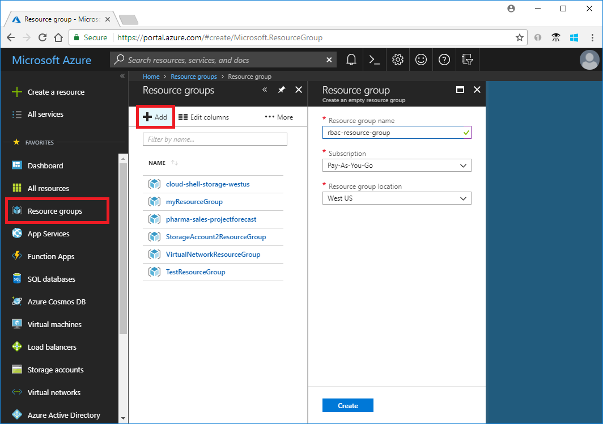
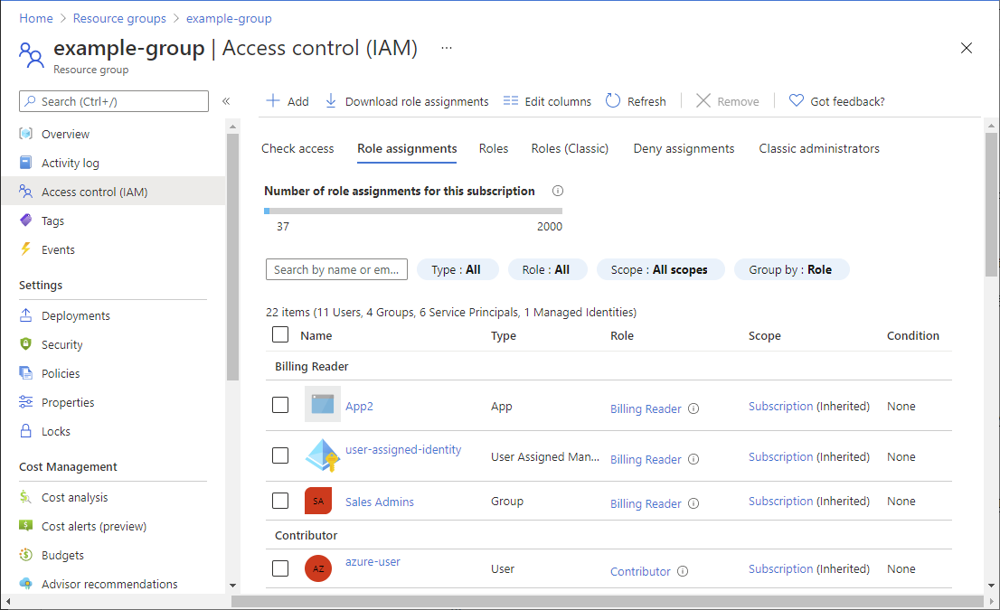
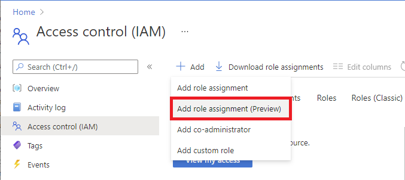
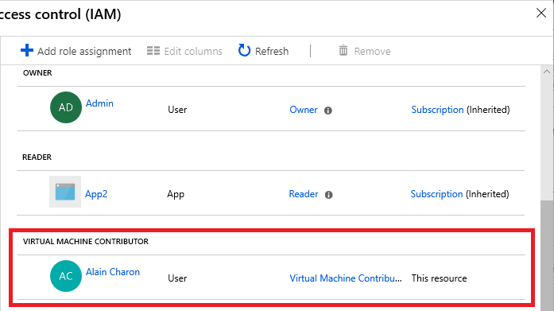
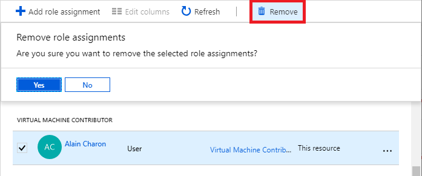

# Tutorial: Grant a user access to Azure resources using the Azure portal

[Azure role-based access control (Azure RBAC)](overview.md) is the way that you manage access to Azure resources. In this tutorial, you grant a user access to create and manage virtual machines in a resource group.

In this tutorial, you learn how to:

> [!div class="checklist"]
> * Grant access for a user at a resource group scope
> * Remove access

If you don't have an Azure subscription, create a [free account](https://azure.microsoft.com/free/?WT.mc_id=A261C142F) before you begin.

## Sign in to Azure

Sign in to the [Azure portal](https://portal.azure.com).

## Create a resource group

1. In the navigation list, click **Resource groups**.

1. Click **New** to open the **Create a resource group** page.

   

1. Select a subscription.

1. For **Resource group** name, enter **example-group** or another name.

1. Click **Review + create** and then click **Create** to create the resource group.

1. Click **Refresh** to refresh the list of resource groups.

   The new resource group appears in your resource groups list.

## Grant access

In Azure RBAC, to grant access, you assign an Azure role.

1. In the list of **Resource groups**, open the new **example-group** resource group.

1. In the navigation menu, click **Access control (IAM)**.

1. Click the **Role assignments** tab to see the current list of role assignments.

   

1. Click **Add** > **Add role assignment**.

   If you don't have permissions to assign roles, the Add role assignment option will be disabled.

   

1. On the **Role** tab, select the **Virtual Machine Contributor** role.

    

1. On the **Members** tab, select yourself or another user.

1. On the **Review + assign** tab, review the role assignment settings.

1. Click **Review + assign** to assign the role.

   After a few moments, the user is assigned the Virtual Machine Contributor role at the example-group resource group scope.

   

## Remove access

In Azure RBAC, to remove access, you remove a role assignment.

1. In the list of role assignments, add a checkmark next to the user with the Virtual Machine Contributor role.

1. Click **Remove**.

   

1. In the remove role assignment message that appears, click **Yes**.

## Clean up

1. In the navigation list, click **Resource groups**.

1. Click **example-group** to open the resource group.

1. Click **Delete resource group** to delete the resource group.

1. On the **Are you sure you want to delete** pane, type the resource group name and then click **Delete**.

## Next steps

> [!div class="nextstepaction"]
> [Tutorial: Grant a user access to Azure resources using Azure PowerShell](tutorial-role-assignments-user-powershell.md)
