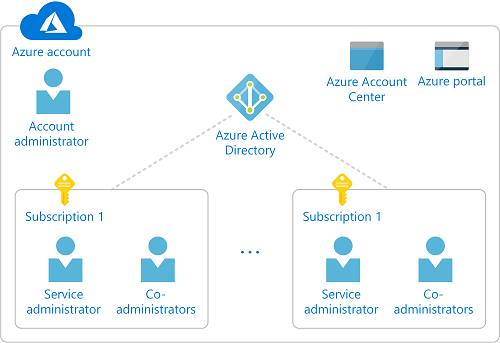

# Understand Azure Active Directory administrator roles and Azure RBAC roles

If you are new to Azure, you may find it challenging to understand all the different roles in Azure. This article helps explain the following roles and when you would use each:
- Classic subscription administrator roles
- Azure Active Directory (Azure AD) administrator roles
- Azure role-based access control (RBAC) roles

## How roles in Azure have evolved

To better understand roles in Azure, it helps to know some of the history. When Azure was initially released, access to resources was managed with just three administrator roles: Account administrator, Service administrator, and Co-administrator. Later additional administrator roles were added to include several more administrator roles. These administrator roles provide basic access management.

Azure role-based access control (RBAC) is a newer authorization system built on [Azure Resource Manager](../azure-resource-manager/resource-group-overview.md) that provides fine-grained access management to Azure resources. RBAC includes many built-in roles, can be assigned at different scopes, and allows you to create your own custom roles.

## Classic subscription administrators

Account administrator, Service administrator, and Co-administrator are the three classic subscription administrator roles in Azure. Classic subscription administrators have full access to the Azure subscription. They can manage resources using the Azure portal, Azure Resource Manager APIs, and the classic deployment model APIs. The account that is used to sign up for Azure is automatically set as both the Account administrator and Service administrator. Then, additional Co-administrators can be added. The Service administrator and the Co-administrators have the equivalent access of users who have been assigned the Owner role at the subscription scope. The following table describes the differences between these three administrative roles.

| Classic subscription administrator | Limit | Permissions | Notes |
| --- | --- | --- | --- |
| Account administrator | 1 per Azure account | <ul><li>Access the [Azure Account Center](https://account.azure.com/Subscriptions)</li><li>Manage all subscriptions in an account</li><li>Create new subscriptions</li><li>Cancel subscriptions</li><li>Change the billing for a subscription</li><li>Change the Service administrator</li></ul> | Conceptually, the billing owner of the subscription.|
| Service administrator | 1 per Azure subscription | <ul><li>Manage services in the [Azure portal](https://portal.azure.com)</li><li>Assign users to the Co-administrator role</li></ul> | By default, for a new subscription, the Account administrator is also the Service administrator. The Service administrator has the equivalent access of a user who is assigned the Owner role at the subscription scope. |
| Co-administrator | 200 per subscription | <ul><li>Same access privileges as the Service administrator, but can’t change the association of subscriptions to Azure directories</li><li>Assign users to the Co-administrator role, but cannot change the Service administrator</li></ul> | The Co-administrator has the equivalent access of a user who is assigned the Owner role at the subscription scope. |

In the Azure portal, you can see who is assigned to the Account administrator and Service administrator by viewing the properties of your subscription.

For information about how to add or change subscription administrators, see [Add or change Azure subscription administrators](../billing/billing-add-change-azure-subscription-administrator.md) in the Azure Billing documentation.

### Azure account and Azure subscriptions

An Azure account represents a billing relationship. An Azure account is a user identity, one or more Azure subscriptions, and an associated set of Azure resources. The person who creates the account is the Account administrator for all subscriptions created in that account. That person is also the default Service administrator for the subscription.

Azure subscriptions help you organize access to Azure resources. They also help you control how resource usage is reported, billed, and paid for. Each subscription can have a different billing and payment setup, so you can have different subscriptions and different plans by office, department, project, and so on. Every service belongs to a subscription, and the subscription ID may be required for programmatic operations.

Accounts and subscriptions are managed in the [Azure Account Center](https://account.azure.com/Subscriptions). The following diagram shows the relationship between an Azure account and Azure subscriptions.

## Azure AD administrator roles

Azure AD administrator roles are used to manage Azure AD resources in a directory such as create or edit users, assign administrative roles to others, reset user passwords, manage user licenses, and manage domains. The following table describes a few of the more important Azure AD administrator roles.

| Azure AD administrator role | Permissions | Notes |
| --- | --- | --- |
| [Global administrator](../active-directory/active-directory-assign-admin-roles-azure-portal.md#global-administrator) | <ul><li>Manage access to all administrative features in Azure Active Directory, as well as services that federate to Azure Active Directory</li><li>Assign administrator roles to others</li><li>Reset the password for any user and all other administrators</li></ul> | The person who signs up for the Azure Active Directory tenant becomes a Global administrator. |
| [User administrator](../active-directory/active-directory-assign-admin-roles-azure-portal.md#user-account-administrator) | <ul><li>Create and manage all aspects of users and groups</li><li>Manage support tickets</li><li>Monitor service health</li><li>Change passwords for users, Helpdesk administrators, and other User administrators</li></ul> |  |
| [Password administrator](../active-directory/active-directory-assign-admin-roles-azure-portal.md#password-administrator--helpdesk-administrator) | <ul><li>Change passwords for users and other Helpdesk administrators</li><li>Manage service requests</li><li>Monitor service health</li></ul> |  |
| [Billing administrator](../active-directory/active-directory-assign-admin-roles-azure-portal.md#billing-administrator) | <ul><li>Make purchases</li><li>Manage subscriptions</li><li>Manage support tickets</li><li>Monitors service health</li></ul> |  |

For a list of all the Azure AD administrator roles, see [Assigning administrator roles in Azure Active Directory](/azure/active-directory/active-directory-assign-admin-roles-azure-portal).

In the Azure portal, you can assign the Azure AD administrator roles in the **Azure Active Directory** blade.

## Azure RBAC roles

Azure RBAC is a system that provides fine-grained access management to Azure resources. Azure RBAC includes over 60 built-in roles that control permissions to manage Azure resources such as compute and storage. There are four fundamental RBAC roles. The first three apply to all resource types:

| Azure RBAC role | Permissions | Notes |
| --- | --- | --- |
| [Owner](built-in-roles.md#owner) | <ul><li>Full access to all resources</li><li>Delegate access to others</li></ul> | The Service administrator and Co-administrators are assigned the Owner role at the subscription scope Applies to all resource types. |
| [Contributor](built-in-roles.md#contributor) | <ul><li>Create and manage all of types of Azure resources</li><li>Cannot grant access to others</li></ul> | Applies to all resource types. |
| [Reader](built-in-roles.md#reader) | <ul><li>View Azure resources</li></ul> | Applies to all resource types. |
| [User Access Administrator](built-in-roles.md#user-access-administrator) | <ul><li>Manage user access to Azure resources</li></ul> |  |

The rest of the built-in roles allow management of specific Azure resources. For example, the [Virtual Machine Contributor](built-in-roles.md#virtual-machine-contributor) role allows the user to create and manage virtual machines. For a list of all the built-in roles, see [Built-in roles](built-in-roles.md).

Only the Azure portal and the Azure Resource Manager APIs support RBAC. Users, groups, and applications that are assigned RBAC roles cannot use the [Azure classic deployment model APIs](../azure-resource-manager/resource-manager-deployment-model.md).

In the Azure portal, role assignment using RBAC appears in the **Access control (IAM)** blade. This blade can found throughout the portal, such as subscriptions, resource groups, and various resources.

When you click the **Roles** option, you will see the list of built-in and custom roles.

## Differences between Azure AD administrator roles and Azure RBAC roles

At a high level, Azure AD administrator roles control permissions to manage Azure Active Directory resources, while Azure RBAC roles control permissions to manage Azure resources. The following table compares some of the differences.

| Azure AD administrator roles | Azure RBAC roles |
| --- | --- |
| Manage access to Azure Active Directory resources | Manage access to Azure resources |
| Cannot create your own roles | Supports custom roles |
| Scope is at the tenant level | Scope can be specified at multiple levels (management group, subscription, resource group, resource) |
| Role information can be accessed in Azure admin portal, Office 365 admin portal, Microsoft Graph, AzureAD PowerShell | Role information can be accessed in Azure portal, Azure CLI, Azure PowerShell, Azure Resource Manager templates, REST API |

### Do Azure AD administrator roles and Azure RBAC roles overlap?

By default, Azure AD administrator roles and Azure RBAC roles do not span Azure AD and Azure. However, if a Global administrator elevates their access by choosing the **Global admin can manage Azure Subscriptions and Management Groups** switch in the Azure portal, the Global administrator will be granted the [User Access Administrator](built-in-roles.md#user-access-administrator) role (an RBAC role) on all subscriptions for a particular tenant. The User Access Administrator role enables the user to grant other users access to Azure resources. This switch can be helpful to regain access to a subscription. For more information, see [Elevate access as an Azure AD administrator](elevate-access-global-admin.md).

Several Azure AD administrator roles span Azure AD and Microsoft Office 365, such as the Global administrator and User administrator roles. For example, if you are a member of the Global administrator role, you have global administrator capabilities in Azure AD and Office 365, such making changes to Microsoft Exchange and Microsoft SharePoint. However, by default, the Global administrator doesn't have access to Azure resources.

## List of roles in Azure

Roles in Azure are always evolving, but here is a list of roles and their corresponding type.

| Role | Classic subscription administrator | Azure AD administrator | Azure RBAC |
| --- | :---: | :---: | :---: |
| Account administrator | X |  |  |
| Service administrator | X |  |  |
| Co-administrator | X |  |  |
| [Global administrator](../active-directory/active-directory-assign-admin-roles-azure-portal.md#global-administrator) |  | X |  |
| [Billing administrator](../active-directory/active-directory-assign-admin-roles-azure-portal.md#billing-administrator) |  | X |  |
| [Compliance administrator](../active-directory/active-directory-assign-admin-roles-azure-portal.md) |  | X |  |
| [Conditional Access administrator](../active-directory/active-directory-assign-admin-roles-azure-portal.md#conditional-access-administrator) |  | X |  |
| [Exchange administrator](../active-directory/active-directory-assign-admin-roles-azure-portal.md) |  | X |  |
| [Guest inviter](../active-directory/active-directory-assign-admin-roles-azure-portal.md) |  | X |  |
| [Password administrator](../active-directory/active-directory-assign-admin-roles-azure-portal.md#password-administrator--helpdesk-administrator) |  | X |  |
| [Information Protection administrator](../active-directory/active-directory-assign-admin-roles-azure-portal.md#information-protection-administrator) |  | X |  |
| [Intune Service administrator](../active-directory/active-directory-assign-admin-roles-azure-portal.md) |  | X |  |
| [Skype for Business administrator](../active-directory/active-directory-assign-admin-roles-azure-portal.md) |  | X |  |
| [Privileged role administrator](../active-directory/active-directory-assign-admin-roles-azure-portal.md) |  | X |  |
| [Reports reader](../active-directory/active-directory-assign-admin-roles-azure-portal.md#reports-reader) |  | X |  |
| [Security administrator](../active-directory/active-directory-assign-admin-roles-azure-portal.md#security-administrator) |  | X |  |
| [Security reader](../active-directory/active-directory-assign-admin-roles-azure-portal.md#security-reader) |  | X |  |
| [Service administrator](../active-directory/active-directory-assign-admin-roles-azure-portal.md#service-administrator) |  | X |  |
| [SharePoint administrator](../active-directory/active-directory-assign-admin-roles-azure-portal.md) |  | X |  |
| [User administrator](../active-directory/active-directory-assign-admin-roles-azure-portal.md#user-account-administrator) |  | X |  |
| [Owner](built-in-roles.md#owner) |  |  | X |
| [Contributor](built-in-roles.md#contributor) |  |  | X |
| [Reader](built-in-roles.md#reader) |  |  | X |
| [AcrImageSigner](built-in-roles.md#acrimagesigner) |  |  | X |
| [AcrQuarantineReader](built-in-roles.md#acrquarantinereader) |  |  | X |
| [AcrQuarantineWriter](built-in-roles.md#acrquarantinewriter) |  |  | X |
| [API Management Service Contributor](built-in-roles.md#api-management-service-contributor) |  |  | X |
| [API Management Service Operator Role](built-in-roles.md#api-management-service-operator-role) |  |  | X |
| [API Management Service Reader Role](built-in-roles.md#api-management-service-reader-role) |  |  | X |
| [Application Insights Component Contributor](built-in-roles.md#application-insights-component-contributor) |  |  | X |
| [Application Insights Snapshot Debugger](built-in-roles.md#application-insights-snapshot-debugger) |  |  | X |
| [Automation Job Operator](built-in-roles.md#automation-job-operator) |  |  | X |
| [Automation Operator](built-in-roles.md#automation-operator) |  |  | X |
| [Automation Runbook Operator](built-in-roles.md#automation-runbook-operator) |  |  | X |
| [Azure Stack Registration Owner](built-in-roles.md#azure-stack-registration-owner) |  |  | X |
| [Backup Contributor](built-in-roles.md#backup-contributor) |  |  | X |
| [Backup Operator](built-in-roles.md#backup-operator) |  |  | X |
| [Backup Reader](built-in-roles.md#backup-reader) |  |  | X |
| [Billing Reader](built-in-roles.md#billing-reader) |  |  | X |
| [BizTalk Contributor](built-in-roles.md#biztalk-contributor) |  |  | X |
| [CDN Endpoint Contributor](built-in-roles.md#cdn-endpoint-contributor) |  |  | X |
| [CDN Endpoint Reader](built-in-roles.md#cdn-endpoint-reader) |  |  | X |
| [CDN Profile Contributor](built-in-roles.md#cdn-profile-contributor) |  |  | X |
| [CDN Profile Reader](built-in-roles.md#cdn-profile-reader) |  |  | X |
| [Classic Network Contributor](built-in-roles.md#classic-network-contributor) |  |  | X |
| [Classic Storage Account Contributor](built-in-roles.md#classic-storage-account-contributor) |  |  | X |
| [Classic Storage Account Key Operator Service Role](built-in-roles.md#classic-storage-account-key-operator-service-role) |  |  | X |
| [Classic Virtual Machine Contributor](built-in-roles.md#classic-virtual-machine-contributor) |  |  | X |
| [ClearDB MySQL DB Contributor](built-in-roles.md#cleardb-mysql-db-contributor) |  |  | X |
| [Cosmos DB Account Reader Role](built-in-roles.md#cosmos-db-account-reader-role) |  |  | X |
| [Data Factory Contributor](built-in-roles.md#data-factory-contributor) |  |  | X |
| [Data Lake Analytics Developer](built-in-roles.md#data-lake-analytics-developer) |  |  | X |
| [DevTest Labs User](built-in-roles.md#devtest-labs-user) |  |  | X |
| [DNS Zone Contributor](built-in-roles.md#dns-zone-contributor) |  |  | X |
| [DocumentDB Account Contributor](built-in-roles.md#documentdb-account-contributor) |  |  | X |
| [Intelligent Systems Account Contributor](built-in-roles.md#intelligent-systems-account-contributor) |  |  | X |
| [Key Vault Contributor](built-in-roles.md#key-vault-contributor) |  |  | X |
| [Lab Creator](built-in-roles.md#lab-creator) |  |  | X |
| [Log Analytics Contributor](built-in-roles.md#log-analytics-contributor) |  |  | X |
| [Log Analytics Reader](built-in-roles.md#log-analytics-reader) |  |  | X |
| [Logic App Contributor](built-in-roles.md#logic-app-contributor) |  |  | X |
| [Logic App Operator](built-in-roles.md#logic-app-operator) |  |  | X |
| [Managed Identity Contributor](built-in-roles.md#managed-identity-contributor) |  |  | X |
| [Managed Identity Operator](built-in-roles.md#managed-identity-operator) |  |  | X |
| [Monitoring Contributor](built-in-roles.md#monitoring-contributor) |  |  | X |
| [Monitoring Reader](built-in-roles.md#monitoring-reader) |  |  | X |
| [Network Contributor](built-in-roles.md#network-contributor) |  |  | X |
| [New Relic APM Account Contributor](built-in-roles.md#new-relic-apm-account-contributor) |  |  | X |
| [Reader and Data Access](built-in-roles.md#reader-and-data-access) |  |  | X |
| [Redis Cache Contributor](built-in-roles.md#redis-cache-contributor) |  |  | X |
| [Resource Policy Contributor (Preview)](built-in-roles.md#resource-policy-contributor-preview) |  |  | X |
| [Scheduler Job Collections Contributor](built-in-roles.md#scheduler-job-collections-contributor) |  |  | X |
| [Search Service Contributor](built-in-roles.md#search-service-contributor) |  |  | X |
| [Security Admin](built-in-roles.md#security-admin) |  |  | X |
| [Security Manager (Legacy)](built-in-roles.md#security-manager-legacy) |  |  | X |
| [Security Reader](built-in-roles.md#security-reader) |  |  | X |
| [Site Recovery Contributor](built-in-roles.md#site-recovery-contributor) |  |  | X |
| [Site Recovery Operator](built-in-roles.md#site-recovery-operator) |  |  | X |
| [Site Recovery Reader](built-in-roles.md#site-recovery-reader) |  |  | X |
| [SQL DB Contributor](built-in-roles.md#sql-db-contributor) |  |  | X |
| [SQL Security Manager](built-in-roles.md#sql-security-manager) |  |  | X |
| [SQL Server Contributor](built-in-roles.md#sql-server-contributor) |  |  | X |
| [Storage Account Contributor](built-in-roles.md#storage-account-contributor) |  |  | X |
| [Storage Account Key Operator Service Role](built-in-roles.md#storage-account-key-operator-service-role) |  |  | X |
| [Storage Blob Data Contributor (Preview)](built-in-roles.md#storage-blob-data-contributor-preview) |  |  | X |
| [Storage Queue Data Contributor (Preview)](built-in-roles.md#storage-queue-data-contributor-preview) |  |  | X |
| [Storage Queue Data Reader (Preview)](built-in-roles.md#storage-queue-data-reader-preview) |  |  | X |
| [Support Request Contributor](built-in-roles.md#support-request-contributor) |  |  | X |
| [Traffic Manager Contributor](built-in-roles.md#traffic-manager-contributor) |  |  | X |
| [User Access Administrator](built-in-roles.md#user-access-administrator) |  |  | X |
| [Virtual Machine Administrator Login](built-in-roles.md#virtual-machine-administrator-login) |  |  | X |
| [Virtual Machine Contributor](built-in-roles.md#virtual-machine-contributor) |  |  | X |
| [Virtual Machine User Login](built-in-roles.md#virtual-machine-user-login) |  |  | X |
| [Web Plan Contributor](built-in-roles.md#web-plan-contributor) |  |  | X |
| [Website Contributor](built-in-roles.md#website-contributor) |  |  | X |
| \<Custom\> |  |  | X |

## Next Steps

- [Add or change Azure subscription administrators](/azure/billing/billing-add-change-azure-subscription-administrator)
- [Assigning administrator roles in Azure Active Directory](/azure/active-directory/active-directory-assign-admin-roles-azure-portal)
- [Role-based access control overview](overview.md)
