# Assign Azure roles to external guest users using the Azure portal

[Azure role-based access control (Azure RBAC)](overview.md) allows better security management for large organizations and for small and medium-sized businesses working with external collaborators, vendors, or freelancers that need access to specific resources in your environment, but not necessarily to the entire infrastructure or any billing-related scopes. You can use the capabilities in [Azure Active Directory B2B](../active-directory/external-identities/what-is-b2b.md) to collaborate with external guest users and you can use Azure RBAC to grant just the permissions that guest users need in your environment.

## Prerequisites

To assign Azure roles or remove role assignments, you must have:

- `Microsoft.Authorization/roleAssignments/write` and `Microsoft.Authorization/roleAssignments/delete` permissions, such as [User Access Administrator](built-in-roles.md#user-access-administrator) or [Owner](built-in-roles.md#owner)

## When would you invite guest users?

Here are a couple example scenarios when you might invite guest users to your organization and grant permissions:

- Allow an external self-employed vendor that only has an email account to access your Azure resources for a project.
- Allow an external partner to manage certain resources or an entire subscription.
- Allow support engineers not in your organization (such as Microsoft support) to temporarily access your Azure resource to troubleshoot issues.

## Permission differences between member users and guest users

Native members of a directory (member users) have different permissions than users invited from another directory as a B2B collaboration guest (guest users). For example, members user can read almost all directory information while guest users have restricted directory permissions. For more information about member users and guest users, see [What are the default user permissions in Azure Active Directory?](../active-directory/fundamentals/users-default-permissions.md).

## Add a guest user to your directory

Follow these steps to add a guest user to your directory using the Azure Active Directory page.

1. Sign in to the [Azure portal](https://portal.azure.com).

1. Make sure your organization's external collaboration settings are configured such that you're allowed to invite guests. For more information, see [Configure external collaboration settings](../active-directory/external-identities/external-collaboration-settings-configure.md).

1. Click **Azure Active Directory** > **Users** > **New guest user**.

    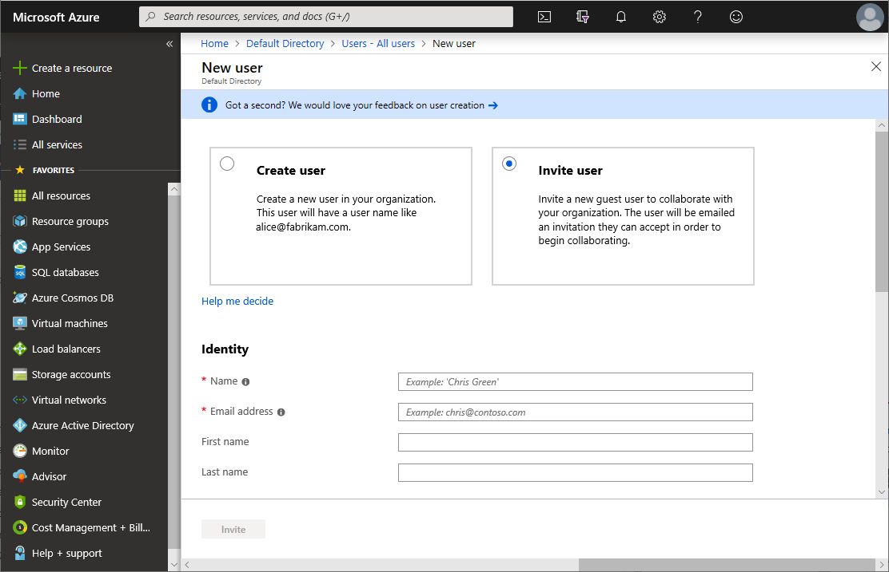

1. Follow the steps to add a new guest user. For more information, see [Add Azure Active Directory B2B collaboration users in the Azure portal](../active-directory/external-identities/add-users-administrator.md#add-guest-users-to-the-directory).

After you add a guest user to the directory, you can either send the guest user a direct link to a shared app, or the guest user can click the accept invitation link in the invitation email.

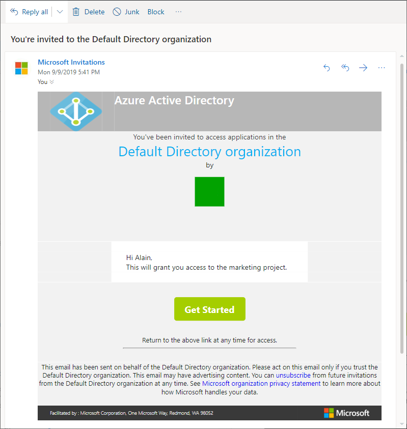

For the guest user to be able to access your directory, they must complete the invitation process.

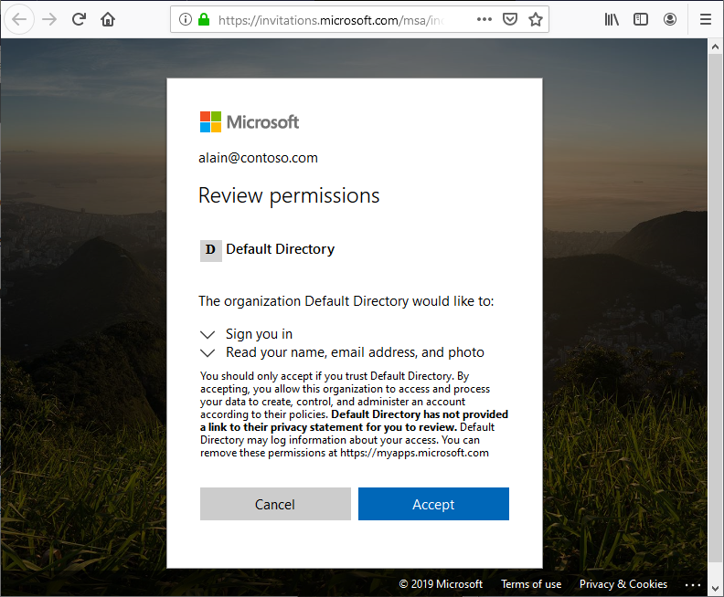

For more information about the invitation process, see [Azure Active Directory B2B collaboration invitation redemption](../active-directory/external-identities/redemption-experience.md).

## Assign a role to a guest user

In Azure RBAC, to grant access, you assign a role. To assign a role to a guest user, you follow [same steps](role-assignments-portal.md) as you would for a member user, group, service principal, or managed identity. Follow these steps assign a role to a guest user at different scopes.

1. Sign in to the [Azure portal](https://portal.azure.com).

1. In the Search box at the top, search for the scope you want to grant access to. For example, search for **Management groups**, **Subscriptions**, **Resource groups**, or a specific resource.

1. Click the specific resource for that scope.

1. Click **Access control (IAM)**.

    The following shows an example of the Access control (IAM) page for a resource group.

    

1. Click the **Role assignments** tab to view the role assignments at this scope.

1. Click **Add** > **Add role assignment**.

    If you don't have permissions to assign roles, the Add role assignment option will be disabled.

    

    The Add role assignment page opens.

1. On the **Role** tab, select a role such as **Virtual Machine Contributor**.

   

1. On the **Members** tab, select **User, group, or service principal**.

   

1. Click **Select members**.

1. Find and select the guest user. If you don't see the user in the list, you can type in the **Select** box to search the directory for display name or email address.

    You can type in the **Select** box to search the directory for display name or email address.

    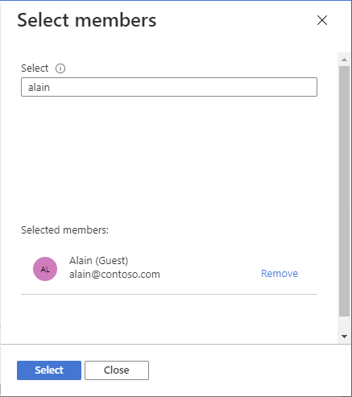

1. Click **Select** to add the guest user to the Members list.

1. On the **Review + assign** tab, click **Review + assign**.

    After a few moments, the guest user is assigned the role at the selected scope.

    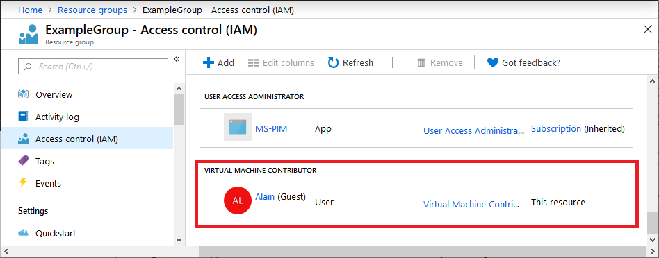

## Assign a role to a guest user not yet in your directory

To assign a role to a guest user, you follow [same steps](role-assignments-portal.md) as you would for a member user, group, service principal, or managed identity.

If the guest user is not yet in your directory, you can invite the user directly from the Select members pane.

1. Sign in to the [Azure portal](https://portal.azure.com).

1. In the Search box at the top, search for the scope you want to grant access to. For example, search for **Management groups**, **Subscriptions**, **Resource groups**, or a specific resource.

1. Click the specific resource for that scope.

1. Click **Access control (IAM)**.

1. Click **Add** > **Add role assignment**.

    If you don't have permissions to assign roles, the Add role assignment option will be disabled.

    

    The Add role assignment page opens.

1. On the **Role** tab, select a role such as **Virtual Machine Contributor**.

1. On the **Members** tab, select **User, group, or service principal**.

   

1. Click **Select members**.

1. In the **Select** box, type the email address of the person you want to invite and select that person.

    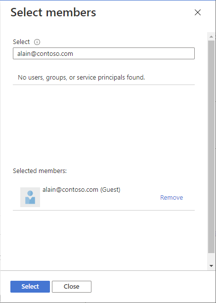

1. Click **Select** to add the guest user to the Members list.

1. On the **Review + assign** tab, click **Review + assign** to add the guest user to your directory, assign the role, and send an invite.

    After a few moments, you'll see a notification of the role assignment and information about the invite.

    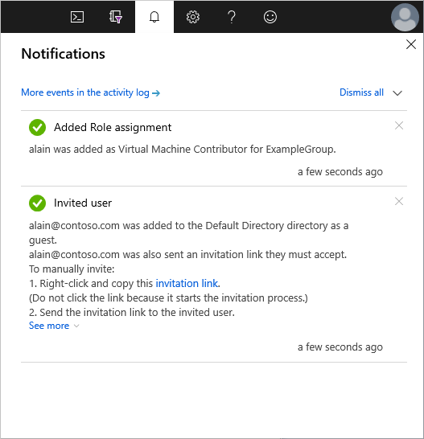

1. To manually invite the guest user, right-click and copy the invitation link in the notification. Don't click the invitation link because it starts the invitation process.

    The invitation link will have the following format:

    `https://login.microsoftonline.com/redeem?rd=https%3a%2f%2finvitations.microsoft.com%2fredeem%2f%3ftenant%3d0000...`

1. Send the invitation link to the guest user to complete the invitation process.

    For more information about the invitation process, see [Azure Active Directory B2B collaboration invitation redemption](../active-directory/external-identities/redemption-experience.md).

## Remove a guest user from your directory

Before you remove a guest user from a directory, you should first remove any role assignments for that guest user. Follow these steps to remove a guest user from a directory.

1. Open **Access control (IAM)** at a scope, such as management group, subscription, resource group, or resource, where the guest user has a role assignment.

1. Click the **Role assignments** tab to view all the role assignments.

1. In the list of role assignments, add a check mark next to the guest user with the role assignment you want to remove.

   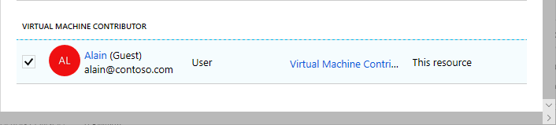

1. Click **Remove**.

   

1. In the remove role assignment message that appears, click **Yes**.

1. Click the **Classic administrators** tab.

1. If the guest user has a Co-Administrator assignment, add a check mark next to the guest user and click **Remove**.

1. In the left navigation bar, click **Azure Active Directory** > **Users**.

1. Click the guest user you want to remove.

1. Click **Delete**.

   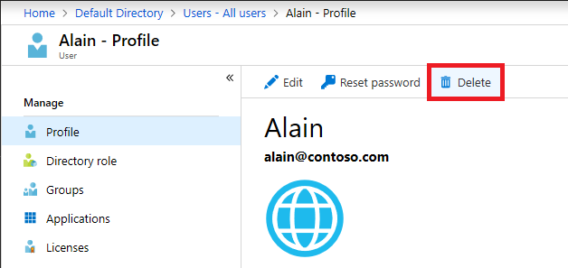

1. In the delete message that appears, click **Yes**.

## Troubleshoot

### Guest user cannot browse the directory

Guest users have restricted directory permissions. For example, guest users cannot browse the directory and cannot search for groups or applications. For more information, see [What are the default user permissions in Azure Active Directory?](../active-directory/fundamentals/users-default-permissions.md).

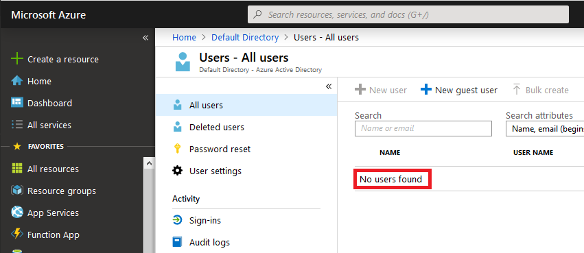

If a guest user needs additional privileges in the directory, you can assign an Azure AD role to the guest user. If you really want a guest user to have full read access to your directory, you can add the guest user to the [Directory Readers](../active-directory/roles/permissions-reference.md#directory-readers) role in Azure AD. For more information, see [Add Azure Active Directory B2B collaboration users in the Azure portal](../active-directory/external-identities/add-users-administrator.md).

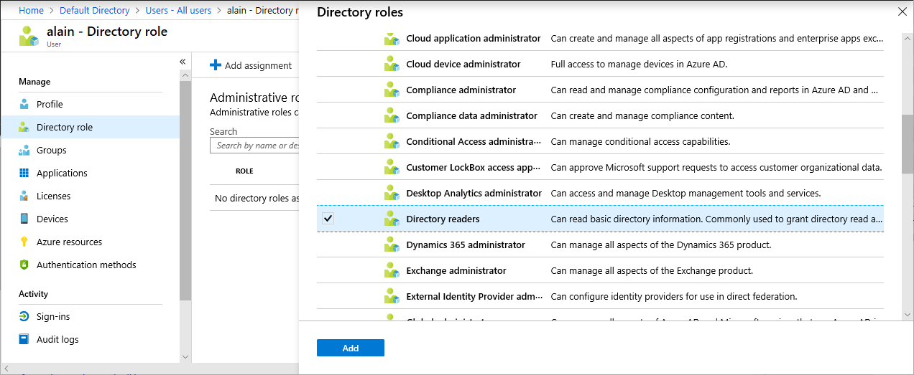

### Guest user cannot browse users, groups, or service principals to assign roles

Guest users have restricted directory permissions. Even if a guest user is an [Owner](built-in-roles.md#owner) at a scope, if they try to assign a role to grant someone else access, they cannot browse the list of users, groups, or service principals.

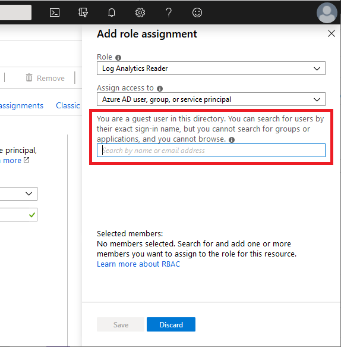

If the guest user knows someone's exact sign-in name in the directory, they can grant access. If you really want a guest user to have full read access to your directory, you can add the guest user to the [Directory Readers](../active-directory/roles/permissions-reference.md#directory-readers) role in Azure AD. For more information, see [Add Azure Active Directory B2B collaboration users in the Azure portal](../active-directory/external-identities/add-users-administrator.md).

### Guest user cannot register applications or create service principals

Guest users have restricted directory permissions. If a guest user needs to be able to register applications or create service principals, you can add the guest user to the [Application Developer](../active-directory/roles/permissions-reference.md#application-developer) role in Azure AD. For more information, see [Add Azure Active Directory B2B collaboration users in the Azure portal](../active-directory/external-identities/add-users-administrator.md).

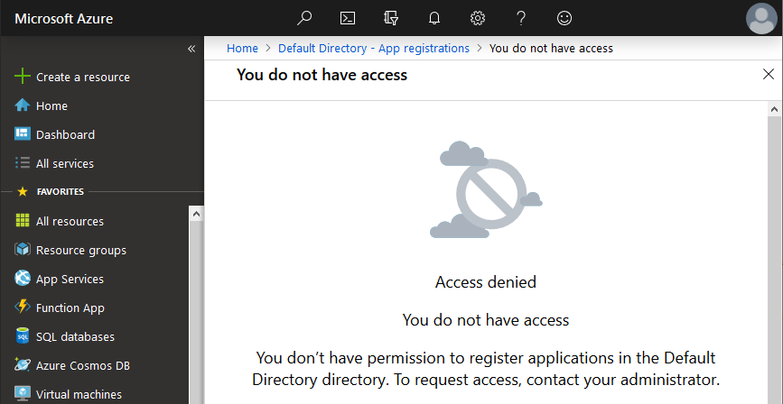

### Guest user does not see the new directory

If a guest user has been granted access to a directory, but they do not see the new directory listed in the Azure portal when they try to switch in their **Directories** page, make sure the guest user has completed the invitation process. For more information about the invitation process, see [Azure Active Directory B2B collaboration invitation redemption](../active-directory/external-identities/redemption-experience.md).

### Guest user does not see resources

If a guest user has been granted access to a directory, but they do not see the resources they have been granted access to in the Azure portal, make sure the guest user has selected the correct directory. A guest user might have access to multiple directories. To switch directories, in the upper left, click **Settings** > **Directories**, and then click the appropriate directory.

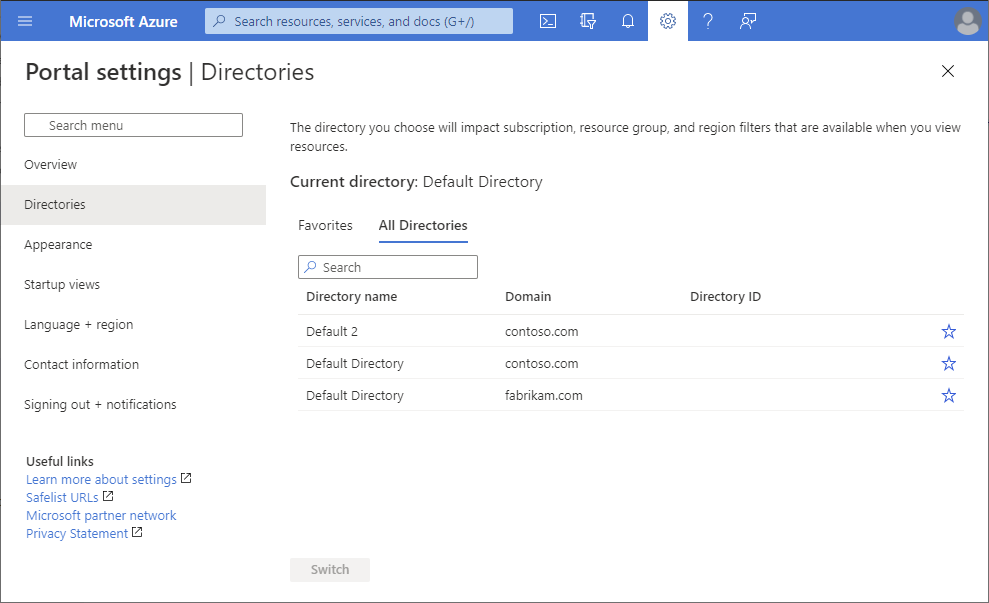

## Next steps

- [Add Azure Active Directory B2B collaboration users in the Azure portal](../active-directory/external-identities/add-users-administrator.md)
- [Properties of an Azure Active Directory B2B collaboration user](../active-directory/external-identities/user-properties.md)
- [The elements of the B2B collaboration invitation email - Azure Active Directory](../active-directory/external-identities/invitation-email-elements.md)
