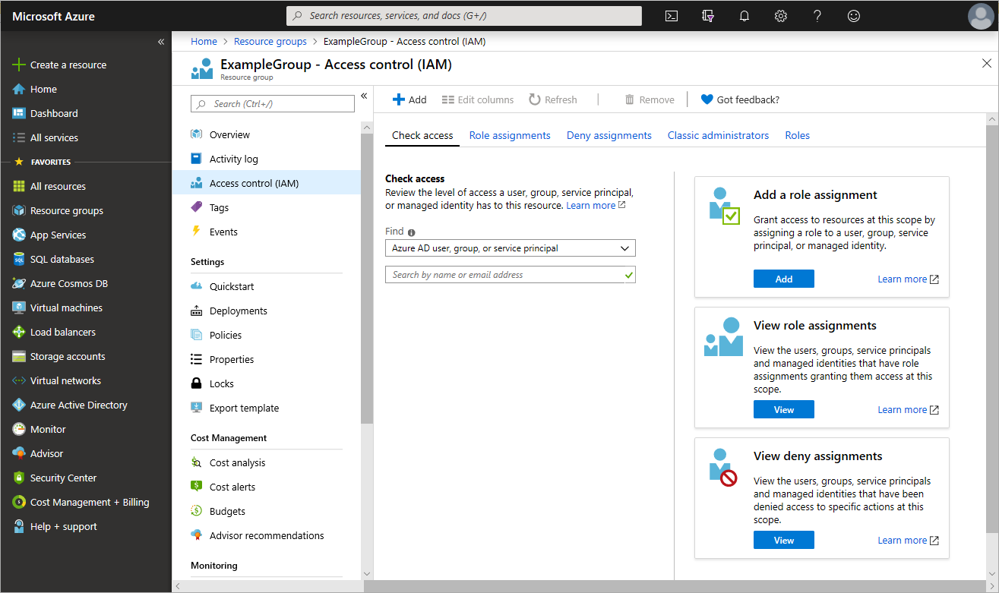
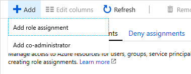
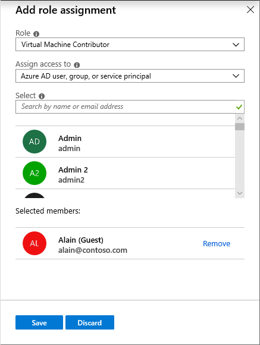
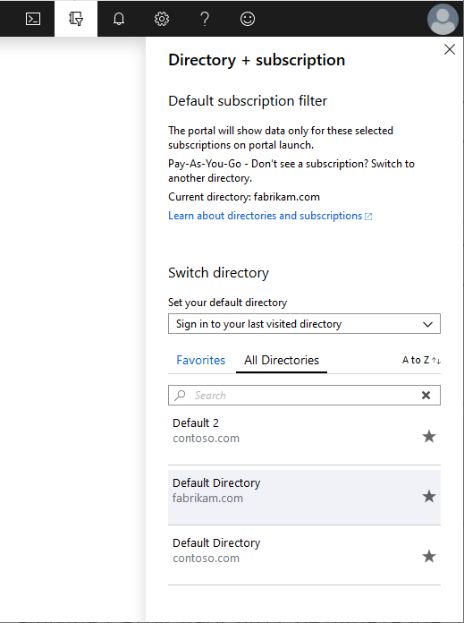

# Manage access to Azure resources for external guest users using RBAC

Role-based access control (RBAC) allows better security management for large organizations and for small and medium-sized businesses working with external collaborators, vendors, or freelancers that need access to specific resources in your environment, but not necessarily to the entire infrastructure or any billing-related scopes. You can use the capabilities in [Azure Active Directory B2B](../active-directory/b2b/what-is-b2b.md) to collaborate with external guest users and you can use RBAC to grant just the permissions that guest users need in your environment.

## When would you invite guest users?

Here are a couple example scenarios when you might invite guest users to your organization and grant permissions:

- Allow an external self-employed vendor that only has an email account to access your Azure resources for a project.
- Allow an external partner to manage certain resources or an entire subscription.
- Allow support engineers not in your organization (such as Microsoft support) to temporarily access your Azure resource to troubleshoot issues.

## Permission differences between member users and guest users

Native members of a directory (member users) have different permissions than users invited from another directory as a B2B collaboration guest (guest users). For example, members user can read almost all directory information while guest users have restricted directory permissions. For more information about member users and guest users, see [What are the default user permissions in Azure Active Directory?](../active-directory/fundamentals/users-default-permissions.md).

## Add a guest user to the directory

1. Make sure your organization's external collaboration settings are configured such that you're allowed to invite guests. For more information, see [Enable B2B external collaboration and manage who can invite guests](../azure/active-directory/b2b/delegate-invitations.md).

1. In the Azure portal, click **Azure Active Directory** > **Users** > **New guest user**.

    

1. Follow the steps to add a new guest user. For more information see [Add Azure Active Directory B2B collaboration users in the Azure portal](../active-directory/b2b/add-users-administrator.md#add-guest-users-to-the-directory).

After you add a guest user to the directory, you can either send the guest user a direct link to a shared app, or the guest user can click the redemption URL in the invitation email.

The guest users will need to complete the consent experience.

For more information about the redemption process, see [Azure Active Directory B2B collaboration invitation redemption](../active-directory/b2b/redemption-experience.md).

## Grant access to the guest user

In RBAC, to grant access, you assign a role. To grant access to the guest user, you follow [same steps](role-assignments-portal.md#add-a-role-assignment) as you would for a user, group, service principal, or managed identity. Follow these steps to grant access to the guest user at different scopes.

1. In the Azure portal, click **All services**.

1.  Select the set of resources that the access applies to, also known as the scope. For example, you can select **Management groups**, **Subscriptions**, **Resource groups**, or a resource.

1. Click the specific resource.

1. Click **Access control (IAM)**.

    The following shows an example of the Access control (IAM) blade for a resource group. If you make any access control changes here, they would apply to just to the resource group.

    

1. Click the **Role assignments** tab to view all the role assignments at this scope.

1. Click **Add** > **Add role assignment** to open the Add role assignment pane.

   If you don't have permissions to assign roles, the Add role assignment option will be disabled.

   

   

1. In the **Role** drop-down list, select a role such as **Virtual Machine Contributor**.

1. In the **Select** list, select the guest user. If you don't see the security principal in the list, you can type in the **Select** box to search the directory for display names, email addresses, and object identifiers.

1. Click **Save** to assign the role.

   After a few moments, the guest user will have the [Virtual Machine Contributor](built-in-roles.md#virtual-machine-contributor) role for the selected scope.

   

## Troubleshoot

### Guest user is unable to browse the directory

Guest users have restricted directory permissions. For example, guest users cannot search for groups or applications, and cannot browse the directory. If a guest user needs additional privileges in the directory, you can assign a directory role to the guest user. For more information, see [Grant permissions to users from partner organizations in your Azure Active Directory tenant](../active-directory/b2b/add-guest-to-role.md) and [What are the default user permissions in Azure Active Directory?](../active-directory/fundamentals/users-default-permissions.md).

### Guest user does not see the new directory

If a guest user has been granted access in a directory, but they do not see the new directory listed in the Azure portal when they try to switch in their **Directory + subscription** pane, make sure the guest user has accepted the invite. For more information about the redemption process, see [Azure Active Directory B2B collaboration invitation redemption](../active-directory/b2b/redemption-experience.md).

### Guest user does not see resources in the Azure portal

If a guest user has been granted access in a directory, but they do not see the resources they have been granted access to in the Azure portal, make sure the guest user has selected the correct directory. A guest user might have access to multiple directories. To switch directories, in the upper left, click **Directory + Subscription**. In the **Directory + Subscription** pane, click the appropriate directory.

## Next steps

- [Add Azure Active Directory B2B collaboration users in the Azure portal](../active-directory/b2b/add-users-administrator.md)
- [Properties of an Azure Active Directory B2B collaboration user](../active-directory/b2b/user-properties.md)
- [The elements of the B2B collaboration invitation email - Azure Active Directory](../active-directory/b2b/invitation-email-elements.md)