# List Azure role assignments using the Azure portal

[!INCLUDE [Azure RBAC definition list access](../../includes/role-based-access-control/definition-list.md)] This article describes how to list role assignments using the Azure portal.

> [!NOTE]
> If your organization has outsourced management functions to a service provider who uses [Azure Lighthouse](../lighthouse/overview.md), role assignments authorized by that service provider won't be shown here.

## List role assignments for a user or group

A quick way to see the roles assigned to a user or group in a subscription is to use the **Azure role assignments** pane.

1. In the Azure portal, select **All services** from the Azure portal menu.

1. Select **Microsoft Entra ID** and then select **Users** or **Groups**.

1. Click the user or group you want list the role assignments for.

1. Click **Azure role assignments**.

    You see a list of roles assigned to the selected user or group at various scopes such as management group, subscription, resource group, or resource. This list includes all role assignments you have permission to read.

        

1. To change the subscription, click the **Subscriptions** list.

## List owners of a subscription

Users that have been assigned the [Owner](built-in-roles.md#owner) role for a subscription can manage everything in the subscription. Follow these steps to list the owners of a subscription.

1. In the Azure portal, click **All services** and then **Subscriptions**.

1. Click the subscription you want to list the owners of.

1. Click **Access control (IAM)**.

1. Click the **Role assignments** tab to view all the role assignments for this subscription.

1. Scroll to the **Owners** section to see all the users that have been assigned the Owner role for this subscription.

   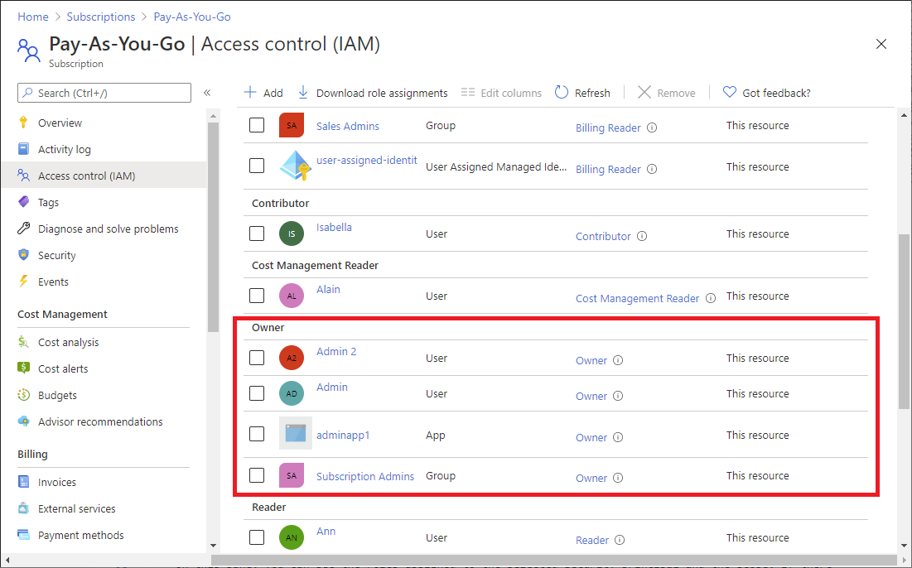

## List or manage privileged administrator role assignments

On the **Role assignments** tab, you can list and see the count of privileged administrator role assignments at the current scope. For more information, see [Privileged administrator roles](role-assignments-steps.md#privileged-administrator-roles).

1. In the Azure portal, click **All services** and then select the scope. For example, you can select **Management groups**, **Subscriptions**, **Resource groups**, or a resource.

1. Click the specific resource.

1. Click **Access control (IAM)**.

1. Click the **Role assignments** tab and then click the **Privileged** tab to list the privileged administrator role assignments at this scope.

    :::image type="content" source="./media/role-assignments-list-portal/access-control-role-assignments-privileged.png" alt-text="Screenshot of Access control page, Role assignments tab, and Privileged tab showing privileged role assignments." lightbox="./media/role-assignments-list-portal/access-control-role-assignments-privileged.png":::

1. To see the count of privileged administrator role assignments at this scope, see the **Privileged** card.

1. To manage privileged administrator role assignments, see the **Privileged** card and click **View assignments**.

    On the **Manage privileged role assignments** page, you can add a condition to constrain the privileged role assignment or remove the role assignment. For more information, see [Delegate the Azure role assignment task to others with conditions (preview)](delegate-role-assignments-portal.md).

    :::image type="content" source="./media/role-assignments-list-portal/access-control-role-assignments-privileged-manage.png" alt-text="Screenshot of Manage privileged role assignments page showing how to add conditions or remove role assignments." lightbox="./media/role-assignments-list-portal/access-control-role-assignments-privileged-manage.png":::

## List role assignments at a scope

1. In the Azure portal, click **All services** and then select the scope. For example, you can select **Management groups**, **Subscriptions**, **Resource groups**, or a resource.

1. Click the specific resource.

1. Click **Access control (IAM)**.

1. Click the **Role assignments** tab to view all the role assignments at this scope.

   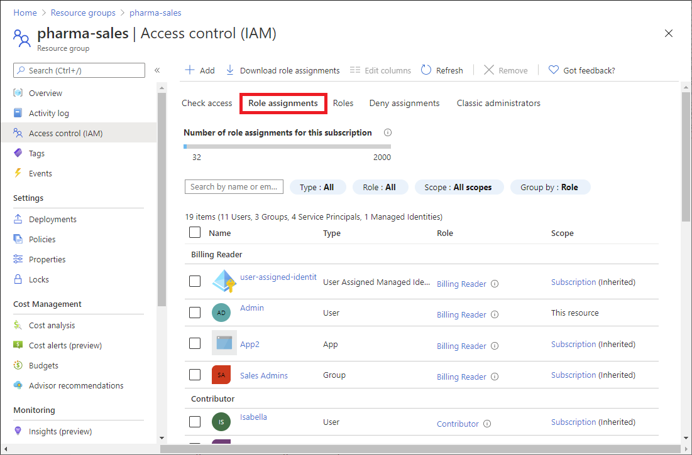

   On the Role assignments tab, you can see who has access at this scope. Notice that some roles are scoped to **This resource** while others are **(Inherited)** from another scope. Access is either assigned specifically to this resource or inherited from an assignment to the parent scope.

## List role assignments for a user at a scope

To list access for a user, group, service principal, or managed identity, you list their role assignments. Follow these steps to list the role assignments for a single user, group, service principal, or managed identity at a particular scope.

1. In the Azure portal, click **All services** and then select the scope. For example, you can select **Management groups**, **Subscriptions**, **Resource groups**, or a resource.

1. Click the specific resource.

1. Click **Access control (IAM)**.

    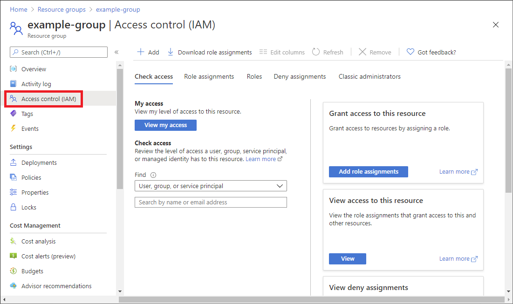

1. On the **Check access** tab, click the **Check access** button.

1. In the **Check access** pane, click **User, group, or service principal** or **Managed identity**.

1. In the search box, enter a string to search the directory for display names, email addresses, or object identifiers.

    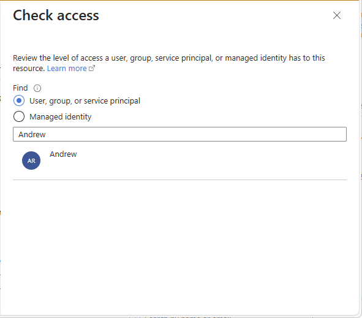

1. Click the security principal to open the **assignments** pane.

    On this pane, you can see the access for the selected security principal at this scope and inherited to this scope. Assignments at child scopes are not listed. You see the following assignments:

    - Role assignments added with Azure RBAC.
    - Deny assignments added using Azure Blueprints or Azure managed apps.
    - Classic Service Administrator or Co-Administrator assignments for classic deployments. 

    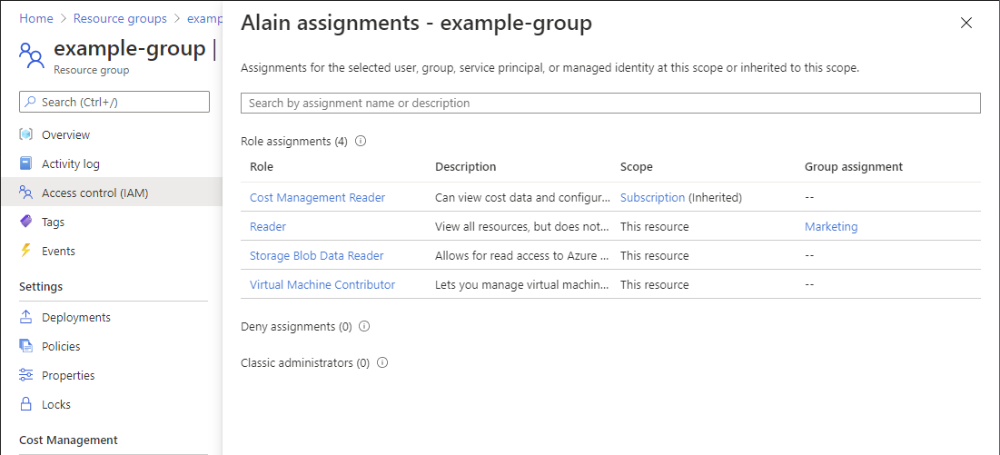

## List role assignments for a managed identity

You can list role assignments for system-assigned and user-assigned managed identities at a particular scope by using the **Access control (IAM)** blade as described earlier. This section describes how to list role assignments for just the managed identity.

### System-assigned managed identity

1. In the Azure portal, open a system-assigned managed identity.

1. In the left menu, click **Identity**.

    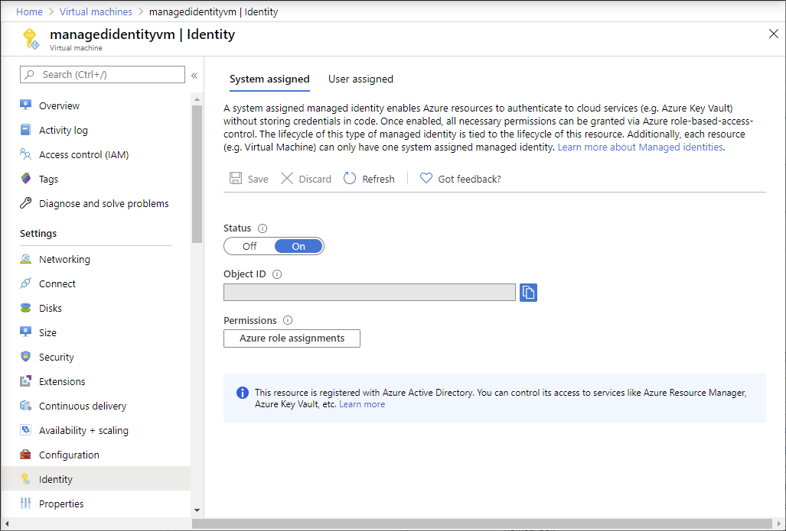

1. Under **Permissions**, click **Azure role assignments**.

    You see a list of roles assigned to the selected system-assigned managed identity at various scopes such as management group, subscription, resource group, or resource. This list includes all role assignments you have permission to read.

    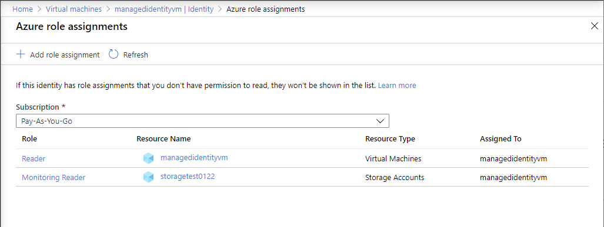

1. To change the subscription, click the **Subscription** list.

### User-assigned managed identity

1. In the Azure portal, open a user-assigned managed identity.

1. Click **Azure role assignments**.

    You see a list of roles assigned to the selected user-assigned managed identity at various scopes such as management group, subscription, resource group, or resource. This list includes all role assignments you have permission to read.

    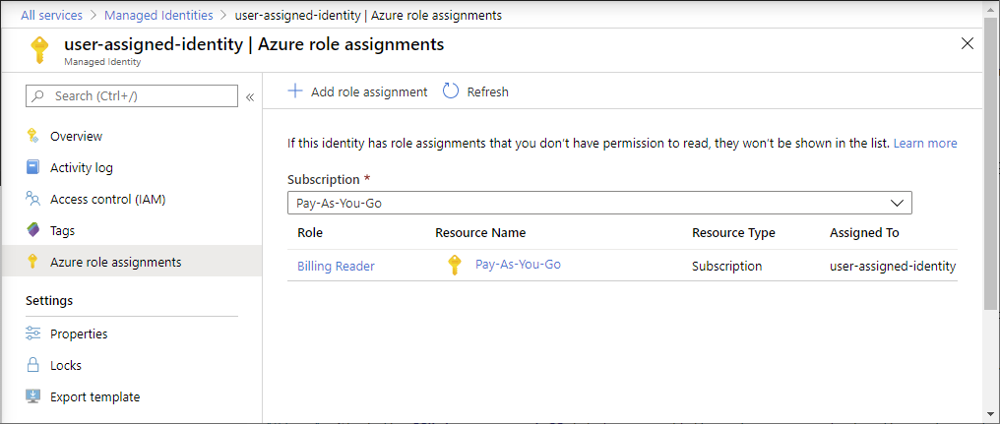

1. To change the subscription, click the **Subscription** list.

## List number of role assignments

You can have up to **4000** role assignments in each subscription. This limit includes role assignments at the subscription, resource group, and resource scopes. To help you keep track of this limit, the **Role assignments** tab includes a chart that lists the number of role assignments for the current subscription.

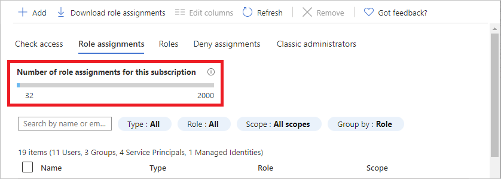

If you are getting close to the maximum number and you try to add more role assignments, you'll see a warning in the **Add role assignment** pane. For ways that you can reduce the number of role assignments, see [Troubleshoot Azure RBAC limits](troubleshoot-limits.md).

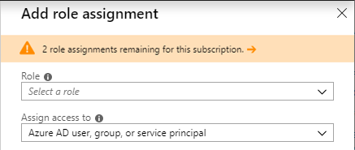

## Download role assignments

You can download role assignments at a scope in CSV or JSON formats. This can be helpful if you need to inspect the list in a spreadsheet or take an inventory when migrating a subscription.

When you download role assignments, you should keep in mind the following criteria:

- If you don't have permissions to read the directory, such as the Directory Readers role, the DisplayName, SignInName, and ObjectType columns will be blank.
- Role assignments whose security principal has been deleted are not included.
- Access granted to classic administrators are not included.

Follow these steps to download role assignments at a scope.

1. In the Azure portal, click **All services** and then select the scope where you want to download the role assignments. For example, you can select **Management groups**, **Subscriptions**, **Resource groups**, or a resource.

1. Click the specific resource.

1. Click **Access control (IAM)**.

1. Click **Download role assignments** to open the Download role assignments pane.

    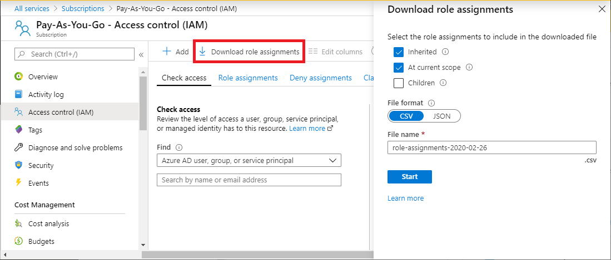

1. Use the check boxes to select the role assignments you want to include in the downloaded file.

    - **Inherited** - Include inherited role assignments for the current scope.
    - **At current scope** - Include role assignments for the current scope.
    - **Children** - Include role assignments at levels below the current scope. This check box is disabled for management group scope.

1. Select the file format, which can be comma-separated values (CSV) or JavaScript Object Notation (JSON).

1. Specify the file name.

1. Click **Start** to start the download.

    The following show examples of the output for each file format.

    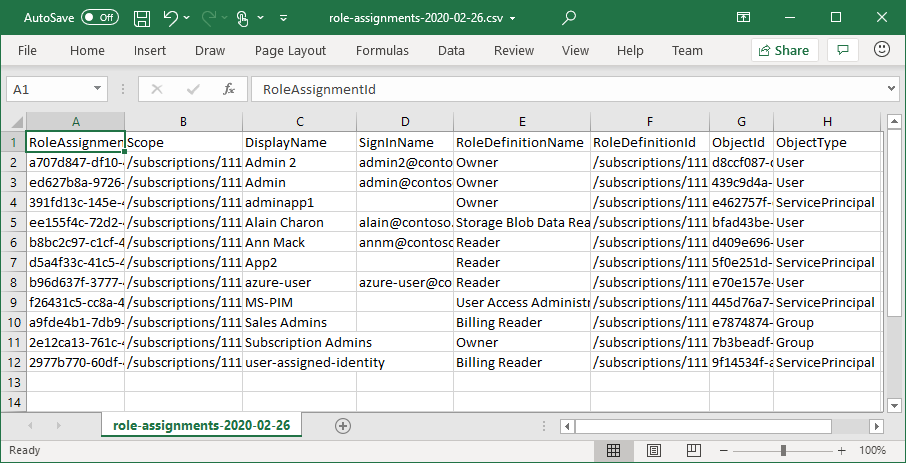

    

## Next steps

- [Assign Azure roles using the Azure portal](role-assignments-portal.md)
- [Troubleshoot Azure RBAC](troubleshooting.md)
