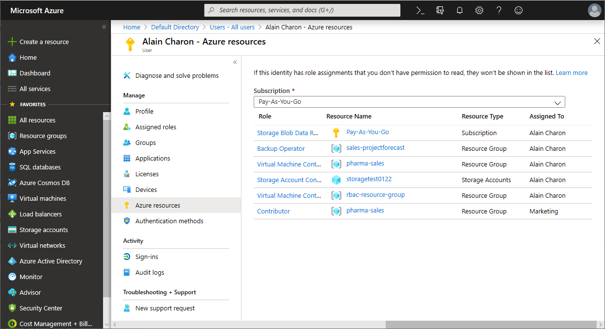
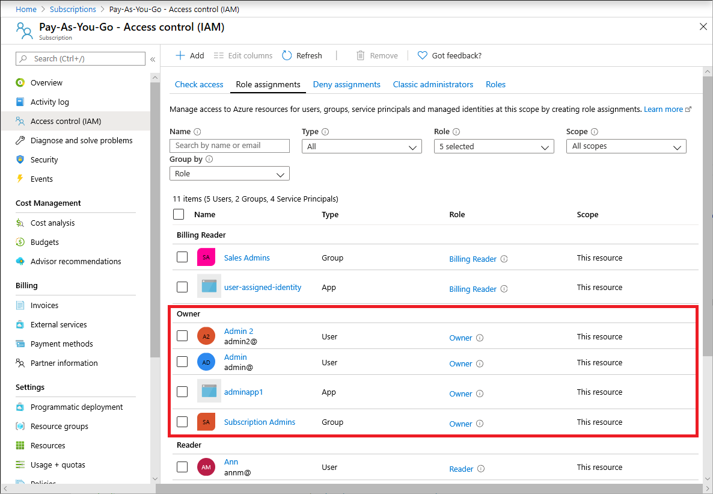
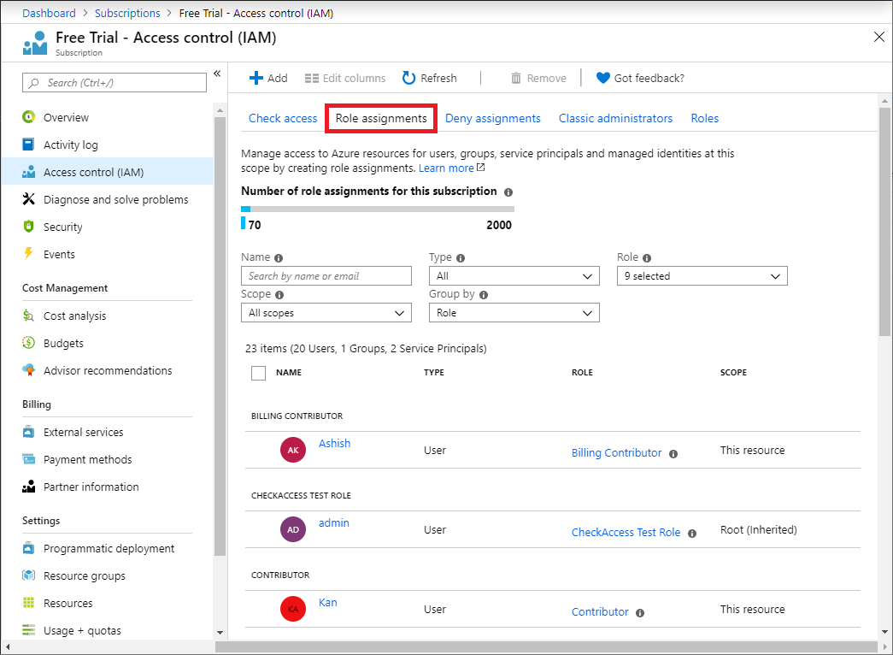
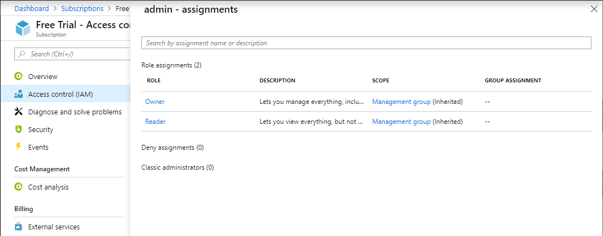
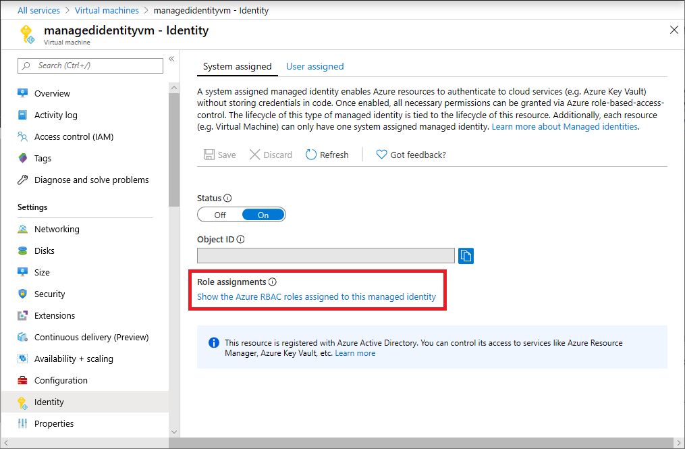
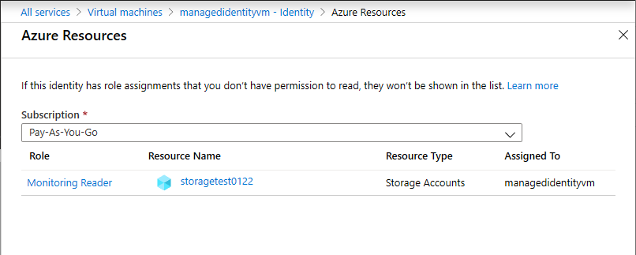
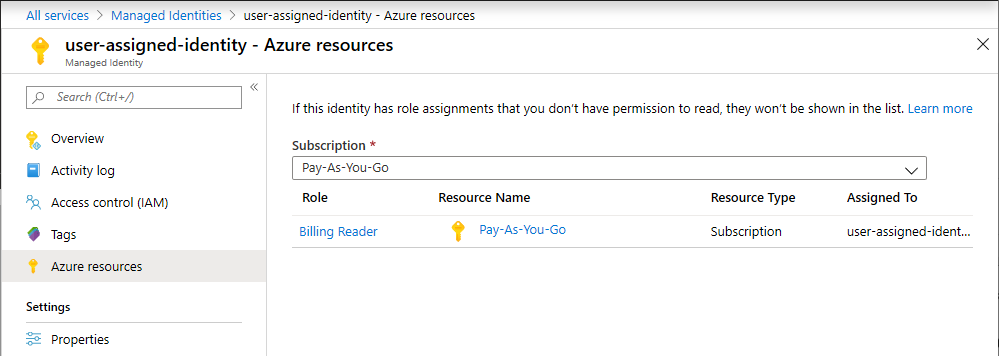

# List role assignments using Azure RBAC and the Azure portal

[!INCLUDE [Azure RBAC definition list access](../../includes/role-based-access-control-definition-list.md)] This article describes how to list role assignments using the Azure portal.

> [!NOTE]
> If your organization has outsourced management functions to a service provider who uses [Azure delegated resource management](../lighthouse/concepts/azure-delegated-resource-management.md), role assignments authorized by that service provider won't be shown here.

## List role assignments for a user or group

The easiest way to see the roles assigned to a user or group in a subscription is to use the **Azure resources** pane.

1. In the Azure portal, click **All services** and then select **Users** or **Groups**.

1. Click the user or group you want list the role assignments for.

1. Click **Azure resources**.

    You see a list of roles assigned to the selected user or group at various scopes such as management group, subscription, resource group, or resource. This list includes all role assignments you have permission to read.

        

1. To change the subscription, click the **Subscriptions** list.

## List owners of a subscription

Users that have been assigned the [Owner](built-in-roles.md#owner) role for a subscription can manage everything in the subscription. Follow these steps to list the owners of a subscription.

1. In the Azure portal, click **All services** and then **Subscriptions**.

1. Click the subscription you want to list the owners of.

1. Click **Access control (IAM)**.

1. Click the **Role assignments** tab to view all the role assignments for this subscription.

1. Scroll to the **Owners** section to see all the users that have been assigned the Owner role for this subscription.

   

## List role assignments at a scope

1. In the Azure portal, click **All services** and then select the scope. For example, you can select **Management groups**, **Subscriptions**, **Resource groups**, or a resource.

1. Click the specific resource.

1. Click **Access control (IAM)**.

1. Click the **Role assignments** tab to view all the role assignments at this scope.

   

   On the Role assignments tab, you can see who has access at this scope. Notice that some roles are scoped to **This resource** while others are **(Inherited)** from another scope. Access is either assigned specifically to this resource or inherited from an assignment to the parent scope.

## List role assignments for a user at a scope

To list access for a user, group, service principal, or managed identity, you list their role assignments. Follow these steps to list the role assignments for a single user, group, service principal, or managed identity at a particular scope.

1. In the Azure portal, click **All services** and then select the scope. For example, you can select **Management groups**, **Subscriptions**, **Resource groups**, or a resource.

1. Click the specific resource.

1. Click **Access control (IAM)**.

1. Click the **Check access** tab.

    

1. In the **Find** list, select the type of security principal you want to check access for.

1. In the search box, enter a string to search the directory for display names, email addresses, or object identifiers.

    

1. Click the security principal to open the **assignments** pane.

    

    On this pane, you can see the roles assigned to the selected security principal and the scope. If there are any deny assignments at this scope or inherited to this scope, they will be listed.

## List role assignments for a system-assigned managed identity

1. In the Azure portal, open a system-assigned managed identity.

1. In the left menu, click **Identity**.

    

1. Under **Role assignments**, click **Show the Azure RBAC roles assigned to this managed identity**.

    You see a list of roles assigned to the selected system-assigned managed identity at various scopes such as management group, subscription, resource group, or resource. This list includes all role assignments you have permission to read.

    

## List role assignments for a user-assigned managed identity

1. In the Azure portal, open a system-assigned managed identity.

1. Click **Azure resources**.

    You see a list of roles assigned to the selected user-assigned managed identity at various scopes such as management group, subscription, resource group, or resource. This list includes all role assignments you have permission to read.

    

1. To change the subscription, click the **Subscriptions** list.

## Next steps

- [Add or remove role assignments using Azure RBAC and the Azure portal](role-assignments-portal.md)
- [Troubleshoot RBAC for Azure resources](troubleshooting.md)
