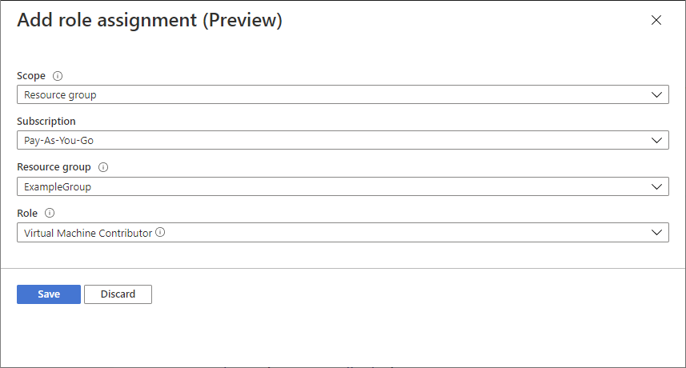

# Assign Azure roles to a managed identity (Preview)

You can assign a role to a managed identity by using the **Access control (IAM)** page as described in [Assign Azure roles using the Azure portal](role-assignments-portal.md). When you use the Access control (IAM) page, you start with the scope and then select the managed identity and role. This article describes an alternate way to assign roles for a managed identity. Using these steps, you start with the managed identity and then select the scope and role.

> [!IMPORTANT]
> Assign a role to a managed identity using these alternate steps is currently in preview.
> This preview version is provided without a service level agreement, and it's not recommended for production workloads. Certain features might not be supported or might have constrained capabilities.
> For more information, see [Supplemental Terms of Use for Microsoft Azure Previews](https://azure.microsoft.com/support/legal/preview-supplemental-terms/).

## Prerequisites

[!INCLUDE [Azure role assignment prerequisites](../../includes/role-based-access-control/prerequisites-role-assignments.md)]

## System-assigned managed identity

Follow these steps to assign a role to a system-assigned managed identity by starting with the managed identity.

1. In the Azure portal, open a system-assigned managed identity.

1. In the left menu, click **Identity**.

    

1. Under **Permissions**, click **Azure role assignments**.

    If roles are already assigned to the selected system-assigned managed identity, you see the list of role assignments. This list includes all role assignments you have permission to read.

    

1. To change the subscription, click the **Subscription** list.

1. Click **Add role assignment (Preview)**.

1. Use the drop-down lists to select the set of resources that the role assignment applies to such as **Subscription**, **Resource group**, or resource.

    If you don't have role assignment write permissions for the selected scope, an inline message will be displayed. 

1. In the **Role** drop-down list, select a role such as **Virtual Machine Contributor**.

   

1. Click **Save** to assign the role.

   After a few moments, the managed identity is assigned the role at the selected scope.

## User-assigned managed identity

Follow these steps to assign a role to a user-assigned managed identity by starting with the managed identity.

1. In the Azure portal, open a user-assigned managed identity.

1. In the left menu, click **Azure role assignments**.

    If roles are already assigned to the selected user-assigned managed identity, you see the list of role assignments. This list includes all role assignments you have permission to read.

    

1. To change the subscription, click the **Subscription** list.

1. Click **Add role assignment (Preview)**.

1. Use the drop-down lists to select the set of resources that the role assignment applies to such as **Subscription**, **Resource group**, or resource.

    If you don't have role assignment write permissions for the selected scope, an inline message will be displayed. 

1. In the **Role** drop-down list, select a role such as **Virtual Machine Contributor**.

   

1. Click **Save** to assign the role.

   After a few moments, the managed identity is assigned the role at the selected scope.

## Next steps

- [What are managed identities for Azure resources?](../active-directory/managed-identities-azure-resources/overview.md)
- [Assign Azure roles using the Azure portal](role-assignments-portal.md)
- [List Azure role assignments using the Azure portal](role-assignments-list-portal.md)
