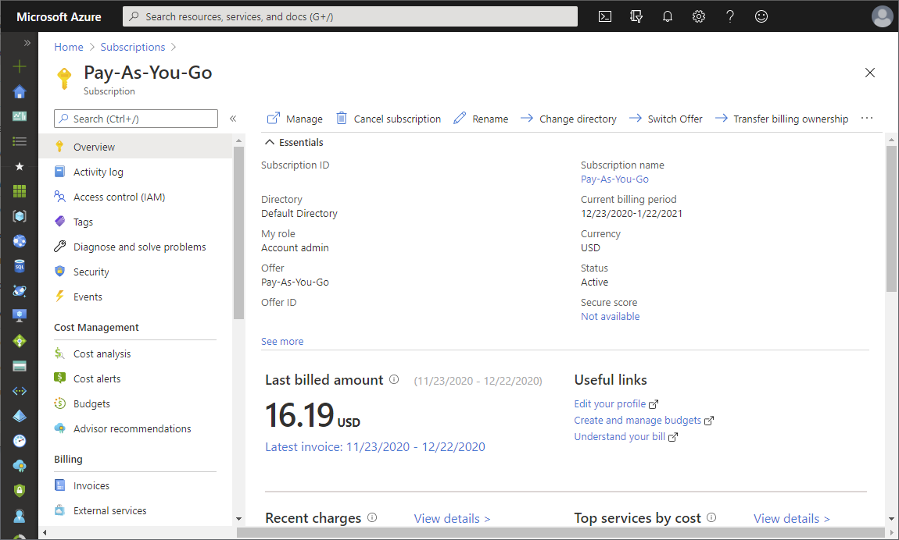
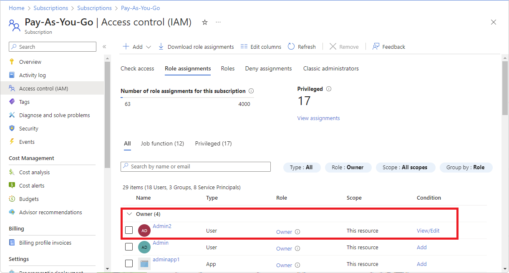

# Assign a user as an administrator of an Azure subscription

To make a user an administrator of an Azure subscription, assign them the [Owner](built-in-roles.md#owner) role at the subscription scope. The Owner role gives the user full access to all resources in the subscription, including the permission to grant access to others. These steps are the same as any other role assignment.

## Prerequisites

[!INCLUDE [Azure role assignment prerequisites](../../includes/role-based-access-control/prerequisites-role-assignments.md)]

## Step 1: Open the subscription

1. Sign in to the [Azure portal](https://portal.azure.com).

1. In the Search box at the top, search for subscriptions.

1. Click the subscription you want to use.

    The following shows an example subscription.

    

## Step 2: Open the Add role assignment page

**Access control (IAM)** is the page that you typically use to assign roles to grant access to Azure resources. It's also known as identity and access management (IAM) and appears in several locations in the Azure portal.

1. Click **Access control (IAM)**.

    The following shows an example of the Access control (IAM) page for a subscription.

    

1. Click the **Role assignments** tab to view the role assignments at this scope.

1. Click **Add** > **Add role assignment**.

   If you don't have permissions to assign roles, the Add role assignment option will be disabled.

    

    The Add role assignment page opens.

## Step 3: Select the Owner role

The [Owner](built-in-roles.md#owner) role grant full access to manage all resources, including the ability to assign roles in Azure RBAC. You should have a maximum of 3 subscription owners to reduce the potential for breach by a compromised owner.

1. On the **Role** tab, select the **Privileged administrator roles** tab.

   

1. Select the **Owner** role.

1. Click **Next**.

## Step 4: Select who needs access

1. On the **Members** tab, select **User, group, or service principal**.

   

1. Click **Select members**.

1. Find and select the user.

    You can type in the **Select** box to search the directory for display name or email address.

   

1. Click **Save** to add the user to the Members list.

1. In the **Description** box enter an optional description for this role assignment.

    Later you can show this description in the role assignments list.

1. Click **Next**.

## Step 5: Assign role

1. On the **Review + assign** tab, review the role assignment settings.

1. Click **Review + assign** to assign the role.

   After a few moments, the user is assigned the Owner role for the subscription.

    

## Next steps

- [Assign Azure roles using the Azure portal](role-assignments-portal.md)
- [Organize your resources with Azure management groups](../governance/management-groups/overview.md)
- [Alert on privileged Azure role assignments](role-assignments-alert.md)
