# Manage access using RBAC and the Azure portal

[Role-based access control (RBAC)](overview.md) is the way that you manage access to resources in Azure. This article describes how you manage access for users, groups, and applications using RBAC and the Azure portal.

## List roles

A role definition is a collection of permissions that you use for role assignments. Azure has over 70 [built-in roles](built-in-roles.md). Follow these steps to list the roles in the portal.

1. In the Azure portal, choose **All services** and then **Subscriptions**.

1. Choose your subscription.

1. Choose **Access control (IAM)**.

   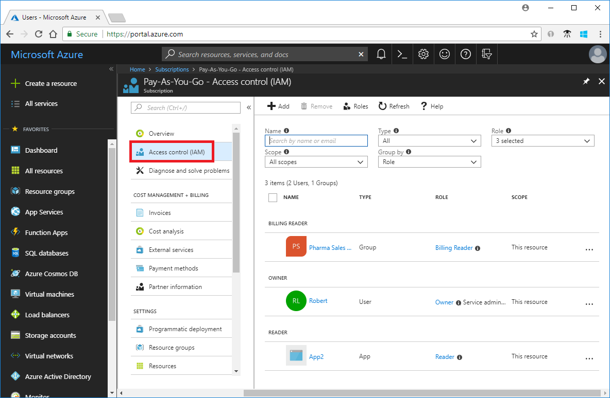

1. Choose **Roles** to see a list of all the built-in and custom roles.

   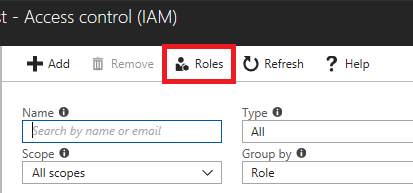

   You can see the number of users and groups that are assigned to each role.

   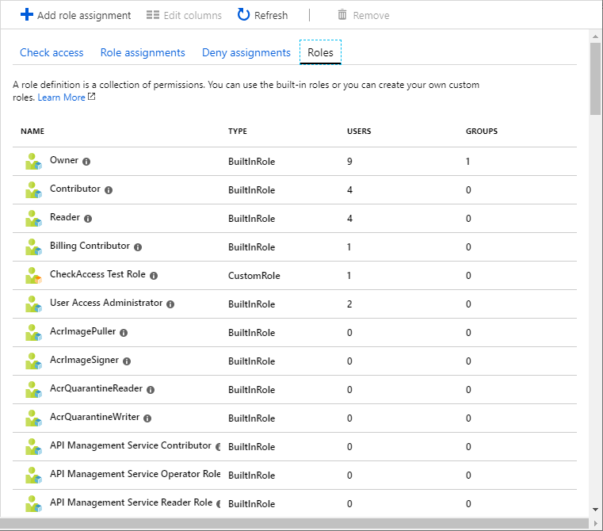

## List access

When managing access, you want to know who has access, what are their permissions, and at what level. To list access, you list the role assignments. Follow these steps to list the access for users and list the access at different scopes.

### List role assignments for a user

1. In the navigation list, choose **Azure Active Directory**.

1. Choose **Users** to open **All users**.

   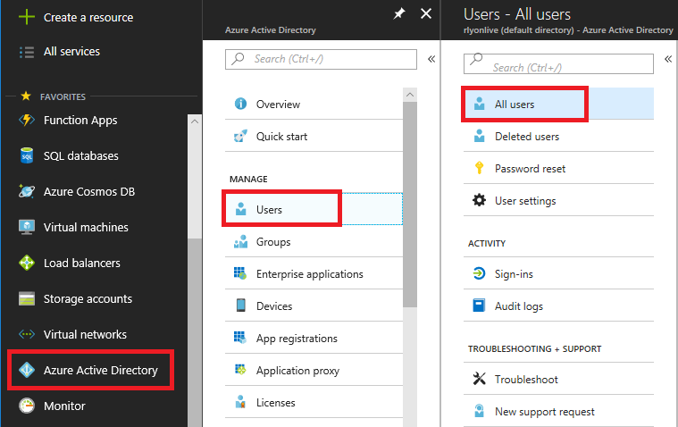

1. Choose an individual user in the list.

1. In the **Manage** section, choose **Azure resources**.

   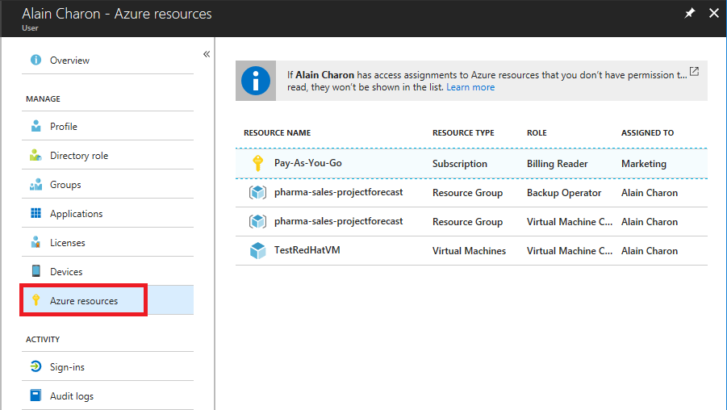

   On the Azure resources blade, you can see the role assignments for the selected user and selected subscription. This list includes only role assignments for resources that you have permission to read. For example, if the user also has role assignments that you cannot read, those role assignments will not appear in the list.

1. If you have multiple subscriptions, you can choose the **Subscription** drop-down list to see the role assignments in a different subscription.

### List role assignments for a resource group

1. In the navigation list, choose **Resource groups**.

1. Choose a resource group and then choose **Access control (IAM)**.

   On the Access control (IAM) blade, also known as identity and access management, you can see who has access to this resource group. Notice that some roles are scoped to **This resource** while others are **(Inherited)** from another scope. Access is either assigned specifically to the resource group or inherited from an assignment to the parent subscription.

   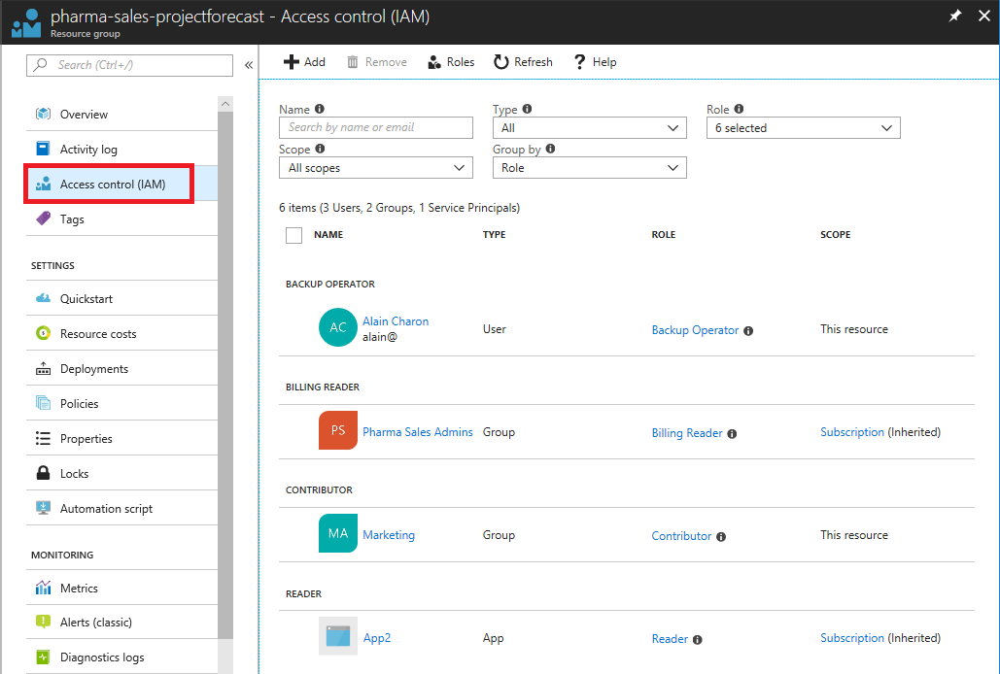

### List role assignments for a subscription

1. In the Azure portal, choose **All services** and then **Subscriptions**.

1. Choose your subscription.

1. Choose **Access control (IAM)**.

    On the Access control (IAM) blade, you can see who has access to this subscription and their role.

    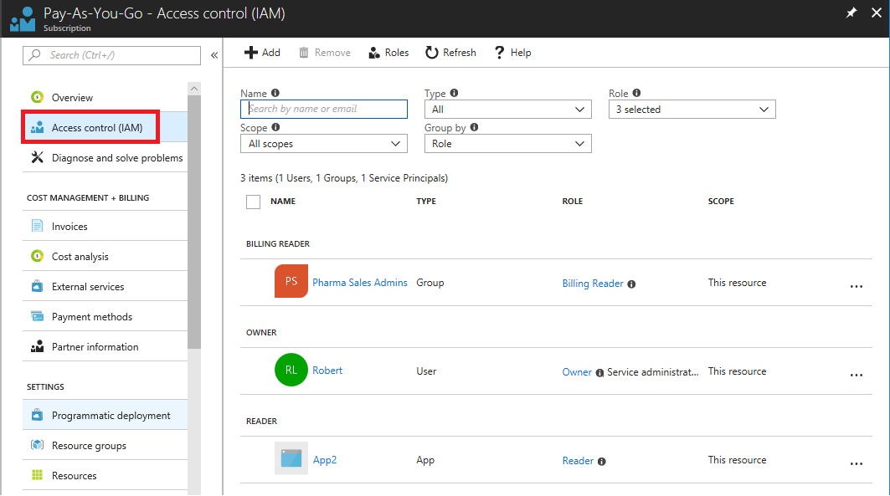

    Classic subscription administrators and Co-administrators are considered owners of the subscription in the RBAC model.

### List role assignments for a management group

1. In the Azure portal, choose **All services** and then **Management Groups**.

1. Choose your management group.

1. Choose **(details)** for your selected management group.

    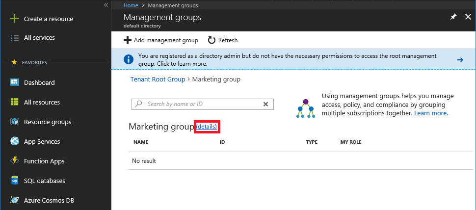

1. Choose **Access control (IAM)**.

    On the Access control (IAM) blade, you can see who has access to this management group and their role.

    

## Grant access

In RBAC, to grant access, you assign a role. Follow these steps to grant access at different scopes.

### Assign a role at a resource group scope

1. In the navigation list, choose **Resource groups**.

1. Choose a resource group.

1. Choose **Access control (IAM)** to see the current list of role assignments at the resource group scope.

   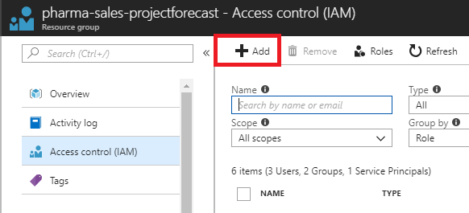

1. Choose **Add** to open the **Add permissions** pane.

   If you don't have permissions to assign roles, you won't see the **Add** option.

   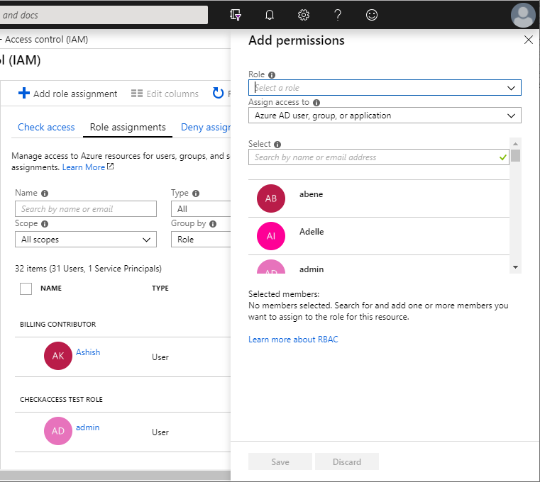

1. In the **Role** drop-down list, select a role such as **Virtual Machine Contributor**.

1. In the **Select** list, select a user, group, or application. If you don't see the security principal in the list, you can type in the **Select** box to search the directory for display names, email addresses, and object identifiers.

1. Choose **Save** to assign the role.

   After a few moments, the security principal is assigned the role at the resource group scope.

### Assign a role at a subscription scope

1. In the Azure portal, choose **All services** and then **Subscriptions**.

1. Choose your subscription.

1. Choose **Access control (IAM)** to see the current list of role assignments at the subscription scope.

   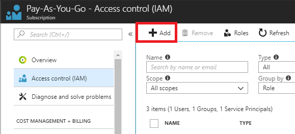

1. Choose **Add** to open the **Add permissions** pane.

   If you don't have permissions to assign roles, you won't see the **Add** option.

   

1. In the **Role** drop-down list, select a role such as **Virtual Machine Contributor**.

1. In the **Select** list, select a user, group, or application. If you don't see the security principal in the list, you can type in the **Select** box to search the directory for display names, email addresses, and object identifiers.

1. Choose **Save** to assign the role.

   After a few moments, the security principal is assigned the role at the subscription scope.

### Assign a user as an administrator of a subscription

To make a user an administrator of an Azure subscription, assign them the [Owner](built-in-roles.md#owner) role at the subscription scope. The Owner role gives the user full access to all resources in the subscription, including the right to delegate access to others. These steps are the same as any other role assignment.

1. In the Azure portal, choose **All services** and then **Subscriptions**.

1. Choose your subscription.

1. Choose **Access control (IAM)** to see the current list of role assignments at the subscription scope.

   

1. Choose **Add** to open the **Add permissions** pane.

   If you don't have permissions to assign roles, you won't see the **Add** option.

   

1. In the **Role** drop-down list, select the **Owner** role.

1. In the **Select** list, select a user. If you don't see the user in the list, you can type in the **Select** box to search the directory for display names and email addresses.

1. Choose **Save** to assign the role.

   After a few moments, the user is assigned the Owner role at the subscription scope.

### Assign a role at a management group scope

1. In the Azure portal, choose **All services** and then **Management groups**.

1. Choose your management group.

1. Choose **(details)** for your selected management group.

    

1. Choose **Access control (IAM)** to see the current list of role assignments at the subscription scope.

   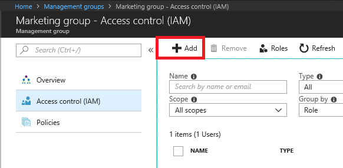

1. Choose **Add** to open the **Add permissions** pane.

   If you don't have permissions to assign roles, you won't see the **Add** option.

   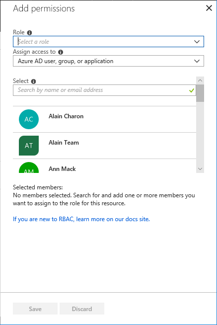

1. In the **Role** drop-down list, select a role such as **Management Group Contributor**.

    For information about the supported actions on management groups for various roles, see [Organize your resources with Azure management groups](../governance/management-groups/index.md#management-group-access).

1. In the **Select** list, select a user, group, or application. If you don't see the security principal in the list, you can type in the **Select** box to search the directory for display names, email addresses, and object identifiers.

1. Choose **Save** to assign the role.

   After a few moments, the security principal is assigned the role at the management group scope.

## Remove access

In RBAC, to remove access, you remove a role assignment. Follow these steps to remove access.

### Remove a role assignment

1. Open the **Access control (IAM)** blade for the management group, subscription, resource group, or resource that has the role assignment you want to remove.

1. In the list of role assignments, add a checkmark next to the security principal with the role assignment you want to remove.

   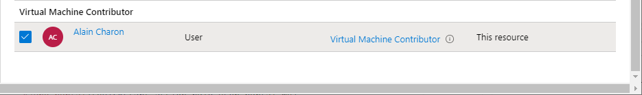

1. Choose **Remove**.

   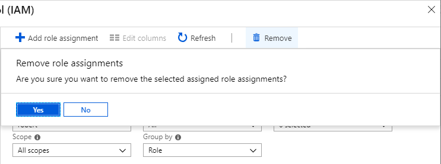

1. In the remove role assignment message that appears, choose **Yes**.

    Inherited role assignments cannot be removed. If you need to remove an inherited role assignment, you must do it at the scope where the role assignment was created. In the **Scope** column, next to **(Inherited)** there is a link that takes you to the scope where this role was assigned. Go to the scope listed there to remove the role assignment.

   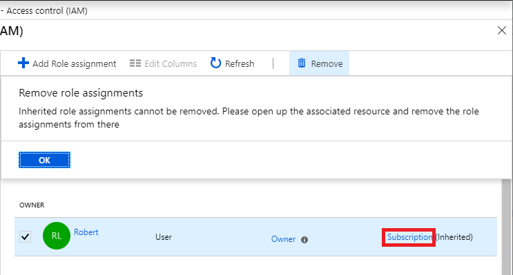

## Next steps

* [Quickstart: Grant access for a user using RBAC and the Azure portal](quickstart-assign-role-user-portal.md)
* [Tutorial: Grant access for a user using RBAC and Azure PowerShell](tutorial-role-assignments-user-powershell.md)
* [Built-in roles](built-in-roles.md)
* [Organize your resources with Azure management groups](../azure-resource-manager/management-groups-overview.md)
