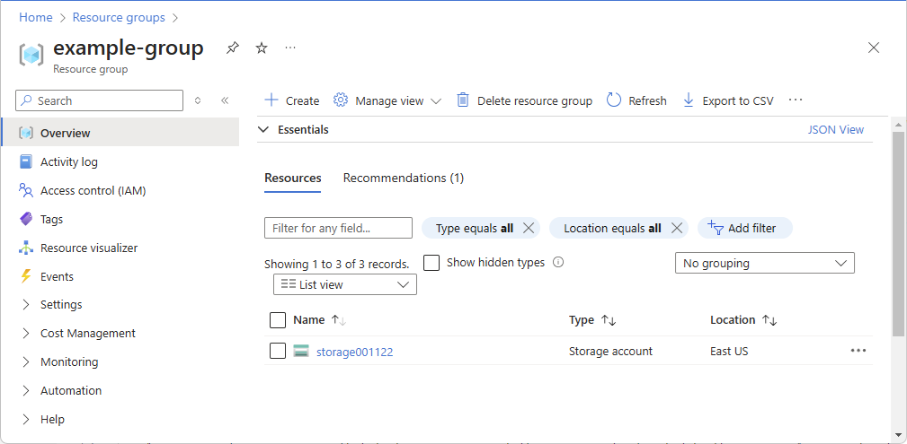
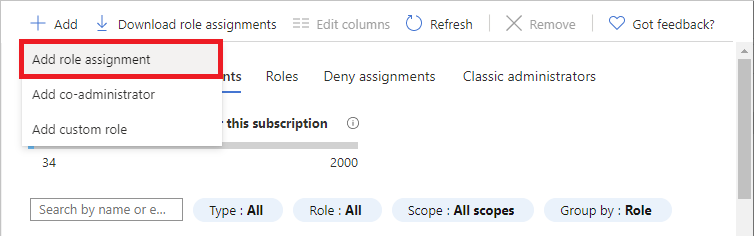
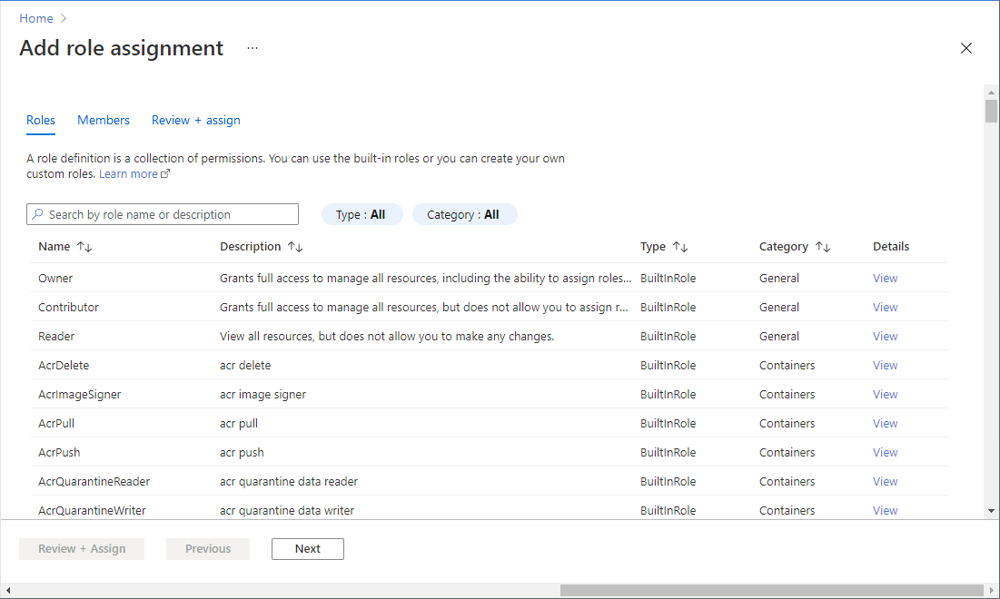
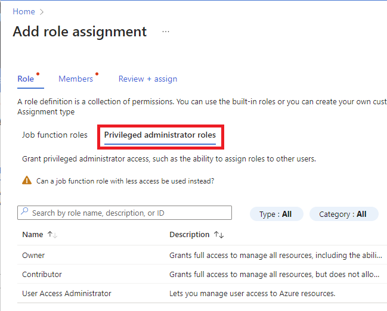
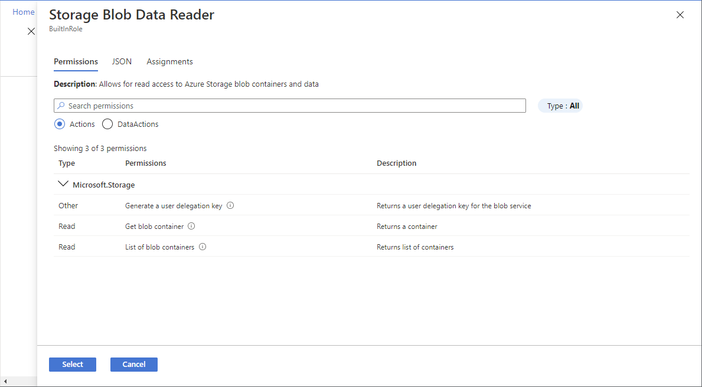
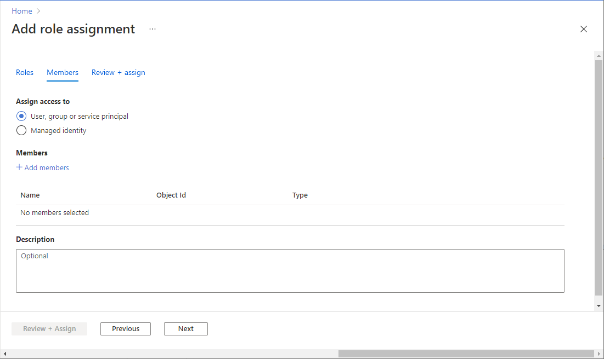
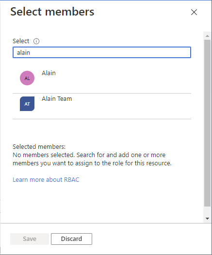
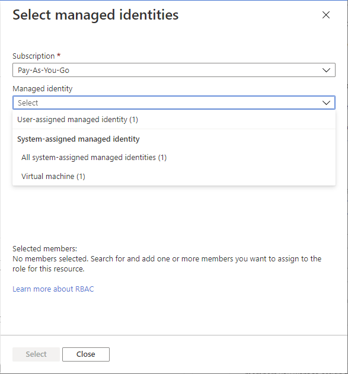
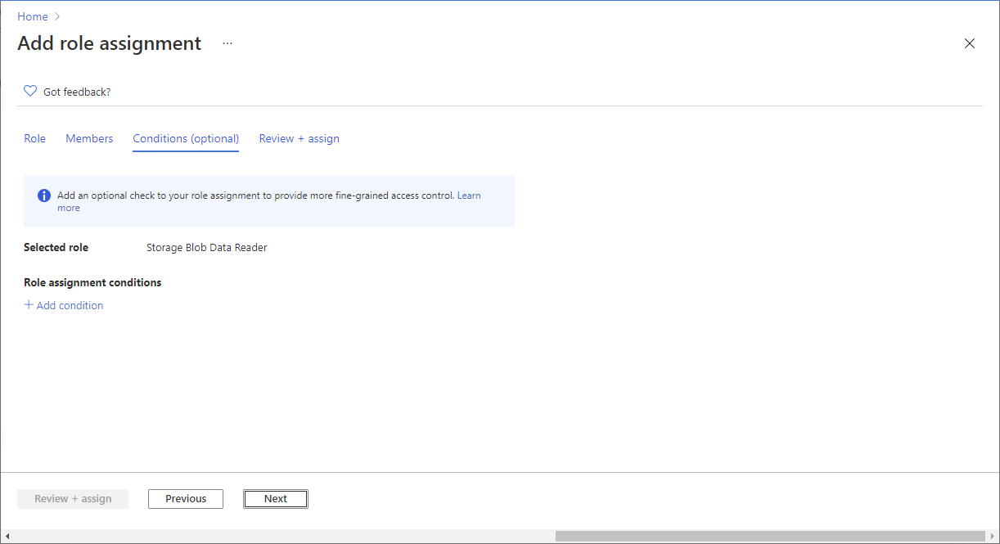
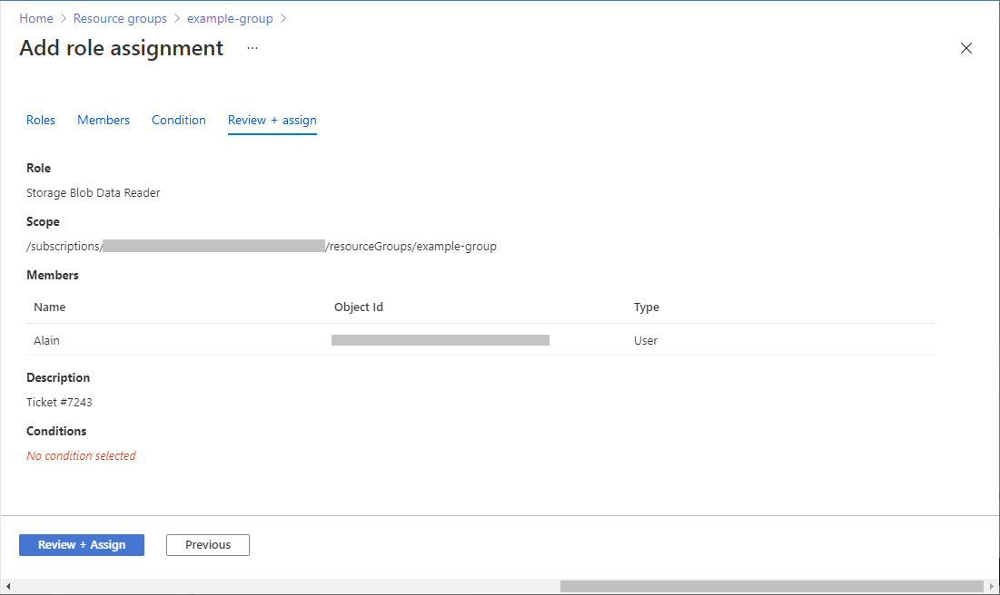

# Assign Azure roles using the Azure portal

[!INCLUDE [Azure RBAC definition grant access](../../includes/role-based-access-control/definition-grant.md)] This article describes how to assign roles using the Azure portal.

If you need to assign administrator roles in Microsoft Entra ID, see [Assign Microsoft Entra roles to users](../active-directory/roles/manage-roles-portal.md).

## Prerequisites

[!INCLUDE [Azure role assignment prerequisites](../../includes/role-based-access-control/prerequisites-role-assignments.md)]

## Step 1: Identify the needed scope

[!INCLUDE [Scope for Azure RBAC introduction](../../includes/role-based-access-control/scope-intro.md)] For more information, see [Understand scope](scope-overview.md).

1. Sign in to the [Azure portal](https://portal.azure.com).

1. In the Search box at the top, search for the scope you want to grant access to. For example, search for **Management groups**, **Subscriptions**, **Resource groups**, or a specific resource.

1. Click the specific resource for that scope.

    The following shows an example resource group.

    

## Step 2: Open the Add role assignment page

**Access control (IAM)** is the page that you typically use to assign roles to grant access to Azure resources. It's also known as identity and access management (IAM) and appears in several locations in the Azure portal.

1. Click **Access control (IAM)**.

    The following shows an example of the Access control (IAM) page for a resource group.

    

1. Click the **Role assignments** tab to view the role assignments at this scope.

1. Click **Add** > **Add role assignment**.

    If you don't have permissions to assign roles, the Add role assignment option will be disabled.

    

    The Add role assignment page opens.

## Step 3: Select the appropriate role

1. On the **Role** tab, select a role that you want to use.

    You can search for a role by name or by description. You can also filter roles by type and category.

   

1. If you want to assign a privileged administrator role, select the **Privileged administrator roles** tab to select the role.

    Privileged administrator roles are roles that grant privileged administrator access, such as the ability to manage Azure resources or assign roles to other users. You should avoid assigning a privileged administrator role when a job function role can be assigned instead. If you must assign a privileged administrator role, use a narrow scope, such as resource group or resource. For more information, see [Privileged administrator roles](./role-assignments-steps.md#privileged-administrator-roles).

   

1. In the **Details** column, click **View** to get more details about a role.

   

1. Click **Next**.

## Step 4: Select who needs access

1. On the **Members** tab, select **User, group, or service principal** to assign the selected role to one or more Microsoft Entra users, groups, or service principals (applications).

   

1. Click **Select members**.

1. Find and select the users, groups, or service principals.

    You can type in the **Select** box to search the directory for display name or email address.

   

1. Click **Select** to add the users, groups, or service principals to the Members list.

1. To assign the selected role to one or more managed identities, select **Managed identity**.

1. Click **Select members**.

1. In the **Select managed identities** pane, select whether the type is [user-assigned managed identity](../active-directory/managed-identities-azure-resources/overview.md) or [system-assigned managed identity](../active-directory/managed-identities-azure-resources/overview.md).

1. Find and select the managed identities.

    For system-assigned managed identities, you can select managed identities by Azure service instance.

   

1. Click **Select** to add the managed identities to the Members list.

1. In the **Description** box enter an optional description for this role assignment.

    Later you can show this description in the role assignments list.

1. Click **Next**.

## Step 5: (Optional) Add condition

If you selected a role that supports conditions, a **Conditions** tab will appear and you have the option to add a condition to your role assignment. A [condition](conditions-overview.md) is an additional check that you can optionally add to your role assignment to provide more fine-grained access control.

The **Conditions** tab will look different depending on the role you selected.

# [Delegate condition](#tab/delegate-condition)

> [!IMPORTANT]
> Delegating Azure role assignments with conditions is currently in PREVIEW.
> See the [Supplemental Terms of Use for Microsoft Azure Previews](https://azure.microsoft.com/support/legal/preview-supplemental-terms/) for legal terms that apply to Azure features that are in beta, preview, or otherwise not yet released into general availability.

If you selected one of the following privileged roles, follow the steps in this section.

- [Owner](built-in-roles.md#owner)
- [Role Based Access Control Administrator (Preview)](built-in-roles.md#role-based-access-control-administrator-preview)
- [User Access Administrator](built-in-roles.md#user-access-administrator)

1. On the **Conditions** tab under **Delegation type**, select the **Constrained (recommended)** option.

    :::image type="content" source="./media/shared/condition-constrained.png" alt-text="Screenshot of Add role assignment with the Constrained option selected." lightbox="./media/shared/condition-constrained.png":::

1. Click **Add condition** to add a condition that constrains the roles and principals this user can assign roles to.

1. Follow the steps in [Delegate the Azure role assignment task to others with conditions (preview)](delegate-role-assignments-portal.md#step-3-add-a-condition).

# [Storage condition](#tab/storage-condition)

If you selected one of the following storage roles, follow the steps in this section.

- [Storage Blob Data Contributor](built-in-roles.md#storage-blob-data-contributor)
- [Storage Blob Data Owner](built-in-roles.md#storage-blob-data-owner)
- [Storage Blob Data Reader](built-in-roles.md#storage-blob-data-reader)
- [Storage Queue Data Contributor](built-in-roles.md#storage-queue-data-contributor)
- [Storage Queue Data Message Processor](built-in-roles.md#storage-queue-data-message-processor)
- [Storage Queue Data Message Sender](built-in-roles.md#storage-queue-data-message-sender)
- [Storage Queue Data Reader](built-in-roles.md#storage-queue-data-reader)

1. Click **Add condition** if you want to further refine the role assignments based on storage attributes.

   

1. Follow the steps in [Add or edit Azure role assignment conditions](conditions-role-assignments-portal.md#step-3-review-basics).

---

## Step 6: Assign role

1. On the **Review + assign** tab, review the role assignment settings.

   

1. Click **Review + assign** to assign the role.

   After a few moments, the security principal is assigned the role at the selected scope.

    

1. If you don't see the description for the role assignment, click **Edit columns** to add the **Description** column.

## Next steps

- [Assign a user as an administrator of an Azure subscription](role-assignments-portal-subscription-admin.md)
- [Remove Azure role assignments](role-assignments-remove.md)
- [Troubleshoot Azure RBAC](troubleshooting.md)
