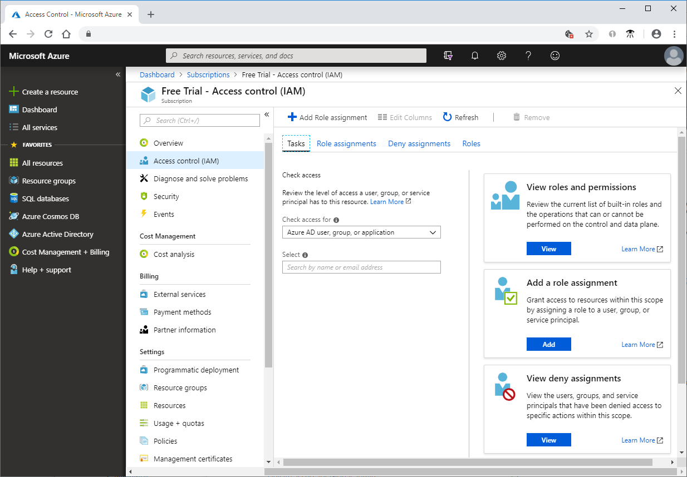
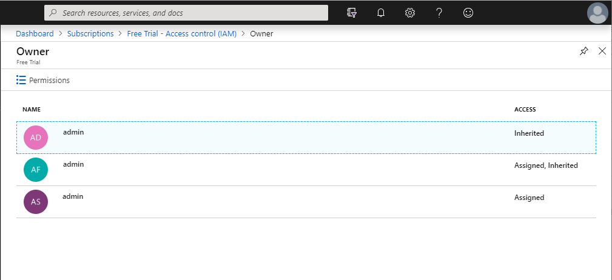
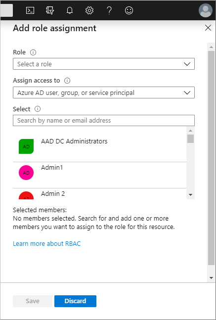
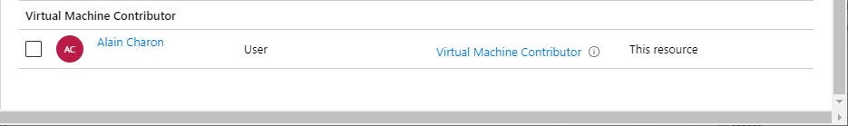
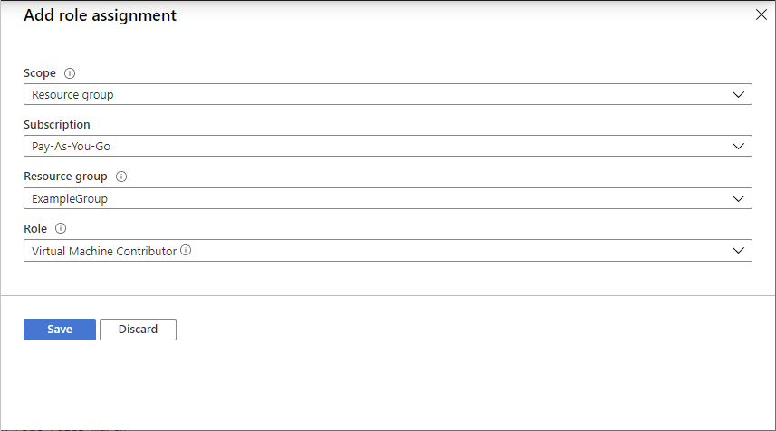

# Add or remove Azure role assignments using the Azure portal

[!INCLUDE [Azure RBAC definition grant access](../../includes/role-based-access-control-definition-grant.md)] This article describes how to assign roles using the Azure portal.

If you need to assign administrator roles in Azure Active Directory, see [View and assign administrator roles in Azure Active Directory](../active-directory/users-groups-roles/directory-manage-roles-portal.md).

## Prerequisites

To add or remove role assignments, you must have:

- `Microsoft.Authorization/roleAssignments/write` and `Microsoft.Authorization/roleAssignments/delete` permissions, such as [User Access Administrator](built-in-roles.md#user-access-administrator) or [Owner](built-in-roles.md#owner)

## Access control (IAM)

**Access control (IAM)** is the page that you typically use to assign roles to grant access to Azure resources. It's also known as identity and access management and appears in several locations in the Azure portal. The following shows an example of the Access control (IAM) page for a subscription.

To be the most effective with the Access control (IAM) page, it helps if you can answer the following three questions when you are trying to assign a role:

1. **Who needs access?**

    Who refers to a user, group, service principal, or managed identity. This is also called a *security principal*.

1. **What role do they need?**

    Permissions are grouped together into roles. You can select from a list of several [built-in roles](built-in-roles.md) or you can use your own custom roles.

1. **Where do they need access?**

    Where refers to the set of resources that the access applies to. Where can be a management group, subscription, resource group, or a single resource such as a storage account. This is called the *scope*.

## Add a role assignment

In Azure RBAC, to grant access to an Azure resource, you add a role assignment. Follow these steps to assign a role.

1. In the Azure portal, click **All services** and then select the scope that you want to grant access to. For example, you can select **Management groups**, **Subscriptions**, **Resource groups**, or a resource.

1. Click the specific resource for that scope.

1. Click **Access control (IAM)**.

1. Click the **Role assignments** tab to view the role assignments at this scope.

    

1. Click **Add** > **Add role assignment**.

   If you don't have permissions to assign roles, the Add role assignment option will be disabled.

   

    The Add role assignment pane opens.

   

1. In the **Role** drop-down list, select a role such as **Virtual Machine Contributor**.

1. In the **Select** list, select a user, group, service principal, or managed identity. If you don't see the security principal in the list, you can type in the **Select** box to search the directory for display names, email addresses, and object identifiers.

1. Click **Save** to assign the role.

   After a few moments, the security principal is assigned the role at the selected scope.

    

## Assign a user as an administrator of a subscription

To make a user an administrator of an Azure subscription, assign them the [Owner](built-in-roles.md#owner) role at the subscription scope. The Owner role gives the user full access to all resources in the subscription, including the permission to grant access to others. These steps are the same as any other role assignment.

1. In the Azure portal, click **All services** and then **Subscriptions**.

1. Click the subscription where you want to grant access.

1. Click **Access control (IAM)**.

1. Click the **Role assignments** tab to view the role assignments for this subscription.

    

1. Click **Add** > **Add role assignment**.

   If you don't have permissions to assign roles, the Add role assignment option will be disabled.

   

    The Add role assignment pane opens.

   

1. In the **Role** drop-down list, select the **Owner** role.

1. In the **Select** list, select a user. If you don't see the user in the list, you can type in the **Select** box to search the directory for display names and email addresses.

1. Click **Save** to assign the role.

   After a few moments, the user is assigned the Owner role at the subscription scope.

## Add a role assignment for a managed identity (Preview)

You can add role assignments for a managed identity by using the **Access control (IAM)** page as described earlier in this article. When you use the Access control (IAM) page, you start with the scope and then select the managed identity and role. This section describes an alternate way to add role assignments for a managed identity. Using these steps, you start with the managed identity and then select the scope and role.

> [!IMPORTANT]
> Adding a role assignment for a managed identity using these alternate steps is currently in preview.
> This preview version is provided without a service level agreement, and it's not recommended for production workloads. Certain features might not be supported or might have constrained capabilities.
> For more information, see [Supplemental Terms of Use for Microsoft Azure Previews](https://azure.microsoft.com/support/legal/preview-supplemental-terms/).

### System-assigned managed identity

Follow these steps to assign a role to a system-assigned managed identity by starting with the managed identity.

1. In the Azure portal, open a system-assigned managed identity.

1. In the left menu, click **Identity**.

    

1. Under **Permissions**, click **Azure role assignments**.

    If roles are already assigned to the selected system-assigned managed identity, you see the list of role assignments. This list includes all role assignments you have permission to read.

    

1. To change the subscription, click the **Subscription** list.

1. Click **Add role assignment (Preview)**.

1. Use the drop-down lists to select the set of resources that the role assignment applies to such as **Subscription**, **Resource group**, or resource.

    If you don't have role assignment write permissions for the selected scope, an inline message will be displayed. 

1. In the **Role** drop-down list, select a role such as **Virtual Machine Contributor**.

   

1. Click **Save** to assign the role.

   After a few moments, the managed identity is assigned the role at the selected scope.

### User-assigned managed identity

Follow these steps to assign a role to a user-assigned managed identity by starting with the managed identity.

1. In the Azure portal, open a user-assigned managed identity.

1. In the left menu, click **Azure role assignments**.

    If roles are already assigned to the selected user-assigned managed identity, you see the list of role assignments. This list includes all role assignments you have permission to read.

    

1. To change the subscription, click the **Subscription** list.

1. Click **Add role assignment (Preview)**.

1. Use the drop-down lists to select the set of resources that the role assignment applies to such as **Subscription**, **Resource group**, or resource.

    If you don't have role assignment write permissions for the selected scope, an inline message will be displayed. 

1. In the **Role** drop-down list, select a role such as **Virtual Machine Contributor**.

   

1. Click **Save** to assign the role.

   After a few moments, the managed identity is assigned the role at the selected scope.

## Remove a role assignment

In Azure RBAC, to remove access from an Azure resource, you remove a role assignment. Follow these steps to remove a role assignment.

1. Open **Access control (IAM)** at a scope, such as management group, subscription, resource group, or resource, where you want to remove access.

1. Click the **Role assignments** tab to view all the role assignments for this subscription.

1. In the list of role assignments, add a checkmark next to the security principal with the role assignment you want to remove.

   

1. Click **Remove**.

   

1. In the remove role assignment message that appears, click **Yes**.

    If you see a message that inherited role assignments cannot be removed, you are trying to remove a role assignment at a child scope. You should open Access control (IAM) at the scope where the role was assigned and try again. A quick way to open Access control (IAM) at the correct scope is to look at the **Scope** column and click the link next to **(Inherited)**.

   

## Next steps

- [List Azure role assignments using the Azure portal](role-assignments-list-portal.md)
- [Tutorial: Grant a user access to Azure resources using the Azure portal](quickstart-assign-role-user-portal.md)
- [Troubleshoot Azure RBAC](troubleshooting.md)
- [Organize your resources with Azure management groups](../governance/management-groups/overview.md)
