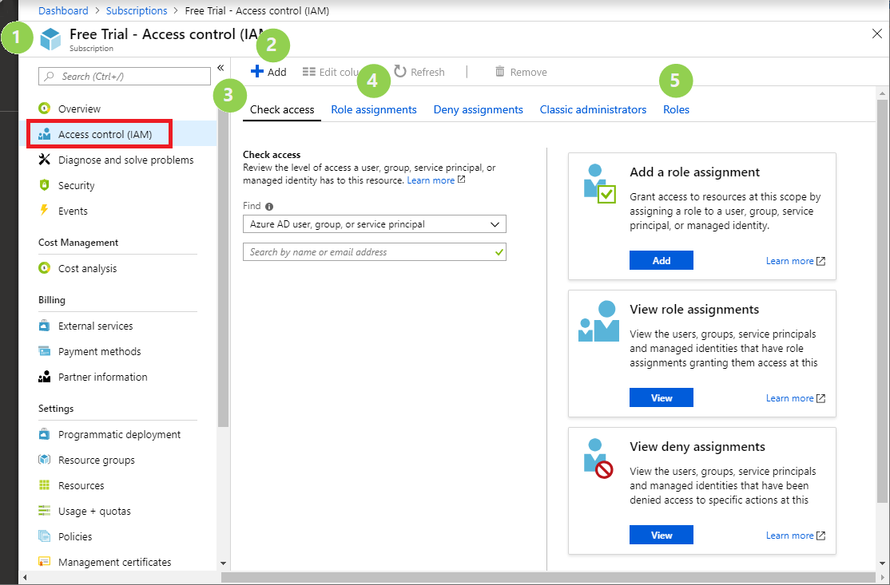
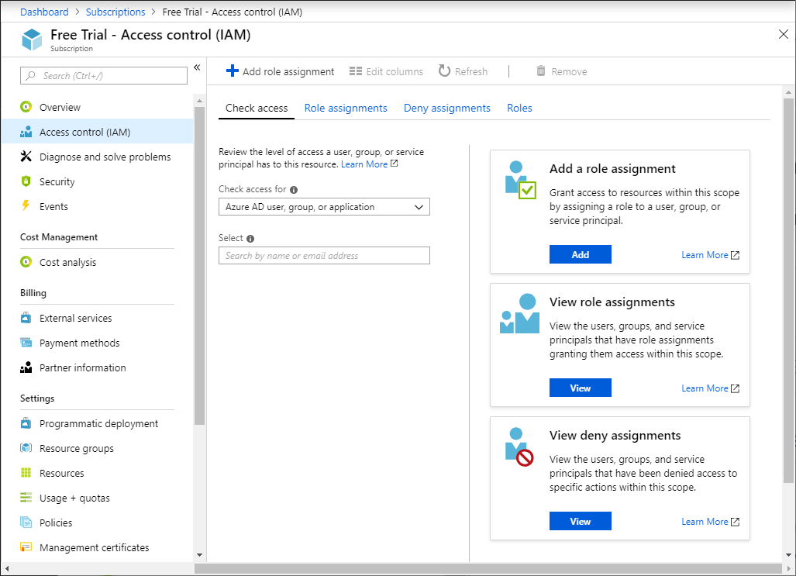
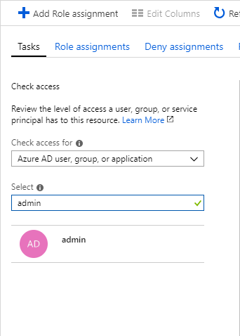
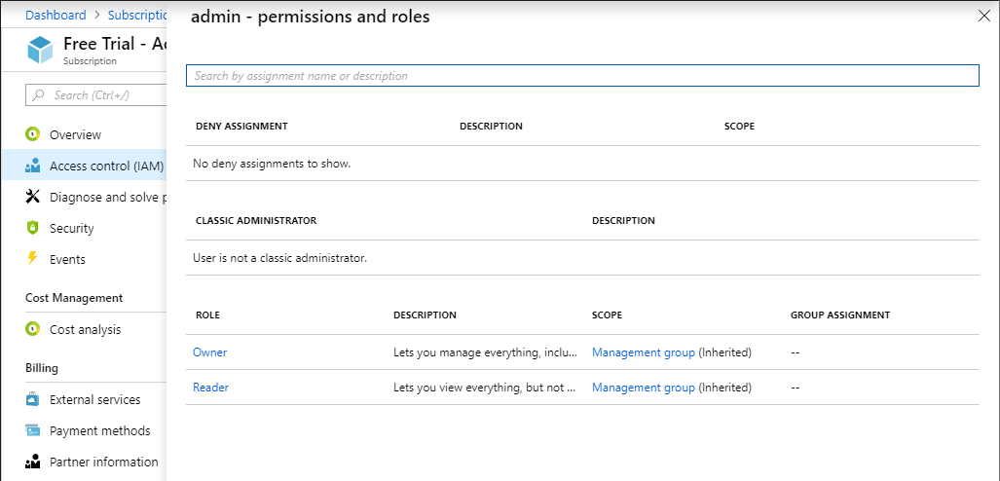
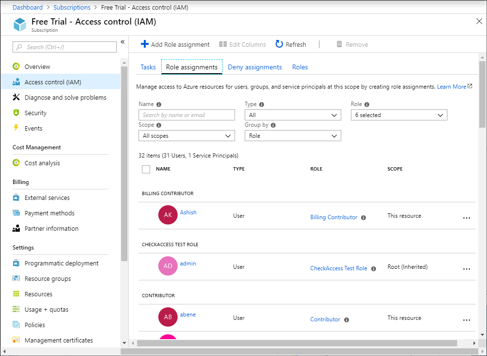

# Manage access to Azure resources using RBAC and the Azure portal

[Role-based access control (RBAC)](overview.md) is the way that you manage access to Azure resources. This article describes how you manage access using the Azure portal. If you need to manage access to Azure Active Directory, see [View and assign administrator roles in Azure Active Directory](../active-directory/users-groups-roles/directory-manage-roles-portal.md).

## Prerequisites

To add and remove role assignments, you must have:

- `Microsoft.Authorization/roleAssignments/write` and `Microsoft.Authorization/roleAssignments/delete` permissions, such as [User Access Administrator](built-in-roles.md#user-access-administrator) or [Owner](built-in-roles.md#owner)

## Overview of Access control (IAM)

**Access control (IAM)** is the blade that you use to manage access to Azure resources. It's also known as identity and access management and appears in several locations in the Azure portal. The following shows an example of the Access control (IAM) blade for a subscription.

The following table describes what some of the elements are use for:

| # | Element | What you use it for |
| --- | --- | --- |
| 1 | Resource where Access control (IAM) is opened | Identify scope (subscription in this example) |
| 2 | **Add** button | Add role assignments |
| 3 | **Check access** tab | View the role assignments for a single user |
| 4 | **Role assignments** tab | View the role assignments at the current scope |
| 5 | **Roles** tab | View all roles and permissions |

To be the most effective with the Access control (IAM) blade, it helps if you can answer the following three questions when you are trying to manage access:

1. **Who needs access?**

    Who refers to a user, group, service principal, or managed identity. This is also called a *security principal*.

1. **What permissions do they need?**

    Permissions are grouped together into roles. You can select from a list of several built-in roles.

1. **Where do they need access?**

    Where refers to the set of resources that the access applies to. Where can be a management group, subscription, resource group, or a single resource such as a storage account. This is called the *scope*.

## Open Access control (IAM)

The first thing you need to decide is where to open the Access control (IAM) blade. It depends on what resources you want to manage access for. Do you want to manage access for everything in a management group, everything in a subscription, everything in a resource group, or a single resource?

1. In the Azure portal, click **All services** and then select the scope. For example, you can select **Management groups**, **Subscriptions**, **Resource groups**, or a resource.

1. Click the specific resource.

1. Click **Access control (IAM)**.

    The following shows an example of the Access control (IAM) blade for a subscription. If you make any access control changes here, they would apply to the entire subscription.

    

## View roles and permissions

A role definition is a collection of permissions that you use for role assignments. Azure has over 70 [built-in roles for Azure resources](built-in-roles.md). Follow these steps to view the available roles and permissions.

1. Open **Access control (IAM)** at any scope.

1. Click the **Roles** tab to see a list of all the built-in and custom roles.

   You can see the number of users and groups that are assigned to each role at the current scope.

   

1. Click an individual role to see who has been assigned this role and also view the permissions for the role.

   

## View role assignments

When managing access, you want to know who has access, what are their permissions, and at what scope. To list access for a user, group, service principal, or managed identity, you view their role assignments.

### View role assignments for a single user

Follow these steps to view the access for a single user, group, service principal, or managed identity at a particular scope.

1. Open **Access control (IAM)** at a scope, such as management group, subscription, resource group, or resource, where you want to view access.

1. Click the **Check access** tab.

    

1. In the **Find** list, select the type of security principal you want to check access for.

1. In the search box, enter a string to search the directory for display names, email addresses, or object identifiers.

    

1. Click the security principal to open the **assignments** pane.

    

    On this pane, you can see the roles assigned to the selected security principal and the scope. If there are any deny assignments at this scope or inherited to this scope, they will be listed.

### View all role assignments at a scope

1. Open **Access control (IAM)** at a scope, such as management group, subscription, resource group, or resource, where you want to view access.

1. Click the **Role assignments** tab to view all the role assignments at this scope.

   

   On the Role assignments tab, you can see who has access at this scope. Notice that some roles are scoped to **This resource** while others are **(Inherited)** from another scope. Access is either assigned specifically to this resource or inherited from an assignment to the parent scope.

## Add a role assignment

In RBAC, to grant access, you assign a role to a user, group, service principal, or managed identity. Follow these steps to grant access at different scopes.

### Assign a role at a scope

1. Open **Access control (IAM)** at a scope, such as management group, subscription, resource group, or resource, where you want to grant access.

1. Click the **Role assignments** tab to view all the role assignments at this scope.

1. Click **Add** > **Add role assignment** to open the Add role assignment pane.

   If you don't have permissions to assign roles, the Add role assignment option will be disabled.

   

   

1. In the **Role** drop-down list, select a role such as **Virtual Machine Contributor**.

1. In the **Select** list, select a user, group, service principal, or managed identity. If you don't see the security principal in the list, you can type in the **Select** box to search the directory for display names, email addresses, and object identifiers.

1. Click **Save** to assign the role.

   After a few moments, the security principal is assigned the role at the selected scope.

### Assign a user as an administrator of a subscription

To make a user an administrator of an Azure subscription, assign them the [Owner](built-in-roles.md#owner) role at the subscription scope. The Owner role gives the user full access to all resources in the subscription, including the right to delegate access to others. These steps are the same as any other role assignment.

1. In the Azure portal, click **All services** and then **Subscriptions**.

1. Click the subscription where you want to grant access.

1. Click **Access control (IAM)**.

1. Click the **Role assignments** tab to view all the role assignments for this subscription.

1. Click **Add** > **Add role assignment** to open the Add role assignment pane.

   If you don't have permissions to assign roles, the Add role assignment option will be disabled.

   

   

1. In the **Role** drop-down list, select the **Owner** role.

1. In the **Select** list, select a user. If you don't see the user in the list, you can type in the **Select** box to search the directory for display names and email addresses.

1. Click **Save** to assign the role.

   After a few moments, the user is assigned the Owner role at the subscription scope.

## Remove role assignments

In RBAC, to remove access, you remove a role assignment. Follow these steps to remove access.

1. Open **Access control (IAM)** at a scope, such as management group, subscription, resource group, or resource, where you want to remove access.

1. Click the **Role assignments** tab to view all the role assignments for this subscription.

1. In the list of role assignments, add a checkmark next to the security principal with the role assignment you want to remove.

   

1. Click **Remove**.

   

1. In the remove role assignment message that appears, click **Yes**.

    Inherited role assignments cannot be removed. If you need to remove an inherited role assignment, you must do it at the scope where the role assignment was created. In the **Scope** column, next to **(Inherited)** there is a link that takes you to the scope where this role was assigned. Go to the scope listed there to remove the role assignment.

   

## Next steps

* [Tutorial: Grant a user access to Azure resources using RBAC and the Azure portal](quickstart-assign-role-user-portal.md)
* [Tutorial: Grant a user access to Azure resources using RBAC and Azure PowerShell](tutorial-role-assignments-user-powershell.md)
* [Troubleshoot RBAC for Azure resources](troubleshooting.md)
* [Organize your resources with Azure management groups](../governance/management-groups/index.md)
