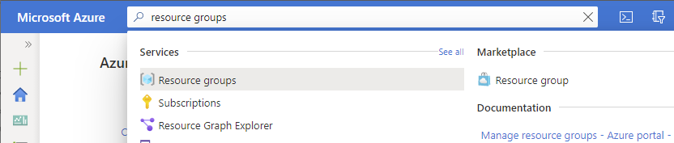
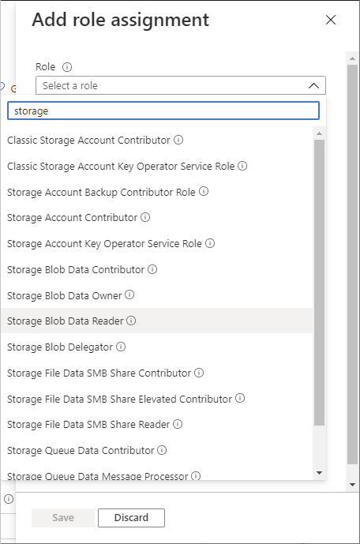
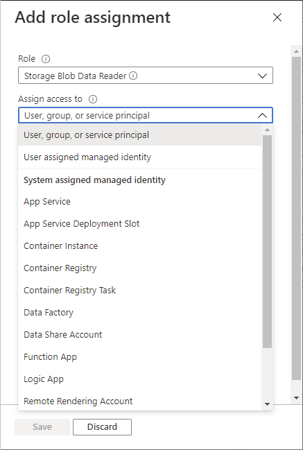
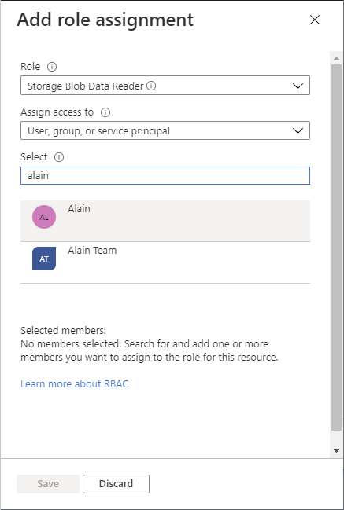
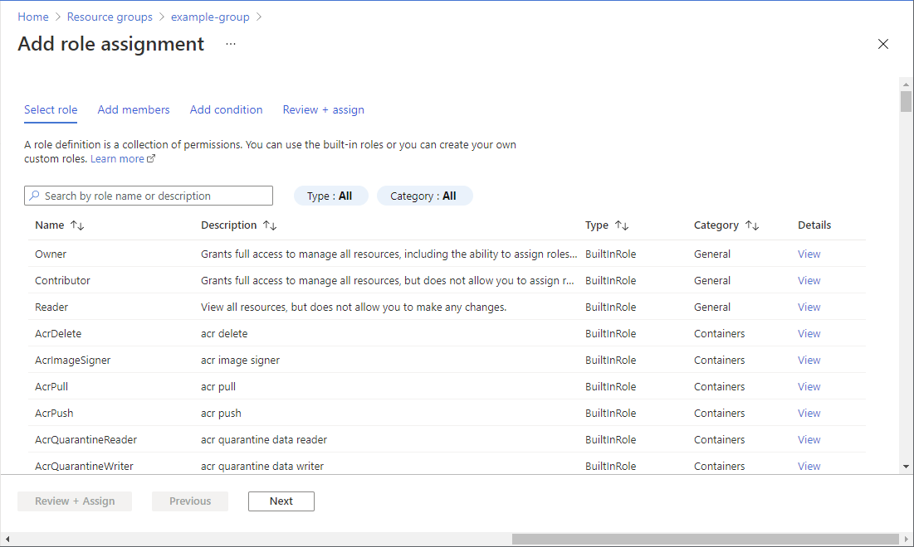
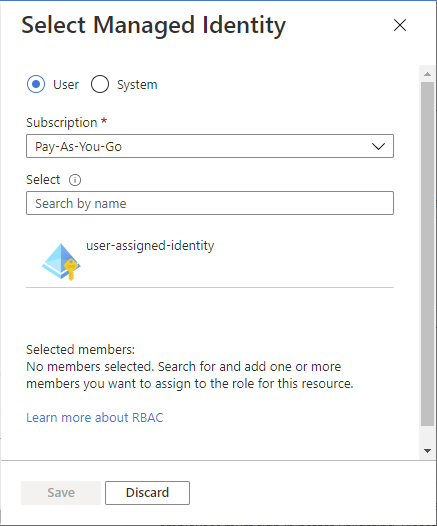
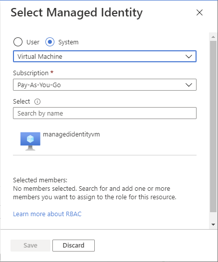
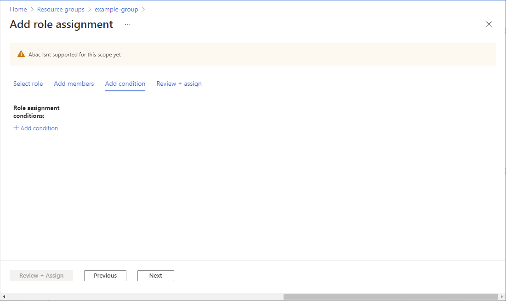

# Assign Azure roles using the Azure portal

[!INCLUDE [Azure RBAC definition grant access](../../includes/role-based-access-control/definition-grant.md)] This article describes how to assign roles using the Azure portal.

If you need to assign administrator roles in Azure Active Directory, see [View and assign administrator roles in Azure Active Directory](../active-directory/roles/manage-roles-portal.md).

## Prerequisites

[!INCLUDE [Azure role assignment prerequisites](../../includes/role-based-access-control/prerequisites-role-assignments.md)]

## Choose experience

Azure RBAC has a new experience for assigning Azure roles in the Azure portal that is currently in public preview. If you want to try this new experience, follow the steps on the **Add role assignment (Preview)** tab.

#### [Add role assignment](#tab/add-role-assignment/)

## Step 1: Identify the needed scope

[!INCLUDE [Scope for Azure RBAC introduction](../../includes/role-based-access-control/scope-intro.md)] For more information about scope, see [Understand scope](scope-overview.md).

1. Sign in to the [Azure portal](https://portal.azure.com).

1. In the Search box at the top, search for the scope you want to grant access to. For example, search for **Management groups**, **Subscriptions**, **Resource groups**, or a specific resource.

    

1. Click the specific resource for that scope.

    The following shows an example resource group.

    

## Step 2: Open the Add role assignment pane

**Access control (IAM)** is the page that you typically use to assign roles to grant access to Azure resources. It's also known as identity and access management (IAM) and appears in several locations in the Azure portal.

1. Click **Access control (IAM)**.

    The following shows an example of the Access control (IAM) page for a resource group.

    

1. Click the **Role assignments** tab to view the role assignments at this scope.

1. Click **Add** > **Add role assignment**.
   If you don't have permissions to assign roles, the Add role assignment option will be disabled.

   

    The Add role assignment pane opens.

   

## Step 3: Select the appropriate role

1. In the **Role** list, search or scroll to find the role that you want to assign.

    To help you determine the appropriate role, you can hover over the info icon to display a description for the role. For additional information, you can view the [Azure built-in roles](built-in-roles.md) article.

   

1. Click to select the role.

## Step 4: Select who needs access

1. In the **Assign access to** list, select the type of security principal to assign access to.

    | Type | Description |
    | --- | --- |
    | **User, group, or service principal** | If you want to assign the role to a user, group, or service principal (application), select this type. |
    | **User assigned managed identity** | If you want to assign the role to a [user-assigned managed identity](../active-directory/managed-identities-azure-resources/overview.md), select this type. |
    | *System assigned managed identity* | If you want to assign the role to a [system-assigned managed identity](../active-directory/managed-identities-azure-resources/overview.md), select the Azure service instance where the managed identity is located. |

   

1. If you selected a user-assigned managed identity or a system-assigned managed identity, select the **Subscription** where the managed identity is located.

1. In the **Select** section, search for the security principal by entering a string or scrolling through the list.

   

1. Once you have found the security principal, click to select it.

## Step 5: Assign role

1. To assign the role, click **Save**.

   After a few moments, the security principal is assigned the role at the selected scope.

1. On the **Role assignments** tab, verify that you see the role assignment in the list.

    

#### [Add role assignment (Preview)](#tab/add-role-assignment-preview/)

## Step 1: Identify the needed scope (Preview)

[!INCLUDE [Scope for Azure RBAC introduction](../../includes/role-based-access-control/scope-intro.md)] For more information about scope, see [Understand scope](scope-overview.md).

1. Sign in to the [Azure portal](https://portal.azure.com).

1. In the Search box at the top, search for the scope you want to grant access to. For example, search for **Management groups**, **Subscriptions**, **Resource groups**, or a specific resource.

    

1. Click the specific resource for that scope.

    The following shows an example resource group.

    

## Step 2: Open the Assign role page (Preview)

**Access control (IAM)** is the page that you typically use to assign roles to grant access to Azure resources. It's also known as identity and access management (IAM) and appears in several locations in the Azure portal.

1. Click **Access control (IAM)**.

    The following shows an example of the Access control (IAM) page for a resource group.

    

1. Click the **Role assignments** tab to view the role assignments at this scope.

1. Click **Add** > **Add role assignment (Preview)**.

    If you don't have permissions to assign roles, the Add role assignment option will be disabled.

    

    The Assign a role page opens.

## Step 3: Select the appropriate role (Preview)

1. On the **Select role** tab, select a role that you want to use.

    You can search for a role by name or by description. You can also filter roles by type and category.

   

1. In the **Details** column, click **View** to get more details about a role.

   

1. Click **Next**.

## Step 4: Select who needs access (Preview)

1. On the **Add members** tab, select **User, group, or service principal** to assign the selected role to one or more Azure AD users, groups, or service principals (applications).

   

1. Click **Add members**.

1. Find and select the users, groups, or service principals.

    You can type in the **Select** box to search the directory for display names, email addresses, and object identifiers.

   

1. Click **Save** to add the users, groups, or service principals to the Members list.

1. To assign the selected role to one or more managed identities, select **Managed identity**.

1. Click **Add members**.

1. In the **Select managed identity** pane, select whether the type is [user-assigned managed identity](../active-directory/managed-identities-azure-resources/overview.md) or [system-assigned managed identity](../active-directory/managed-identities-azure-resources/overview.md).

1. Find and select the managed identities.

   

    If you selected a system-assigned managed identity, you need to select the Azure service instance where the managed identity is located.

   

1. Click **Save** to add the managed identities to the Members list.

1. In the **Description** box enter an optional description for this role assignment.

    Later you can show this description in the role assignments list.

1. Click **Next**.

## Step 5: (Optional) Add condition (Preview)

If you selected a role that supports conditions, you have the option to add a condition.

1. Click **Add condition** if you want to further refine the role assignments based on principal and resource attributes. For more information, see role assignment conditions.

   

1. Click **Next**.

## Step 6: Assign role (Preview)

1. On the **Review + assign** tab, review the role assignment settings.

   

1. Click **Review + assign** to assign the role.

   After a few moments, the security principal is assigned the role at the selected scope.

    

1. If you don't see the description for the role assignment, click **Edit columns** to add the **Description** column.

---

## Next steps

- [Assign a user as an administrator of an Azure subscription](role-assignments-portal-subscription-admin.md)
- [Remove Azure role assignments](role-assignments-remove.md)
- [Troubleshoot Azure RBAC](troubleshooting.md)
