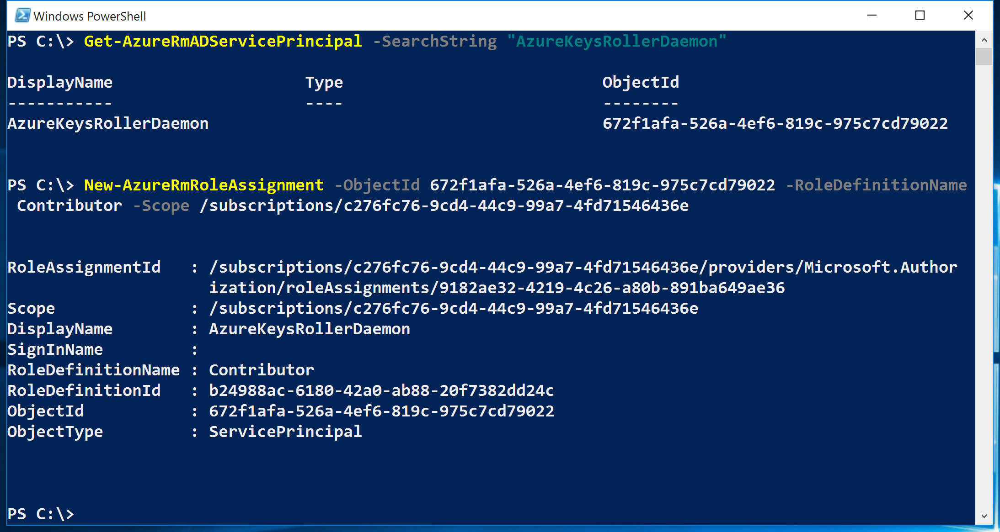
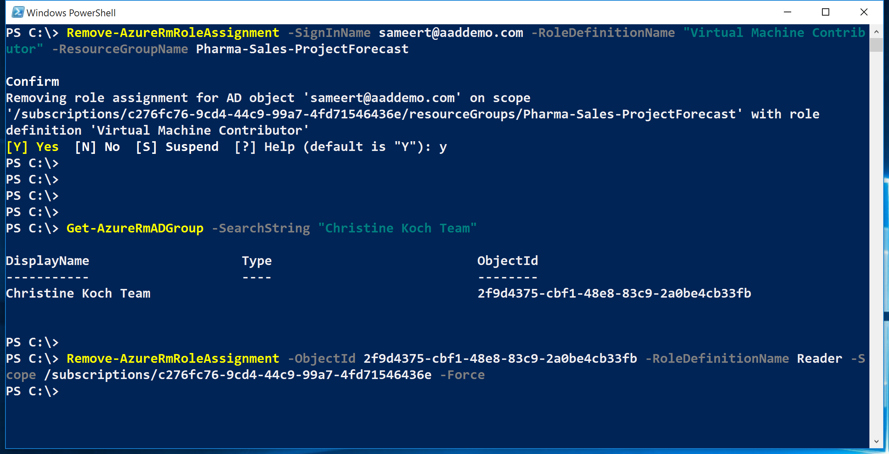

# Manage role-based access control with Azure PowerShell
> [!div class="op_single_selector"]
> * [PowerShell](role-assignments-powershell.md)
> * [Azure CLI](role-assignments-cli.md)
> * [REST API](role-assignments-rest.md)

With role-based access control (RBAC), you define access for users, groups, and service principals by assigning roles at a particular scope. This article describes how to manage access using Azure PowerShell.

Before you can use PowerShell to manage RBAC, you need the following prerequisites:

* Azure PowerShell version 0.8.8 or later. To install the latest version and associate it with your Azure subscription, see [how to install and configure Azure PowerShell](/powershell/azure/overview).
* Azure Resource Manager cmdlets. Install the [Azure Resource Manager cmdlets](/powershell/azure/overview) in PowerShell.

## List roles

### List all available roles

To list RBAC roles that are available for assignment and to inspect the operations to which they grant access, use [Get-AzureRmRoleDefinition](/powershell/module/azurerm.resources/get-azurermroledefinition).

```powershell
Get-AzureRmRoleDefinition | FT Name, Description
```

```Output
AcrImageSigner                                    acr image signer
AcrQuarantineReader                               acr quarantine data reader
AcrQuarantineWriter                               acr quarantine data writer
API Management Service Contributor                Can manage service and the APIs
API Management Service Operator Role              Can manage service but not the APIs
API Management Service Reader Role                Read-only access to service and APIs
Application Insights Component Contributor        Can manage Application Insights components
Application Insights Snapshot Debugger            Gives user permission to use Application Insights Snapshot Debugge...
Automation Job Operator                           Create and Manage Jobs using Automation Runbooks.
Automation Operator                               Automation Operators are able to start, stop, suspend, and resume ...
...
```

### List actions of a role

To list the actions for a specific role, use [Get-AzureRmRoleDefinition](/powershell/module/azurerm.resources/get-azurermroledefinition) `<role name>`.

```powershell
Get-AzureRmRoleDefinition Contributor | FL Actions, NotActions
```

```Output
Actions    : {*}
NotActions : {Microsoft.Authorization/*/Delete, Microsoft.Authorization/*/Write,
             Microsoft.Authorization/elevateAccess/Action}
```

```powershell
(Get-AzureRmRoleDefinition "Virtual Machine Contributor").Actions
```

```Output
Microsoft.Authorization/*/read
Microsoft.Compute/availabilitySets/*
Microsoft.Compute/locations/*
Microsoft.Compute/virtualMachines/*
Microsoft.Compute/virtualMachineScaleSets/*
Microsoft.DevTestLab/schedules/*
Microsoft.Insights/alertRules/*
Microsoft.Network/applicationGateways/backendAddressPools/join/action
Microsoft.Network/loadBalancers/backendAddressPools/join/action
...
```

## See who has access

To list RBAC access assignments, use [Get-AzureRmRoleAssignment](/powershell/module/azurerm.resources/get-azurermroleassignment).

### List role assignments at a specific scope

You can see all the access assignments for a specified subscription, resource group, or resource. For example, to see the all the active assignments for a resource group, use [Get-AzureRmRoleAssignment](/powershell/module/azurerm.resources/get-azurermroleassignment) `-ResourceGroupName <resource group name>`.

```powershell
Get-AzureRmRoleAssignment -ResourceGroupName pharma-sales-projectforecast | FL DisplayName, RoleDefinitionName, Scope
```

```Output
DisplayName        : Alain Charon
RoleDefinitionName : Backup Operator
Scope              : /subscriptions/00000000-0000-0000-0000-000000000000/resourceGroups/pharma-sales-projectforecast

DisplayName        : Isabella Simonsen
RoleDefinitionName : BizTalk Contributor
Scope              : /subscriptions/00000000-0000-0000-0000-000000000000/resourceGroups/pharma-sales-projectforecast

DisplayName        : Alain Charon
RoleDefinitionName : Virtual Machine Contributor
Scope              : /subscriptions/00000000-0000-0000-0000-000000000000/resourceGroups/pharma-sales-projectforecast
```

### List roles assigned to a user

To list all the roles that are assigned to a specified user and the roles that are assigned to the groups to which the user belongs, use [Get-AzureRmRoleAssignment](/powershell/module/azurerm.resources/get-azurermroleassignment) `-SignInName <User email> -ExpandPrincipalGroups`.

```powershell
Get-AzureRmRoleAssignment -SignInName sameert@aaddemo.com | FL DisplayName, RoleDefinitionName, Scope

Get-AzureRmRoleAssignment -SignInName sameert@aaddemo.com -ExpandPrincipalGroups | FL DisplayName, RoleDefinitionName, Scope
```


### List classic service administrator and coadmin role assignments

To list access assignments for the classic subscription administrator and co-administrators, use:

```powershell
Get-AzureRmRoleAssignment -IncludeClassicAdministrators
```

## Grant access

### Search for object IDs

To assign a role, you need to identify both the object (user, group, or application) and the scope.

If you don't know the subscription ID, you can find it in the **Subscriptions** blade on the Azure portal. To learn how to query for the subscription ID, see [Get-AzureRmSubscription](/powershell/module/azurerm.profile/get-azurermsubscription).

To get the object ID for an Azure AD group, use:

```powershell
Get-AzureRmADGroup -SearchString <group name in quotes>
```

To get the object ID for an Azure AD service principal or application, use:

```powershell
Get-AzureRmADServicePrincipal -SearchString <service name in quotes>
```

### Assign a role to an application at the subscription scope

To grant access to an application at the subscription scope, use:

```powershell
New-AzureRmRoleAssignment -ObjectId <application id> -RoleDefinitionName <role name> -Scope <subscription id>
```



### Assign a role to a user at the resource group scope

To grant access to a user at the resource group scope, use:

```powershell
New-AzureRmRoleAssignment -SignInName <email of user> -RoleDefinitionName <role name in quotes> -ResourceGroupName <resource group name>
```


### Assign a role to a group at the resource scope

To grant access to a group at the resource scope, use:

```powershell
New-AzureRmRoleAssignment -ObjectId <object id> -RoleDefinitionName <role name in quotes> -ResourceName <resource name> -ResourceType <resource type> -ParentResource <parent resource> -ResourceGroupName <resource group name>
```


## Remove access

To remove access for users, groups, and applications, use:

```powershell
Remove-AzureRmRoleAssignment -ObjectId <object id> -RoleDefinitionName <role name> -Scope <scope such as subscription id>
```



## Create a custom role

To create a custom role, use the [New-AzureRmRoleDefinition](/powershell/module/azurerm.resources/new-azurermroledefinition) command. There are two methods of structuring the role, using `PSRoleDefinition` object or a JSON template. 

### Get operations for a resource provider

When you create custom roles, it is important to know all the possible operations from the resource providers.
You can view the list of [resource provider operations](resource-provider-operations.md) or you can use the [Get-AzureRMProviderOperation](/powershell/module/azurerm.resources/get-azurermprovideroperation) command to get this information.
For example, if you want to check all the available operations for virtual machines, use this command:

```powershell
Get-AzureRMProviderOperation "Microsoft.Compute/virtualMachines/*" | FT OperationName, Operation, Description -AutoSize
```

```Output
OperationName                                  Operation                                                      Description
-------------                                  ---------                                                      -----------
Get Virtual Machine                            Microsoft.Compute/virtualMachines/read                         Get the propertie...
Create or Update Virtual Machine               Microsoft.Compute/virtualMachines/write                        Creates a new vir...
Delete Virtual Machine                         Microsoft.Compute/virtualMachines/delete                       Deletes the virtu...
Start Virtual Machine                          Microsoft.Compute/virtualMachines/start/action                 Starts the virtua...
...
```

### Create a role with PSRoleDefinition object

When you use PowerShell to create a custom role, you can use one of the [built-in roles](built-in-roles.md) as a starting point or you can start from scratch. The first example in this section starts with a built-in role and then customizes it with more permissions. Edit the attributes to add the *Actions*, *NotActions*, or *AssignableScopes* that you want, and then save the changes as a new role.

The following example starts with the [Virtual Machine Contributor](built-in-roles.md#virtual-machine-contributor) built-in role to create a custom role named *Virtual Machine Operator*. The new role grants access to all read operations of *Microsoft.Compute*, *Microsoft.Storage*, and *Microsoft.Network* resource providers and grants access to start, restart, and monitor virtual machines. The custom role can be used in two subscriptions.

```powershell
$role = Get-AzureRmRoleDefinition "Virtual Machine Contributor"
$role.Id = $null
$role.Name = "Virtual Machine Operator"
$role.Description = "Can monitor and restart virtual machines."
$role.Actions.Clear()
$role.Actions.Add("Microsoft.Storage/*/read")
$role.Actions.Add("Microsoft.Network/*/read")
$role.Actions.Add("Microsoft.Compute/*/read")
$role.Actions.Add("Microsoft.Compute/virtualMachines/start/action")
$role.Actions.Add("Microsoft.Compute/virtualMachines/restart/action")
$role.Actions.Add("Microsoft.Authorization/*/read")
$role.Actions.Add("Microsoft.Resources/subscriptions/resourceGroups/read")
$role.Actions.Add("Microsoft.Insights/alertRules/*")
$role.Actions.Add("Microsoft.Support/*")
$role.AssignableScopes.Clear()
$role.AssignableScopes.Add("/subscriptions/c276fc76-9cd4-44c9-99a7-4fd71546436e")
$role.AssignableScopes.Add("/subscriptions/e91d47c4-76f3-4271-a796-21b4ecfe3624")
New-AzureRmRoleDefinition -Role $role
```

The following example shows another way to create the *Virtual Machine Operator* custom role. It starts by creating a new PSRoleDefinition object. The action operations are specified in the `perms` variable and set to the *Actions* property. The *NotActions* property is set by reading the *NotActions* from the [Virtual Machine Contributor](built-in-roles.md#virtual-machine-contributor) built-in role. Since [Virtual Machine Contributor](built-in-roles.md#virtual-machine-contributor) does not have any *NotActions*, this line is not required, but it shows how information can be retrieved from another role.

```powershell
$role = [Microsoft.Azure.Commands.Resources.Models.Authorization.PSRoleDefinition]::new()
$role.Name = 'Virtual Machine Operator 2'
$role.Description = 'Can monitor and restart virtual machines.'
$role.IsCustom = $true
$perms = 'Microsoft.Storage/*/read','Microsoft.Network/*/read','Microsoft.Compute/*/read'
$perms += 'Microsoft.Compute/virtualMachines/start/action','Microsoft.Compute/virtualMachines/restart/action'
$perms += 'Microsoft.Authorization/*/read','Microsoft.Resources/subscriptions/resourceGroups/read'
$perms += 'Microsoft.Insights/alertRules/*','Microsoft.Support/*'
$role.Actions = $perms
$role.NotActions = (Get-AzureRmRoleDefinition -Name 'Virtual Machine Contributor').NotActions
$subs = '/subscriptions/c276fc76-9cd4-44c9-99a7-4fd71546436e','/subscriptions/e91d47c4-76f3-4271-a796-21b4ecfe3624'
$role.AssignableScopes = $subs
New-AzureRmRoleDefinition -Role $role
```

### Create role with JSON template

A JSON template can be used as the source definition for the custom role. The following example creates a custom role that allows read access to storage and compute resources, access to support, and adds that role to two subscriptions. Create a new file `C:\CustomRoles\customrole1.json` with the following example. The Id should be set to `null` on initial role creation as a new ID is generated automatically. 

```json
{
  "Name": "Custom Role 1",
  "Id": null,
  "IsCustom": true,
  "Description": "Allows for read access to Azure storage and compute resources and access to support",
  "Actions": [
    "Microsoft.Compute/*/read",
    "Microsoft.Storage/*/read",
    "Microsoft.Support/*"
  ],
  "NotActions": [
  ],
  "AssignableScopes": [
    "/subscriptions/c276fc76-9cd4-44c9-99a7-4fd71546436e",
    "/subscriptions/e91d47c4-76f3-4271-a796-21b4ecfe3624"
  ]
}
```

To add the role to the subscriptions, run the following PowerShell command:

```powershell
New-AzureRmRoleDefinition -InputFile "C:\CustomRoles\customrole1.json"
```

## Modify a custom role

Similar to creating a custom role, you can modify an existing custom role using either the `PSRoleDefinition` object or a JSON template.

### Modify role with PSRoleDefinition object

To modify a custom role, first, use the [Get-AzureRmRoleDefinition](/powershell/module/azurerm.resources/get-azurermroledefinition) command to retrieve the role definition. Second, make the desired changes to the role definition. Finally, use the [Set-AzureRmRoleDefinition](/powershell/module/azurerm.resources/set-azurermroledefinition) command to save the modified role definition.

The following example adds the `Microsoft.Insights/diagnosticSettings/*` operation to the *Virtual Machine Operator* custom role.

```powershell
$role = Get-AzureRmRoleDefinition "Virtual Machine Operator"
$role.Actions.Add("Microsoft.Insights/diagnosticSettings/*")
Set-AzureRmRoleDefinition -Role $role
```

```Output
PS C:\> $role = Get-AzureRmRoleDefinition "Virtual Machine Operator"
PS C:\> $role.Actions.Add("Microsoft.Insights/diagnosticSettings/*")
PS C:\> Set-AzureRmRoleDefinition -Role $role

Name             : Virtual Machine Operator
Id               : 88888888-8888-8888-8888-888888888888
IsCustom         : True
Description      : Can monitor and restart virtual machines.
Actions          : {Microsoft.Storage/*/read, Microsoft.Network/*/read, Microsoft.Compute/*/read,
                   Microsoft.Compute/virtualMachines/start/action...}
NotActions       : {}
DataActions      : {}
NotDataActions   : {}
AssignableScopes : {/subscriptions/00000000-0000-0000-0000-000000000000,
                   /subscriptions/11111111-1111-1111-1111-111111111111}
```

The following example adds an Azure subscription to the assignable scopes of the *Virtual Machine Operator* custom role.

```powershell
Get-AzureRmSubscription -SubscriptionName Production3

$role = Get-AzureRmRoleDefinition "Virtual Machine Operator"
$role.AssignableScopes.Add("/subscriptions/22222222-2222-2222-2222-222222222222")
Set-AzureRmRoleDefinition -Role $role
```

```Output
PS C:\> Get-AzureRmSubscription -SubscriptionName Production3

Name     : Production3
Id       : 22222222-2222-2222-2222-222222222222
TenantId : 99999999-9999-9999-9999-999999999999
State    : Enabled

PS C:\> $role = Get-AzureRmRoleDefinition "Virtual Machine Operator"
PS C:\> $role.AssignableScopes.Add("/subscriptions/22222222-2222-2222-2222-222222222222")
PS C:\> Set-AzureRmRoleDefinition -Role $role

Name             : Virtual Machine Operator
Id               : 88888888-8888-8888-8888-888888888888
IsCustom         : True
Description      : Can monitor and restart virtual machines.
Actions          : {Microsoft.Storage/*/read, Microsoft.Network/*/read, Microsoft.Compute/*/read,
                   Microsoft.Compute/virtualMachines/start/action...}
NotActions       : {}
DataActions      : {}
NotDataActions   : {}
AssignableScopes : {/subscriptions/00000000-0000-0000-0000-000000000000,
                   /subscriptions/11111111-1111-1111-1111-111111111111,
                   /subscriptions/22222222-2222-2222-2222-222222222222}
```

### Modify role with JSON template

Using the previous JSON template, you can easily modify an existing custom role to add or remove Actions. Update the JSON template and add the read action for networking as shown in the following example. The definitions listed in the template are not cumulatively applied to an existing definition, meaning that the role appears exactly as you specify in the template. You also need to update the Id field with the ID of the role. If you aren't sure what this value is, you can use the [Get-AzureRmRoleDefinition](/powershell/module/azurerm.resources/get-azurermroledefinition) cmdlet to get this information.

```json
{
  "Name": "Custom Role 1",
  "Id": "acce7ded-2559-449d-bcd5-e9604e50bad1",
  "IsCustom": true,
  "Description": "Allows for read access to Azure storage and compute resources and access to support",
  "Actions": [
    "Microsoft.Compute/*/read",
    "Microsoft.Storage/*/read",
    "Microsoft.Network/*/read",
    "Microsoft.Support/*"
  ],
  "NotActions": [
  ],
  "AssignableScopes": [
    "/subscriptions/c276fc76-9cd4-44c9-99a7-4fd71546436e",
    "/subscriptions/e91d47c4-76f3-4271-a796-21b4ecfe3624"
  ]
}
```

To update the existing role, run the following PowerShell command:

```powershell
Set-AzureRmRoleDefinition -InputFile "C:\CustomRoles\customrole1.json"
```

## Delete a custom role

To delete a custom role, use the [Remove-AzureRmRoleDefinition](/powershell/module/azurerm.resources/remove-azurermroledefinition) command.

The following example removes the *Virtual Machine Operator* custom role.

```powershell
Get-AzureRmRoleDefinition "Virtual Machine Operator"
Get-AzureRmRoleDefinition "Virtual Machine Operator" | Remove-AzureRmRoleDefinition
```

```Output
PS C:\> Get-AzureRmRoleDefinition "Virtual Machine Operator"

Name             : Virtual Machine Operator
Id               : 88888888-8888-8888-8888-888888888888
IsCustom         : True
Description      : Can monitor and restart virtual machines.
Actions          : {Microsoft.Storage/*/read, Microsoft.Network/*/read, Microsoft.Compute/*/read,
                   Microsoft.Compute/virtualMachines/start/action...}
NotActions       : {}
DataActions      : {}
NotDataActions   : {}
AssignableScopes : {/subscriptions/00000000-0000-0000-0000-000000000000,
                   /subscriptions/11111111-1111-1111-1111-111111111111}

PS C:\> Get-AzureRmRoleDefinition "Virtual Machine Operator" | Remove-AzureRmRoleDefinition

Confirm
Are you sure you want to remove role definition with name 'Virtual Machine Operator'.
[Y] Yes  [N] No  [S] Suspend  [?] Help (default is "Y"): Y
```

## List custom roles

To list the roles that are available for assignment at a scope, use the [Get-AzureRmRoleDefinition](/powershell/module/azurerm.resources/get-azurermroledefinition) command.

The following example lists all roles that are available for assignment in the selected subscription.

```powershell
Get-AzureRmRoleDefinition | FT Name, IsCustom
```

```Output
Name                                              IsCustom
----                                              --------
Virtual Machine Operator                              True
AcrImageSigner                                       False
AcrQuarantineReader                                  False
AcrQuarantineWriter                                  False
API Management Service Contributor                   False
...
```

The following example lists just the custom roles that are available for assignment in the selected subscription.

```powershell
Get-AzureRmRoleDefinition | ? {$_.IsCustom -eq $true} | FT Name, IsCustom
```

```Output
Name                     IsCustom
----                     --------
Virtual Machine Operator     True
```

If the selected subscription isn't in the `AssignableScopes` of the role, the custom role won't be listed.

## See also

* [Using Azure PowerShell with Azure Resource Manager](../azure-resource-manager/powershell-azure-resource-manager.md)
  [!INCLUDE [role-based-access-control-toc.md](../../includes/role-based-access-control-toc.md)]
