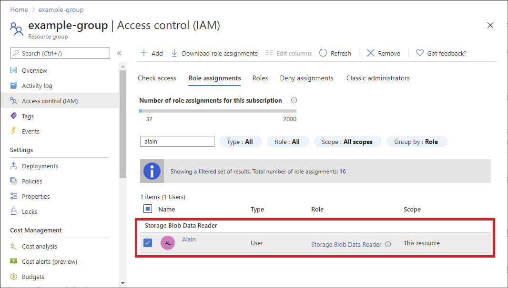
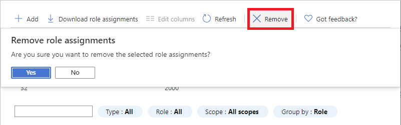
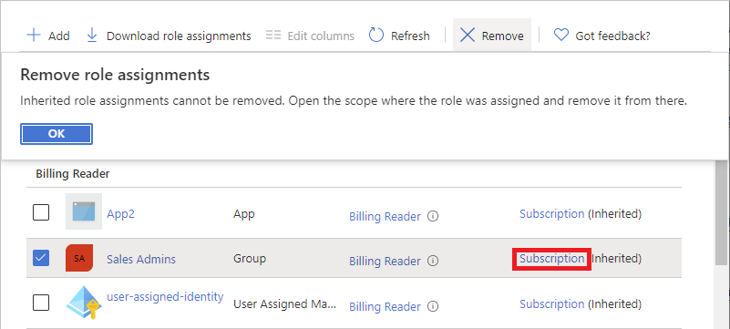

# Remove Azure role assignments

[Azure role-based access control (Azure RBAC)](../../articles/role-based-access-control/overview.md) is the authorization system you use to manage access to Azure resources. To remove access from an Azure resource, you remove a role assignment. This article describes how to remove roles assignments using the Azure portal, Azure PowerShell, Azure CLI, and REST API.

## Prerequisites

To remove role assignments, you must have:

- `Microsoft.Authorization/roleAssignments/delete` permissions, such as [User Access Administrator](../../articles/role-based-access-control/built-in-roles.md#user-access-administrator) or [Owner](../../articles/role-based-access-control/built-in-roles.md#owner)

For the REST API, you must use the following version:

- `2015-07-01` or later

For more information, see [API versions of Azure RBAC REST APIs](/rest/api/authorization/versions).

## Azure portal

1. Open **Access control (IAM)** at a scope, such as management group, subscription, resource group, or resource, where you want to remove access.

1. Click the **Role assignments** tab to view all the role assignments at this scope.

1. In the list of role assignments, add a checkmark next to the security principal with the role assignment you want to remove.

   

1. Click **Remove**.

   

1. In the remove role assignment message that appears, click **Yes**.

    If you see a message that inherited role assignments cannot be removed, you are trying to remove a role assignment at a child scope. You should open Access control (IAM) at the scope where the role was assigned and try again. A quick way to open Access control (IAM) at the correct scope is to look at the **Scope** column and click the link next to **(Inherited)**.

   

## Azure PowerShell

In Azure PowerShell, you remove a role assignment by using [Remove-AzRoleAssignment](/powershell/module/az.resources/remove-azroleassignment).

The following example removes the [Virtual Machine Contributor](built-in-roles.md#virtual-machine-contributor) role assignment from the *patlong\@contoso.com* user on the *pharma-sales* resource group:

```azurepowershell
PS C:\> Remove-AzRoleAssignment -SignInName patlong@contoso.com `
-RoleDefinitionName "Virtual Machine Contributor" `
-ResourceGroupName pharma-sales
```

Removes the [Reader](built-in-roles.md#reader) role from the *Ann Mack Team* group with ID 22222222-2222-2222-2222-222222222222 at a subscription scope.

```azurepowershell
PS C:\> Remove-AzRoleAssignment -ObjectId 22222222-2222-2222-2222-222222222222 `
-RoleDefinitionName "Reader" `
-Scope "/subscriptions/00000000-0000-0000-0000-000000000000"
```

Removes the [Billing Reader](built-in-roles.md#billing-reader) role from the *alain\@example.com* user at the management group scope.

```azurepowershell
PS C:\> Remove-AzRoleAssignment -SignInName alain@example.com `
-RoleDefinitionName "Billing Reader" `
-Scope "/providers/Microsoft.Management/managementGroups/marketing-group"
```

If you get the error message: "The provided information does not map to a role assignment", make sure that you also specify the `-Scope` or `-ResourceGroupName` parameters. For more information, see [Troubleshoot Azure RBAC](troubleshooting.md#symptom---role-assignments-with-identity-not-found).

## Azure CLI

In Azure CLI, you remove a role assignment by using [az role assignment delete](/cli/azure/role/assignment#az-role-assignment-delete).

The following example removes the [Virtual Machine Contributor](built-in-roles.md#virtual-machine-contributor) role assignment from the *patlong\@contoso.com* user on the *pharma-sales* resource group:

```azurecli
az role assignment delete --assignee "patlong@contoso.com" \
--role "Virtual Machine Contributor" \
--resource-group "pharma-sales"
```

Removes the [Reader](built-in-roles.md#reader) role from the *Ann Mack Team* group with ID 22222222-2222-2222-2222-222222222222 at a subscription scope.

```azurecli
az role assignment delete --assignee "22222222-2222-2222-2222-222222222222" \
--role "Reader" \
--subscription "00000000-0000-0000-0000-000000000000"
```

Removes the [Billing Reader](built-in-roles.md#billing-reader) role from the *alain\@example.com* user at the management group scope.

```azurecli
az role assignment delete --assignee "alain@example.com" \
--role "Billing Reader" \
--scope "/providers/Microsoft.Management/managementGroups/marketing-group"
```

## REST API

In the REST API, you remove a role assignment by using [Role Assignments - Delete](/rest/api/authorization/role-assignments/delete).

1. Get the role assignment identifier (GUID). This identifier is returned when you first create the role assignment or you can get it by listing the role assignments.

1. Start with the following request:

    ```http
    DELETE https://management.azure.com/{scope}/providers/Microsoft.Authorization/roleAssignments/{roleAssignmentId}?api-version=2022-04-01
    ```

1. Within the URI, replace *{scope}* with the scope for removing the role assignment.

    > [!div class="mx-tableFixed"]
    > | Scope | Type |
    > | --- | --- |
    > | `providers/Microsoft.Management/managementGroups/{groupId1}` | Management group |
    > | `subscriptions/{subscriptionId1}` | Subscription |
    > | `subscriptions/{subscriptionId1}/resourceGroups/myresourcegroup1` | Resource group |
    > | `subscriptions/{subscriptionId1}/resourceGroups/myresourcegroup1/providers/microsoft.web/sites/mysite1` | Resource |

1. Replace *{roleAssignmentId}* with the GUID identifier of the role assignment.

The following request removes the specified role assignment at subscription scope:

```http
DELETE https://management.azure.com/subscriptions/{subscriptionId1}/providers/microsoft.authorization/roleassignments/{roleAssignmentId1}?api-version=2022-04-01
```

The following shows an example of the output:

```json
{
    "properties": {
        "roleDefinitionId": "/subscriptions/{subscriptionId1}/providers/Microsoft.Authorization/roleDefinitions/a795c7a0-d4a2-40c1-ae25-d81f01202912",
        "principalId": "{objectId1}",
        "principalType": "User",
        "scope": "/subscriptions/{subscriptionId1}",
        "condition": null,
        "conditionVersion": null,
        "createdOn": "2022-05-06T23:55:24.5379478Z",
        "updatedOn": "2022-05-06T23:55:24.5379478Z",
        "createdBy": "{createdByObjectId1}",
        "updatedBy": "{updatedByObjectId1}",
        "delegatedManagedIdentityResourceId": null,
        "description": null
    },
    "id": "/subscriptions/{subscriptionId1}/providers/Microsoft.Authorization/roleAssignments/{roleAssignmentId1}",
    "type": "Microsoft.Authorization/roleAssignments",
    "name": "{roleAssignmentId1}"
}
```

## ARM template

There isn't a way to remove a role assignment using an Azure Resource Manager template (ARM template). To remove a role assignment, you must use other tools such as the Azure portal, Azure PowerShell, Azure CLI, or REST API.

## Next steps

- [List Azure role assignments using the Azure portal](role-assignments-list-portal.md)
- [List Azure role assignments using Azure PowerShell](role-assignments-list-powershell.md)
- [Troubleshoot Azure RBAC](troubleshooting.md)
