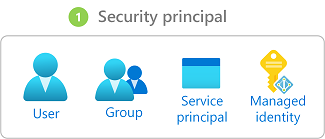
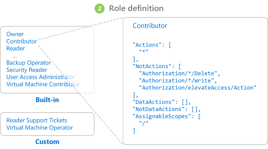
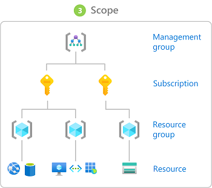

# Steps to assign an Azure role

[!INCLUDE [Azure RBAC definition grant access](../../includes/role-based-access-control/definition-grant.md)] This article describes the high-level steps to assign Azure roles using the [Azure portal](role-assignments-portal.md), [Azure PowerShell](role-assignments-powershell.md), [Azure CLI](role-assignments-cli.md), or the [REST API](role-assignments-rest.md).

## Step 1: Determine who needs access

You first need to determine who needs access. You can assign a role to a user, group, service principal, or managed identity. This is also called a *security principal*.

- User - An individual who has a profile in Microsoft Entra ID. You can also assign roles to users in other tenants. For information about users in other organizations, see [Microsoft Entra B2B](../active-directory/external-identities/what-is-b2b.md).
- Group - A set of users created in Microsoft Entra ID. When you assign a role to a group, all users within that group have that role. 
- Service principal - A security identity used by applications or services to access specific Azure resources. You can think of it as a *user identity* (username and password or certificate) for an application.
- Managed identity - An identity in Microsoft Entra ID that is automatically managed by Azure. You typically use [managed identities](../active-directory/managed-identities-azure-resources/overview.md) when developing cloud applications to manage the credentials for authenticating to Azure services.

## Step 2: Select the appropriate role

Permissions are grouped together into a *role definition*. It's typically just called a *role*. You can select from a list of several built-in roles. If the built-in roles don't meet the specific needs of your organization, you can create your own custom roles.

Roles are organized into job function roles and privileged administrator roles.

### Job function roles

Job function roles allow management of specific Azure resources. For example, the [Virtual Machine Contributor](built-in-roles.md#virtual-machine-contributor) role allows a user to create and manage virtual machines. To select the appropriate job function role, use these steps:

1. Begin with the comprehensive article, [Azure built-in roles](built-in-roles.md). The table at the top of the article is an index into the details later in the article.

1. In that article, navigate to the service category (such as compute, storage, and databases) for the resource to which you want to grant permissions. The easiest way to find what your looking for is typically to search the page for a relevant keyword, like "blob", "virtual machine", and so on.

1. Review the roles listed for the service category and identify the specific actions you need. Again, always start with the most restrictive role.

    For example, if a security principal needs to read blobs in an Azure storage account, but doesn't need write access, then choose [Storage Blob Data Reader](built-in-roles.md#storage-blob-data-reader) rather than [Storage Blob Data Contributor](built-in-roles.md#storage-blob-data-contributor) (and definitely not the administrator-level [Storage Blob Data Owner](built-in-roles.md#storage-blob-data-owner) role). You can always update the role assignments later as needed.

1. If you don't find a suitable role, you can create a [custom role](custom-roles.md).

### Privileged administrator roles

Privileged administrator roles are roles that grant privileged administrator access, such as the ability to manage Azure resources or assign roles to other users. The following roles are considered privileged and apply to all resource types.

| Azure role | Permissions |
| --- | --- |
| [Owner](built-in-roles.md#owner) | <ul><li>Grants full access to manage all resources</li><li>Assign roles in Azure RBAC</li></ul> |
| [Contributor](built-in-roles.md#contributor) | <ul><li>Grants full access to manage all resources</li><li>Can't assign roles in Azure RBAC</li><li>Can't manage assignments in Azure Blueprints or share image galleries</li></ul> |
| [User Access Administrator](built-in-roles.md#user-access-administrator) | <ul><li>Manage user access to Azure resources</li><li>Assign roles in Azure RBAC</li><li>Assign themselves or others the Owner role</li></ul> |

It's a best practice to grant users the least privilege to get their work done. You should avoid assigning a privileged administrator role when a job function role can be assigned instead. If you must assign a privileged administrator role, use a narrow scope, such as resource group or resource, instead of a broader scope, such as management group or subscription.

## Step 3: Identify the needed scope

*Scope* is the set of resources that the access applies to. In Azure, you can specify a scope at four levels: [management group](../governance/management-groups/overview.md), subscription, [resource group](../azure-resource-manager/management/overview.md#resource-groups), and resource. Scopes are structured in a parent-child relationship. Each level of hierarchy makes the scope more specific. You can assign roles at any of these levels of scope. The level you select determines how widely the role is applied. Lower levels inherit role permissions from higher levels. 

When you assign a role at a parent scope, those permissions are inherited to the child scopes. For example:

- If you assign the [Reader](built-in-roles.md#reader) role to a user at the management group scope, that user can read everything in all subscriptions in the management group.
- If you assign the [Billing Reader](built-in-roles.md#billing-reader) role to a group at the subscription scope, the members of that group can read billing data for every resource group and resource in the subscription.
- If you assign the [Contributor](built-in-roles.md#contributor) role to an application at the resource group scope, it can manage resources of all types in that resource group, but not other resource groups in the subscription.

[!INCLUDE [Scope for Azure RBAC least privilege](../../includes/role-based-access-control/scope-least.md)] For more information, see [Understand scope](scope-overview.md).

## Step 4: Check your prerequisites

To assign roles, you must be signed in with a user that is assigned a role that has role assignments write permission, such as [Owner](built-in-roles.md#owner) or [User Access Administrator](built-in-roles.md#user-access-administrator) at the scope you are trying to assign the role. Similarly, to remove a role assignment, you must have the role assignments delete permission.

- `Microsoft.Authorization/roleAssignments/write`
- `Microsoft.Authorization/roleAssignments/delete`

If your user account doesn't have permission to assign a role within your subscription, you see an error message that your account "does not have authorization to perform action 'Microsoft.Authorization/roleAssignments/write'." In this case, contact the administrators of your subscription as they can assign the permissions on your behalf.

If you are using a service principal to assign roles, you might get the error "Insufficient privileges to complete the operation." This error is likely because Azure is attempting to look up the assignee identity in Microsoft Entra ID and the service principal cannot read Microsoft Entra ID by default. In this case, you need to grant the service principal permissions to read data in the directory. Alternatively, if you are using Azure CLI, you can create the role assignment by using the assignee object ID to skip the Microsoft Entra lookup. For more information, see [Troubleshoot Azure RBAC](troubleshooting.md).

## Step 5: Assign role

Once you know the security principal, role, and scope, you can assign the role. You can assign roles using the Azure portal, Azure PowerShell, Azure CLI, Azure SDKs, or REST APIs.

You can have up to **4000** role assignments in each subscription. This limit includes role assignments at the subscription, resource group, and resource scopes. You can have up to **500** role assignments in each management group. For more information, see [Troubleshoot Azure RBAC limits](troubleshoot-limits.md).

Check out the following articles for detailed steps for how to assign roles.

- [Assign Azure roles using the Azure portal](role-assignments-portal.md)
- [Assign Azure roles using Azure PowerShell](role-assignments-powershell.md)
- [Assign Azure roles using Azure CLI](role-assignments-cli.md)
- [Assign Azure roles using the REST API](role-assignments-rest.md)

## Next steps

- [Tutorial: Grant a user access to Azure resources using the Azure portal](quickstart-assign-role-user-portal.md)
