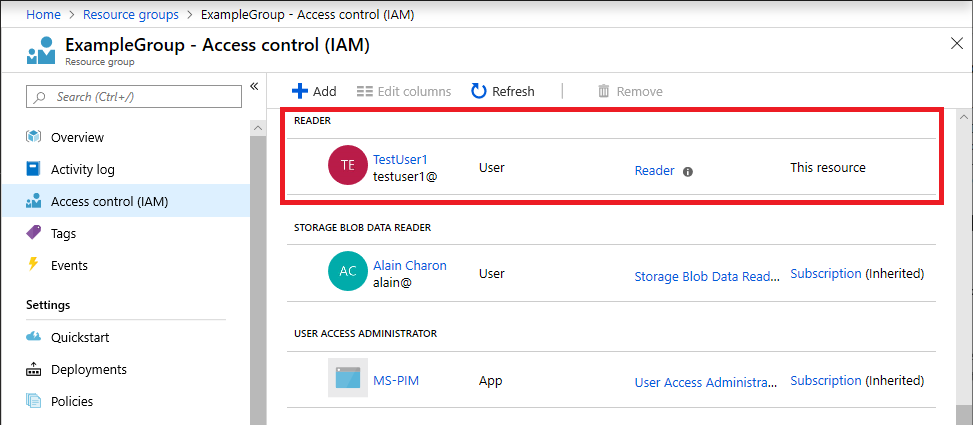
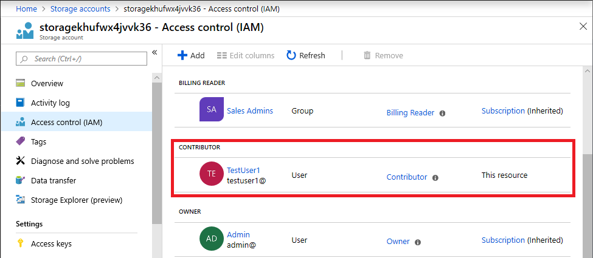
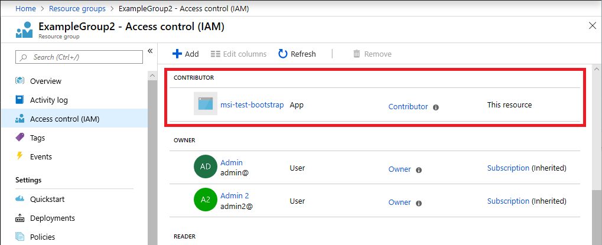

# Assign Azure roles using Azure Resource Manager templates

[!INCLUDE [Azure RBAC definition grant access](../../includes/role-based-access-control/definition-grant.md)] In addition to using Azure PowerShell or the Azure CLI, you can assign roles using [Azure Resource Manager templates](../azure-resource-manager/templates/template-syntax.md). Templates can be helpful if you need to deploy resources consistently and repeatedly. This article describes how to assign roles using templates.

## Prerequisites

[!INCLUDE [Azure role assignment prerequisites](../../includes/role-based-access-control/prerequisites-role-assignments.md)]

## Get object IDs

To assign a role, you need to specify the ID of the user, group, or application you want to assign the role to. The ID has the format: `11111111-1111-1111-1111-111111111111`. You can get the ID using the Azure portal, Azure PowerShell, or Azure CLI.

### User

To get the ID of a user, you can use the [Get-AzADUser](/powershell/module/az.resources/get-azaduser) or [az ad user show](/cli/azure/ad/user#az_ad_user_show) commands.

```azurepowershell
$objectid = (Get-AzADUser -DisplayName "{name}").id
```

```azurecli
objectid=$(az ad user show --id "{email}" --query objectId --output tsv)
```

### Group

To get the ID of a group, you can use the [Get-AzADGroup](/powershell/module/az.resources/get-azadgroup) or [az ad group show](/cli/azure/ad/group#az_ad_group_show) commands.

```azurepowershell
$objectid = (Get-AzADGroup -DisplayName "{name}").id
```

```azurecli
objectid=$(az ad group show --group "{name}" --query objectId --output tsv)
```

### Managed identities

To get the ID of a managed identity, you can use [Get-AzAdServiceprincipal](/powershell/module/az.resources/get-azadserviceprincipal) or [az ad sp](/cli/azure/ad/sp) commands.

```azurepowershell
$objectid = (Get-AzADServicePrincipal -DisplayName <Azure resource name>).id
```

```azurecli
objectid=$(az ad sp list --display-name <Azure resource name> --query [].objectId --output tsv)
```

### Application

To get the ID of a service principal (identity used by an application), you can use the [Get-AzADServicePrincipal](/powershell/module/az.resources/get-azadserviceprincipal) or [az ad sp list](/cli/azure/ad/sp#az_ad_sp_list) commands. For a service principal, use the object ID and **not** the application ID.

```azurepowershell
$objectid = (Get-AzADServicePrincipal -DisplayName "{name}").id
```

```azurecli
objectid=$(az ad sp list --display-name "{name}" --query [].objectId --output tsv)
```

## Assign an Azure role

In Azure RBAC, to grant access, you assign a role.

### Resource group scope (without parameters)

The following template shows a basic way to assign a role. Some values are specified within the template. The following template demonstrates:

-  How to assign the [Reader](built-in-roles.md#reader) role to a user, group, or application at a resource group scope

To use the template, you must do the following:

- Create a new JSON file and copy the template
- Replace `<your-principal-id>` with the ID of a user, group, managed identity, or application to assign the role to

```json
{
    "$schema": "https://schema.management.azure.com/schemas/2015-01-01/deploymentTemplate.json#",
    "contentVersion": "1.0.0.0",
    "resources": [
        {
            "type": "Microsoft.Authorization/roleAssignments",
            "apiVersion": "2018-09-01-preview",
            "name": "[guid(resourceGroup().id)]",
            "properties": {
                "roleDefinitionId": "[concat('/subscriptions/', subscription().subscriptionId, '/providers/Microsoft.Authorization/roleDefinitions/', 'acdd72a7-3385-48ef-bd42-f606fba81ae7')]",
                "principalId": "<your-principal-id>"
            }
        }
    ]
}
```

Here are example [New-AzResourceGroupDeployment](/powershell/module/az.resources/new-azresourcegroupdeployment) and [az deployment group create](/cli/azure/deployment/group#az_deployment_group_create) commands for how to start the deployment in a resource group named ExampleGroup.

```azurepowershell
New-AzResourceGroupDeployment -ResourceGroupName ExampleGroup -TemplateFile rbac-test.json
```

```azurecli
az deployment group create --resource-group ExampleGroup --template-file rbac-test.json
```

The following shows an example of the Reader role assignment to a user for a resource group after deploying the template.



### Resource group or subscription scope

The previous template isn't very flexible. The following template uses parameters and can be used at different scopes. The following template demonstrates:

- How to assign a role to a user, group, or application at either a resource group or subscription scope
- How to specify the Owner, Contributor, and Reader roles as a parameter

To use the template, you must specify the following inputs:

- The ID of a user, group, managed identity, or application to assign the role to
- A unique ID that will be used for the role assignment, or you can use the default ID

```json
{
    "$schema": "https://schema.management.azure.com/schemas/2015-01-01/deploymentTemplate.json#",
    "contentVersion": "1.0.0.0",
    "parameters": {
        "principalId": {
            "type": "string",
            "metadata": {
                "description": "The principal to assign the role to"
            }
        },
        "builtInRoleType": {
            "type": "string",
            "allowedValues": [
                "Owner",
                "Contributor",
                "Reader"
            ],
            "metadata": {
                "description": "Built-in role to assign"
            }
        },
        "roleNameGuid": {
            "type": "string",
            "defaultValue": "[newGuid()]",
            "metadata": {
                "description": "A new GUID used to identify the role assignment"
            }
        }
    },
    "variables": {
        "Owner": "[concat('/subscriptions/', subscription().subscriptionId, '/providers/Microsoft.Authorization/roleDefinitions/', '8e3af657-a8ff-443c-a75c-2fe8c4bcb635')]",
        "Contributor": "[concat('/subscriptions/', subscription().subscriptionId, '/providers/Microsoft.Authorization/roleDefinitions/', 'b24988ac-6180-42a0-ab88-20f7382dd24c')]",
        "Reader": "[concat('/subscriptions/', subscription().subscriptionId, '/providers/Microsoft.Authorization/roleDefinitions/', 'acdd72a7-3385-48ef-bd42-f606fba81ae7')]"
    },
    "resources": [
        {
            "type": "Microsoft.Authorization/roleAssignments",
            "apiVersion": "2018-09-01-preview",
            "name": "[parameters('roleNameGuid')]",
            "properties": {
                "roleDefinitionId": "[variables(parameters('builtInRoleType'))]",
                "principalId": "[parameters('principalId')]"
            }
        }
    ]
}
```

> [!NOTE]
> This template is not idempotent unless the same `roleNameGuid` value is provided as a parameter for each deployment of the template. If no `roleNameGuid` is provided, by default a new GUID is generated on each deployment and subsequent deployments will fail with a `Conflict: RoleAssignmentExists` error.

The scope of the role assignment is determined from the level of the deployment. Here are example [New-AzResourceGroupDeployment](/powershell/module/az.resources/new-azresourcegroupdeployment) and [az deployment group create](/cli/azure/deployment/group#az_deployment_group_create) commands for how to start the deployment at a resource group scope.

```azurepowershell
New-AzResourceGroupDeployment -ResourceGroupName ExampleGroup -TemplateFile rbac-test.json -principalId $objectid -builtInRoleType Reader
```

```azurecli
az deployment group create --resource-group ExampleGroup --template-file rbac-test.json --parameters principalId=$objectid builtInRoleType=Reader
```

Here are example [New-AzDeployment](/powershell/module/az.resources/new-azdeployment) and [az deployment sub create](/cli/azure/deployment/sub#az_deployment_sub_create) commands for how to start the deployment at a subscription scope and specify the location.

```azurepowershell
New-AzDeployment -Location centralus -TemplateFile rbac-test.json -principalId $objectid -builtInRoleType Reader
```

```azurecli
az deployment sub create --location centralus --template-file rbac-test.json --parameters principalId=$objectid builtInRoleType=Reader
```

### Resource scope

If you need to assign a role at the level of a resource, set the `scope` property on the role assignment to the name of the resource.

The following template demonstrates:

- How to create a new storage account
- How to assign a role to a user, group, or application at the storage account scope
- How to specify the Owner, Contributor, and Reader roles as a parameter

To use the template, you must specify the following inputs:

- The ID of a user, group, managed identity, or application to assign the role to

```json
{
    "$schema": "https://schema.management.azure.com/schemas/2019-04-01/deploymentTemplate.json#",
    "contentVersion": "1.0.0.0",
    "parameters": {
        "principalId": {
            "type": "string",
            "metadata": {
                "description": "The principal to assign the role to"
            }
        },
        "builtInRoleType": {
            "type": "string",
            "allowedValues": [
                "Owner",
                "Contributor",
                "Reader"
            ],
            "metadata": {
                "description": "Built-in role to assign"
            }
        },
        "roleNameGuid": {
            "type": "string",
            "defaultValue": "[newGuid()]",
            "metadata": {
                "description": "A new GUID used to identify the role assignment"
            }
        },
        "location": {
            "type": "string",
            "defaultValue": "[resourceGroup().location]"
        }
    },
    "variables": {
        "Owner": "[concat('/subscriptions/', subscription().subscriptionId, '/providers/Microsoft.Authorization/roleDefinitions/', '8e3af657-a8ff-443c-a75c-2fe8c4bcb635')]",
        "Contributor": "[concat('/subscriptions/', subscription().subscriptionId, '/providers/Microsoft.Authorization/roleDefinitions/', 'b24988ac-6180-42a0-ab88-20f7382dd24c')]",
        "Reader": "[concat('/subscriptions/', subscription().subscriptionId, '/providers/Microsoft.Authorization/roleDefinitions/', 'acdd72a7-3385-48ef-bd42-f606fba81ae7')]",
        "storageName": "[concat('storage', uniqueString(resourceGroup().id))]"
    },
    "resources": [
        {
            "apiVersion": "2019-04-01",
            "type": "Microsoft.Storage/storageAccounts",
            "name": "[variables('storageName')]",
            "location": "[parameters('location')]",
            "sku": {
                "name": "Standard_LRS"
            },
            "kind": "Storage",
            "properties": {}
        },
        {
            "type": "Microsoft.Authorization/roleAssignments",
            "apiVersion": "2020-04-01-preview",
            "name": "[parameters('roleNameGuid')]",
            "scope": "[concat('Microsoft.Storage/storageAccounts', '/', variables('storageName'))]",
            "dependsOn": [
                "[variables('storageName')]"
            ],
            "properties": {
                "roleDefinitionId": "[variables(parameters('builtInRoleType'))]",
                "principalId": "[parameters('principalId')]"
            }
        }
    ]
}
```

To deploy the previous template, you use the resource group commands. Here are example [New-AzResourceGroupDeployment](/powershell/module/az.resources/new-azresourcegroupdeployment) and [az deployment group create](/cli/azure/deployment/group#az_deployment_group_create) commands for how to start the deployment at a resource scope.

```azurepowershell
New-AzResourceGroupDeployment -ResourceGroupName ExampleGroup -TemplateFile rbac-test.json -principalId $objectid -builtInRoleType Contributor
```

```azurecli
az deployment group create --resource-group ExampleGroup --template-file rbac-test.json --parameters principalId=$objectid builtInRoleType=Contributor
```

The following shows an example of the Contributor role assignment to a user for a storage account after deploying the template.



### New service principal

If you create a new service principal and immediately try to assign a role to that service principal, that role assignment can fail in some cases. For example, if you create a new managed identity and then try to assign a role to that service principal in the same Azure Resource Manager template, the role assignment might fail. The reason for this failure is likely a replication delay. The service principal is created in one region; however, the role assignment might occur in a different region that hasn't replicated the service principal yet.

To address this scenario, you should set the `principalType` property to `ServicePrincipal` when creating the role assignment. You must also set the `apiVersion` of the role assignment to `2018-09-01-preview` or later.

The following template demonstrates:

- How to create a new managed identity service principal
- How to specify the `principalType`
- How to assign the Contributor role to that service principal at a resource group scope

To use the template, you must specify the following inputs:

- The base name of the managed identity, or you can use the default string

```json
{
    "$schema": "http://schema.management.azure.com/schemas/2015-01-01/deploymentTemplate.json#",
    "contentVersion": "1.0.0.0",
    "parameters": {
        "baseName": {
            "type": "string",
            "defaultValue": "msi-test"
        }
    },
    "variables": {
        "identityName": "[concat(parameters('baseName'), '-bootstrap')]",
        "bootstrapRoleAssignmentId": "[guid(concat(resourceGroup().id, 'contributor'))]",
        "contributorRoleDefinitionId": "[concat('/subscriptions/', subscription().subscriptionId, '/providers/Microsoft.Authorization/roleDefinitions/', 'b24988ac-6180-42a0-ab88-20f7382dd24c')]"
    },
    "resources": [
        {
            "type": "Microsoft.ManagedIdentity/userAssignedIdentities",
            "name": "[variables('identityName')]",
            "apiVersion": "2018-11-30",
            "location": "[resourceGroup().location]"
        },
        {
            "type": "Microsoft.Authorization/roleAssignments",
            "apiVersion": "2018-09-01-preview",
            "name": "[variables('bootstrapRoleAssignmentId')]",
            "dependsOn": [
                "[resourceId('Microsoft.ManagedIdentity/userAssignedIdentities', variables('identityName'))]"
            ],
            "properties": {
                "roleDefinitionId": "[variables('contributorRoleDefinitionId')]",
                "principalId": "[reference(resourceId('Microsoft.ManagedIdentity/userAssignedIdentities', variables('identityName')), '2018-11-30').principalId]",
                "principalType": "ServicePrincipal"
            }
        }
    ]
}
```

Here are example [New-AzResourceGroupDeployment](/powershell/module/az.resources/new-azresourcegroupdeployment) and [az deployment group create](/cli/azure/deployment/group#az_deployment_group_create) commands for how to start the deployment at a resource group scope.

```azurepowershell
New-AzResourceGroupDeployment -ResourceGroupName ExampleGroup2 -TemplateFile rbac-test.json
```

```azurecli
az deployment group create --resource-group ExampleGroup2 --template-file rbac-test.json
```

The following shows an example of the Contributor role assignment to a new managed identity service principal after deploying the template.



## Next steps

- [Quickstart: Create and deploy ARM templates by using the Azure portal](../azure-resource-manager/templates/quickstart-create-templates-use-the-portal.md)
- [Understand the structure and syntax of ARM templates](../azure-resource-manager/templates/template-syntax.md)
- [Create resource groups and resources at the subscription level](../azure-resource-manager/templates/deploy-to-subscription.md)
- [Azure Quickstart Templates](https://azure.microsoft.com/resources/templates/?term=rbac)
