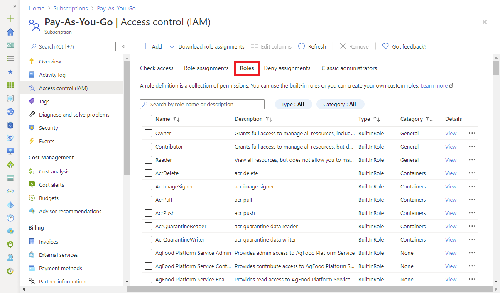
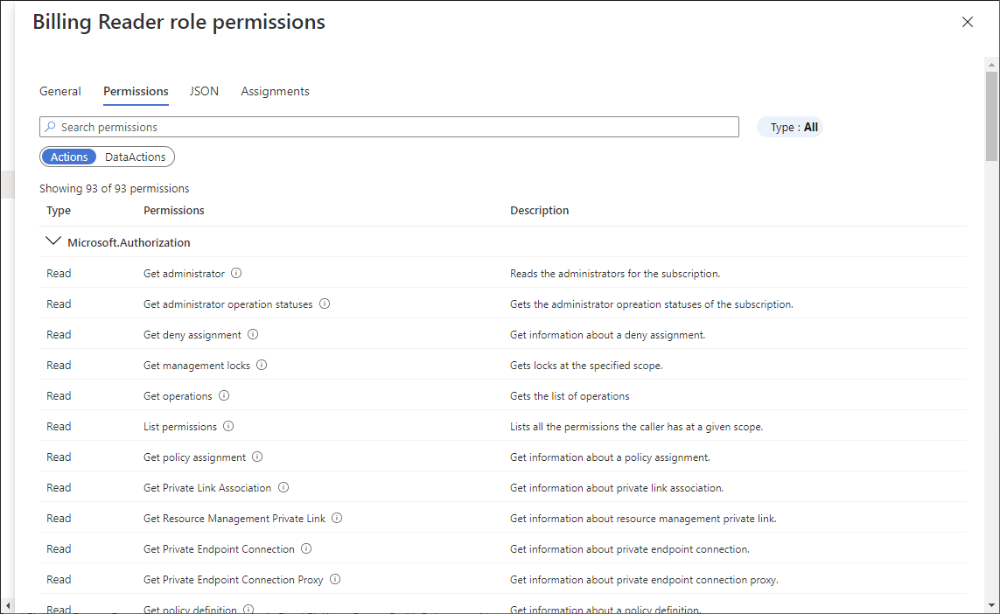

# List Azure role definitions

A role definition is a collection of permissions that can be performed, such as read, write, and delete. It's typically just called a role. [Azure role-based access control (Azure RBAC)](overview.md) has over 120 [built-in roles](built-in-roles.md) or you can create your own custom roles. This article describes how to list the built-in and custom roles that you can use to grant access to Azure resources.

To see the list of administrator roles for Azure Active Directory, see [Administrator role permissions in Azure Active Directory](../active-directory/roles/permissions-reference.md).

## Azure portal

### List all roles

Follow these steps to list all roles in the Azure portal.

1. In the Azure portal, click **All services** and then select any scope. For example, you can select **Management groups**, **Subscriptions**, **Resource groups**, or a resource.

1. Click the specific resource.

1. Click **Access control (IAM)**.

1. Click the **Roles** tab to see a list of all the built-in and custom roles.

   
  
1. To see the permissions for a particular role, in the **Details** column, click the **View** link.

    A permissions pane appears.

1. Click the **Permissions** tab to view and search the permissions for the selected role.

   

## Azure PowerShell

### List all roles

To list all roles in Azure PowerShell, use [Get-AzRoleDefinition](/powershell/module/az.resources/get-azroledefinition).

```azurepowershell
Get-AzRoleDefinition | FT Name, Description
```

```Example
AcrImageSigner                                    acr image signer
AcrQuarantineReader                               acr quarantine data reader
AcrQuarantineWriter                               acr quarantine data writer
API Management Service Contributor                Can manage service and the APIs
API Management Service Operator Role              Can manage service but not the APIs
API Management Service Reader Role                Read-only access to service and APIs
Application Insights Component Contributor        Can manage Application Insights components
Application Insights Snapshot Debugger            Gives user permission to use Application Insights Snapshot Debugge...
Automation Job Operator                           Create and Manage Jobs using Automation Runbooks.
Automation Operator                               Automation Operators are able to start, stop, suspend, and resume ...
...
```

### List a role definition

To list the details of a specific role, use [Get-AzRoleDefinition](/powershell/module/az.resources/get-azroledefinition).

```azurepowershell
Get-AzRoleDefinition <role_name>
```

```Example
PS C:\> Get-AzRoleDefinition "Contributor"

Name             : Contributor
Id               : b24988ac-6180-42a0-ab88-20f7382dd24c
IsCustom         : False
Description      : Lets you manage everything except access to resources.
Actions          : {*}
NotActions       : {Microsoft.Authorization/*/Delete, Microsoft.Authorization/*/Write,
                   Microsoft.Authorization/elevateAccess/Action}
DataActions      : {}
NotDataActions   : {}
AssignableScopes : {/}
```

### List a role definition in JSON format

To list a role in JSON format, use [Get-AzRoleDefinition](/powershell/module/az.resources/get-azroledefinition).

```azurepowershell
Get-AzRoleDefinition <role_name> | ConvertTo-Json
```

```Example
PS C:\> Get-AzRoleDefinition "Contributor" | ConvertTo-Json

{
  "Name": "Contributor",
  "Id": "b24988ac-6180-42a0-ab88-20f7382dd24c",
  "IsCustom": false,
  "Description": "Lets you manage everything except access to resources.",
  "Actions": [
    "*"
  ],
  "NotActions": [
    "Microsoft.Authorization/*/Delete",
    "Microsoft.Authorization/*/Write",
    "Microsoft.Authorization/elevateAccess/Action",
    "Microsoft.Blueprint/blueprintAssignments/write",
    "Microsoft.Blueprint/blueprintAssignments/delete"
  ],
  "DataActions": [],
  "NotDataActions": [],
  "AssignableScopes": [
    "/"
  ]
}
```

### List permissions of a role definition

To list the permissions for a specific role, use [Get-AzRoleDefinition](/powershell/module/az.resources/get-azroledefinition).

```azurepowershell
Get-AzRoleDefinition <role_name> | FL Actions, NotActions
```

```Example
PS C:\> Get-AzRoleDefinition "Contributor" | FL Actions, NotActions

Actions    : {*}
NotActions : {Microsoft.Authorization/*/Delete, Microsoft.Authorization/*/Write,
             Microsoft.Authorization/elevateAccess/Action,
             Microsoft.Blueprint/blueprintAssignments/write...}
```

```azurepowershell
(Get-AzRoleDefinition <role_name>).Actions
```

```Example
PS C:\> (Get-AzRoleDefinition "Virtual Machine Contributor").Actions

Microsoft.Authorization/*/read
Microsoft.Compute/availabilitySets/*
Microsoft.Compute/locations/*
Microsoft.Compute/virtualMachines/*
Microsoft.Compute/virtualMachineScaleSets/*
Microsoft.DevTestLab/schedules/*
Microsoft.Insights/alertRules/*
Microsoft.Network/applicationGateways/backendAddressPools/join/action
Microsoft.Network/loadBalancers/backendAddressPools/join/action
...
```

## Azure CLI

### List all roles

To list all roles in Azure CLI, use [az role definition list](/cli/azure/role/definition#az-role-definition-list).

```azurecli
az role definition list
```

The following example lists the name and description of all available role definitions:

```azurecli
az role definition list --output json --query '[].{roleName:roleName, description:description}'
```

```json
[
  {
    "description": "Can manage service and the APIs",
    "roleName": "API Management Service Contributor"
  },
  {
    "description": "Can manage service but not the APIs",
    "roleName": "API Management Service Operator Role"
  },
  {
    "description": "Read-only access to service and APIs",
    "roleName": "API Management Service Reader Role"
  },

  ...

]
```

The following example lists all of the built-in roles.

```azurecli
az role definition list --custom-role-only false --output json --query '[].{roleName:roleName, description:description, roleType:roleType}'
```

```json
[
  {
    "description": "Can manage service and the APIs",
    "roleName": "API Management Service Contributor",
    "roleType": "BuiltInRole"
  },
  {
    "description": "Can manage service but not the APIs",
    "roleName": "API Management Service Operator Role",
    "roleType": "BuiltInRole"
  },
  {
    "description": "Read-only access to service and APIs",
    "roleName": "API Management Service Reader Role",
    "roleType": "BuiltInRole"
  },
  
  ...

]
```

### List a role definition

To list details of a role, use [az role definition list](/cli/azure/role/definition#az-role-definition-list).

```azurecli
az role definition list --name {roleName}
```

The following example lists the *Contributor* role definition:

```azurecli
az role definition list --name "Contributor"
```

```json
[
  {
    "assignableScopes": [
      "/"
    ],
    "description": "Lets you manage everything except access to resources.",
    "id": "/subscriptions/{subscriptionId}/providers/Microsoft.Authorization/roleDefinitions/b24988ac-6180-42a0-ab88-20f7382dd24c",
    "name": "b24988ac-6180-42a0-ab88-20f7382dd24c",
    "permissions": [
      {
        "actions": [
          "*"
        ],
        "dataActions": [],
        "notActions": [
          "Microsoft.Authorization/*/Delete",
          "Microsoft.Authorization/*/Write",
          "Microsoft.Authorization/elevateAccess/Action",
          "Microsoft.Blueprint/blueprintAssignments/write",
          "Microsoft.Blueprint/blueprintAssignments/delete"
        ],
        "notDataActions": []
      }
    ],
    "roleName": "Contributor",
    "roleType": "BuiltInRole",
    "type": "Microsoft.Authorization/roleDefinitions"
  }
]
```

### List permissions of a role definition

The following example lists just the *actions* and *notActions* of the *Contributor* role.

```azurecli
az role definition list --name "Contributor" --output json --query '[].{actions:permissions[0].actions, notActions:permissions[0].notActions}'
```

```json
[
  {
    "actions": [
      "*"
    ],
    "notActions": [
      "Microsoft.Authorization/*/Delete",
      "Microsoft.Authorization/*/Write",
      "Microsoft.Authorization/elevateAccess/Action",
      "Microsoft.Blueprint/blueprintAssignments/write",
      "Microsoft.Blueprint/blueprintAssignments/delete"
    ]
  }
]
```

The following example lists just the actions of the *Virtual Machine Contributor* role.

```azurecli
az role definition list --name "Virtual Machine Contributor" --output json --query '[].permissions[0].actions'
```

```json
[
  [
    "Microsoft.Authorization/*/read",
    "Microsoft.Compute/availabilitySets/*",
    "Microsoft.Compute/locations/*",
    "Microsoft.Compute/virtualMachines/*",
    "Microsoft.Compute/virtualMachineScaleSets/*",
    "Microsoft.Compute/disks/write",
    "Microsoft.Compute/disks/read",
    "Microsoft.Compute/disks/delete",
    "Microsoft.DevTestLab/schedules/*",
    "Microsoft.Insights/alertRules/*",
    "Microsoft.Network/applicationGateways/backendAddressPools/join/action",
    "Microsoft.Network/loadBalancers/backendAddressPools/join/action",

    ...

    "Microsoft.Storage/storageAccounts/listKeys/action",
    "Microsoft.Storage/storageAccounts/read",
    "Microsoft.Support/*"
  ]
]
```

## REST API

### Prerequisites

You must use the following version:

- `2015-07-01` or later

For more information, see [API versions of Azure RBAC REST APIs](/rest/api/authorization/versions).

### List all role definitions

To list role definitions in a tenant, use the [Role Definitions - List](/rest/api/authorization/role-definitions/list) REST API.

- The following example lists all role definitions in a tenant:

    **Request**
    
    ```http
    GET https://management.azure.com/providers/Microsoft.Authorization/roleDefinitions?api-version=2022-04-01
    ```
    
    **Response**
    
    ```json
    {
        "value": [
            {
                "properties": {
                    "roleName": "Billing Reader Plus",
                    "type": "CustomRole",
                    "description": "Read billing data and download invoices",
                    "assignableScopes": [
                        "/subscriptions/473a4f86-11e3-48cb-9358-e13c220a2f15"
                    ],
                    "permissions": [
                        {
                            "actions": [
                                "Microsoft.Authorization/*/read",
                                "Microsoft.Billing/*/read",
                                "Microsoft.Commerce/*/read",
                                "Microsoft.Consumption/*/read",
                                "Microsoft.Management/managementGroups/read",
                                "Microsoft.CostManagement/*/read",
                                "Microsoft.Billing/invoices/download/action",
                                "Microsoft.CostManagement/exports/*"
                            ],
                            "notActions": [
                                "Microsoft.CostManagement/exports/delete"
                            ],
                            "dataActions": [],
                            "notDataActions": []
                        }
                    ],
                    "createdOn": "2021-05-22T21:57:23.5764138Z",
                    "updatedOn": "2021-05-22T21:57:23.5764138Z",
                    "createdBy": "68f66d4c-c0eb-4009-819b-e5315d677d70",
                    "updatedBy": "68f66d4c-c0eb-4009-819b-e5315d677d70"
                },
                "id": "/providers/Microsoft.Authorization/roleDefinitions/17adabda-4bf1-4f4e-8c97-1f0cab6dea1c",
                "type": "Microsoft.Authorization/roleDefinitions",
                "name": "17adabda-4bf1-4f4e-8c97-1f0cab6dea1c"
            },
            {
                "properties": {
                    "roleName": "AcrPush",
                    "type": "BuiltInRole",
                    "description": "acr push",
                    "assignableScopes": [
                        "/"
                    ],
                    "permissions": [
                        {
                            "actions": [
                                "Microsoft.ContainerRegistry/registries/pull/read",
                                "Microsoft.ContainerRegistry/registries/push/write"
                            ],
                            "notActions": [],
                            "dataActions": [],
                            "notDataActions": []
                        }
                    ],
                    "createdOn": "2018-10-29T17:52:32.5201177Z",
                    "updatedOn": "2021-11-11T20:13:07.4993029Z",
                    "createdBy": null,
                    "updatedBy": null
                },
                "id": "/providers/Microsoft.Authorization/roleDefinitions/8311e382-0749-4cb8-b61a-304f252e45ec",
                "type": "Microsoft.Authorization/roleDefinitions",
                "name": "8311e382-0749-4cb8-b61a-304f252e45ec"
            }
        ]
    }
    ```

### List role definitions

To list role definitions, use the [Role Definitions - List](/rest/api/authorization/role-definitions/list) REST API. To refine your results, you specify a scope and an optional filter.

1. Start with the following request:

    ```http
    GET https://management.azure.com/{scope}/providers/Microsoft.Authorization/roleDefinitions?$filter={$filter}&api-version=2022-04-01
    ```

    For a tenant-level scope, you can use this request:

    ```http
    GET https://management.azure.com/providers/Microsoft.Authorization/roleDefinitions?filter={$filter}&api-version=2022-04-01
    ```

1. Within the URI, replace *{scope}* with the scope for which you want to list the role definitions.

    > [!div class="mx-tableFixed"]
    > | Scope | Type |
    > | --- | --- |
    > | `providers/Microsoft.Management/managementGroups/{groupId1}` | Management group |
    > | `subscriptions/{subscriptionId1}` | Subscription |
    > | `subscriptions/{subscriptionId1}/resourceGroups/myresourcegroup1` | Resource group |
    > | `subscriptions/{subscriptionId1}/resourceGroups/myresourcegroup1/providers/Microsoft.Web/sites/mysite1` | Resource |

    In the previous example, microsoft.web is a resource provider that refers to an App Service instance. Similarly, you can use any other resource providers and specify the scope. For more information, see [Azure Resource providers and types](../azure-resource-manager/management/resource-providers-and-types.md) and supported [Azure resource provider operations](resource-provider-operations.md).  
     
1. Replace *{filter}* with the condition that you want to apply to filter the role definition list.

    > [!div class="mx-tableFixed"]
    > | Filter | Description |
    > | --- | --- |
    > | `$filter=type+eq+'{type}'` | Lists role definitions of the specified type. Type of role can be `CustomRole` or `BuiltInRole`. |

    The following example lists all custom roles in a tenant:

    **Request**
    
    ```http
    GET https://management.azure.com/providers/Microsoft.Authorization/roleDefinitions?$filter=type+eq+'CustomRole'&api-version=2022-04-01
    ```
    
    **Response**
    
    ```json
    {
        "value": [
            {
                "properties": {
                    "roleName": "Billing Reader Plus",
                    "type": "CustomRole",
                    "description": "Read billing data and download invoices",
                    "assignableScopes": [
                        "/subscriptions/473a4f86-11e3-48cb-9358-e13c220a2f15"
                    ],
                    "permissions": [
                        {
                            "actions": [
                                "Microsoft.Authorization/*/read",
                                "Microsoft.Billing/*/read",
                                "Microsoft.Commerce/*/read",
                                "Microsoft.Consumption/*/read",
                                "Microsoft.Management/managementGroups/read",
                                "Microsoft.CostManagement/*/read",
                                "Microsoft.Billing/invoices/download/action",
                                "Microsoft.CostManagement/exports/*"
                            ],
                            "notActions": [
                                "Microsoft.CostManagement/exports/delete"
                            ],
                            "dataActions": [],
                            "notDataActions": []
                        }
                    ],
                    "createdOn": "2021-05-22T21:57:23.5764138Z",
                    "updatedOn": "2021-05-22T21:57:23.5764138Z",
                    "createdBy": "68f66d4c-c0eb-4009-819b-e5315d677d70",
                    "updatedBy": "68f66d4c-c0eb-4009-819b-e5315d677d70"
                },
                "id": "/providers/Microsoft.Authorization/roleDefinitions/17adabda-4bf1-4f4e-8c97-1f0cab6dea1c",
                "type": "Microsoft.Authorization/roleDefinitions",
                "name": "17adabda-4bf1-4f4e-8c97-1f0cab6dea1c"
            }
        ]
    }
    ```

### List a role definition

To list the details of a specific role, use the [Role Definitions - Get](/rest/api/authorization/role-definitions/get) or [Role Definitions - Get By ID](/rest/api/authorization/role-definitions/get-by-id) REST API.

1. Start with the following request:

    ```http
    GET https://management.azure.com/{scope}/providers/Microsoft.Authorization/roleDefinitions/{roleDefinitionId}?api-version=2022-04-01
    ```

    For a tenant-level role definition, you can use this request:

    ```http
    GET https://management.azure.com/providers/Microsoft.Authorization/roleDefinitions/{roleDefinitionId}?api-version=2022-04-01
    ```

1. Within the URI, replace *{scope}* with the scope for which you want to list the role definition.

    > [!div class="mx-tableFixed"]
    > | Scope | Type |
    > | --- | --- |
    > | `providers/Microsoft.Management/managementGroups/{groupId1}` | Management group |
    > | `subscriptions/{subscriptionId1}` | Subscription |
    > | `subscriptions/{subscriptionId1}/resourceGroups/myresourcegroup1` | Resource group |
    > | `subscriptions/{subscriptionId1}/resourceGroups/myresourcegroup1/providers/Microsoft.Web/sites/mysite1` | Resource |
     
1. Replace *{roleDefinitionId}* with the role definition identifier.

    The following example lists the [Reader](built-in-roles.md#reader) role definition:
    
    **Request**
    
    ```http
    GET https://management.azure.com/providers/Microsoft.Authorization/roleDefinitions/acdd72a7-3385-48ef-bd42-f606fba81ae7?api-version=2022-04-01
    ```
    
    **Response**
    
    ```json
    {
        "properties": {
            "roleName": "Reader",
            "type": "BuiltInRole",
            "description": "View all resources, but does not allow you to make any changes.",
            "assignableScopes": [
                "/"
            ],
            "permissions": [
                {
                    "actions": [
                        "*/read"
                    ],
                    "notActions": [],
                    "dataActions": [],
                    "notDataActions": []
                }
            ],
            "createdOn": "2015-02-02T21:55:09.8806423Z",
            "updatedOn": "2021-11-11T20:13:47.8628684Z",
            "createdBy": null,
            "updatedBy": null
        },
        "id": "/providers/Microsoft.Authorization/roleDefinitions/acdd72a7-3385-48ef-bd42-f606fba81ae7",
        "type": "Microsoft.Authorization/roleDefinitions",
        "name": "acdd72a7-3385-48ef-bd42-f606fba81ae7"
    }
    ```

## Next steps

- [Azure built-in roles](built-in-roles.md)
- [Azure custom roles](custom-roles.md)
- [List Azure role assignments using the Azure portal](role-assignments-list-portal.md)
- [Assign Azure roles using the Azure portal](role-assignments-portal.md)
