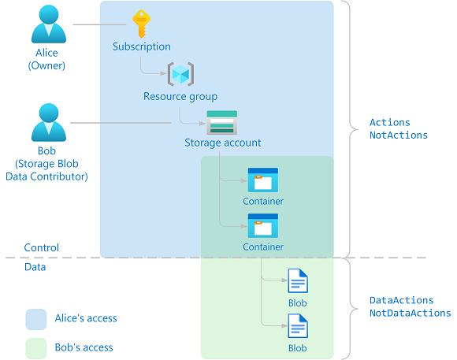

# Understand Azure role definitions

If you are trying to understand how an Azure role works or if you are creating your own [Azure custom role](custom-roles.md), it's helpful to understand how roles are defined. This article describes the details of role definitions and provides some examples.

## Role definition

A *role definition* is a collection of permissions. It's sometimes just called a *role*. A role definition lists the actions that can be performed, such as read, write, and delete. It can also list the actions that are excluded from allowed actions or actions related to underlying data.

The following shows an example of the properties in a role definition when displayed using [Azure PowerShell](role-definitions-list.md#azure-powershell):

```
Name
Id
IsCustom
Description
Actions []
NotActions []
DataActions []
NotDataActions []
AssignableScopes []
```

The following shows an example of the properties in a role definition when displayed using the [Azure portal](role-definitions-list.md#azure-portal), [Azure CLI](role-definitions-list.md#azure-cli), or the [REST API](role-definitions-list.md#rest-api):

```
roleName
name
type
description
actions []
notActions []
dataActions []
notDataActions []
assignableScopes []
```

The following table describes what the role properties mean.

| Property | Description |
| --- | --- |
| `Name`</br>`roleName` | The display name of the role. |
| `Id`</br>`name` | The unique ID of the role. Built-in roles have the same role ID across clouds. |
| `IsCustom`</br>`roleType` | Indicates whether this is a custom role. Set to `true` or `CustomRole` for custom roles. Set to `false` or `BuiltInRole` for built-in roles. |
| `Description`</br>`description` | The description of the role. |
| `Actions`</br>`actions` | An array of strings that specifies the control plane actions that the role allows to be performed. |
| `NotActions`</br>`notActions` | An array of strings that specifies the control plane actions that are excluded from the allowed `Actions`. |
| `DataActions`</br>`dataActions` | An array of strings that specifies the data plane actions that the role allows to be performed to your data within that object. |
| `NotDataActions`</br>`notDataActions` | An array of strings that specifies the data plane actions that are excluded from the allowed `DataActions`. |
| `AssignableScopes`</br>`assignableScopes` | An array of strings that specifies the scopes that the role is available for assignment. |

### Actions format

Actions are specified with strings that have the following format:

- `{Company}.{ProviderName}/{resourceType}/{action}`

The `{action}` portion of an action string specifies the type of actions you can perform on a resource type. For example, you will see the following substrings in `{action}`:

| Action substring    | Description         |
| ------------------- | ------------------- |
| `*` | The wildcard character grants access to all actions that match the string. |
| `read` | Enables read actions (GET). |
| `write` | Enables write actions (PUT or PATCH). |
| `action` | Enables custom actions like restart virtual machines (POST). |
| `delete` | Enables delete actions (DELETE). |

### Role definition example

Here's the [Contributor](built-in-roles.md#contributor) role definition as displayed in Azure PowerShell and Azure CLI. The wildcard (`*`) actions under `Actions` indicates that the principal assigned to this role can perform all actions, or in other words, it can manage everything. This includes actions defined in the future, as Azure adds new resource types. The actions under `NotActions` are subtracted from `Actions`. In the case of the [Contributor](built-in-roles.md#contributor) role, `NotActions` removes this role's ability to manage access to resources and also manage Azure Blueprints assignments.

Contributor role as displayed in [Azure PowerShell](role-definitions-list.md#azure-powershell):

```json
{
  "Name": "Contributor",
  "Id": "b24988ac-6180-42a0-ab88-20f7382dd24c",
  "IsCustom": false,
  "Description": "Lets you manage everything except access to resources.",
  "Actions": [
    "*"
  ],
  "NotActions": [
    "Microsoft.Authorization/*/Delete",
    "Microsoft.Authorization/*/Write",
    "Microsoft.Authorization/elevateAccess/Action",
    "Microsoft.Blueprint/blueprintAssignments/write",
    "Microsoft.Blueprint/blueprintAssignments/delete"
  ],
  "DataActions": [],
  "NotDataActions": [],
  "AssignableScopes": [
    "/"
  ]
}
```

Contributor role as displayed in [Azure CLI](role-definitions-list.md#azure-cli):

```json
{
  "assignableScopes": [
    "/"
  ],
  "description": "Lets you manage everything except access to resources.",
  "id": "/subscriptions/{subscriptionId}/providers/Microsoft.Authorization/roleDefinitions/b24988ac-6180-42a0-ab88-20f7382dd24c",
  "name": "b24988ac-6180-42a0-ab88-20f7382dd24c",
  "permissions": [
    {
      "actions": [
        "*"
      ],
      "notActions": [
        "Microsoft.Authorization/*/Delete",
        "Microsoft.Authorization/*/Write",
        "Microsoft.Authorization/elevateAccess/Action",
        "Microsoft.Blueprint/blueprintAssignments/write",
        "Microsoft.Blueprint/blueprintAssignments/delete"
      ],
      "dataActions": [],
      "notDataActions": []
    }
  ],
  "roleName": "Contributor",
  "roleType": "BuiltInRole",
  "type": "Microsoft.Authorization/roleDefinitions"
}
```

## Control and data actions

Role-based access control for control plane actions is specified in the `Actions` and `NotActions` properties of a role definition. Here are some examples of control plane actions in Azure:

- Manage access to a storage account
- Create, update, or delete a blob container
- Delete a resource group and all of its resources

Control plane access is not inherited to your data plane provided that the container authentication method is set to "Azure AD User Account" and not "Access Key". This separation prevents roles with wildcards (`*`) from having unrestricted access to your data. For example, if a user has a [Reader](built-in-roles.md#reader) role on a subscription, then they can view the storage account, but by default they can't view the underlying data.

Previously, role-based access control was not used for data actions. Authorization for data actions varied across resource providers. The same role-based access control authorization model used for control plane actions has been extended to data plane actions.

To support data plane actions, new data properties have been added to the role definition. Data plane actions are specified in the `DataActions` and `NotDataActions` properties. By adding these data properties, the separation between control plane and data plane is maintained. This prevents current role assignments with wildcards (`*`) from suddenly having accessing to data. Here are some data plane actions that can be specified in `DataActions` and `NotDataActions`:

- Read a list of blobs in a container
- Write a storage blob in a container
- Delete a message in a queue

Here's the [Storage Blob Data Reader](built-in-roles.md#storage-blob-data-reader) role definition, which includes actions in both the `Actions` and `DataActions` properties. This role allows you to read the blob container and also the underlying blob data.

Storage Blob Data Reader role as displayed in Azure PowerShell:

```json
{
  "Name": "Storage Blob Data Reader",
  "Id": "2a2b9908-6ea1-4ae2-8e65-a410df84e7d1",
  "IsCustom": false,
  "Description": "Allows for read access to Azure Storage blob containers and data",
  "Actions": [
    "Microsoft.Storage/storageAccounts/blobServices/containers/read",
    "Microsoft.Storage/storageAccounts/blobServices/generateUserDelegationKey/action"
  ],
  "NotActions": [],
  "DataActions": [
    "Microsoft.Storage/storageAccounts/blobServices/containers/blobs/read"
  ],
  "NotDataActions": [],
  "AssignableScopes": [
    "/"
  ]
}
```

Storage Blob Data Reader role as displayed in Azure CLI:

```json
{
  "assignableScopes": [
    "/"
  ],
  "description": "Allows for read access to Azure Storage blob containers and data",
  "id": "/subscriptions/{subscriptionId}/providers/Microsoft.Authorization/roleDefinitions/2a2b9908-6ea1-4ae2-8e65-a410df84e7d1",
  "name": "2a2b9908-6ea1-4ae2-8e65-a410df84e7d1",
  "permissions": [
    {
      "actions": [
        "Microsoft.Storage/storageAccounts/blobServices/containers/read",
        "Microsoft.Storage/storageAccounts/blobServices/generateUserDelegationKey/action"
      ],
      "notActions": [],
      "dataActions": [
        "Microsoft.Storage/storageAccounts/blobServices/containers/blobs/read"
      ],
      "notDataActions": []
    }
  ],
  "roleName": "Storage Blob Data Reader",
  "roleType": "BuiltInRole",
  "type": "Microsoft.Authorization/roleDefinitions"
}
```

Only data plane actions can be added to the `DataActions` and `NotDataActions` properties. Resource providers identify which actions are data actions, by setting the `isDataAction` property to `true`. To see a list of the actions where `isDataAction` is `true`, see [Resource provider operations](resource-provider-operations.md). Roles that do not have data actions are not required to have `DataActions` and `NotDataActions` properties within the role definition.

Authorization for all control plane API calls is handled by Azure Resource Manager. Authorization for data plane API calls is handled by either a resource provider or Azure Resource Manager.

### Data actions example

To better understand how control plane and data plane actions work, let's consider a specific example. Alice has been assigned the [Owner](built-in-roles.md#owner) role at the subscription scope. Bob has been assigned the [Storage Blob Data Contributor](built-in-roles.md#storage-blob-data-contributor) role at a storage account scope. The following diagram shows this example.



The [Owner](built-in-roles.md#owner) role for Alice and the [Storage Blob Data Contributor](built-in-roles.md#storage-blob-data-contributor) role for  Bob have the following actions:

Owner

&nbsp;&nbsp;&nbsp;&nbsp;Actions<br>
&nbsp;&nbsp;&nbsp;&nbsp;`*`

Storage Blob Data Contributor

&nbsp;&nbsp;&nbsp;&nbsp;Actions<br>
&nbsp;&nbsp;&nbsp;&nbsp;`Microsoft.Storage/storageAccounts/blobServices/containers/delete`<br>
&nbsp;&nbsp;&nbsp;&nbsp;`Microsoft.Storage/storageAccounts/blobServices/containers/read`<br>
&nbsp;&nbsp;&nbsp;&nbsp;`Microsoft.Storage/storageAccounts/blobServices/containers/write`<br>
&nbsp;&nbsp;&nbsp;&nbsp;`Microsoft.Storage/storageAccounts/blobServices/generateUserDelegationKey/action`<br>
&nbsp;&nbsp;&nbsp;&nbsp;DataActions<br>
&nbsp;&nbsp;&nbsp;&nbsp;`Microsoft.Storage/storageAccounts/blobServices/containers/blobs/delete`<br>
&nbsp;&nbsp;&nbsp;&nbsp;`Microsoft.Storage/storageAccounts/blobServices/containers/blobs/read`<br>
&nbsp;&nbsp;&nbsp;&nbsp;`Microsoft.Storage/storageAccounts/blobServices/containers/blobs/move/action`<br>
&nbsp;&nbsp;&nbsp;&nbsp;`Microsoft.Storage/storageAccounts/blobServices/containers/blobs/write`

Since Alice has a wildcard (`*`) action at a subscription scope, their permissions inherit down to enable them to perform all control plane actions. Alice can read, write, and delete containers. However, Alice cannot perform data plane actions without taking additional steps. For example, by default, Alice cannot read the blobs inside a container. To read the blobs, Alice would have to retrieve the storage access keys and use them to access the blobs.

Bob's permissions are restricted to just the `Actions` and `DataActions` specified in the [Storage Blob Data Contributor](built-in-roles.md#storage-blob-data-contributor) role. Based on the role, Bob can perform both control plane and data plane actions. For example, Bob can read, write, and delete containers in the specified storage account and can also read, write, and delete the blobs.

For more information about control and data plane security for storage, see the [Azure Storage security guide](../storage/blobs/security-recommendations.md).

### What tools support using Azure roles for data actions?

To view and work with data actions, you must have the correct versions of the tools or SDKs:

| Tool  | Version  |
|---------|---------|
| [Azure PowerShell](/powershell/azure/install-azure-powershell) | 1.1.0 or later |
| [Azure CLI](/cli/azure/install-azure-cli) | 2.0.30 or later |
| [Azure for .NET](/dotnet/azure/) | 2.8.0-preview or later |
| [Azure SDK for Go](/azure/go/azure-sdk-go-install) | 15.0.0 or later |
| [Azure for Java](/java/azure/) | 1.9.0 or later |
| [Azure for Python](/azure/python/) | 0.40.0 or later |
| [Azure SDK for Ruby](https://rubygems.org/gems/azure_sdk) | 0.17.1 or later |

To view and use the data actions in the REST API, you must set the **api-version** parameter to the following version or later:

- 2018-07-01

## Actions

The `Actions` permission specifies the control plane actions that the role allows to be performed. It is a collection of strings that identify securable actions of Azure resource providers. Here are some examples of control plane actions that can be used in `Actions`.

> [!div class="mx-tableFixed"]
> | Action string    | Description         |
> | ------------------- | ------------------- |
> | `*/read` | Grants access to read actions for all resource types of all Azure resource providers.|
> | `Microsoft.Compute/*` | Grants access to all actions for all resource types in the Microsoft.Compute resource provider.|
> | `Microsoft.Network/*/read` | Grants access to read actions for all resource types in the Microsoft.Network resource provider.|
> | `Microsoft.Compute/virtualMachines/*` | Grants access to all actions of virtual machines and its child resource types.|
> | `microsoft.web/sites/restart/Action` | Grants access to restart a web app.|

## NotActions

The `NotActions` permission specifies the control plane actions that are subtracted or excluded from the allowed `Actions` that have a wildcard (`*`). Use the `NotActions` permission if the set of actions that you want to allow is more easily defined by subtracting from `Actions` that have a wildcard (`*`). The access granted by a role (effective permissions) is computed by subtracting the `NotActions` actions from the `Actions` actions.

`Actions - NotActions = Effective control plane permissions`

The following table shows two examples of the effective control plane permissions for a [Microsoft.CostManagement](resource-provider-operations.md#microsoftcostmanagement) wildcard action:

> [!div class="mx-tableFixed"]
> | Actions | NotActions | Effective control plane permissions |
> | --- | --- | --- |
> | `Microsoft.CostManagement/exports/*` | *none* | `Microsoft.CostManagement/exports/action`</br>`Microsoft.CostManagement/exports/read`</br>`Microsoft.CostManagement/exports/write`</br>`Microsoft.CostManagement/exports/delete`</br>`Microsoft.CostManagement/exports/run/action` |
> | `Microsoft.CostManagement/exports/*` | `Microsoft.CostManagement/exports/delete` | `Microsoft.CostManagement/exports/action`</br>`Microsoft.CostManagement/exports/read`</br>`Microsoft.CostManagement/exports/write`</br>`Microsoft.CostManagement/exports/run/action` |

> [!NOTE]
> If a user is assigned a role that excludes an action in `NotActions`, and is assigned a second role that grants access to the same action, the user is allowed to perform that action. `NotActions` is not a deny rule – it is simply a convenient way to create a set of allowed actions when specific actions need to be excluded.
>

### Differences between NotActions and deny assignments

`NotActions` and deny assignments are not the same and serve different purposes. `NotActions` are a convenient way to subtract specific actions from a wildcard (`*`) action.

Deny assignments block users from performing specific actions even if a role assignment grants them access. For more information, see [Understand Azure deny assignments](deny-assignments.md).

## DataActions

The `DataActions` permission specifies the data plane actions that the role allows to be performed to your data within that object. For example, if a user has read blob data access to a storage account, then they can read the blobs within that storage account. Here are some examples of data actions that can be used in `DataActions`.

> [!div class="mx-tableFixed"]
> | Data action string    | Description         |
> | ------------------- | ------------------- |
> | `Microsoft.Storage/storageAccounts/blobServices/containers/blobs/read` | Returns a blob or a list of blobs. |
> | `Microsoft.Storage/storageAccounts/blobServices/containers/blobs/write` | Returns the result of writing a blob. |
> | `Microsoft.Storage/storageAccounts/queueServices/queues/messages/read` | Returns a message. |
> | `Microsoft.Storage/storageAccounts/queueServices/queues/messages/*` | Returns a message or the result of writing or deleting a message. |

## NotDataActions

The `NotDataActions` permission specifies the data plane actions that are subtracted or excluded from the allowed `DataActions` that have a wildcard (`*`). Use the `NotDataActions` permission if the set of actions that you want to allow is more easily defined by subtracting from `DataActions` that have a wildcard (`*`). The access granted by a role (effective permissions) is computed by subtracting the `NotDataActions` actions from the `DataActions` actions. Each resource provider provides its respective set of APIs to fulfill data actions.

`DataActions - NotDataActions = Effective data plane permissions`

The following table shows two examples of the effective date plane permissions for a [Microsoft.Storage](resource-provider-operations.md#microsoftstorage) wildcard action:

> [!div class="mx-tableFixed"]
> | DataActions | NotDataActions | Effective data plane permissions |
> | --- | --- | --- |
> | `Microsoft.Storage/storageAccounts/queueServices/queues/messages/*` | *none* | `Microsoft.Storage/storageAccounts/queueServices/queues/messages/read`</br>`Microsoft.Storage/storageAccounts/queueServices/queues/messages/write`</br>`Microsoft.Storage/storageAccounts/queueServices/queues/messages/delete`</br>`Microsoft.Storage/storageAccounts/queueServices/queues/messages/add/action`</br>`Microsoft.Storage/storageAccounts/queueServices/queues/messages/process/action` |
> | `Microsoft.Storage/storageAccounts/queueServices/queues/messages/*` | `Microsoft.Storage/storageAccounts/queueServices/queues/messages/delete`</br> | `Microsoft.Storage/storageAccounts/queueServices/queues/messages/read`</br>`Microsoft.Storage/storageAccounts/queueServices/queues/messages/write`</br>`Microsoft.Storage/storageAccounts/queueServices/queues/messages/add/action`</br>`Microsoft.Storage/storageAccounts/queueServices/queues/messages/process/action` |

> [!NOTE]
> If a user is assigned a role that excludes a data action in `NotDataActions`, and is assigned a second role that grants access to the same data action, the user is allowed to perform that data action. `NotDataActions` is not a deny rule – it is simply a convenient way to create a set of allowed data actions when specific data actions need to be excluded.
>

## AssignableScopes

The `AssignableScopes` property specifies the scopes (root, management group, subscriptions, or resource groups) where a role definition can be assigned. You can make a custom role available for assignment in only the management group, subscriptions, or resource groups that require it. You must use at least one management group, subscription, or resource group.

For example, if `AssignableScopes` is set to a subscription, that means that the custom role is available for assignment at subscription scope for the specified subscription, resource group scope for any resource group in the subscription, or resource scope for any resource in the subscription.

Built-in roles have `AssignableScopes` set to the root scope (`"/"`). The root scope indicates that the role is available for assignment in all scopes.

Examples of valid assignable scopes include:

> [!div class="mx-tableFixed"]
> | Role is available for assignment | Example |
> |----------|---------|
> | One subscription | `"/subscriptions/{subscriptionId1}"` |
> | Two subscriptions | `"/subscriptions/{subscriptionId1}", "/subscriptions/{subscriptionId2}"` |
> | Network resource group | `"/subscriptions/{subscriptionId1}/resourceGroups/Network"` |
> | One management group | `"/providers/Microsoft.Management/managementGroups/{groupId1}"` |
> | Management group and a subscription | `"/providers/Microsoft.Management/managementGroups/{groupId1}", "/subscriptions/{subscriptionId1}",` |
> | All scopes (applies only to built-in roles) | `"/"` |

You can define only one management group in `AssignableScopes` of a custom role.

Although it's possible to create a custom role with a resource instance in `AssignableScopes` using the command line, it's not recommended. Each tenant supports a maximum of 5000 custom roles. Using this strategy could potentially exhaust your available custom roles. Ultimately, the level of access is determined by the custom role assignment (scope + role permissions + security principal) and not the `AssignableScopes` listed in the custom role. So, create your custom roles with `AssignableScopes` of management group, subscription, or resource group, but assign the custom roles with narrow scope, such as resource or resource group.

For more information about `AssignableScopes` for custom roles, see [Azure custom roles](custom-roles.md).

## Next steps

* [Understand role assignments](role-assignments.md)
* [Azure built-in roles](built-in-roles.md)
* [Azure custom roles](custom-roles.md)
* [Azure resource provider operations](resource-provider-operations.md)
