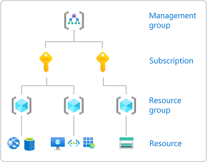
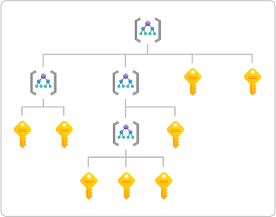
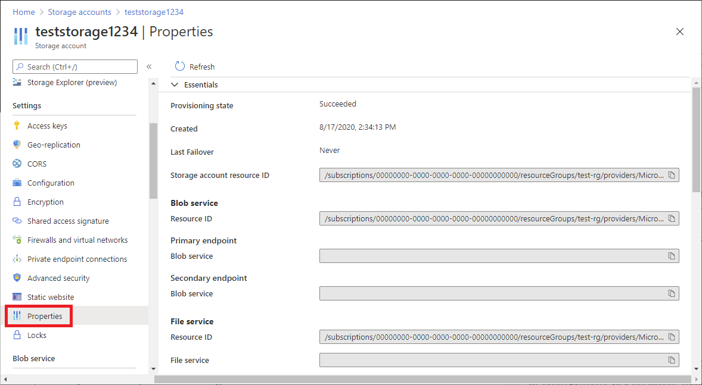

# Understand scope for Azure RBAC

*Scope* is the set of resources that access applies to. When you assign a role, it's important to understand scope so that you can grant a security principal just the access that it really needs. By limiting the scope, you limit what resources are at risk if the security principal is ever compromised.

## Scope levels

In Azure, you can specify a scope at four levels: [management group](../governance/management-groups/overview.md), subscription, [resource group](../azure-resource-manager/management/overview.md#resource-groups), and resource. Scopes are structured in a parent-child relationship. Each level of hierarchy makes the scope more specific. You can assign roles at any of these levels of scope. The level you select determines how widely the role is applied. Lower levels inherit role permissions from higher levels. 



Management groups are a level of scope above subscriptions, but management groups support more complex hierarchies. The following diagram shows an example of a hierarchy of management groups and subscriptions that you can define. For more information about management groups, see [What are Azure management groups?](../governance/management-groups/overview.md).



## Scope format

If you assign roles using the command line, you'll need to specify the scope. For command-line tools, scope is a potentially long string that identifies the exact scope of the role assignment. In the Azure portal, this scope is typically listed as the *resource ID*.

The scope consists of a series of identifiers separated by the slash (/) character. You can think of this string as expressing the following hierarchy, where text without placeholders (`{}`) are fixed identifiers:

```
/subscriptions
    /{subscriptionId}
        /resourcegroups
            /{resourceGroupName}
                /providers
                    /{providerName}
                        /{resourceType}
                            /{resourceSubType1}
                                /{resourceSubType2}
                                    /{resourceName}
```

- `{subscriptionId}` is the ID of the subscription to use (a GUID).
- `{resourcesGroupName}` is the name of the containing resource group.
- `{providerName}` is the name of the [resource provider](../azure-resource-manager/management/azure-services-resource-providers.md) that handles the resource, then `{resourceType}` and `{resourceSubType*}` identify further levels within that resource provider.
- `{resourceName}` is the last part of the string that identifies a specific resource.

Management groups are a level above subscriptions and have the broadest (least specific) scope. Role assignments at this level apply to subscriptions within the management group. The scope for a management group has the following format:

```
/providers
    /Microsoft.Management
        /managementGroups
            /{managmentGroupName}
```

## Scope examples

> [!div class="mx-tableFixed"]
> | Scope | Example |
> | --- | --- |
> | Management group | `/providers/Microsoft.Management/managementGroups/marketing-group` |
> | Subscription | `/subscriptions/00000000-0000-0000-0000-000000000000` |
> | Resource group | `/subscriptions/00000000-0000-0000-0000-000000000000/resourceGroups/Example-Storage-rg` |
> |  | `/subscriptions/00000000-0000-0000-0000-000000000000/resourceGroups/pharma-sales` |
> | Resource | `/subscriptions/00000000-0000-0000-0000-000000000000/resourceGroups/Example-Storage-rg/providers/Microsoft.Storage/storageAccounts/azurestorage12345/blobServices/default/containers/blob-container-01` |
> |  | `/subscriptions/00000000-0000-0000-0000-000000000000/resourceGroups/MyVirtualNetworkResourceGroup/providers/Microsoft.Network/virtualNetworks/MyVirtualNetwork12345` |

## How to determine the scope for a resource

It's fairly simple to determine the scope for a management group, subscription, or resource group. You just need to know the name and the subscription ID. However, determining the scope for a resource takes a little more work. Here are a couple ways that you can determine the scope for a resource.

- In the Azure portal, open the resource and then look at the properties. The resource should list the **Resource ID** where you can determine the scope. For example, here are the resource IDs for a storage account.

    

- Another way is to use the Azure portal to assign a role temporarily at the resource scope and then use [Azure PowerShell](role-assignments-list-powershell.md) or [Azure CLI](role-assignments-list-cli.md) to list the role assignment. In the output, the scope will be listed as a property.

    ```azurepowershell
    RoleAssignmentId   : /subscriptions/<subscriptionId>/resourceGroups/test-rg/providers/Microsoft.Storage/storageAccounts/azurestorage12345/blobServices/default/containers/blob-container-01/pro
                         viders/Microsoft.Authorization/roleAssignments/<roleAssignmentId>
    Scope              : /subscriptions/<subscriptionId>/resourceGroups/test-rg/providers/Microsoft.Storage/storageAccounts/azurestorage12345/blobServices/default/containers/blob-container-01
    DisplayName        : User
    SignInName         : user@contoso.com
    RoleDefinitionName : Storage Blob Data Reader
    RoleDefinitionId   : 2a2b9908-6ea1-4ae2-8e65-a410df84e7d1
    ObjectId           : <principalId>
    ObjectType         : User
    CanDelegate        : False
    Description        :
    ConditionVersion   :
    Condition          :
    ```

    ```azurecli
    {
        "canDelegate": null,
        "condition": null,
        "conditionVersion": null,
        "description": null,
        "id": "/subscriptions/{subscriptionId}/resourceGroups/Example-Storage-rg/providers/Microsoft.Storage/storageAccounts/azurestorage12345/blobServices/default/containers/blob-container-01/providers/Microsoft.Authorization/roleAssignments/{roleAssignmentId}",
        "name": "{roleAssignmentId}",
        "principalId": "{principalId}",
        "principalName": "user@contoso.com",
        "principalType": "User",
        "resourceGroup": "test-rg",
        "roleDefinitionId": "/subscriptions/{subscriptionId}/providers/Microsoft.Authorization/roleDefinitions/2a2b9908-6ea1-4ae2-8e65-a410df84e7d1",
        "roleDefinitionName": "Storage Blob Data Reader",
        "scope": "/subscriptions/{subscriptionId}/resourceGroups/Example-Storage-rg/providers/Microsoft.Storage/storageAccounts/azurestorage12345/blobServices/default/containers/blob-container-01",
        "type": "Microsoft.Authorization/roleAssignments"
      }
    ```

## Scope and ARM templates

A role assignment is a special type in Azure Resource Manager called an *extension resource*. An extension resource is a resource that adds to another resource's capabilities. They always exist as an extension (like a child) of another resource. For example, a role assignment at subscription scope is an extension resource of the subscription. The name of a role assignment is always the name of the resource you are extending plus `/Microsoft.Authorization/roleAssignments/{roleAssignmentId}`. When assigning roles using Azure Resource Manager template (ARM template), you typically don't need to provide the scope. The reason is that the scope field ends up always being the ID of the resource you are extending. The scope can be determined from the ID of the role assignment itself. The following table shows examples of a role assignment ID and the corresponding scope:

> [!div class="mx-tableFixed"]
> | Role assignment ID | Scope |
> | --- | --- |
> | `/subscriptions/{subscriptionId}/providers/Microsoft.Authorization/roleAssignments/{roleAssignmentId}` | `/subscriptions/{subscriptionId}` |
> | `/subscriptions/{subscriptionId}/resourceGroups/Example-Storage-rg/providers/Microsoft.Authorization/roleAssignments/{roleAssignmentId}` | `/subscriptions/{subscriptionId}/resourceGroups/Example-Storage-rg` |

For more information about scope and ARM templates, see [Assign Azure roles using Azure Resource Manager templates](role-assignments-template.md). For a full list of extension resource types, see [Resource types that extend capabilities of other resources](../azure-resource-manager/management/extension-resource-types.md).

## Next steps

- [Steps to assign an Azure role](role-assignments-steps.md)
- [Resource providers for Azure services](../azure-resource-manager/management/azure-services-resource-providers.md)
- [What are Azure management groups?](../governance/management-groups/overview.md)
