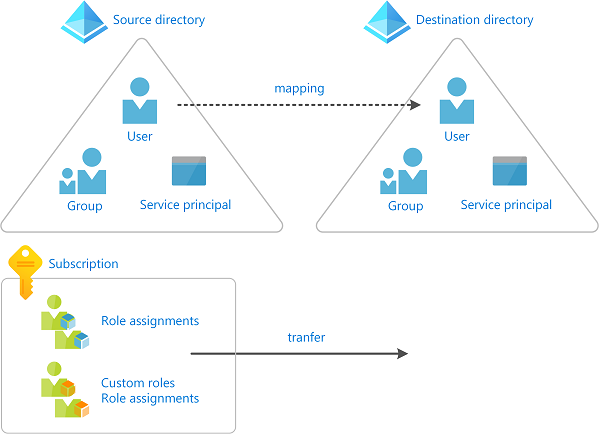

# Transfer an Azure subscription to a different Microsoft Entra directory

Organizations might have several Azure subscriptions. Each subscription is associated with a particular Microsoft Entra directory. To make management easier, you might want to transfer a subscription to a different Microsoft Entra directory. When you transfer a subscription to a different Microsoft Entra directory, some resources are not transferred to the target directory. For example, all role assignments and custom roles in Azure role-based access control (Azure RBAC) are **permanently** deleted from the source directory and are not transferred to the target directory.

This article describes the basic steps you can follow to transfer a subscription to a different Microsoft Entra directory and re-create some of the resources after the transfer.

If you want to instead **block** the transfer of subscriptions to different directories in your organization, you can configure a subscription policy. For more information, see [Manage Azure subscription policies](../cost-management-billing/manage/manage-azure-subscription-policy.md).

> [!NOTE]
> For Azure Cloud Solution Providers (CSP) subscriptions, changing the Microsoft Entra directory for the subscription isn't supported.

## Overview

Transferring an Azure subscription to a different Microsoft Entra directory is a complex process that must be carefully planned and executed. Many Azure services require security principals (identities) to operate normally or even manage other Azure resources. This article tries to cover most of the Azure services that depend heavily on security principals, but is not comprehensive.

> [!IMPORTANT]
> In some scenarios, transferring a subscription might require downtime to complete the process. Careful planning is required to assess whether downtime will be required for your transfer.

The following diagram shows the basic steps you must follow when you transfer a subscription to a different directory.

1. Prepare for the transfer

1. Transfer the Azure subscription to a different directory

1. Re-create resources in the target directory such as role assignments, custom roles, and managed identities

    

### Deciding whether to transfer a subscription to a different directory

The following are some reasons why you might want to transfer a subscription:

- Because of a company merger or acquisition, you want to manage an acquired subscription in your primary Microsoft Entra directory.
- Someone in your organization created a subscription and you want to consolidate management to a particular Microsoft Entra directory.
- You have applications that depend on a particular subscription ID or URL and it isn't easy to modify the application configuration or code.
- A portion of your business has been split into a separate company and you need to move some of your resources into a different Microsoft Entra directory.
- You want to manage some of your resources in a different Microsoft Entra directory for security isolation purposes.

### Alternate approaches

Transferring a subscription requires downtime to complete the process. Depending on your scenario, you can consider the following alternate approaches:

- Re-create the resources and copy data to the target directory and subscription.
- Adopt a multi-directory architecture and leave the subscription in the source directory. Use Azure Lighthouse to delegate resources so that users in the target directory can access the subscription in the source directory. For more information, see [Azure Lighthouse in enterprise scenarios](../lighthouse/concepts/enterprise.md).

### Understand the impact of transferring a subscription

Several Azure resources have a dependency on a subscription or a directory. Depending on your situation, the following table lists the known impact of transferring a subscription. By performing the steps in this article, you can re-create some of the resources that existed prior to the subscription transfer.

> [!IMPORTANT]
> This section lists the known Azure services or resources that depend on your subscription. Because resource types in Azure are constantly evolving, there might be additional dependencies not listed here that can cause a breaking change to your environment. 

| Service or resource | Impacted | Recoverable | Are you impacted? | What you can do |
| --------- | --------- | --------- | --------- | --------- |
| Role assignments | Yes | Yes | [List role assignments](#save-all-role-assignments) | All role assignments are permanently deleted. You must map users, groups, and service principals to corresponding objects in the target directory. You must re-create the role assignments. |
| Custom roles | Yes | Yes | [List custom roles](#save-custom-roles) | All custom roles are permanently deleted. You must re-create the custom roles and any role assignments. |
| System-assigned managed identities | Yes | Yes | [List managed identities](#list-role-assignments-for-managed-identities) | You must disable and re-enable the managed identities. You must re-create the role assignments. |
| User-assigned managed identities | Yes | Yes | [List managed identities](#list-role-assignments-for-managed-identities) | You must delete, re-create, and attach the managed identities to the appropriate resource. You must re-create the role assignments. |
| Azure Key Vault | Yes | Yes | [List Key Vault access policies](#list-key-vaults) | You must update the tenant ID associated with the key vaults. You must remove and add new access policies. |
| Azure SQL databases with Microsoft Entra authentication integration enabled | Yes | No | [Check Azure SQL databases with Microsoft Entra authentication](#list-azure-sql-databases-with-azure-ad-authentication) | You cannot transfer an Azure SQL database with Microsoft Entra authentication enabled to a different directory. For more information, see [Use Microsoft Entra authentication](/azure/azure-sql/database/authentication-aad-overview). |
| Azure database for MySQL with Microsoft Entra authentication integration enabled | Yes | No |  | You cannot transfer an Azure database for MySQL (Single and Flexible server) with Microsoft Entra authentication enabled to a different directory. | 
| Azure Storage and Azure Data Lake Storage Gen2 | Yes | Yes |  | You must re-create any ACLs. |
| Azure Data Lake Storage Gen1 | Yes | Yes |  | You must re-create any ACLs. |
| Azure Files | Yes | Yes |  | You must re-create any ACLs. |
| Azure File Sync | Yes | Yes |  | The storage sync service and/or storage account can be moved to a different directory. For more information, see [Frequently asked questions (FAQ) about Azure Files](../storage/files/storage-files-faq.md#azure-file-sync) |
| Azure Managed Disks | Yes | Yes |  |  If you are using Disk Encryption Sets to encrypt Managed Disks with customer-managed keys, you must disable and re-enable the system-assigned identities associated with Disk Encryption Sets. And you must re-create the role assignments i.e. again grant required permissions to Disk Encryption Sets in the Key Vaults. |
| Azure Kubernetes Service | Yes | No |  | You cannot transfer your AKS cluster and its associated resources to a different directory. For more information, see [Frequently asked questions about Azure Kubernetes Service (AKS)](../aks/faq.md) |
| Azure Policy | Yes | No | All Azure Policy objects, including custom definitions, assignments, exemptions, and compliance data. | You must [export](../governance/policy/how-to/export-resources.md), import, and re-assign definitions. Then, create new policy assignments and any needed [policy exemptions](../governance/policy/concepts/exemption-structure.md). |
| Microsoft Entra Domain Services | Yes | No |  | You cannot transfer a Microsoft Entra Domain Services managed domain to a different directory. For more information, see [Frequently asked questions (FAQs) about Microsoft Entra Domain Services](../active-directory-domain-services/faqs.yml) |
| App registrations | Yes | Yes |  |  |
| Microsoft Dev Box | Yes | No | | You cannot transfer a dev box and its associated resources to a different directory. Once a subscription moves to another tenant, you will not be able to perform any actions on your dev box |
| Azure Deployment Environments | Yes | No | | You cannot transfer an environment and its associated resources to a different directory. Once a subscription moves to another tenant, you will not be able to perform any actions on your environment |
| Azure Service Bus | Yes | Yes | |You must delete, re-create, and attach the managed identities to the appropriate resource. You must re-create the role assignments. |
| Azure Synapse Analytics Workspace | Yes | Yes |  | You must update the tenant ID associated with the Synapse Analytics Workspace. If the workspace is associated with a Git repository, you must update the [workspace's Git configuration](../synapse-analytics/cicd/source-control.md#switch-to-a-different-git-repository). For more information, see [Recovering Synapse Analytics workspace after transferring a subscription to a different Microsoft Entra directory (tenant)](../synapse-analytics/how-to-recover-workspace-after-tenant-move.md). |

> [!WARNING]
> If you are using encryption at rest for a resource, such as a storage account or SQL database, that has a dependency on a key vault that is being transferred, it can lead to an unrecoverable scenario. If you have this situation, you should take steps to use a different key vault or temporarily disable customer-managed keys to avoid this unrecoverable scenario.

To get a list of some of the Azure resources that are impacted when you transfer a subscription, you can also run a query in [Azure Resource Graph](../governance/resource-graph/overview.md). For a sample query, see [List impacted resources when transferring an Azure subscription](../governance/resource-graph/samples/samples-by-category.md#list-impacted-resources-when-transferring-an-azure-subscription).

## Prerequisites

To complete these steps, you will need:

- [Bash in Azure Cloud Shell](../cloud-shell/overview.md) or [Azure CLI](/cli/azure)
- Account Administrator of the subscription you want to transfer in the source directory
- A user account in both the source and target directory for the user making the directory change

## Step 1: Prepare for the transfer

### Sign in to source directory

1. Sign in to Azure as an administrator.

1. Get a list of your subscriptions with the [az account list](/cli/azure/account#az-account-list) command.

    ```azurecli
    az account list --output table
    ```

1. Use [az account set](/cli/azure/account#az-account-set) to set the active subscription you want to transfer.

    ```azurecli
    az account set --subscription "Marketing"
    ```

### Install the Azure Resource Graph extension

 The Azure CLI extension for [Azure Resource Graph](../governance/resource-graph/index.yml), *resource-graph*, enables you to use the [az graph](/cli/azure/graph) command to query resources managed by Azure Resource Manager. You'll use this command in later steps.

1. Use [az extension list](/cli/azure/extension#az-extension-list) to see if you have the *resource-graph* extension installed.

    ```azurecli
    az extension list
    ```

1. If you are using a preview version or an older version of the *resource-graph* extension, use [az extension update](/cli/azure/extension#az-extension-update) to update the extension.

    ```azurecli
    az extension update --name resource-graph
    ```

1. If the *resource-graph* extension is not installed, use [az extension add](/cli/azure/extension#az-extension-add) to install the extension.

    ```azurecli
    az extension add --name resource-graph
    ```

### Save all role assignments

1. Use [az role assignment list](/cli/azure/role/assignment#az-role-assignment-list) to list all the role assignments (including inherited role assignments).

    To make it easier to review the list, you can export the output as JSON, TSV, or a table. For more information, see [List role assignments using Azure RBAC and Azure CLI](role-assignments-list-cli.md).

    ```azurecli
    az role assignment list --all --include-inherited --output json > roleassignments.json
    az role assignment list --all --include-inherited --output tsv > roleassignments.tsv
    az role assignment list --all --include-inherited --output table > roleassignments.txt
    ```

1. Save the list of role assignments.

    When you transfer a subscription, all of the role assignments are **permanently** deleted so it is important to save a copy.

1. Review the list of role assignments. There might be role assignments you won't need in the target directory.

### Save custom roles

1. Use the [az role definition list](/cli/azure/role/definition#az-role-definition-list) to list your custom roles. For more information, see [Create or update Azure custom roles using Azure CLI](custom-roles-cli.md).

    ```azurecli
    az role definition list --custom-role-only true --output json --query '[].{roleName:roleName, roleType:roleType}'
    ```

1. Save each custom role that you will need in the target directory as a separate JSON file.

    ```azurecli
    az role definition list --name <custom_role_name> > customrolename.json
    ```

1. Make copies of the custom role files.

1. Modify each copy to use the following format.

    You'll use these files later to re-create the custom roles in the target directory.

    ```json
    {
      "Name": "",
      "Description": "",
      "Actions": [],
      "NotActions": [],
      "DataActions": [],
      "NotDataActions": [],
      "AssignableScopes": []
    }
    ```

### Determine user, group, and service principal mappings

1. Based on your list of role assignments, determine the users, groups, and service principals you will map to in the target directory.

    You can identify the type of principal by looking at the `principalType` property in each role assignment.

1. If necessary, in the target directory, create any users, groups, or service principals you will need.

### List role assignments for managed identities

Managed identities do not get updated when a subscription is transferred to another directory. As a result, any existing system-assigned or user-assigned managed identities will be broken. After the transfer, you can re-enable any system-assigned managed identities. For user-assigned managed identities, you will have to re-create and attach them in the target directory.

1. Review the [list of Azure services that support managed identities](../active-directory/managed-identities-azure-resources/services-support-managed-identities.md) to note where you might be using managed identities.

1. Use [az ad sp list](/cli/azure/ad/sp#az-ad-sp-list) to list your system-assigned and user-assigned managed identities.

    ```azurecli
    az ad sp list --all --filter "servicePrincipalType eq 'ManagedIdentity'"
    ```

1. In the list of managed identities, determine which are system-assigned and which are user-assigned. You can use the following criteria to determine the type.

    | Criteria | Managed identity type |
    | --- | --- |
    | `alternativeNames` property includes `isExplicit=False` | System-assigned |
    | `alternativeNames` property does not include `isExplicit` | System-assigned |
    | `alternativeNames` property includes `isExplicit=True` | User-assigned |

    You can also use [az identity list](/cli/azure/identity#az-identity-list) to just list user-assigned managed identities. For more information, see [Create, list, or delete a user-assigned managed identity using the Azure CLI](../active-directory/managed-identities-azure-resources/how-to-manage-ua-identity-cli.md).

    ```azurecli
    az identity list
    ```

1. Get a list of the `objectId` values for your managed identities.

1. Search your list of role assignments to see if there are any role assignments for your managed identities.

### List key vaults

When you create a key vault, it is automatically tied to the default Microsoft Entra tenant ID for the subscription in which it is created. All access policy entries are also tied to this tenant ID. For more information, see [Moving an Azure Key Vault to another subscription](../key-vault/general/move-subscription.md).

> [!WARNING]
> If you are using encryption at rest for a resource, such as a storage account or SQL database, that has a dependency on a key vault that is being transferred, it can lead to an unrecoverable scenario. If you have this situation, you should take steps to use a different key vault or temporarily disable customer-managed keys to avoid this unrecoverable scenario.

- If you have a key vault, use [az keyvault show](/cli/azure/keyvault#az-keyvault-show) to list the access policies. For more information, see [Assign a Key Vault access policy](../key-vault/general/assign-access-policy-cli.md).

    ```azurecli
    az keyvault show --name MyKeyVault
    ```

<a name='list-azure-sql-databases-with-azure-ad-authentication'></a>

### List Azure SQL databases with Microsoft Entra authentication

- Use [az sql server ad-admin list](/cli/azure/sql/server/ad-admin#az-sql-server-ad-admin-list) and the [az graph](/cli/azure/graph) extension to see if you are using Azure SQL databases with Microsoft Entra authentication integration enabled. For more information, see [Configure and manage Microsoft Entra authentication with SQL](/azure/azure-sql/database/authentication-aad-configure).

    ```azurecli
    az sql server ad-admin list --ids $(az graph query -q "resources | where type == 'microsoft.sql/servers' | project id" --query data[*].[id] -o tsv)
    ```

### List ACLs

1. If you are using Azure Data Lake Storage Gen1, list the ACLs that are applied to any file by using the Azure portal or PowerShell.

1. If you are using Azure Data Lake Storage Gen2, list the ACLs that are applied to any file by using the Azure portal or PowerShell.

1. If you are using Azure Files, list the ACLs that are applied to any file.

### List other known resources

1. Use [az account show](/cli/azure/account#az-account-show) to get your subscription ID (in `bash`).

    ```azurecli
    subscriptionId=$(az account show --output tsv --query id)
    ```
    
1. Use the [az graph](/cli/azure/graph) extension to list other Azure resources with known Microsoft Entra directory dependencies (in `bash`).

    ```azurecli
    az graph query -q 'resources 
        | where type != "microsoft.azureactivedirectory/b2cdirectories" 
        | where  identity <> "" or properties.tenantId <> "" or properties.encryptionSettingsCollection.enabled == true 
        | project name, type, kind, identity, tenantId, properties.tenantId' --subscriptions $subscriptionId --output yaml
    ```

## Step 2: Transfer the subscription

In this step, you transfer the subscription from the source directory to the target directory. The steps will be different depending on whether you want to also transfer the billing ownership.

> [!WARNING]
> When you transfer the subscription, all role assignments in the source directory are **permanently** deleted and cannot be restored. You cannot go back once you transfer the subscription. Be sure you complete the previous steps before performing this step.

1. Determine whether you want to also transfer the billing ownership to another account.

1. Transfer the subscription to a different directory.

    - If you want to keep the current billing ownership, follow the steps in [Associate or add an Azure subscription to your Microsoft Entra tenant](../active-directory/fundamentals/active-directory-how-subscriptions-associated-directory.md).
    - If you want to also transfer the billing ownership, follow the steps in [Transfer billing ownership of an Azure subscription to another account](../cost-management-billing/manage/billing-subscription-transfer.md). To transfer the subscription to a different directory, you must check the **Subscription Microsoft Entra tenant** check box.

1. Once you finish transferring the subscription, return back to this article to re-create the resources in the target directory.

## Step 3: Re-create resources

### Sign in to target directory

1. In the target directory, sign in as the user that accepted the transfer request.

    Only the user in the new account who accepted the transfer request will have access to manage the resources.

1. Get a list of your subscriptions with the [az account list](/cli/azure/account#az-account-list) command.

    ```azurecli
    az account list --output table
    ```

1. Use [az account set](/cli/azure/account#az-account-set) to set the active subscription you want to use.

    ```azurecli
    az account set --subscription "Contoso"
    ```

### Create custom roles
        
- Use [az role definition create](/cli/azure/role/definition#az-role-definition-create) to create each custom role from the files you created earlier. For more information, see [Create or update Azure custom roles using Azure CLI](custom-roles-cli.md).

    ```azurecli
    az role definition create --role-definition <role_definition>
    ```

### Assign roles

- Use [az role assignment create](/cli/azure/role/assignment#az-role-assignment-create) to assign roles to users, groups, and service principals. For more information, see [Assign Azure roles using Azure CLI](role-assignments-cli.md).

    ```azurecli
    az role assignment create --role <role_name_or_id> --assignee <assignee> --resource-group <resource_group>
    ```

### Update system-assigned managed identities

1. Disable and re-enable system-assigned managed identities.

    | Azure service | More information | 
    | --- | --- |
    | Virtual machines | [Configure managed identities for Azure resources on an Azure VM using Azure CLI](../active-directory/managed-identities-azure-resources/qs-configure-cli-windows-vm.md#system-assigned-managed-identity) |
    | Virtual machine scale sets | [Configure managed identities for Azure resources on a virtual machine scale set using Azure CLI](../active-directory/managed-identities-azure-resources/qs-configure-cli-windows-vmss.md#system-assigned-managed-identity) |
    | Other services | [Services that support managed identities for Azure resources](../active-directory/managed-identities-azure-resources/services-support-managed-identities.md) |

1. Use [az role assignment create](/cli/azure/role/assignment#az-role-assignment-create) to assign roles to system-assigned managed identities. For more information, see [Assign a managed identity access to a resource using Azure CLI](../active-directory/managed-identities-azure-resources/howto-assign-access-cli.md).

    ```azurecli
    az role assignment create --assignee <objectid> --role '<role_name_or_id>' --scope <scope>
    ```

### Update user-assigned managed identities

1. Delete, re-create, and attach user-assigned managed identities.

    | Azure service | More information | 
    | --- | --- |
    | Virtual machines | [Configure managed identities for Azure resources on an Azure VM using Azure CLI](../active-directory/managed-identities-azure-resources/qs-configure-cli-windows-vm.md#user-assigned-managed-identity) |
    | Virtual machine scale sets | [Configure managed identities for Azure resources on a virtual machine scale set using Azure CLI](../active-directory/managed-identities-azure-resources/qs-configure-cli-windows-vmss.md#user-assigned-managed-identity) |
    | Other services | [Services that support managed identities for Azure resources](../active-directory/managed-identities-azure-resources/services-support-managed-identities.md)<br/>[Create, list, or delete a user-assigned managed identity using the Azure CLI](../active-directory/managed-identities-azure-resources/how-to-manage-ua-identity-cli.md) |

1. Use [az role assignment create](/cli/azure/role/assignment#az-role-assignment-create) to assign roles to user-assigned managed identities. For more information, see [Assign a managed identity access to a resource using Azure CLI](../active-directory/managed-identities-azure-resources/howto-assign-access-cli.md).

    ```azurecli
    az role assignment create --assignee <objectid> --role '<role_name_or_id>' --scope <scope>
    ```

### Update key vaults

This section describes the basic steps to update your key vaults. For more information, see [Moving an Azure Key Vault to another subscription](../key-vault/general/move-subscription.md).

1. Update the tenant ID associated with all existing key vaults in the subscription to the target directory.

1. Remove all existing access policy entries.

1. Add new access policy entries associated with the target directory.

### Update ACLs

1. If you are using Azure Data Lake Storage Gen1, assign the appropriate ACLs. For more information, see [Securing data stored in Azure Data Lake Storage Gen1](../data-lake-store/data-lake-store-secure-data.md).

1. If you are using Azure Data Lake Storage Gen2, assign the appropriate ACLs. For more information, see [Access control in Azure Data Lake Storage Gen2](../storage/blobs/data-lake-storage-access-control.md).

1. If you are using Azure Files, assign the appropriate ACLs.

### Review other security methods

Even though role assignments are removed during the transfer, users in the original owner account might continue to have access to the subscription through other security methods, including:

- Access keys for services like Storage.
- [Management certificates](../cloud-services/cloud-services-certs-create.md) that grant the user administrator access to subscription resources.
- Remote Access credentials for services like Azure Virtual Machines.

If your intent is to remove access from users in the source directory so that they don't have access in the target directory, you should consider rotating any credentials. Until the credentials are updated, users will continue to have access after the transfer.

1. Rotate storage account access keys. For more information, see [Manage storage account access keys](../storage/common/storage-account-keys-manage.md).

1. If you are using access keys for other services such as Azure SQL Database or Azure Service Bus Messaging, rotate access keys.

1. For resources that use secrets, open the settings for the resource and update the secret.

1. For resources that use certificates, update the certificate.

## Next steps

- [Transfer billing ownership of an Azure subscription to another account](../cost-management-billing/manage/billing-subscription-transfer.md)
- [Transfer Azure subscriptions between subscribers and CSPs](../cost-management-billing/manage/transfer-subscriptions-subscribers-csp.md)
- [Associate or add an Azure subscription to your Microsoft Entra tenant](../active-directory/fundamentals/active-directory-how-subscriptions-associated-directory.md)
- [Azure Lighthouse in enterprise scenarios](../lighthouse/concepts/enterprise.md)
