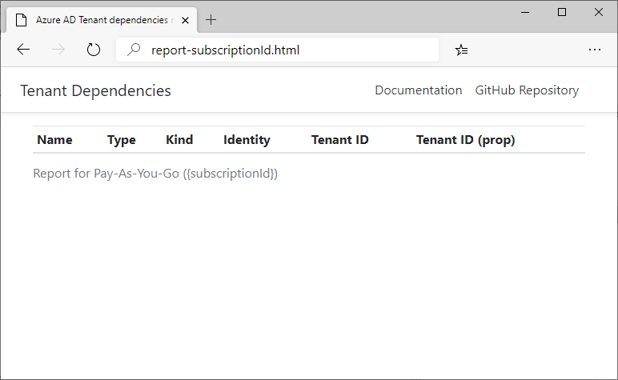

# Transfer an Azure subscription to a different Azure AD directory (Preview)

> [!IMPORTANT]
> Following these steps to transfer a subscription is currently in public preview.
> This preview version is provided without a service level agreement, and it's not recommended for production workloads. Certain features might not be supported or might have constrained capabilities.
> For more information, see [Supplemental Terms of Use for Microsoft Azure Previews](https://azure.microsoft.com/support/legal/preview-supplemental-terms/).

When you transfer an Azure subscription to a different Azure Active Directory (Azure AD) directory, some artifacts are not transferred to the destination directory. For example, all role assignments in Azure role-based access control (Azure RBAC) are by default **permanently** deleted from the source directory and are not be transferred to the destination directory. Also, managed identities do not get updated. To retain your custom role definitions and role assignments and to ensure you managed identities still work, you must take additional steps.

This article describes the procedure and scripts you can use to transfer your subscription to different Azure AD directory and still maintain your custom roles, role assignments, and managed identities.

## Understand the impact of transferring a subscription

Depending on your situation, the following table lists the impact of transferring a subscription.

| You are using  | Impact of a transfer  | What you can do  |
| --------- | --------- | --------- |
| Role assignments for any of the following: **Service Principal**, **SQL Azure**, **Managed Identity** | All role assignments are permanently deleted from the source directory and will not be transferred to the destination directory. | Currently, there is not a procedure for this scenario. You must investigate the impact of these role assignment deletions. |
| Role assignments for the following: **Key Vault** | All role assignments are permanently deleted from the source directory and will not be transferred to the destination directory. |You must manually re-create the custom role definitions and role assignments in the destination directory. |
| Role assignments for any of the following: **User**, **Group** | All role assignments are permanently deleted from the source directory and will not be transferred to the destination directory. | Before initiating the transfer, follow the instructions in this article to transfer your role assignments to the destination directory. |
| Custom roles | All custom role definitions and role assignments are permanently deleted from the source directory and will not be transferred to the destination directory. | You must manually re-create the custom role definitions and role assignments in the destination directory. |

## What gets transferred?

The following table lists the artifacts that will get transferred when you follow the steps in this article.

| Artifact | Transfer |
| --------- | :---------: |
| Role assignments for built-in roles | Yes |
| Role assignments for users | Yes |
| Role assignments for groups | No |
| Role assignments for service principals | No |
| Role assignments for SQL Azure | No |
| Role assignments for managed identities | Yes |
| Role assignments for applications | No |
| Custom role definitions | Yes |
| Role assignments for custom roles | Yes |

## Overview of transfer process


## Prerequisites

To complete these steps, you will need:

- Role in the source directory that can read all users and all service principals
- [Owner](built-in-roles.md#owner) role in the destination directory

## Step 1: Clean up source directory

You can't skip the transfer of some role assignments. If you do not want a role assignment to be transferred, you must delete it prior to the transfer.

1. Sign into the Azure portal for the source directory.

1. Open the subscription you want to transfer.

1. Delete any role assignments that you no longer need or do not want to transfer.

## Step 2: Save data and generate a report about source directory

In this step, you save data about the following artifacts:

- Azure custom role definitions
- Azure custom role assignments
- Azure role assignments
    - User objects are saved using e-mail address
    - User-assigned or system-assigned managed identities
    - (Service principals and groups are not preserved)

In this step, you also generate an HTML report that includes the following information:

- List of resources that have a dependency on the directory
- List of Azure SQL Databases with configured Azure AD authentication
- List of Azure role assignments

1. In the source directory, open Cloud Shell in a Bash session.

1. Run the following command to ensure you are set to the subscription you want to transfer.

    ```bash
    az account set --subscription {subscriptionId}
    ```

1. To generate a report, run the following command.

    ```bash
    curl -L https://aka.ms/as/dirchange | bash
    ```

    ```bash
    The output will be similar to the following:
    Azure:~$ curl -L https://aka.ms/as/dirchange | bash
      % Total    % Received % Xferd  Average Speed   Time    Time     Time  Current
                                     Dload  Upload   Total   Spent    Left  Speed
      0     0    0     0    0     0      0      0 --:--:-- --:--:-- --:--:--     0
    100   273  100   273    0     0    231      0  0:00:01  0:00:01 --:--:--   231
    Archive:  tmp.zip
      inflating: apply-rbac.py
      inflating: check-aad-deps.sh
      inflating: dump-rbac.py
    Checking for graph extension on Azure CLI...
    --------------------------------------------
    Graph extension is already installed...
    
    Azure resources with known Azure AD Tenant dependencies:
    --------------------------------------------------------
    
    
    Azure SQL Servers with Azrue AD Authentication
    ----------------------------------------------
    az sql server ad-admin list: error: argument --ids: expected at least one argument
    usage: az sql server ad-admin list [-h] [--verbose] [--debug]
                                       [--output {json,jsonc,table,tsv,yaml,yamlc,none}]
                                       [--query JMESPATH]
                                       [--subscription _SUBSCRIPTION]
                                       [--resource-group RESOURCE_GROUP_NAME]
                                       [--server-name SERVER_NAME]
                                       [--ids ID [ID ...]]
    RBAC role assignments:
    ----------------------
    Principal                             Role                 Scope
    ------------------------------------  -------------------  ---------------------------------------------------
    alain@contoso.com                     Billing Reader Plus  /subscriptions/{subscriptionId}
    alain@contoso.com                     Owner                /subscriptions/{subscriptionId}
    admin1@contoso.com                    Owner                /subscriptions/{subscriptionId}
    alain@contoso.com                     Billing Reader       /subscriptions/{subscriptionId}
    Writing custom RBAC roles ...
    Getting rbac assignments ...
    Matching assignments ...
    Download report from '/clouddrive/dirchange-{subscriptionId}/report-{subscriptionId}.html'
    ```

## Step 3: View data and report

In this step, you view the data and report about the source directory.

1. Open the the clouddrive/dirchange-{subscriptionId} folder.

1. View the groups_mapping.csv.

    ```
    GroupName,GroupObjectId,NewGroupObjectId
    ```

1. View rbac_custom_roles.json.

    ```json
    [
        {
            "description": "Read billing data and download invoices",
            "type": "Microsoft.Authorization/roleDefinitions",
            "name": "{name}",
            "assignableScopes": [
                "/subscriptions/{subscriptionId}"
            ],
            "permissions": [
                {
                    "notActions": [
                        "Microsoft.CostManagement/exports/delete"
                    ],
                    "notDataActions": [],
                    "dataActions": [],
                    "actions": [
                        "Microsoft.Authorization/*/read",
                        "Microsoft.Billing/*/read",
                        "Microsoft.Commerce/*/read",
                        "Microsoft.Consumption/*/read",
                        "Microsoft.Management/managementGroups/read",
                        "Microsoft.CostManagement/*/read",
                        "Microsoft.CostManagement/exports/*",
                        "Microsoft.Billing/invoices/download/action"
                    ]
                }
            ],
            "id": "/subscriptions/{subscriptionId}/providers/Microsoft.Authorization/roleDefinitions/{name}",
            "roleName": "Billing Reader Plus",
            "roleType": "CustomRole"
        }
    ]
    ```

1. View rbac.json.

    ```json
    [
        {
            "scope": "/subscriptions/{subscriptionId}",
            "roleName": "Billing Reader Plus",
            "managedIdentityReosurceId": null,
            "principalId": "{principalId}",
            "principalEmail": null,
            "principalType": "User",
            "msiType": null
        },
        {
            "scope": "/subscriptions/{subscriptionId}",
            "roleName": "Owner",
            "managedIdentityReosurceId": null,
            "principalId": "{principalId}",
            "principalEmail": null,
            "principalType": "User",
            "msiType": null
        },
        {
            "scope": "/subscriptions/{subscriptionId}",
            "roleName": "Owner",
            "managedIdentityReosurceId": null,
            "principalId": "{principalId}",
            "principalEmail": null,
            "principalType": "User",
            "msiType": null
        },
        {
            "scope": "/subscriptions/{subscriptionId}",
            "roleName": "Owner",
            "managedIdentityReosurceId": null,
            "principalId": "{principalId}",
            "principalEmail": null,
            "principalType": "User",
            "msiType": null
        },
        {
            "scope": "/subscriptions/{subscriptionId}",
            "roleName": "Billing Reader",
            "managedIdentityReosurceId": null,
            "principalId": "{principalId}",
            "principalEmail": null,
            "principalType": "User",
            "msiType": null
        }
    ]
    ```

1. View report-{subscriptionId}.html.

    
    
## Step 4: Transfer billing ownership of the subscription

In this step, you transfer the billing ownership of the subscription from the source directory to the destination directory.

> [!IMPORTANT]
>
> When you transfer the billing ownership of the subscription, all role assignments in the source directory are **permanently** deleted and cannot be restored. Be sure you complete the previous steps before performing this step.

1. Follow the steps in [Transfer billing ownership of an Azure subscription to another account](../cost-management-billing/manage/billing-subscription-transfer.md).

1. Once you finish transferring ownership, return back to this article to restore the role assignments in the destination directory.

## Step 5: Restore data in destination directory


## Next steps

- [Transfer billing ownership of an Azure subscription to another account](../cost-management-billing/manage/billing-subscription-transfer.md)
- [Transfer Azure subscriptions between subscribers and CSPs](../cost-management-billing/manage/transfer-subscriptions-subscribers-csp.md)
- [Associate or add an Azure subscription to your Azure Active Directory tenant](../active-directory/fundamentals/active-directory-how-subscriptions-associated-directory.md)
