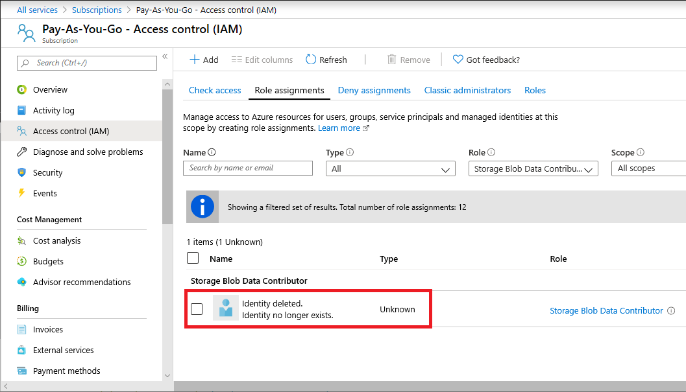
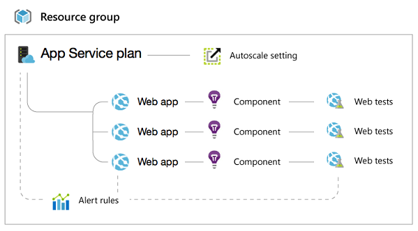
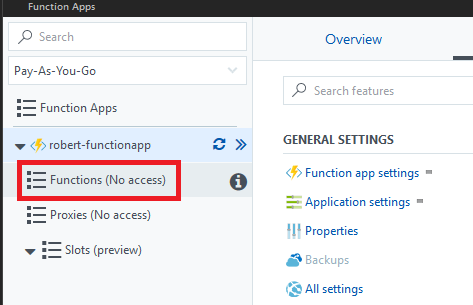

# Troubleshoot Azure RBAC

This article answers some common questions about Azure role-based access control (Azure RBAC), so that you know what to expect when using the roles and can troubleshoot access problems.

## Azure role assignments limit

Azure supports up to **2000** role assignments per subscription. This limit includes role assignments at the subscription, resource group, and resource scopes. If you get the error message "No more role assignments can be created (code: RoleAssignmentLimitExceeded)" when you try to assign a role, try to reduce the number of role assignments in the subscription.

> [!NOTE]
> The **2000** role assignments limit per subscription is fixed and cannot be increased.

If you are getting close to this limit, here are some ways that you can reduce the number of role assignments:

- Add users to groups and assign roles to the groups instead. 
- Combine multiple built-in roles with a custom role. 
- Make common role assignments at a higher scope, such as subscription or management group.
- If you have Azure AD Premium P2, make role assignments eligible in [Azure AD Privileged Identity Management](../active-directory/privileged-identity-management/pim-configure.md) instead of permanently assigned. 
- Add an additional subscription. 

To get the number of role assignments, you can view the [chart on the Access control (IAM) page](role-assignments-list-portal.md#list-number-of-role-assignments) in the Azure portal. You can also use the following Azure PowerShell commands:

```azurepowershell
$scope = "/subscriptions/<subscriptionId>"
$ras = Get-AzRoleAssignment -Scope $scope | Where-Object {$_.scope.StartsWith($scope)}
$ras.Count
```

## Problems with Azure role assignments

- If you are unable to add a role assignment in the Azure portal on **Access control (IAM)** because the **Add** > **Add role assignment** option is disabled or because you get the permissions error "The client with object id does not have authorization to perform action", check that you are currently signed in with a user that is assigned a role that has the `Microsoft.Authorization/roleAssignments/write` permission such as [Owner](built-in-roles.md#owner) or [User Access Administrator](built-in-roles.md#user-access-administrator) at the scope you are trying to assign the role.

## Problems with custom roles

- If you need steps for how to create a custom role, see the custom role tutorials using the [Azure portal](custom-roles-portal.md) (currently in preview), [Azure PowerShell](tutorial-custom-role-powershell.md), or [Azure CLI](tutorial-custom-role-cli.md).
- If you are unable to update an existing custom role, check that you are currently signed in with a user that is assigned a role that has the `Microsoft.Authorization/roleDefinition/write` permission such as [Owner](built-in-roles.md#owner) or [User Access Administrator](built-in-roles.md#user-access-administrator).
- If you are unable to delete a custom role and get the error message "There are existing role assignments referencing role (code: RoleDefinitionHasAssignments)", then there are role assignments still using the custom role. Remove those role assignments and try to delete the custom role again.
- If you get the error message "Role definition limit exceeded. No more role definitions can be created (code: RoleDefinitionLimitExceeded)" when you try to create a new custom role, delete any custom roles that aren't being used. Azure supports up to **5000** custom roles in a directory. (For Azure Germany and Azure China 21Vianet, the limit is 2000 custom roles.)
- If you get an error similar to "The client has permission to perform action 'Microsoft.Authorization/roleDefinitions/write' on scope '/subscriptions/{subscriptionid}', however the linked subscription was not found" when you try to update a custom role, check whether one or more [assignable scopes](role-definitions.md#assignablescopes) have been deleted in the directory. If the scope was deleted, then create a support ticket as there is no self-service solution available at this time.

## Custom roles and management groups

- You can only define one management group in `AssignableScopes` of a custom role. Adding a management group to `AssignableScopes` is currently in preview.
- Custom roles with `DataActions` cannot be assigned at the management group scope.
- Azure Resource Manager doesn't validate the management group's existence in the role definition's assignable scope.
- For more information about custom roles and management groups, see [Organize your resources with Azure management groups](../governance/management-groups/overview.md#custom-rbac-role-definition-and-assignment).

## Transferring a subscription to a different directory

- If you need steps for how to transfer a subscription to a different Azure AD directory, see [Transfer ownership of an Azure subscription to another account](../cost-management-billing/manage/billing-subscription-transfer.md).
- If you transfer a subscription to a different Azure AD directory, all role assignments are **permanently** deleted from the source Azure AD directory and are not migrated to the target Azure AD directory. You must re-create your role assignments in the target directory. You also have to manually recreate managed identities for Azure resources. For more information, see [FAQs and known issues with managed identities](../active-directory/managed-identities-azure-resources/known-issues.md).
- If you are an Azure AD Global Administrator and you don't have access to a subscription after it was transferred between directories, use the **Access management for Azure resources** toggle to temporarily [elevate your access](elevate-access-global-admin.md) to get access to the subscription.

## Issues with service admins or co-admins

- If you are having issues with Service administrator or Co-administrators, see [Add or change Azure subscription administrators](../cost-management-billing/manage/add-change-subscription-administrator.md) and [Classic subscription administrator roles, Azure roles, and Azure AD roles](rbac-and-directory-admin-roles.md).

## Access denied or permission errors

- If you get the permissions error "The client with object id does not have authorization to perform action over scope (code: AuthorizationFailed)" when you try to create a resource, check that you are currently signed in with a user that is assigned a role that has write permission to the resource at the selected scope. For example, to manage virtual machines in a resource group, you should have the [Virtual Machine Contributor](built-in-roles.md#virtual-machine-contributor) role on the resource group (or parent scope). For a list of the permissions for each built-in role, see [Azure built-in roles](built-in-roles.md).
- If you get the permissions error "You don't have permission to create a support request" when you try to create or update a support ticket, check that you are currently signed in with a user that is assigned a role that has the `Microsoft.Support/supportTickets/write` permission, such as [Support Request Contributor](built-in-roles.md#support-request-contributor).

## Role assignments with identity not found

In the list of role assignments for the Azure portal, you might notice that the security principal (user, group, service principal, or managed identity) is listed as **Identity not found** with an **Unknown** type.



The identity might not be found for two reasons:

- You recently invited a user when creating a role assignment
- You deleted a security principal that had a role assignment

If you recently invited a user when creating a role assignment, this security principal might still be in the replication process across regions. If so, wait a few moments and refresh the role assignments list.

However, if this security principal is not a recently invited user, it might be a deleted security principal. If you assign a role to a security principal and then you later delete that security principal without first removing the role assignment, the security principal will be listed as **Identity not found** and an **Unknown** type.

If you list this role assignment using Azure PowerShell, you might see an empty `DisplayName` and an `ObjectType` set to **Unknown**. For example, [Get-AzRoleAssignment](/powershell/module/az.resources/get-azroleassignment) returns a role assignment that is similar to the following output:

```
RoleAssignmentId   : /subscriptions/11111111-1111-1111-1111-111111111111/providers/Microsoft.Authorization/roleAssignments/22222222-2222-2222-2222-222222222222
Scope              : /subscriptions/11111111-1111-1111-1111-111111111111
DisplayName        :
SignInName         :
RoleDefinitionName : Storage Blob Data Contributor
RoleDefinitionId   : ba92f5b4-2d11-453d-a403-e96b0029c9fe
ObjectId           : 33333333-3333-3333-3333-333333333333
ObjectType         : Unknown
CanDelegate        : False
```

Similarly, if you list this role assignment using Azure CLI, you might see an empty `principalName`. For example, [az role assignment list](/cli/azure/role/assignment#az-role-assignment-list) returns a role assignment that is similar to the following output:

```
{
    "canDelegate": null,
    "id": "/subscriptions/11111111-1111-1111-1111-111111111111/providers/Microsoft.Authorization/roleAssignments/22222222-2222-2222-2222-222222222222",
    "name": "22222222-2222-2222-2222-222222222222",
    "principalId": "33333333-3333-3333-3333-333333333333",
    "principalName": "",
    "roleDefinitionId": "/subscriptions/11111111-1111-1111-1111-111111111111/providers/Microsoft.Authorization/roleDefinitions/ba92f5b4-2d11-453d-a403-e96b0029c9fe",
    "roleDefinitionName": "Storage Blob Data Contributor",
    "scope": "/subscriptions/11111111-1111-1111-1111-111111111111",
    "type": "Microsoft.Authorization/roleAssignments"
}
```

It isn't a problem to leave these role assignments where the security principal has been deleted. If you like, you can remove these role assignments using steps that are similar to other role assignments. For information about how to remove role assignments, see [Azure portal](role-assignments-portal.md#remove-a-role-assignment), [Azure PowerShell](role-assignments-powershell.md#remove-a-role-assignment), or [Azure CLI](role-assignments-cli.md#remove-a-role-assignment)

In PowerShell, if you try to remove the role assignments using the object ID and role definition name, and more than one role assignment matches your parameters, you will get the error message: "The provided information does not map to a role assignment". The following output shows an example of the error message:

```
PS C:\> Remove-AzRoleAssignment -ObjectId 33333333-3333-3333-3333-333333333333 -RoleDefinitionName "Storage Blob Data Contributor"

Remove-AzRoleAssignment : The provided information does not map to a role assignment.
At line:1 char:1
+ Remove-AzRoleAssignment -ObjectId 33333333-3333-3333-3333-333333333333 ...
+ ~~~~~~~~~~~~~~~~~~~~~~~~~~~~~~~~~~~~~~~~~~~~~~~~~~~~~~~~~~~~~~~~~~~~~
+ CategoryInfo          : CloseError: (:) [Remove-AzRoleAssignment], KeyNotFoundException
+ FullyQualifiedErrorId : Microsoft.Azure.Commands.Resources.RemoveAzureRoleAssignmentCommand
```

If you get this error message, make sure you also specify the `-Scope` or `-ResourceGroupName` parameters.

```
PS C:\> Remove-AzRoleAssignment -ObjectId 33333333-3333-3333-3333-333333333333 -RoleDefinitionName "Storage Blob Data Contributor" - Scope /subscriptions/11111111-1111-1111-1111-111111111111
```

## Role assignment changes are not being detected

Azure Resource Manager sometimes caches configurations and data to improve performance. When you add or remove role assignments, it can take up to 30 minutes for changes to take effect. If you are using the Azure portal, Azure PowerShell, or Azure CLI, you can force a refresh of your role assignment changes by signing out and signing in. If you are making role assignment changes with REST API calls, you can force a refresh by refreshing your access token.

If you are add or remove a role assignment at management group scope and the role has `DataActions`, the access on the data plane might not be updated for several hours. This applies only to management group scope and the data plane.

## Web app features that require write access

If you grant a user read-only access to a single web app, some features are disabled that you might not expect. The following management capabilities require **write** access to a web app (either Contributor or Owner), and aren't available in any read-only scenario.

* Commands (like start, stop, etc.)
* Changing settings like general configuration, scale settings, backup settings, and monitoring settings
* Accessing publishing credentials and other secrets like app settings and connection strings
* Streaming logs
* Resource logs configuration
* Console (command prompt)
* Active and recent deployments (for local git continuous deployment)
* Estimated spend
* Web tests
* Virtual network (only visible to a reader if a virtual network has previously been configured by a user with write access).

If you can't access any of these tiles, you need to ask your administrator for Contributor access to the web app.

## Web app resources that require write access

Web apps are complicated by the presence of a few different resources that interplay. Here is a typical resource group with a couple of websites:



As a result, if you grant someone access to just the web app, much of the functionality on the website blade in the Azure portal is disabled.

These items require **write** access to the **App Service plan** that corresponds to your website:  

* Viewing the web app's pricing tier (Free or Standard)  
* Scale configuration (number of instances, virtual machine size, autoscale settings)  
* Quotas (storage, bandwidth, CPU)  

These items require **write** access to the whole **Resource group** that contains your website:  

* TLS/SSL Certificates and bindings (TLS/SSL certificates can be shared between sites in the same resource group and geo-location)  
* Alert rules  
* Autoscale settings  
* Application insights components  
* Web tests  

## Virtual machine features that require write access

Similar to web apps, some features on the virtual machine blade require write access to the virtual machine, or to other resources in the resource group.

Virtual machines are related to Domain names, virtual networks, storage accounts, and alert rules.

These items require **write** access to the **Virtual machine**:

* Endpoints  
* IP addresses  
* Disks  
* Extensions  

These require **write** access to both the **Virtual machine**, and the **Resource group** (along with the Domain name) that it is in:  

* Availability set  
* Load balanced set  
* Alert rules  

If you can't access any of these tiles, ask your administrator for Contributor access to the Resource group.

## Azure Functions and write access

Some features of [Azure Functions](../azure-functions/functions-overview.md) require write access. For example, if a user is assigned the [Reader](built-in-roles.md#reader) role, they will not be able to view the functions within a function app. The portal will display **(No access)**.



A reader can click the **Platform features** tab and then click **All settings** to view some settings related to a function app (similar to a web app), but they can't modify any of these settings. To access these features, you will need the [Contributor](built-in-roles.md#contributor) role.

## Next steps

- [Troubleshoot for guest users](role-assignments-external-users.md#troubleshoot)
- [Add or remove Azure role assignments using the Azure portal](role-assignments-portal.md)
- [View activity logs for Azure RBAC changes](change-history-report.md)
