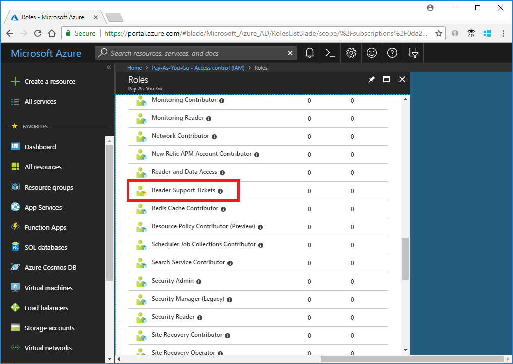

# Tutorial: Create an Azure custom role using Azure CLI

If the [Azure built-in roles](built-in-roles.md) don't meet the specific needs of your organization, you can create your own custom roles. For this tutorial, you create a custom role named Reader Support Tickets using Azure CLI. The custom role allows the user to view everything in the control plane of a subscription and also open support tickets.

In this tutorial, you learn how to:

> [!div class="checklist"]
> * Create a custom role
> * List custom roles
> * Update a custom role
> * Delete a custom role

If you don't have an Azure subscription, create a [free account](https://azure.microsoft.com/free/?WT.mc_id=A261C142F) before you begin.

## Prerequisites

To complete this tutorial, you will need:

- Permissions to create custom roles, such as [Owner](built-in-roles.md#owner) or [User Access Administrator](built-in-roles.md#user-access-administrator)
- [Azure Cloud Shell](../cloud-shell/overview.md) or [Azure CLI](/cli/azure/install-azure-cli)

## Sign in to Azure CLI

Sign in to [Azure CLI](/cli/azure/authenticate-azure-cli).

## Create a custom role

The easiest way to create a custom role is to start with a JSON template, add your changes, and then create a new role.

1. Review the list of actions for the [Microsoft.Support resource provider](resource-provider-operations.md#microsoftsupport). It's helpful to know the actions that are available to create your permissions.

    | Action | Description |
    | --- | --- |
    | Microsoft.Support/register/action | Registers to Support Resource Provider |
    | Microsoft.Support/supportTickets/read | Gets Support Ticket details (including status, severity, contact details and communications) or gets the list of Support Tickets across subscriptions. |
    | Microsoft.Support/supportTickets/write | Creates or Updates a Support Ticket. You can create a Support Ticket for Technical, Billing, Quotas or Subscription Management related issues. You can update severity, contact details and communications for existing support tickets. |
    
1. Create a new file named **ReaderSupportRole.json**.

1. Open ReaderSupportRole.json in an editor and add the following JSON.

    For information about the different properties, see [Azure custom roles](custom-roles.md).

    ```json
    {
      "Name": "",
      "IsCustom": true,
      "Description": "",
      "Actions": [],
      "NotActions": [],
      "DataActions": [],
      "NotDataActions": [],
      "AssignableScopes": [
        "/subscriptions/{subscriptionId1}"
      ]
    }
    ```
    
1. Add the following actions to the `Actions` property. These actions allow the user to view everything in the subscription and create support tickets.

    ```
    "*/read",
    "Microsoft.Support/*"
    ```

1. Get the ID of your subscription using the [az account list](/cli/azure/account#az-account-list) command.

    ```azurecli
    az account list --output table
    ```

1. In `AssignableScopes`, replace `{subscriptionId1}` with your subscription ID.

    You must add explicit subscription IDs, otherwise you won't be allowed to import the role into your subscription.

1. Change the `Name` and `Description` properties to "Reader Support Tickets" and "View everything in the subscription and also open support tickets."

    Your JSON file should look like the following:

    ```json
    {
      "Name": "Reader Support Tickets",
      "IsCustom": true,
      "Description": "View everything in the subscription and also open support tickets.",
      "Actions": [
        "*/read",
        "Microsoft.Support/*"
      ],
      "NotActions": [],
      "DataActions": [],
      "NotDataActions": [],
      "AssignableScopes": [
        "/subscriptions/00000000-0000-0000-0000-000000000000"
      ]
    }
    ```
    
1. To create the new custom role, use the [az role definition create](/cli/azure/role/definition#az-role-definition-create) command and specify the JSON role definition file.

    ```azurecli
    az role definition create --role-definition "~/CustomRoles/ReaderSupportRole.json"
    ```

    ```Output
    {
      "additionalProperties": {},
      "assignableScopes": [
        "/subscriptions/00000000-0000-0000-0000-000000000000"
      ],
      "description": "View everything in the subscription and also open support tickets.",
      "id": "/subscriptions/00000000-0000-0000-0000-000000000000/providers/Microsoft.Authorization/roleDefinitions/22222222-2222-2222-2222-222222222222",
      "name": "22222222-2222-2222-2222-222222222222",
      "permissions": [
        {
          "actions": [
            "*/read",
            "Microsoft.Support/*"
          ],
          "additionalProperties": {},
          "dataActions": [],
          "notActions": [],
          "notDataActions": []
        }
      ],
      "roleName": "Reader Support Tickets",
      "roleType": "CustomRole",
      "type": "Microsoft.Authorization/roleDefinitions"
    }
    ```

    The new custom role is now available and can be assigned to users, groups, or service principals just like built-in roles.

## List custom roles

- To list all your custom roles, use the [az role definition list](/cli/azure/role/definition#az-role-definition-list) command with the `--custom-role-only` parameter.

    ```azurecli
    az role definition list --custom-role-only true
    ```
    
    ```Output
    [
      {
        "additionalProperties": {},
        "assignableScopes": [
          "/subscriptions/00000000-0000-0000-0000-000000000000"
        ],
        "description": "View everything in the subscription and also open support tickets.",
        "id": "/subscriptions/00000000-0000-0000-0000-000000000000/providers/Microsoft.Authorization/roleDefinitions/22222222-2222-2222-2222-222222222222",
        "name": "22222222-2222-2222-2222-222222222222",
        "permissions": [
          {
            "actions": [
              "*/read",
              "Microsoft.Support/*",
              "Microsoft.Resources/deployments/*",
              "Microsoft.Insights/diagnosticSettings/*/read"
            ],
            "additionalProperties": {},
            "dataActions": [],
            "notActions": [],
            "notDataActions": []
          }
        ],
        "roleName": "Reader Support Tickets",
        "roleType": "CustomRole",
        "type": "Microsoft.Authorization/roleDefinitions"
      }
    ]
    ```
    
    You can also see the custom role in the Azure portal.

    

## Update a custom role

To update the custom role, update the JSON file and then update the custom role.

1. Open the ReaderSupportRole.json file.

1. In `Actions`, add the action to create and manage resource group deployments `"Microsoft.Resources/deployments/*"`. Be sure to include a comma after the previous action.

    Your updated JSON file should look like the following:

    ```json
    {
      "Name": "Reader Support Tickets",
      "IsCustom": true,
      "Description": "View everything in the subscription and also open support tickets.",
      "Actions": [
        "*/read",
        "Microsoft.Support/*",
        "Microsoft.Resources/deployments/*"
      ],
      "NotActions": [],
      "DataActions": [],
      "NotDataActions": [],
      "AssignableScopes": [
        "/subscriptions/00000000-0000-0000-0000-000000000000"
      ]
    }
    ```
        
1. To update the custom role, use the [az role definition update](/cli/azure/role/definition#az-role-definition-update) command and specify the updated JSON file.

    ```azurecli
    az role definition update --role-definition "~/CustomRoles/ReaderSupportRole.json"
    ```

    ```Output
    {
      "additionalProperties": {},
      "assignableScopes": [
        "/subscriptions/00000000-0000-0000-0000-000000000000"
      ],
      "description": "View everything in the subscription and also open support tickets.",
      "id": "/subscriptions/00000000-0000-0000-0000-000000000000/providers/Microsoft.Authorization/roleDefinitions/22222222-2222-2222-2222-222222222222",
      "name": "22222222-2222-2222-2222-222222222222",
      "permissions": [
        {
          "actions": [
            "*/read",
            "Microsoft.Support/*",
            "Microsoft.Resources/deployments/*"
          ],
          "additionalProperties": {},
          "dataActions": [],
          "notActions": [],
          "notDataActions": []
        }
      ],
      "roleName": "Reader Support Tickets",
      "roleType": "CustomRole",
      "type": "Microsoft.Authorization/roleDefinitions"
    }
    ```
    
## Delete a custom role

- Use the [az role definition delete](/cli/azure/role/definition#az-role-definition-delete) command and specify the role name or role ID to delete the custom role.

    ```azurecli
    az role definition delete --name "Reader Support Tickets"
    ```

## Next steps

> [!div class="nextstepaction"]
> [Create or update Azure custom roles using Azure CLI](custom-roles-cli.md)
