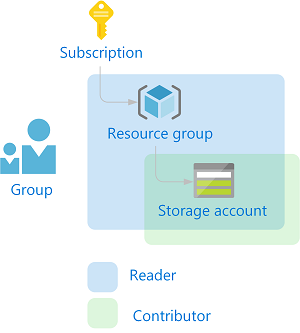
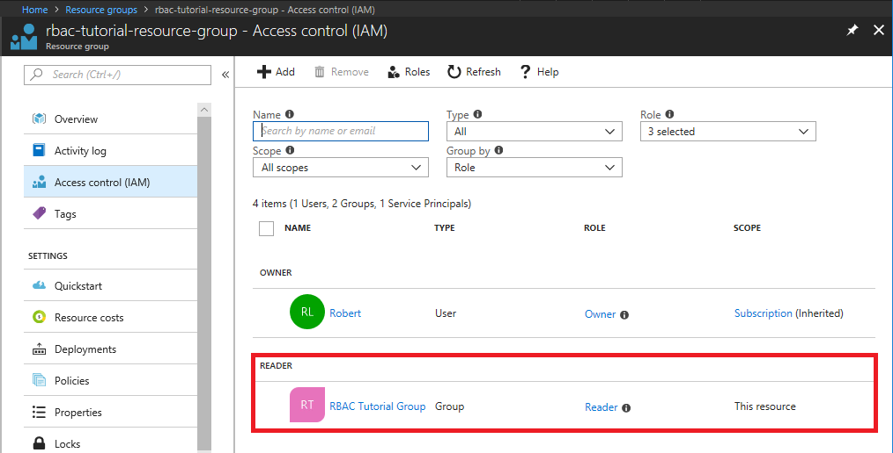
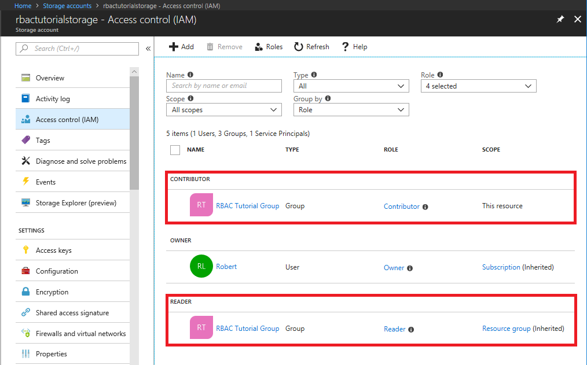

# Tutorial: Assign a role to a group using Azure PowerShell

[Role-based access control (RBAC)](overview.md) is the way that you control access to resources in Azure. In this tutorial, you will assign roles to a group at different scopes using Azure PowerShell.

In this tutorial, you learn how to:

> [!div class="checklist"]
> * Assign roles to a group
> * List role assignments
> * Remove role assignments

If you don't have an Azure subscription, create a [free account](https://azure.microsoft.com/free/?WT.mc_id=A261C142F) before you begin.

## Prerequisites

To complete this tutorial, you will need:

- Permissions to create groups in Azure Active Directory (or have an existing group)
- [Azure Cloud Shell](/azure/cloud-shell/quickstart-powershell) -OR- [Azure PowerShell](/powershell/azure/install-azurerm-ps) with the [Azure AD module](/powershell/azure/active-directory/install-adv2)

## Role assignments

A role assignment consists of three elements: security principal, role definition, and scope. Here are the two role assignments you will perform in this tutorial:

| Security principal | Role definition | Scope |
| --- | --- | --- |
| Group<br>(RBAC Tutorial Group) | [Reader](built-in-roles.md#reader) | Resource group<br>(rbac-tutorial-resource-group) |
| Group<br>(RBAC Tutorial Group)| [Contributor](built-in-roles.md#contributor) | Resource<br>(rbactutorialstorage) |

   

## Create a group

To assign a role, you need a user, group, or service principal.

- Create a new group using the [New-AzureADGroup](/powershell/module/azuread/new-azureadgroup) command with a name of your choice.

   ```azurepowershell
   New-AzureADGroup -DisplayName "RBAC Tutorial Group" `
     -MailEnabled $false -SecurityEnabled $true -MailNickName "NotSet"
   ```

   ```Example
   ObjectId                             DisplayName         Description
   --------                             -----------         -----------
   11111111-1111-1111-1111-111111111111 RBAC Tutorial Group
   ```

## Create a resource group

You use a resource group to show how to assign a role at a resource group scope.

1. Get a list of region locations using the [Get-AzureRmLocation](/powershell/module/azurerm.resources/get-azurermlocation) command.

   ```azurepowershell
   Get-AzureRmLocation | select Location
   ```

1. Select a location near you and assign it to a variable.

   ```azurepowershell
   $location = "westus"
   ```

1. Create a new resource group using the [New-AzureRmResourceGroup](/powershell/module/azurerm.resources/new-azurermresourcegroup) command.

   ```azurepowershell
   New-AzureRmResourceGroup -Name "rbac-tutorial-resource-group" -Location $location
   ```

   ```Example
   ResourceGroupName : rbac-tutorial-resource-group
   Location          : westus
   ProvisioningState : Succeeded
   Tags              :
   ResourceId        : /subscriptions/00000000-0000-0000-0000-000000000000/resourceGroups/rbac-tutorial-resource-group
   ```

## Create a storage account

You use a storage account to show how to assign a role at a resource scope.

- Create a general-purpose storage account using the [New-AzureRmStorageAccount](/powershell/module/azurerm.storage/new-azurermstorageaccount) command.

   ```azurepowershell
   New-AzureRmStorageAccount -ResourceGroupName "rbac-tutorial-resource-group" `
     -Name "rbactutorialstorage" `
     -Location $location `
     -SkuName Standard_LRS `
     -Kind StorageV2
   ```

    ``` Example
    ResourceGroupName      : rbac-tutorial-resource-group
    StorageAccountName     : rbactutorialstorage
    Id                     : /subscriptions/00000000-0000-0000-0000-000000000000/resourceGroups/rbac-tutorial-resource-group/providers/Microsoft.Storage/storageAccounts/rbactutorialstorage
    Location               : westus
    Sku                    : Microsoft.Azure.Management.Storage.Models.Sku
    Kind                   : StorageV2
    Encryption             : Microsoft.Azure.Management.Storage.Models.Encryption
    AccessTier             : Hot
    CreationTime           : 5/4/2018 11:24:22 PM
    CustomDomain           :
    Identity               :
    LastGeoFailoverTime    :
    PrimaryEndpoints       : Microsoft.Azure.Management.Storage.Models.Endpoints
    PrimaryLocation        : westus
    ProvisioningState      : Succeeded
    SecondaryEndpoints     :
    SecondaryLocation      :
    StatusOfPrimary        : Available
    StatusOfSecondary      :
    Tags                   : {}
    EnableHttpsTrafficOnly : False
    NetworkRuleSet         : Microsoft.Azure.Commands.Management.Storage.Models.PSNetworkRuleSet
    Context                : Microsoft.WindowsAzure.Commands.Common.Storage.LazyAzureStorageContext
    ExtendedProperties     : {}
    ```

## Assign roles to the group

To assign a role (grant access), you use the [New-AzureRmRoleAssignment](/powershell/module/azurerm.resources/new-azurermroleassignment) command and specify the security principal, role definition, and scope.

1. Get the object ID of the group using the [Get-AzureADGroup](/powershell/module/azuread/new-azureadgroup) command.

    ```azurepowershell
    Get-AzureADGroup -SearchString "RBAC Tutorial Group"
    ```

    ```Example
    ObjectId                             DisplayName         Description
    --------                             -----------         -----------
    11111111-1111-1111-1111-111111111111 RBAC Tutorial Group
    ```

1. Save the group object ID in a variable.

    ```azurepowershell
    $groupId = "11111111-1111-1111-1111-111111111111"
    ```

1. Assign the [Reader](built-in-roles.md#reader) role to the group at the resource group scope.

    ```azurepowershell
    New-AzureRmRoleAssignment -ObjectId $groupId `
      -RoleDefinitionName "Reader" `
      -ResourceGroupName "rbac-tutorial-resource-group"
    ```

    ```Example
    RoleAssignmentId   : /subscriptions/00000000-0000-0000-0000-000000000000/resourceGroups/rbac-tutorial-resource-group/providers/Microsoft.Authorization/roleAssignments/22222222-2222-2222-2222-222222222222
    Scope              : /subscriptions/00000000-0000-0000-0000-000000000000/resourceGroups/rbac-tutorial-resource-group
    DisplayName        : RBAC Tutorial Group
    SignInName         :
    RoleDefinitionName : Reader
    RoleDefinitionId   : acdd72a7-3385-48ef-bd42-f606fba81ae7
    ObjectId           : 11111111-1111-1111-1111-111111111111
    ObjectType         : Group
    CanDelegate        : False
    ```

1. Get information about the rbactutorialstorage storage account using the [Get-AzureRmStorageAccount](/powershell/module/azurerm.storage/new-azurermstorageaccount) command.

    ```azurepowershell
    Get-AzureRmStorageAccount -ResourceGroupName "rbac-tutorial-resource-group" `
      -AccountName "rbactutorialstorage"
    ```

    ```Example
    ResourceGroupName      : rbac-tutorial-resource-group
    StorageAccountName     : rbactutorialstorage
    Id                     : /subscriptions/00000000-0000-0000-0000-000000000000/resourceGroups/rbac-tutorial-resource-group/providers/Microsoft.Storage/storageAccounts/rbact
                             utorialstorage
    Location               : westus
    Sku                    : Microsoft.Azure.Management.Storage.Models.Sku
    Kind                   : StorageV2
    Encryption             : Microsoft.Azure.Management.Storage.Models.Encryption
    AccessTier             : Hot
    CreationTime           : 5/4/2018 11:24:22 PM
    CustomDomain           :
    Identity               :
    LastGeoFailoverTime    :
    PrimaryEndpoints       : Microsoft.Azure.Management.Storage.Models.Endpoints
    PrimaryLocation        : westus
    ProvisioningState      : Succeeded
    SecondaryEndpoints     :
    SecondaryLocation      :
    StatusOfPrimary        : Available
    StatusOfSecondary      :
    Tags                   : {}
    EnableHttpsTrafficOnly : False
    NetworkRuleSet         : Microsoft.Azure.Commands.Management.Storage.Models.PSNetworkRuleSet
    Context                : Microsoft.WindowsAzure.Commands.Common.Storage.LazyAzureStorageContext
    ExtendedProperties     : {}
    ```

1. Assign the [Contributor](built-in-roles.md#contributor) role to the group at the storage account resource scope.

    ```azurepowershell
    New-AzureRmRoleAssignment -ObjectId $groupId `
      -RoleDefinitionName "Contributor" `
      -ResourceGroupName "rbac-tutorial-resource-group" `
      -ResourceName "rbactutorialstorage" `
      -ResourceType Microsoft.Storage/storageAccounts
    ```

    ```Example
    RoleAssignmentId   : /subscriptions/00000000-0000-0000-0000-000000000000/resourceGroups/rbac-tutorial-resource-group/providers/Microsoft.Storage/storageAccounts/rbactutor
                         ialstorage/providers/Microsoft.Authorization/roleAssignments/33333333-3333-3333-3333-333333333333
    Scope              : /subscriptions/00000000-0000-0000-0000-000000000000/resourceGroups/rbac-tutorial-resource-group/providers/Microsoft.Storage/storageAccounts/rbactutor
                         ialstorage
    DisplayName        : RBAC Tutorial Group
    SignInName         :
    RoleDefinitionName : Contributor
    RoleDefinitionId   : b24988ac-6180-42a0-ab88-20f7382dd24c
    ObjectId           : 11111111-1111-1111-1111-111111111111
    ObjectType         : Group
    CanDelegate        : False
    ```

## List role assignments

1. To verify the role assignments for the resource group, use the [Get-AzureRmRoleAssignment](/powershell/module/azurerm.resources/get-azurermroleassignment) command.

    ```azurepowershell
    Get-AzureRmRoleAssignment -ObjectId $groupId -ResourceGroupName "rbac-tutorial-resource-group"
    ```

    ```Example
    RoleAssignmentId   : /subscriptions/00000000-0000-0000-0000-000000000000/resourceGroups/rbac-tutorial-resource-group/providers/Microsoft.Authorization/roleAssignments/22222222-2222-2222-2222-222222222222
    Scope              : /subscriptions/00000000-0000-0000-0000-000000000000/resourceGroups/rbac-tutorial-resource-group
    DisplayName        : RBAC Tutorial Group
    SignInName         :
    RoleDefinitionName : Reader
    RoleDefinitionId   : acdd72a7-3385-48ef-bd42-f606fba81ae7
    ObjectId           : 11111111-1111-1111-1111-111111111111
    ObjectType         : Group
    CanDelegate        : False
    ```

    In the output, you can see that the Reader role has been assigned to the RBAC Tutorial Group at the rbac-tutorial-resource-group scope.

1. List the role assignments for the storage account resource.

    ```azurepowershell
    Get-AzureRmRoleAssignment -ObjectId $groupId `
      -ResourceGroupName "rbac-tutorial-resource-group" `
      -ResourceName "rbactutorialstorage" `
      -ResourceType "Microsoft.Storage/storageAccounts"
    ```

    ```Example
    RoleAssignmentId   : /subscriptions/00000000-0000-0000-0000-000000000000/resourceGroups/rbac-tutorial-resource-group/providers/Microsoft.Storage/storageAccounts/rbactutorialstorage/providers/Microsoft.Authorization/roleAssignments/33333333-3333-3333-3333-333333333333
    Scope              : /subscriptions/00000000-0000-0000-0000-000000000000/resourceGroups/rbac-tutorial-resource-group/providers/Microsoft.Storage/storageAccounts/rbactutorialstorage
    DisplayName        : RBAC Tutorial Group
    SignInName         :
    RoleDefinitionName : Contributor
    RoleDefinitionId   : b24988ac-6180-42a0-ab88-20f7382dd24c
    ObjectId           : 11111111-1111-1111-1111-111111111111
    ObjectType         : Group
    CanDelegate        : False

    RoleAssignmentId   : /subscriptions/00000000-0000-0000-0000-000000000000/resourceGroups/rbac-tutorial-resource-group/providers/Microsoft.Authorization/roleAssignments/22222222-2222-2222-2222-222222222222
    Scope              : /subscriptions/00000000-0000-0000-0000-000000000000/resourceGroups/rbac-tutorial-resource-group
    DisplayName        : RBAC Tutorial Group
    SignInName         :
    RoleDefinitionName : Reader
    RoleDefinitionId   : acdd72a7-3385-48ef-bd42-f606fba81ae7
    ObjectId           : 11111111-1111-1111-1111-111111111111
    ObjectType         : Group
    CanDelegate        : False
    ```

    In the output, you can see that both the Contributor and Reader roles  have been assigned to the RBAC Tutorial Group. The Contributor role is at the rbactutorialstorage scope and the Reader role is inherited at the rbac-tutorial-resource-group scope.

## (Optional) List role assignments in the Azure portal

1. To see how the role assignments look in the Azure portal, you can view the **Access control (IAM)** pane for the resource group and storage account.

    
    
    
    
## Remove role assignments

To remove a role assignment (revoke access) for users, groups, and applications, use [Remove-AzureRmRoleAssignment](/powershell/module/azurerm.resources/remove-azurermroleassignment).

1. Use the following command to remove the Contributor role assignment for the group at the storage account scope.

    ```azurepowershell
    Remove-AzureRmRoleAssignment -ObjectId $groupId `
      -RoleDefinitionName "Contributor" `
      -ResourceGroupName "rbac-tutorial-resource-group" `
      -ResourceName "rbactutorialstorage" `
      -ResourceType "Microsoft.Storage/storageAccounts"
    ```

1. Use the following command to remove the Reader role assignment for the group at the resource group scope.

    ```azurepowershell
    Remove-AzureRmRoleAssignment -ObjectId $groupId `
      -RoleDefinitionName "Reader" `
      -ResourceGroupName "rbac-tutorial-resource-group"
    ```

## Clean up resources

To clean up the resources created by this tutorial, you can delete the resource group and the group. Deleting the resource group also deletes the associated storage account.

1. Delete the resource group and its associated resources using the [Remove-AzureRmResourceGroup](/powershell/module/azurerm.resources/remove-azurermresourcegroup) command.

    ```azurepowershell
    Remove-AzureRmResourceGroup -Name "rbac-tutorial-resource-group"
    ```

    ```Example
    Confirm
    Are you sure you want to remove resource group 'rbac-tutorial-resource-group'
    [Y] Yes  [N] No  [S] Suspend  [?] Help (default is "Y"):
    ```
    
1. When asked to confirm, type **Y**. It will take a few seconds to delete.

1. Delete the group using the [Remove-AzureADGroup](/powershell/module/azuread/remove-azureadgroup) command.

    ```azurepowershell
    Remove-AzureADGroup -ObjectId $groupId
    ```
    
    If you receive an error when you try to delete the group, you can also delete the group in the portal.

## Next steps

> [!div class="nextstepaction"]
> [Create and manage a custom role using Azure PowerShell](tutorial-custom-roles-powershell.md)