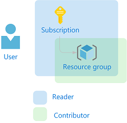
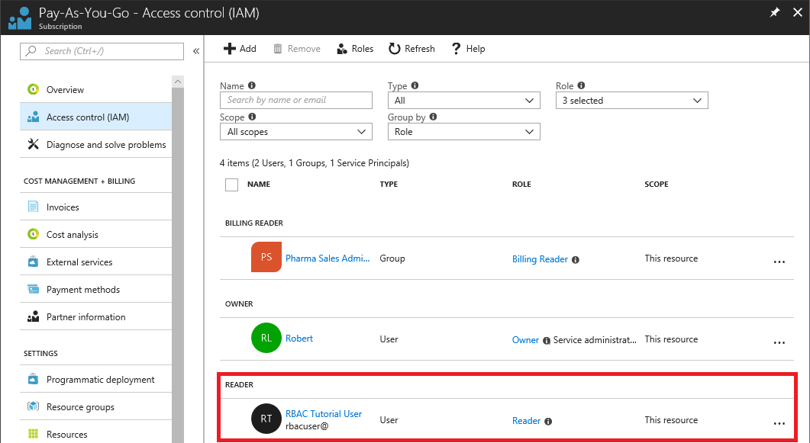
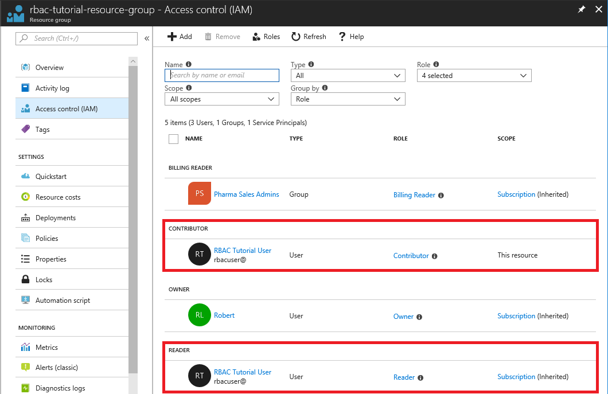

# Tutorial: Grant a user access to Azure resources using RBAC and Azure PowerShell

[Role-based access control (RBAC)](overview.md) is the way that you manage access to Azure resources. In this tutorial, you grant a user access to view everything in a subscription and manage everything in a resource group using Azure PowerShell.

In this tutorial, you learn how to:

> [!div class="checklist"]
> * Grant access for a user at different scopes
> * List access
> * Remove access

If you don't have an Azure subscription, create a [free account](https://azure.microsoft.com/free/?WT.mc_id=A261C142F) before you begin.

[!INCLUDE [az-powershell-update](../../includes/updated-for-az.md)]

## Prerequisites

To complete this tutorial, you will need:

- Permissions to create users in Azure Active Directory (or have an existing user)
- [Azure Cloud Shell](/azure/cloud-shell/quickstart-powershell)

## Role assignments

In RBAC, to grant access, you create a role assignment. A role assignment consists of three elements: security principal, role definition, and scope. Here are the two role assignments you will perform in this tutorial:

| Security principal | Role definition | Scope |
| --- | --- | --- |
| User<br>(RBAC Tutorial User) | [Reader](built-in-roles.md#reader) | Subscription |
| User<br>(RBAC Tutorial User)| [Contributor](built-in-roles.md#contributor) | Resource group<br>(rbac-tutorial-resource-group) |

   

## Create a user

To assign a role, you need a user, group, or service principal. If you don't already have a user, you can create one.

1. In Azure Cloud Shell, create a password that complies with your password complexity requirements.

    ```azurepowershell
    $PasswordProfile = New-Object -TypeName Microsoft.Open.AzureAD.Model.PasswordProfile
    $PasswordProfile.Password = "Password"
    ```

1. Create a new user for your domain using the [New-AzureADUser](/powershell/module/azuread/new-azureaduser) command.

    ```azurepowershell
    New-AzureADUser -DisplayName "RBAC Tutorial User" -PasswordProfile $PasswordProfile `
      -UserPrincipalName "rbacuser@example.com" -AccountEnabled $true -MailNickName "rbacuser"
    ```
    
    ```Example
    ObjectId                             DisplayName        UserPrincipalName    UserType
    --------                             -----------        -----------------    --------
    11111111-1111-1111-1111-111111111111 RBAC Tutorial User rbacuser@example.com Member
    ```

## Create a resource group

You use a resource group to show how to assign a role at a resource group scope.

1. Get a list of region locations using the [Get-AzLocation](/powershell/module/az.resources/get-azlocation) command.

   ```azurepowershell
   Get-AzLocation | select Location
   ```

1. Select a location near you and assign it to a variable.

   ```azurepowershell
   $location = "westus"
   ```

1. Create a new resource group using the [New-AzResourceGroup](/powershell/module/az.resources/new-azresourcegroup) command.

   ```azurepowershell
   New-AzResourceGroup -Name "rbac-tutorial-resource-group" -Location $location
   ```

   ```Example
   ResourceGroupName : rbac-tutorial-resource-group
   Location          : westus
   ProvisioningState : Succeeded
   Tags              :
   ResourceId        : /subscriptions/00000000-0000-0000-0000-000000000000/resourceGroups/rbac-tutorial-resource-group
   ```

## Grant access

To grant access for the user, you use the [New-AzRoleAssignment](/powershell/module/az.resources/new-azroleassignment) command to assign a role. You must specify the security principal, role definition, and scope.

1. Get the ID of your subscription using the [Get-AzSubscription](/powershell/module/Az.Accounts/Get-AzSubscription) command.

    ```azurepowershell
    Get-AzSubscription
    ```

    ```Example
    Name     : Pay-As-You-Go
    Id       : 00000000-0000-0000-0000-000000000000
    TenantId : 22222222-2222-2222-2222-222222222222
    State    : Enabled
    ```

1. Save the subscription scope in a variable.

    ```azurepowershell
    $subScope = "/subscriptions/00000000-0000-0000-0000-000000000000"
    ```

1. Assign the [Reader](built-in-roles.md#reader) role to the user at the subscription scope.

    ```azurepowershell
    New-AzRoleAssignment -SignInName rbacuser@example.com `
      -RoleDefinitionName "Reader" `
      -Scope $subScope
    ```

    ```Example
    RoleAssignmentId   : /subscriptions/00000000-0000-0000-0000-000000000000/providers/Microsoft.Authorization/roleAssignments/44444444-4444-4444-4444-444444444444
    Scope              : /subscriptions/00000000-0000-0000-0000-000000000000
    DisplayName        : RBAC Tutorial User
    SignInName         : rbacuser@example.com
    RoleDefinitionName : Reader
    RoleDefinitionId   : acdd72a7-3385-48ef-bd42-f606fba81ae7
    ObjectId           : 11111111-1111-1111-1111-111111111111
    ObjectType         : User
    CanDelegate        : False
    ```

1. Assign the [Contributor](built-in-roles.md#contributor) role to the user at the resource group scope.

    ```azurepowershell
    New-AzRoleAssignment -SignInName rbacuser@example.com `
      -RoleDefinitionName "Contributor" `
      -ResourceGroupName "rbac-tutorial-resource-group"
    ```

    ```Example
    RoleAssignmentId   : /subscriptions/00000000-0000-0000-0000-000000000000/resourceGroups/rbac-tutorial-resource-group/providers/Microsoft.Authorization/roleAssignments/33333333-3333-3333-3333-333333333333
    Scope              : /subscriptions/00000000-0000-0000-0000-000000000000/resourceGroups/rbac-tutorial-resource-group
    DisplayName        : RBAC Tutorial User
    SignInName         : rbacuser@example.com
    RoleDefinitionName : Contributor
    RoleDefinitionId   : b24988ac-6180-42a0-ab88-20f7382dd24c
    ObjectId           : 11111111-1111-1111-1111-111111111111
    ObjectType         : User
    CanDelegate        : False
    ```

## List access

1. To verify the access for the subscription, use the [Get-AzRoleAssignment](/powershell/module/az.resources/get-azroleassignment) command to list the role assignments.

    ```azurepowershell
    Get-AzRoleAssignment -SignInName rbacuser@example.com -Scope $subScope
    ```

    ```Example
    RoleAssignmentId   : /subscriptions/00000000-0000-0000-0000-000000000000/providers/Microsoft.Authorization/roleAssignments/22222222-2222-2222-2222-222222222222
    Scope              : /subscriptions/00000000-0000-0000-0000-000000000000
    DisplayName        : RBAC Tutorial User
    SignInName         : rbacuser@example.com
    RoleDefinitionName : Reader
    RoleDefinitionId   : acdd72a7-3385-48ef-bd42-f606fba81ae7
    ObjectId           : 11111111-1111-1111-1111-111111111111
    ObjectType         : User
    CanDelegate        : False
    ```

    In the output, you can see that the Reader role has been assigned to the RBAC Tutorial User at the subscription scope.

1. To verify the access for the resource group, use the [Get-AzRoleAssignment](/powershell/module/az.resources/get-azroleassignment) command to list the role assignments.

    ```azurepowershell
    Get-AzRoleAssignment -SignInName rbacuser@example.com -ResourceGroupName "rbac-tutorial-resource-group"
    ```

    ```Example
    RoleAssignmentId   : /subscriptions/00000000-0000-0000-0000-000000000000/resourceGroups/rbac-tutorial-resource-group/providers/Microsoft.Authorization/roleAssignments/33333333-3333-3333-3333-333333333333
    Scope              : /subscriptions/00000000-0000-0000-0000-000000000000/resourceGroups/rbac-tutorial-resource-group
    DisplayName        : RBAC Tutorial User
    SignInName         : rbacuser@example.com
    RoleDefinitionName : Contributor
    RoleDefinitionId   : b24988ac-6180-42a0-ab88-20f7382dd24c
    ObjectId           : 11111111-1111-1111-1111-111111111111
    ObjectType         : User
    CanDelegate        : False
    
    RoleAssignmentId   : /subscriptions/00000000-0000-0000-0000-000000000000/providers/Microsoft.Authorization/roleAssignments/22222222-2222-2222-2222-222222222222
    Scope              : /subscriptions/00000000-0000-0000-0000-000000000000
    DisplayName        : RBAC Tutorial User
    SignInName         : rbacuser@example.com
    RoleDefinitionName : Reader
    RoleDefinitionId   : acdd72a7-3385-48ef-bd42-f606fba81ae7
    ObjectId           : 11111111-1111-1111-1111-111111111111
    ObjectType         : User
    CanDelegate        : False
    ```

    In the output, you can see that both the Contributor and Reader roles have been assigned to the RBAC Tutorial User. The Contributor role is at the rbac-tutorial-resource-group scope and the Reader role is inherited at the subscription scope.

## (Optional) List access using the Azure Portal

1. To see how the role assignments look in the Azure portal, view the **Access control (IAM)** blade for the subscription.

    

1. View the **Access control (IAM)** blade for the resource group.

    

## Remove access

To remove access for users, groups, and applications, use [Remove-AzRoleAssignment](/powershell/module/az.resources/remove-azroleassignment) to remove a role assignment.

1. Use the following command to remove the Contributor role assignment for the user at the resource group scope.

    ```azurepowershell
    Remove-AzRoleAssignment -SignInName rbacuser@example.com `
      -RoleDefinitionName "Contributor" `
      -ResourceGroupName "rbac-tutorial-resource-group"
    ```

1. Use the following command to remove the Reader role assignment for the user at the subscription scope.

    ```azurepowershell
    Remove-AzRoleAssignment -SignInName rbacuser@example.com `
      -RoleDefinitionName "Reader" `
      -Scope $subScope
    ```

## Clean up resources

To clean up the resources created by this tutorial, delete the resource group and the user.

1. Delete the resource group using the [Remove-AzResourceGroup](/powershell/module/az.resources/remove-azresourcegroup) command.

    ```azurepowershell
    Remove-AzResourceGroup -Name "rbac-tutorial-resource-group"
    ```

    ```Example
    Confirm
    Are you sure you want to remove resource group 'rbac-tutorial-resource-group'
    [Y] Yes  [N] No  [S] Suspend  [?] Help (default is "Y"):
    ```
    
1. When asked to confirm, type **Y**. It will take a few seconds to delete.

1. Delete the user using the [Remove-AzureADUser](/powershell/module/azuread/remove-azureaduser) command.

    ```azurepowershell
    Remove-AzureADUser -ObjectId "rbacuser@example.com"
    ```

## Next steps

> [!div class="nextstepaction"]
> [Manage access to Azure resources using RBAC and Azure PowerShell](role-assignments-powershell.md)
