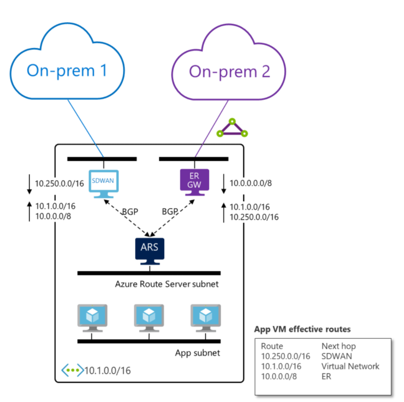
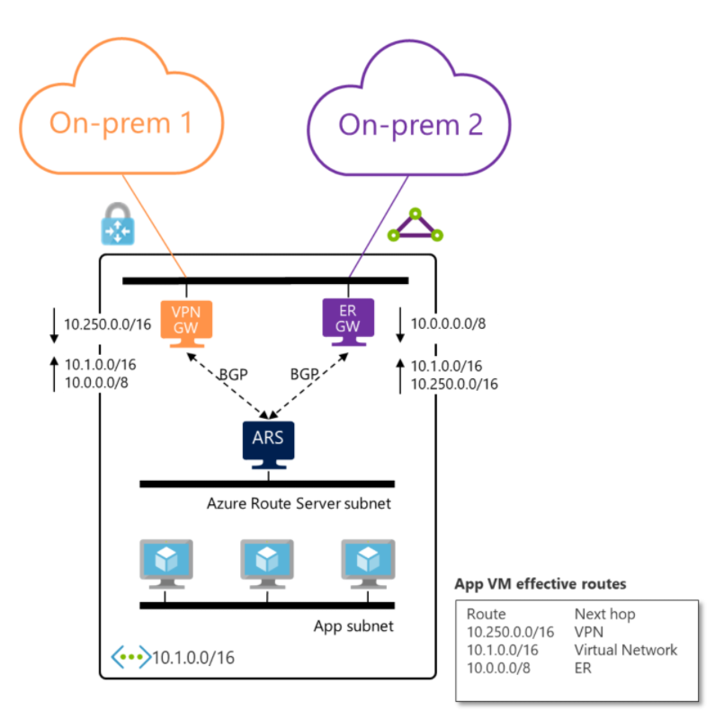

# Azure Route Server support for ExpressRoute and Azure VPN

Azure Route Server supports not only third-party network virtual appliances (NVA) running on Azure but also integrates seamlessly with ExpressRoute and Azure VPN gateways. You don’t need to configure or manage the BGP peering between the gateway and Azure Route Server. You can enable route exchange between the gateways and Azure Route Server by enabling [branch-to-branch](quickstart-configure-route-server-portal.md#configure-route-exchange) in Azure portal. If you prefer, you can use [Azure PowerShell](quickstart-configure-route-server-powershell.md#route-exchange) or [Azure CLI](quickstart-configure-route-server-cli.md#configure-route-exchange) to enable the route exchange with the Route Server.

>[!CAUTION]
> When you create or delete an Azure Route Server from a virtual network that contains a Virtual Network Gateway (ExpressRoute or VPN), expect downtime until the operation complete.

## How does it work?

When you deploy an Azure Route Server along with an ExpressRoute gateway and an NVA in a virtual network, by default Azure Route Server doesn’t propagate the routes it receives from the NVA and ExpressRoute gateway between each other. Once you enable the route exchange, ExpressRoute and the NVA will learn each other’s routes.

For example, in the following diagram:

* The SDWAN appliance will receive from Azure Route Server the route from “On-premises 2”, which is connected to ExpressRoute, along with the virtual network route.

* The ExpressRoute gateway will receive the route from “On-premises 1”, which is connected to the SDWAN appliance, along with the virtual network route from Azure Route Server.

    

You can also replace the SDWAN appliance with Azure VPN gateway. Since Azure VPN gateway and ExpressRoute are fully managed, you only need to enable the route exchange for the two on-premises networks to talk to each other.

> [!IMPORTANT] 
> Azure VPN gateway must be configured in [**active-active**](../vpn-gateway/vpn-gateway-activeactive-rm-powershell.md) mode and have the ASN set to 65515.

> [!IMPORTANT] 
> When the same route is learned over ExpressRoute, Azure VPN or an SDWAN appliance, the ExpressRoute network will be preferred.
>

## Next steps

- Learn more about [Azure Route Server](route-server-faq.md).
- Learn how to [configure Azure Route Server](quickstart-configure-route-server-powershell.md).
- Learn more about [Azure ExpressRoute and Azure VPN coexistence](../expressroute/expressroute-howto-coexist-resource-manager.md).
