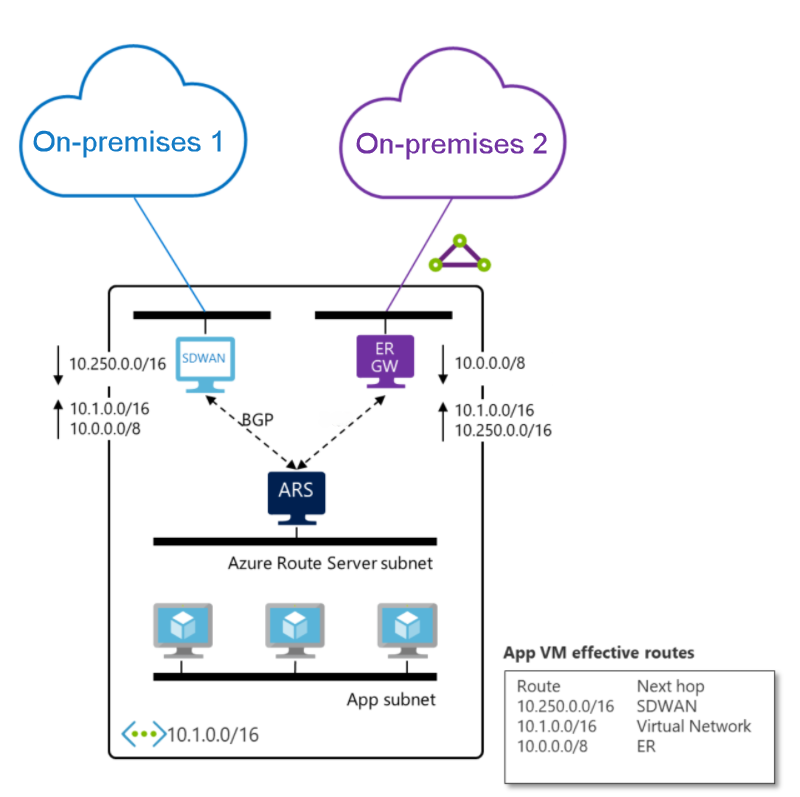
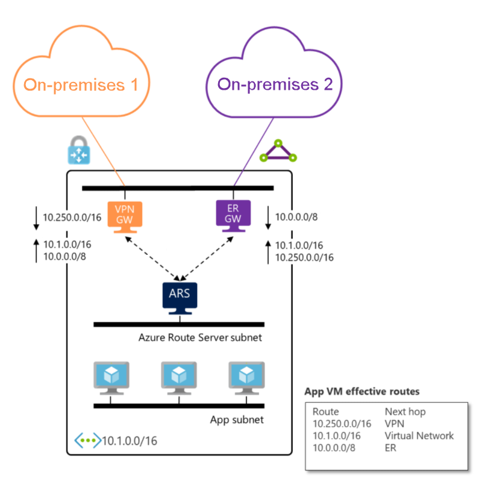

# About Azure Route Server (Preview) support for ExpressRoute and Azure VPN

Azure Route Server supports not only third-party network virtual appliances (NVA) running on Azure but also integrates seamlessly with ExpressRoute and Azure VPN gateways. You don’t need to configure or manage the BGP peering between the gateway and Azure Route Server. You can enable route exchange between the gateway and Azure Route Server with a simple [configuration change](quickstart-configure-route-server-powershell.md#route-exchange).

> [!IMPORTANT]
> Azure Route Server (Preview) is currently in public preview.
> This preview version is provided without a service level agreement, and it's not recommended for production workloads. Certain features might not be supported or might have constrained capabilities.
> For more information, see [Supplemental Terms of Use for Microsoft Azure Previews](https://azure.microsoft.com/support/legal/preview-supplemental-terms/).

## How does it work?

When you deploy an Azure Route Server along with an ExpressRoute gateway and an NVA in a virtual network by default Azure Route Server doesn’t propagate the routes it receives from the NVA and ExpressRoute gateway between each other. Once you enable the route exchange, ExpressRoute and the NVA will learn each other’s routes.

For example, in the following diagram:

* The SDWAN appliance will receive from Azure Route Server the route from “On-prem 2”, which is connected to ExpressRoute, along with the virtual network route.

* The ExpressRoute gateway will receive the route from “On-prem 1”, which is connected to the SDWAN appliance, along with the virtual network route from Azure Route Server.

    

You can also replace the SDWAN appliance with Azure VPN gateway. Since Azure VPN gateway and ExpressRoute are fully managed, you only need to enable the route exchange for the two on-premises networks to talk to each other.

> [!IMPORTANT] 
> Azure VPN gateway must be configured in [**active-active**](../vpn-gateway/vpn-gateway-activeactive-rm-powershell.md) mode.
>

## Next steps

- Learn more about [Azure Route Server](route-server-faq.md).
- Learn how to [configure Azure Route Server](quickstart-configure-route-server-powershell.md).
- Learn more about [Azure ExpressRoute and Azure VPN coexistence](../expressroute/expressroute-howto-coexist-resource-manager.md).
