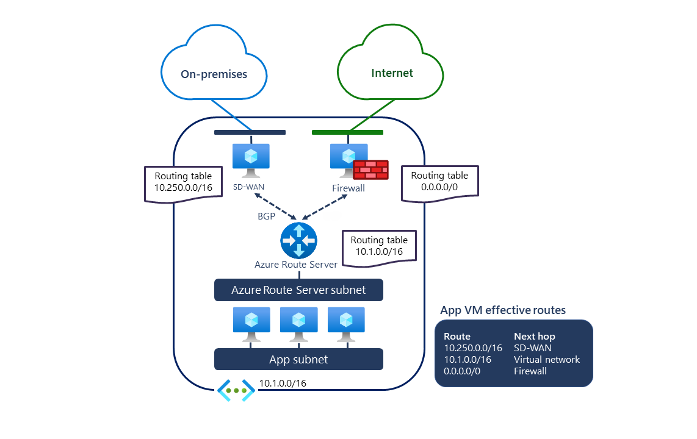

# What is Azure Route Server (Preview)? 

Azure Route Server simplifies dynamic routing between your network virtual appliance (NVA) and your virtual network. It allows you to exchange routing information directly through Border Gateway Protocol (BGP) routing protocol between any NVA that supports the BGP routing protocol and the Azure Software Defined Network (SDN) in the Azure Virtual Network (VNET) without the need to manually configure or maintain route tables. Azure Route Server is a fully managed service and is configured with high availability.

> [!IMPORTANT]
> Azure Route Server (Preview) is currently in public preview.
> This preview version is provided without a service level agreement, and it's not recommended for production workloads. Certain features might not be supported or might have constrained capabilities.
> For more information, see [Supplemental Terms of Use for Microsoft Azure Previews](https://azure.microsoft.com/support/legal/preview-supplemental-terms/).

## How does it work?

The following diagram illustrates how Azure Route Server works with an SDWAN NVA and a security NVA in a virtual network. Once you’ve established the BGP peering, Azure Route Server will receive an on-premises route (10.250.0.0/16) from the SDWAN appliance and a default route (0.0.0.0/0) from the firewall. These routes are then automatically configured on the VMs in the virtual network. As a result, all traffic destined to the on-premises network will be sent to the SDWAN appliance. While all Internet-bound traffic will be sent to the firewall. In the opposite direction, Azure Route Server will send the virtual network address (10.1.0.0/16) to both NVAs. The SDWAN appliance can propagate it further to the on-premises network.

## Key benefits 

Azure Route Server simplifies configuration, management, and deployment of your NVA in your virtual network.  

* You no longer need to manually update the routing table on your NVA whenever your virtual network addresses are updated. 

* You no longer need to update [User-Defined Routes](../virtual-network/virtual-networks-udr-overview.md) manually whenever your NVA announces new routes or withdraw old ones. 

* You can peer multiple instances of your NVA with Azure Route Server. You can configure the BGP attributes in your NVA and, depending on your design (e.g., active-active for performance or active-passive for resiliency), let Azure Route Server know which NVA instance is active or which one is passive. 

* The interface between NVA and Azure Route Server is based on a common standard protocol. As long as your NVA supports BGP, you can peer it with Azure Route Server. For more information, see [Route Server supported routing protocols](route-server-faq.md#protocol).

* You can deploy Azure Route Server in any of your new or existing virtual network. 

## FAQ

For frequently asked questions about Azure Route Server, see [Azure Route Server FAQ](route-server-faq.md).

## Next steps

- [Learn how to configure Azure Route Server](quickstart-configure-route-server-powershell.md)
- [Learn how Azure Route Server works with Azure ExpressRoute and Azure VPN](expressroute-vpn-support.md)
