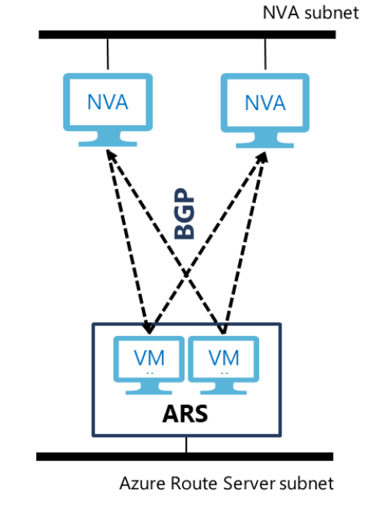

# Troubleshooting Azure Route Server issues

## Connectivity issues

### Why does my NVA lose Internet connectivity after it advertises the default route (0.0.0.0/0) to Azure Route Server?
When your NVA advertises the default route, Azure Route Server programs it for all the VMs in the virtual network including the NVA itself. This default route sets the NVA as the next hop for all Internet-bound traffic. If your NVA needs Internet connectivity, you need to configure a [User Defined Route](../virtual-network/virtual-networks-udr-overview.md) to override this default route from the NVA and attach the UDR to the subnet where the NVA is hosted (see the example below). Otherwise, the NVA host machine will keep sending the Internet-bound traffic including the one sent by the NVA back to the NVA itself.

| Route | Next Hop |
|-------|----------|
| 0.0.0.0/0 | Internet |

### Why can I ping from my NVA to the BGP peer IP on Azure Route Server but after I set up the BGP peering between them, I can’t ping the same IP anymore? Or, why is the BGP peering flapping?

In some NVA, you need to add a static route for the Azure Route Server subnet. For example, if Azure Route Server is in 10.0.255.0/27 and your NVA is in 10.0.1.0/24, you need to add the following route to the routing table in the NVA:

| Route | Next Hop |
|-------|----------|
| 10.0.255.0/27 | 10.0.1.1 |

10.0.1.1 is the default gateway IP in the subnet where your NVA (or more precisely, one of the NICs) is hosted.

### Why do I lose connectivity to my on-premises network over ExpressRoute and/or Azure VPN when I'm deploying Azure Route Server to a virtual network that already has ExpressRoute gateway and/or Azure VPN gateway?
When you deploy Azure Route Server to a virtual network, we need to update the control plane between the gateways and the virtual network. During this update, there's a period of time when the VMs in the virtual network will lose connectivity to the on-premises network. We strongly recommend that you schedule a maintenance to deploy Azure Route Server in your production environment.  

## Control plane issues

### Why does my on-premises network connected to Azure VPN gateway not receive the default route advertised by Azure Route Server?

Although Azure VPN gateway can receive the default route from its BGP peers including Azure Route Server, it [doesn't advertise the default route](../vpn-gateway/vpn-gateway-vpn-faq.md#what-address-prefixes-will-azure-vpn-gateways-advertise-to-me) to other peers. 

### Why does my NVA not receive routes from Azure Route Server even though the BGP peering is up?

The ASN that Azure Route Server uses is 65515. Make sure you configure a different ASN for your NVA so that an “eBGP” session can be established between your NVA and Azure Route Server so route propagation can happen automatically. Make sure you enable "multi-hop" in your BGP configuration because your NVA and Azure Route Server are in different subnets in the virtual network.

### The BGP peering between my NVA and Azure Route Server is up. I can see routes exchanged correctly between them. Why aren’t the NVA routes in the effective routing table of my VM? 

* If your VM is in the same VNet as your NVA and Azure Route Server:

     Azure Route Server exposes two BGP peer IPs, which are hosted on two VMs that share the responsibility of sending the routes to all other VMs running in your virtual network. Each of your NVA must set up two identical BGP sessions (e.g., use the same AS number, the same AS path and advertise the same set of routes) to the two VMs so that your VMs in the virtual network can get consistent routing info from Azure Route Server. See the diagram below.

    

    If you have two or more instances of the NVA, you *can* advertise different AS paths for the same route from different NVA instances if you want to designate one NVA instance as active and the other passive.

* If your VM is in a different virtual network than the one that hosts your NVA and Azure Route Server. Check if VNet Peering is enabled between the two VNets *and* if Use Remote Route Server is enabled on your VM’s VNet.

### Why is the Equal-Cost Multi-Path (ECMP) function of my ExpressRoute turned off after I deploy Azure Route Server to the virtual network?

When you advertise the same routes from your on-premises network to Azure over multiple ExpressRoute connections, normally ECMP is enabled by default for the traffic destined for these routes from Azure back to your premises. However, after the route server is deployed, the multiple-path information is lost in the BGP exchange between ExpressRoute and Azure Route Server, and consequently traffic from Azure will traverse only on one of the ExpressRoute connections. This limitation will be lifted in the future release of Azure Route Server.  

## Next steps

Learn how to [configure an Azure Route Server](quickstart-configure-route-server-powershell.md)
