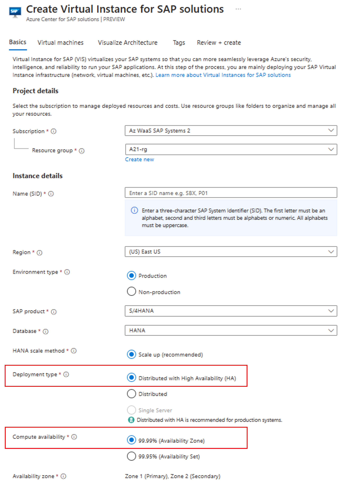

# What is reliability in *Azure Center for SAP Solutions*?
This article describes reliability support in Azure Center for SAP Solutions, and covers both regional resiliency with availability zones and cross-region resiliency with customer enabled disaster recovery. For a more detailed overview of reliability in Azure, see [Azure reliability](/azure/well-architected/resiliency/overview).

Azure Center for SAP solutions is an end-to-end solution that enables you to create and run SAP systems as a unified workload on Azure and provides a more seamless foundation for innovation. You can take advantage of the management capabilities for both new and existing Azure-based SAP systems.

## Availability zone support
Azure availability zones are at least three physically separate groups of datacenters within each Azure region. Datacenters within each zone are equipped with independent power, cooling, and networking infrastructure. In case of a local zone failure, availability zones are designed such that, if one zone is affected, the remaining two zones can support: regional services, capacity and high availability.  Failures can range from software and hardware failures to events such as earthquakes, floods, and fires. Tolerance to failures is achieved with redundancy and logical isolation of Azure services. For more detailed information on availability zones in Azure, see [Availability zone service and regional support](/azure/reliability/availability-zones-service-support).

There are three types of Azure services that support availability zones: zonal, zone-redundant, and always-available services. You can learn more about these types of services and how they promote resiliency in the [Azure services with availability zone support](/azure/reliability/availability-zones-service-support).

Azure Center for SAP Solutions supports zone-redundancy. When creating a new SAP system through Azure Center for SAP solutions, you can choose the Compute availability option for the infrastructure being deployed. You can choose to deploy the SAP system with zone redundancy based on your requirements, while the service is zone-redundant by default. [Learn more about deployment type options for SAP systems here](/azure/sap/center-sap-solutions/deploy-s4hana#deployment-types).

### Regional availability

When deploying SAP systems using Azure Center for SAP solutions, you can use Zone-redundant Premium plans in the following regions:

| Americas         | Europe               | Asia Pacific   |
|------------------|----------------------|----------------|
| East US 2        | North Europe         | Australia East |
| East US          | West Europe          | Central India  |
| West US 3        |                      | East Asia      |
|                  |                      |                |

### Prerequisites for ensuring Resiliency in Azure Center for SAP solutions
- You are expected to choose Zone redundancy for SAP workload that you deploy using Azure Center for SAP solutions based on your requirements. 
- Zone redundancy for the SAP system infrastructure that you deploy using Azure Center for SAP solutions can only be chosen when creating the Virtual Instance for SAP solutions (VIS) resource. Once the VIS resource is created and infrastructure is deployed, you cannot change the underlying infrastructure configuration to zone redundant.

#### Deploy an SAP system with availability zone enabled
This section explains how you can deploy an SAP system with Zone redundancy from the Azure portal. You can also use PowerShell and CLI interfaces to deploy a zone redundant SAP system with Azure Center for SAP solutions. Learn more about [deploying a new SAP system using Azure Center for SAP solutions](/azure/sap/center-sap-solutions/deploy-s4hana).

1. Open the Azure portal and navigate to the **Azure Center for SAP solutions** page.

2. In the **Basics** page, special attention to the fields in the table (also highlighted in the screenshot), which have specific requirements for zone redundancy.

    | Setting      | Suggested value  | Notes for Zone Redundancy |
    | ------------ | ---------------- | ----------- |
    | **Deployment Type** | Distributed with High Availability (HA) | You should choose Availability-Zone configuration for Compute Availability|

    

3. There are no more input fields in the rest of the process that affects zone redundancy. You can proceed with creating the system as per the [deployment guide](/azure/sap/center-sap-solutions/deploy-s4hana).

### Zone down experience
If you deploy the SAP system infrastructure with Zone-redundancy, the SAP workload will fail over to the secondary virtual machine and you will be able to access the system without any interruptions in case of a zone outage.

## Disaster recovery: cross-region fail over
Azure Center for SAP solutions service is a zone redundant service. So, service may experience downtime because no paired region exists. There will be no Microsoft initiated fail over in the event of a region outage. This article explains some of the strategies that you can use to achieve cross-region resiliency for Virtual Instance for SAP solutions resources with customer enabled disaster recovery. It has detailed steps for you to follow when a region in which your Virtual Instance for SAP solutions resource exists is down. 

| Case # | ACSS Service Region  | SAP Workload Region  | Scenario                 | Mitigation Steps       |
|--------|-----------------|------------------|--------------------------|------------------------|
| Case 1 | A (Down)        | B                | ACSS Service region is down   | Register the workload with ACSS service available in another region using PowerShell or CLI which allow to select an available service location. |
| Case 2 | A               | B (Down)         | SAP Workload region is down  | 1. Customers should perform workload failover to DR region (outside of ACSS).   2. Register the failed over workload with ACSS using PowerShell or CLI.  |
| Case 3 | A (Down)        | B (Down)         | ACSS Service and SAP workload regions are down   | 1. Customers should perform workload failover to DR region (outside of ACSS).   2. Register the failed over workload with ACSS service available in another region using PowerShell or CLI which allow to select an available service location.

### Outage detection, notification, and management
When service goes down in a region customer will be notified through *Azure Communications*. Customer also can check the service health page in Azure portal, and can also configure the notifications on service health by following [steps to create a service health alert](/azure/service-health/alerts-activity-log-service-notifications-portal?toc=%2Fazure%2Fservice-health%2Ftoc.json).

### Capacity and proactive disaster recovery resiliency
You need to plan the capacity for your workload in the DR region.

## Next steps
> [!div class="nextstepaction"]
> [Resiliency in Azure](/azure/reliability/availability-zones-overview)
