# High availability setup in SUSE using the fencing device

In this article, we'll go through the steps to set up high availability (HA) in HANA Large Instances on the SUSE operating system by using the fencing device.

> [!NOTE]
> This guide is derived from successfully testing the setup in the Microsoft HANA Large Instances environment. The Microsoft Service Management team for HANA Large Instances doesn't support the operating system. For troubleshooting or clarification on the operating system layer, contact SUSE. 
>
> The Microsoft Service Management team does set up and fully support the fencing device. It can help troubleshoot fencing device problems.

## Prerequisites

To set up high availability by using SUSE clustering, you need to:

- Provision HANA Large Instances.
- Install and register the operating system with the latest patches.
- Connect HANA Large Instance servers to the SMT server to get patches and packages.
- Set up Network Time Protocol (NTP time server).
- Read and understand the latest SUSE documentation on HA setup.

## Setup details

This guide uses the following setup:

- Operating system: SLES 12 SP1 for SAP
- HANA Large Instances: 2xS192 (four sockets, 2 TB)
- HANA version: HANA 2.0 SP1
- Server names: sapprdhdb95 (node1) and sapprdhdb96 (node2)
- Fencing device: iSCSI based
- NTP on one of the HANA Large Instance nodes

When you set up HANA Large Instances with HANA system replication, you can request that the Microsoft Service Management team set up the fencing device. Do this at the time of provisioning. 

If you're an existing customer with HANA Large Instances already provisioned, you can still get the fencing device set up. Provide the following information to the Microsoft Service Management team in the service request form (SRF). You can get the SRF through the Technical Account Manager or your Microsoft contact for HANA Large Instance onboarding.

- Server name and server IP address (for example, myhanaserver1 and 10.35.0.1)
- Location (for example, US East)
- Customer name (for example, Microsoft)
- HANA system identifier (SID) (for example, H11)

After the fencing device is configured, the Microsoft Service Management team will provide you with the SBD name and IP address of the iSCSI storage. You can use this information to configure fencing setup. 

Follow the steps in the following sections to set up HA by using the fencing device.

## Identify the SBD device

> [!NOTE]
> This section applies only to existing customers. If you're a new customer, the Microsoft Service Management team will give you the SBD device name, so skip this section.

1. Modify */etc/iscsi/initiatorname.isci* to: 

    ``` 
    iqn.1996-04.de.suse:01:<Tenant><Location><SID><NodeNumber> 
    ```
    
    Microsoft Service Management provides this string. Modify the file on *both* nodes. However, the node number is different on each node.
    
    

2. Modify */etc/iscsi/iscsid.conf* by setting `node.session.timeo.replacement_timeout=5` and `node.startup = automatic`. Modify the file on *both* nodes.

3. Run the following discovery command on *both* nodes.

    ```
    iscsiadm -m discovery -t st -p <IP address provided by Service Management>:3260
    ```
    
    The results show four sessions.
    
    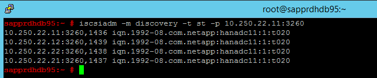

4. Run the following command on *both* nodes to sign in to the iSCSI device. 

    ```
    iscsiadm -m node -l
    ```
    
    The results show four sessions.
    
    

5. Use the following command to run the *rescan-scsi-bus.sh* rescan script. This script shows the new disks created for you.  Run it on *both* nodes.

    ```
    rescan-scsi-bus.sh
    ```
    
    The results should show a LUN number greater than zero (for example: 1, 2, and so on).
     
    

6. To get the device name, run the following command on *both* nodes. 

    ```
      fdisk –l
    ```
    
    In the results, choose the device with the size of 178 MiB.
    
    

## Initialize the SBD device

1. Use the following command to initialize the SBD device on *both* nodes.

    ```
    sbd -d <SBD Device Name> create
    ```
    

2. Use the following command on *both* nodes to check what has been written to the device.

    ```
    sbd -d <SBD Device Name> dump
    ```

## Configure the SUSE HA cluster

1. Use the following command to check whether ha_sles and SAPHanaSR-doc patterns are installed on *both* nodes. If they're not installed, install them.

    ```
    zypper in -t pattern ha_sles
    zypper in SAPHanaSR SAPHanaSR-doc
    ```
    
    
    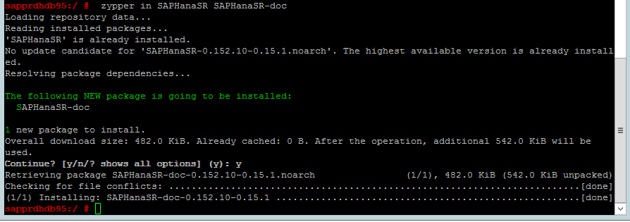
    
2. Set up the cluster by using either the `ha-cluster-init` command or the yast2 wizard. In this example, we're using the yast2 wizard. Do this step only on the *primary node*.

    1. Go to **yast2** > **High Availability** > **Cluster**.
    
        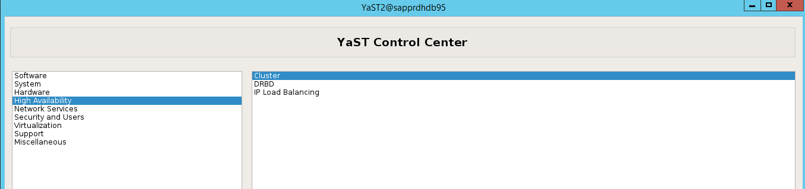        
                
    1. In the dialog that appears about the hawk package installation, select **Cancel** because the halk2 package is already installed.
    
        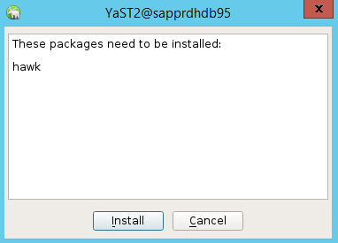
                    
    1. In the dialog that appears about continuing, select **Continue**.
    
                
        
    1. The expected value is the number of nodes deployed (in this case, 2). Select **Next**.  

     
        
    1. Add node names, and then select **Add suggested files**.

        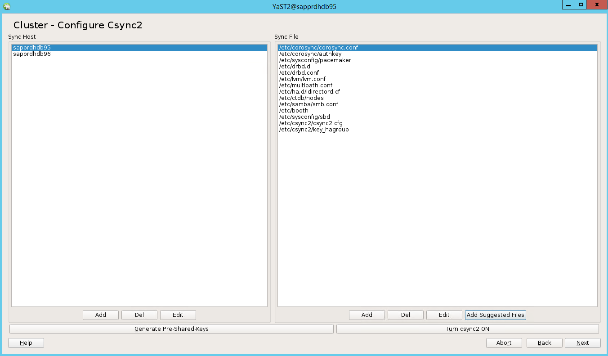
        
    1. Select **Turn csync2 ON**.
    
    1. Select **Generate Pre-Shared-Keys**. 
    
    1. In the pop-up message that appears, select **OK**.
    
        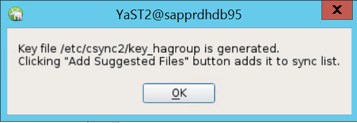
        
    1. The authentication is performed using the IP addresses and preshared keys in Csync2. The key file is generated with `csync2 -k /etc/csync2/key_hagroup`. 
    
        Manually copy the file *key_hagroup* to all members of the cluster after it's created. Be sure to copy the file from node1 to node2. Then select **Next**.
        
        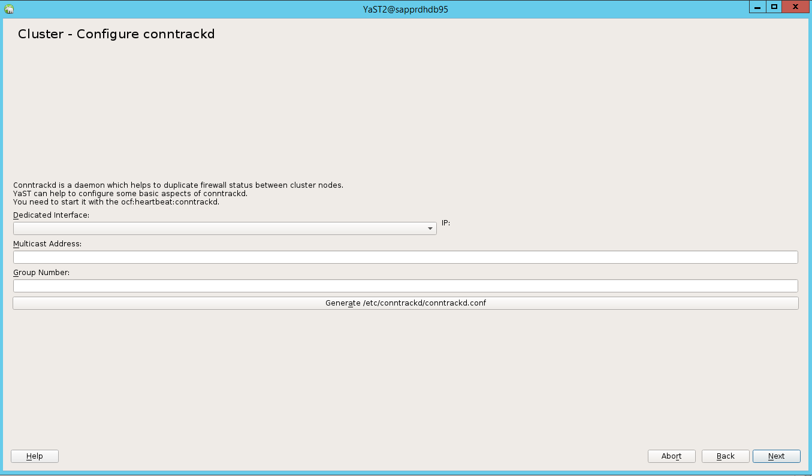
        
    1. In the default option, **Booting** was **Off**. Change it to **On**, so the pacemaker service is started on boot. You can make the choice based on your setup requirements.

        
    
    1. Select **Next**, and the cluster configuration is complete.

## Set up the softdog watchdog

1. Add the following line to */etc/init.d/boot.local* on *both* nodes.
    
    ```
    modprobe softdog
    ```
    
    
2. Use the following command to update the file */etc/sysconfig/sbd* on *both* nodes.
    
    ```
    SBD_DEVICE="<SBD Device Name>"
    ```
    
    
3. Load the kernel module on *both* nodes by running the following command.
    
    ```
    modprobe softdog
    ```
    

4. Use the following command to ensure that softdog is running on *both* nodes.
    
    ```
    lsmod | grep dog
    ```
    
    
5. Use the following command to start the SBD device on *both* nodes.

    ```
    /usr/share/sbd/sbd.sh start
    ```
    
    
6. Use the following command to test the SBD daemon on *both* nodes. 
    
    ```
    sbd -d <SBD Device Name> list
    ```
    The results show two entries after configuration on both nodes.    
    
    
    
7. Send the following test message to *one* of your nodes.

    ```
    sbd  -d <SBD Device Name> message <node2> <message>
    ```
    
8. On the *second* node (node2), use the following command to check the message status.
    
    ```
    sbd  -d <SBD Device Name> list
    ```
    
    
9. To adopt the SBD configuration, update the file */etc/sysconfig/sbd* as follows on *both* nodes.

    ```
    SBD_DEVICE=" <SBD Device Name>" 
    SBD_WATCHDOG="yes" 
    SBD_PACEMAKER="yes" 
    SBD_STARTMODE="clean" 
    SBD_OPTS=""
    ```
10.	Use the following command to start the pacemaker service on the *primary node* (node1).

    ```
    systemctl start pacemaker
    ```
    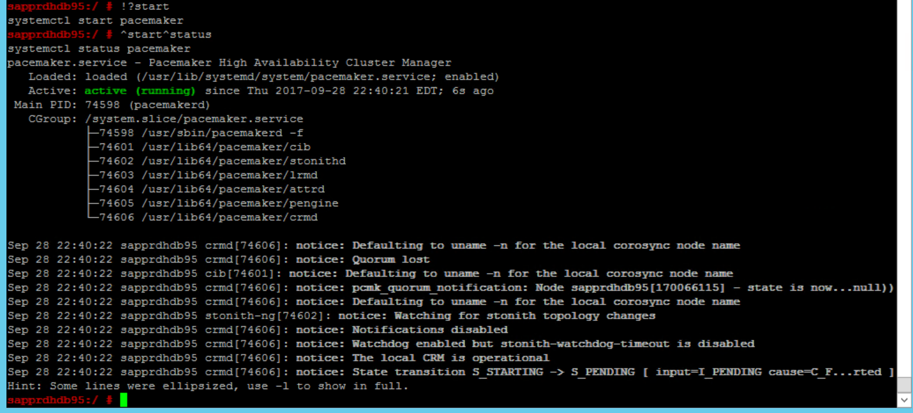
    
    If the pacemaker service fails, see the section [Scenario 5: Pacemaker service fails](#scenario-5-pacemaker-service-fails) later in this article.

## Join the node to the cluster

Run the following command on *node2* to let that node join the cluster.

```
ha-cluster-join
```

If you receive an error during joining of the cluster, see the section [Scenario 6: Node2 can't join the cluster](#scenario-6-node2-cant-join-the-cluster) later in this article.

## Validate the cluster

1. Use the following commands to check and optionally start the cluster for the first time on *both* nodes.
    
     ```
    systemctl status pacemaker
    systemctl start pacemaker
    ```
    
        
2. Run the following command to ensure that *both* nodes are online. You can run it on *any of the nodes* of the cluster.
    
    ```
    crm_mon
    ```
    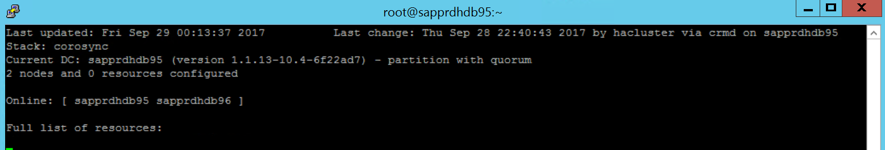
    
    You can also sign in to hawk to check the cluster status: `https://\<node IP>:7630`. The default user is **hacluster**, and the password is **linux**. If needed, you can change the password by using the `passwd` command.
    
## Configure cluster properties and resources

This section describes the steps to configure the cluster resources.
In this example, you set up the following resources. You can configure the rest (if needed) by referencing the SUSE HA guide.

- Cluster bootstrap
- Fencing device
- Virtual IP address

Do the configuration on the *primary node* only.

1. Create the cluster bootstrap file and configure it by adding the following text.
    
    ```
    sapprdhdb95:~ # vi crm-bs.txt
    # enter the following to crm-bs.txt
    property $id="cib-bootstrap-options" \
    no-quorum-policy="ignore" \
    stonith-enabled="true" \
    stonith-action="reboot" \
    stonith-timeout="150s"
    rsc_defaults $id="rsc-options" \
    resource-stickiness="1000" \
    migration-threshold="5000"
    op_defaults $id="op-options" \
    timeout="600"
    ```

2. Use the following command to add the configuration to the cluster.

    ```
    crm configure load update crm-bs.txt
    ```
    
    
3. Configure the fencing device by adding the resource, creating the file, and adding text as follows.

    ```
    # vi crm-sbd.txt
    # enter the following to crm-sbd.txt
    primitive stonith-sbd stonith:external/sbd \
    params pcmk_delay_max="15"
    ```
    Use the following command to add the configuration to the cluster.
        
    ```
    crm configure load update crm-sbd.txt
    ```
        
4. Add the virtual IP address for the resource by creating the file and adding the following text.

    ```
    # vi crm-vip.txt
    primitive rsc_ip_HA1_HDB10 ocf:heartbeat:IPaddr2 \
    operations $id="rsc_ip_HA1_HDB10-operations" \
    op monitor interval="10s" timeout="20s" \
    params ip="10.35.0.197"
    ```
    
    Use the following command to add the configuration to the cluster.
    
    ```
    crm configure load update crm-vip.txt
    ```
        
5. Use the `crm_mon` command to validate the resources. 

    The results show the two resources.

    

    You can also check the status at *https://\<node IP address>:7630/cib/live/state*.
    
    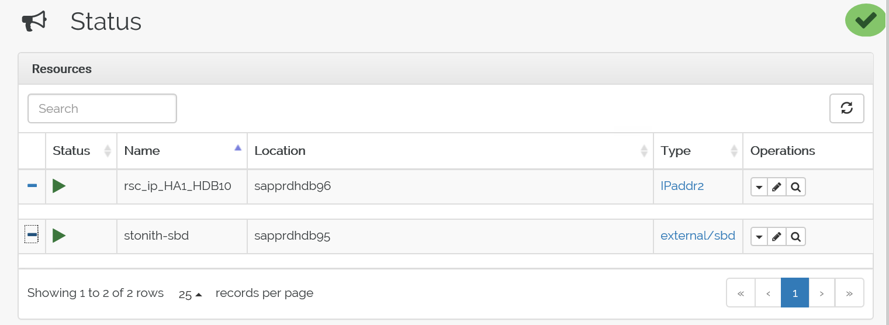
    
## Test the failover process

1. To test the failover process, use the following command to stop the pacemaker service on node1.

    ```
    Service pacemaker stop
    ```
    
    The resources fail over to node2.

2. Stop the pacemaker service on node2, and resources fail over to node1.

    Here's the status before failover:  
    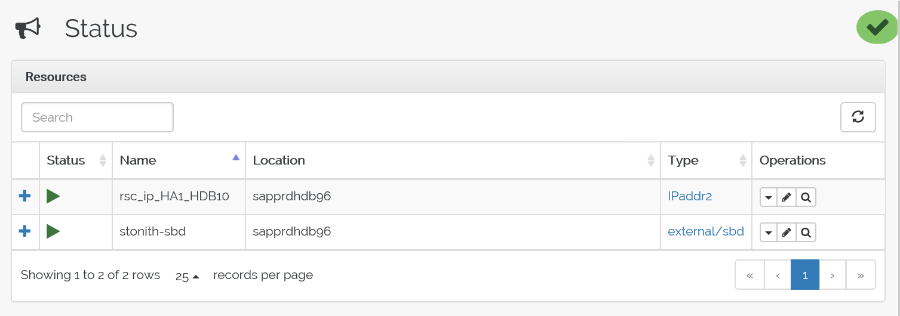  
    
    Here's the status after failover:  
    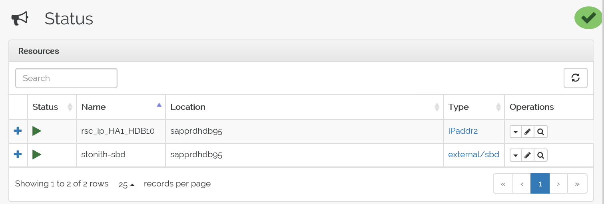
    
      
    

## Troubleshooting

This section describes failure scenarios that you might encounter during setup.

### Scenario 1: Cluster node not online

If any of the nodes don't show online in Cluster Manager, you can try this procedure to bring it online.

1. Use the following command to start the iSCSI service.

    ```
    service iscsid start
    ```
    
2. Use the following command to sign in to that iSCSI node.

    ```
    iscsiadm -m node -l
    ```
    
    The expected output looks like:

    ```
    sapprdhdb45:~ # iscsiadm -m node -l
    Logging in to [iface: default, target: iqn.1992-08.com.netapp:hanadc11:1:t020, portal: 10.250.22.11,3260] (multiple)
    Logging in to [iface: default, target: iqn.1992-08.com.netapp:hanadc11:1:t020, portal: 10.250.22.12,3260] (multiple)
    Logging in to [iface: default, target: iqn.1992-08.com.netapp:hanadc11:1:t020, portal: 10.250.22.22,3260] (multiple)
    Logging in to [iface: default, target: iqn.1992-08.com.netapp:hanadc11:1:t020, portal: 10.250.22.21,3260] (multiple)
    Login to [iface: default, target: iqn.1992-08.com.netapp:hanadc11:1:t020, portal: 10.250.22.11,3260] successful.
    Login to [iface: default, target: iqn.1992-08.com.netapp:hanadc11:1:t020, portal: 10.250.22.12,3260] successful.
    Login to [iface: default, target: iqn.1992-08.com.netapp:hanadc11:1:t020, portal: 10.250.22.22,3260] successful.
    Login to [iface: default, target: iqn.1992-08.com.netapp:hanadc11:1:t020, portal: 10.250.22.21,3260] successful.
    ```
### Scenario 2: Yast2 doesn't show graphical view

The yast2 graphical screen is used to set up the high-availability cluster in this article. If yast2 doesn't open with the graphical window as shown, and it throws a Qt error, take the following steps to install the required packages. If it opens with the graphical window, you can skip the steps.

Here's an example of the Qt error:

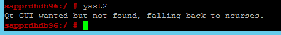

Here's an example of the expected output:


1. Make sure that you're logged in as user "root" and have SMT set up to download and install the packages.

2. Go to **yast** > **Software** > **Software Management** > **Dependencies**, and then select **Install recommended packages**. 

    >[!NOTE]
    >Perform the steps on *both* nodes, so that you can access the yast2 graphical view from both nodes.
    
    The following screenshot shows the expected screen.
    
    
    
3. Under **Dependencies**, select **Install Recommended Packages**.

    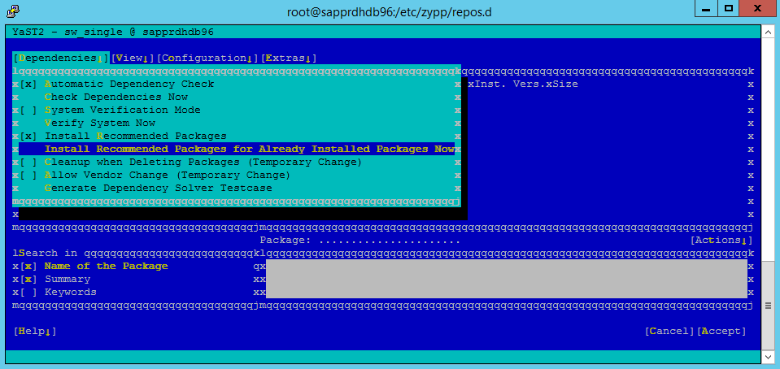

4. Review the changes and select **OK**.

    

    The package installation proceeds.

    

5. Select **Next**.    

6. When the **Installation Successfully Finished** screen appears, select **Finish**.

    

7. Use the following commands to install the libqt4 and libyui-qt packages.
    
    ```
    zypper -n install libqt4
    ```
    
    
    ```
    zypper -n install libyui-qt
    ```
    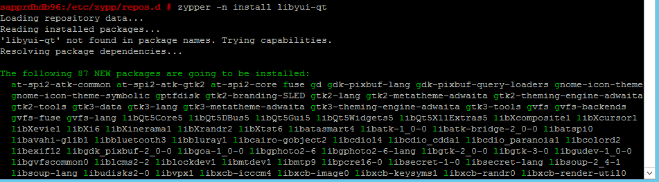
    
    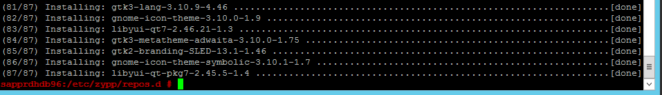
    
    Yast2 can now open the graphical view.

    

### Scenario 3: Yast2 doesn't show the high-availability option

For the high-availability option to be visible on the yast2 control center, you need to install the other packages.

1. Go to **Yast2** > **Software** > **Software Management**. Then select **Software** > **Online Update**.  

    

2. Select patterns for the following items. Then select **Accept**.

    - SAP HANA server base
    - C/C++ compiler and tools
    - High availability
    - SAP application server base

    

    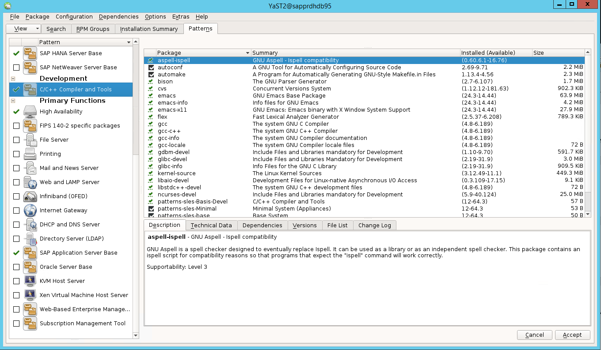

4. In the list of packages that have been changed to resolve dependencies, select **Continue**.

    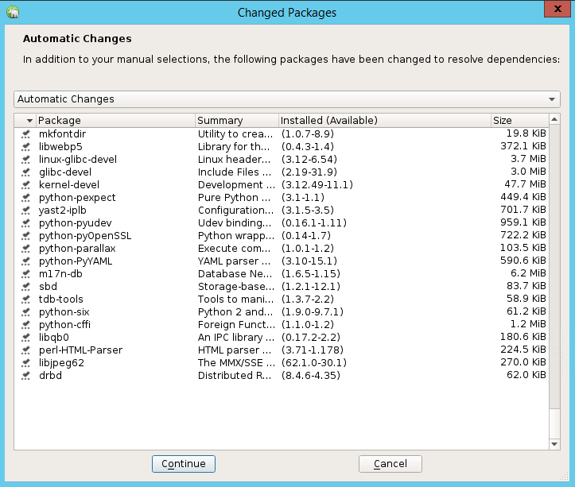

4. On the **Performing Installation** status page, select **Next**.

    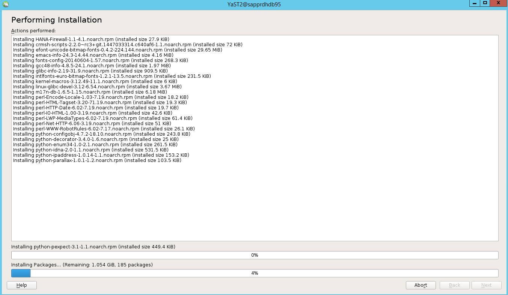

5. When the installation is complete, an installation report appears. Select **Finish**.

    

### Scenario 4: HANA installation fails with gcc assemblies error

If the HANA installation fails, you might get the following error.


To fix the problem, install the libgcc_sl and libstdc++6 libraries as shown in the following screenshot.

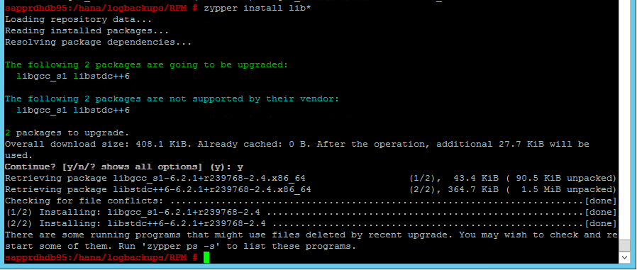

### Scenario 5: Pacemaker service fails

The following information appears if the pacemaker service can't start.

```
sapprdhdb95:/ # systemctl start pacemaker
A dependency job for pacemaker.service failed. See 'journalctl -xn' for details.
```
```
sapprdhdb95:/ # journalctl -xn
-- Logs begin at Thu 2017-09-28 09:28:14 EDT, end at Thu 2017-09-28 21:48:27 EDT. --
Sep 28 21:48:27 sapprdhdb95 corosync[68812]: [SERV  ] Service engine unloaded: corosync configuration map
Sep 28 21:48:27 sapprdhdb95 corosync[68812]: [QB    ] withdrawing server sockets
Sep 28 21:48:27 sapprdhdb95 corosync[68812]: [SERV  ] Service engine unloaded: corosync configuration ser
Sep 28 21:48:27 sapprdhdb95 corosync[68812]: [QB    ] withdrawing server sockets
Sep 28 21:48:27 sapprdhdb95 corosync[68812]: [SERV  ] Service engine unloaded: corosync cluster closed pr
Sep 28 21:48:27 sapprdhdb95 corosync[68812]: [QB    ] withdrawing server sockets
Sep 28 21:48:27 sapprdhdb95 corosync[68812]: [SERV  ] Service engine unloaded: corosync cluster quorum se
Sep 28 21:48:27 sapprdhdb95 corosync[68812]: [SERV  ] Service engine unloaded: corosync profile loading s
Sep 28 21:48:27 sapprdhdb95 corosync[68812]: [MAIN  ] Corosync Cluster Engine exiting normally
Sep 28 21:48:27 sapprdhdb95 systemd[1]: Dependency failed for Pacemaker High Availability Cluster Manager
-- Subject: Unit pacemaker.service has failed
-- Defined-By: systemd
-- Support: https://lists.freedesktop.org/mailman/listinfo/systemd-devel
--
-- Unit pacemaker.service has failed.
--
-- The result is dependency.
```
```
sapprdhdb95:/ # tail -f /var/log/messages
2017-09-28T18:44:29.675814-04:00 sapprdhdb95 corosync[57600]:   [QB    ] withdrawing server sockets
2017-09-28T18:44:29.676023-04:00 sapprdhdb95 corosync[57600]:   [SERV  ] Service engine unloaded: corosync cluster closed process group service v1.01
2017-09-28T18:44:29.725885-04:00 sapprdhdb95 corosync[57600]:   [QB    ] withdrawing server sockets
2017-09-28T18:44:29.726069-04:00 sapprdhdb95 corosync[57600]:   [SERV  ] Service engine unloaded: corosync cluster quorum service v0.1
2017-09-28T18:44:29.726164-04:00 sapprdhdb95 corosync[57600]:   [SERV  ] Service engine unloaded: corosync profile loading service
2017-09-28T18:44:29.776349-04:00 sapprdhdb95 corosync[57600]:   [MAIN  ] Corosync Cluster Engine exiting normally
2017-09-28T18:44:29.778177-04:00 sapprdhdb95 systemd[1]: Dependency failed for Pacemaker High Availability Cluster Manager.
2017-09-28T18:44:40.141030-04:00 sapprdhdb95 systemd[1]: [/usr/lib/systemd/system/fstrim.timer:8] Unknown lvalue 'Persistent' in section 'Timer'
2017-09-28T18:45:01.275038-04:00 sapprdhdb95 cron[57995]: pam_unix(crond:session): session opened for user root by (uid=0)
2017-09-28T18:45:01.308066-04:00 sapprdhdb95 CRON[57995]: pam_unix(crond:session): session closed for user root
```

To fix it, delete the following line from the file */usr/lib/systemd/system/fstrim.timer*:

```
Persistent=true
```
    


### Scenario 6: Node2 can't join the cluster

The following error appears if there's a problem with joining node2 to the existing cluster through the *ha-cluster-join* command.

```
ERROR: Can’t retrieve SSH keys from <Primary Node>
```

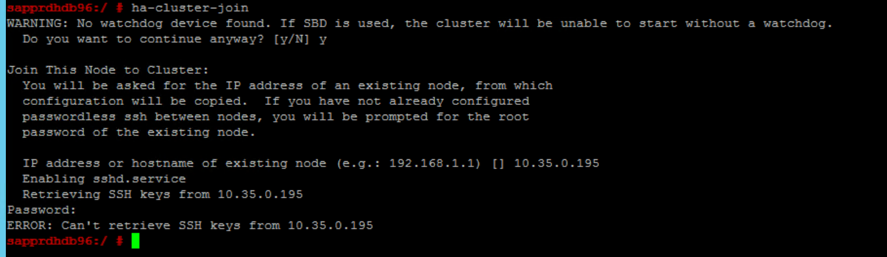

To fix it:

1. Run the following commands on *both nodes*.

    ```
    ssh-keygen -q -f /root/.ssh/id_rsa -C 'Cluster Internal' -N ''
    cat /root/.ssh/id_rsa.pub >> /root/.ssh/authorized_keys
    ```

    

    

2. Confirm that node2 is added to the cluster.

    

## Next steps

You can find more information on SUSE HA setup in the following articles: 

- [SAP HANA SR Performance Optimized Scenario](https://www.suse.com/support/kb/doc/?id=000019450) (SUSE website)
- [Fencing and fencing devices](https://documentation.suse.com/sle-ha/15-SP1/html/SLE-HA-all/cha-ha-fencing.html) (SUSE website)
- [Be Prepared for Using Pacemaker Cluster for SAP HANA – Part 1: Basics](https://blogs.sap.com/2017/11/19/be-prepared-for-using-pacemaker-cluster-for-sap-hana-part-1-basics/) (SAP blog)
- [Be Prepared for Using Pacemaker Cluster for SAP HANA – Part 2: Failure of Both Nodes](https://blogs.sap.com/2017/11/19/be-prepared-for-using-pacemaker-cluster-for-sap-hana-part-2-failure-of-both-nodes/) (SAP blog)
- [OS backup and restore](large-instance-os-backup.md)
