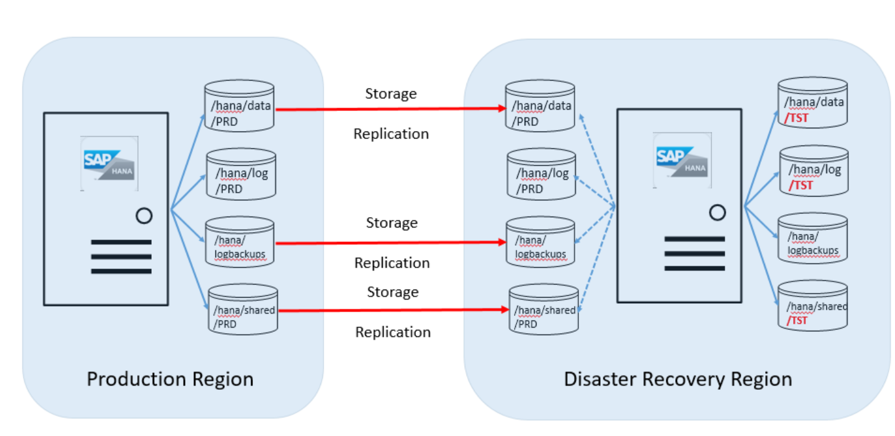
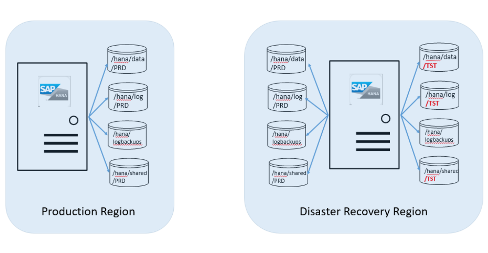
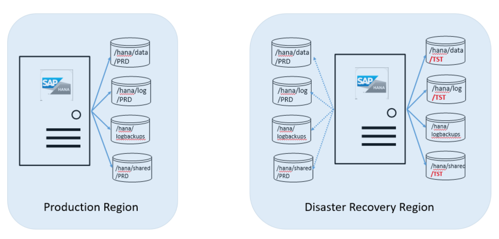
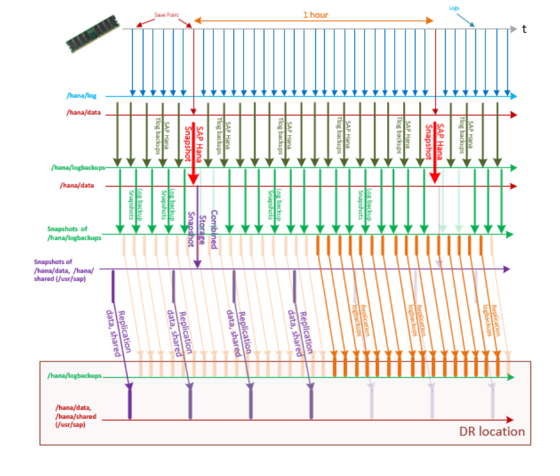

# Disaster Recovery principles and preparation

In this article, we'll discuss important disaster recovery (DR) principles for HANA Large Instances (otherwise known as BareMetal Infrastructure). We'll walk through the steps you need to take in preparation for disaster recovery. You'll also see how to achieve your recovery time objective (RTO) and recovery point objective (RPO) in a disaster. 

## DR principles for HANA Large Instances

HANA Large Instances offer disaster recovery functionality between HANA Large Instance stamps in different Azure regions. For instance, let's say you deploy HANA Large Instances in the US West region of Azure. Then you can use the HANA Large Instances in the US East region as disaster recovery units. Disaster recovery isn't configured automatically, because it requires you to pay for another HANA Large Instance in the DR region. The disaster recovery setup works for scale-up and scale-out setups. 

Most customers use the unit in the DR region to run non-production systems that use an installed HANA instance. The HANA Large Instance needs to be of the same SKU as the SKU used for production purposes. The following image shows what the disk configuration between the server unit in the Azure production region and the disaster recovery region looks like:

As shown in this overview graphic, you'll need to order a second set of disk volumes. The target disk volumes associated with the HANA Large Instance server in the DR site are the same size as the production volumes. 

The following volumes are replicated from the production region to the DR site:

- /hana/data
- /hana/logbackups 
- /hana/shared (includes /usr/sap)

The /hana/log volume isn't replicated. The SAP HANA transaction log isn't needed when restoring from those volumes.

## HANA Large Instance storage replication 

The basis of the DR functionality in the HANA Large Instance infrastructure is its storage replication. The functionality used on the storage side isn't a constant stream of changes that replicate in an asynchronous manner as changes happen to the storage volume. Instead, it's a mechanism that relies on creating snapshots of these volumes regularly. The delta between an already replicated snapshot and a new snapshot that isn't yet replicated is then transferred to the DR site into target disk volumes. These snapshots are stored on the volumes. If there's a disaster recovery failover, they need to be restored on those volumes.  

The first transfer of the complete data of the volume should happen before the amount of data becomes smaller than the deltas between snapshots. Then the volumes in the DR site will contain all of the volume snapshots taken in the production site. Eventually, you can use that DR system to get to an earlier status to recover lost data, without rolling back the production system.

If there's an MCOD deployment with multiple independent SAP HANA instances on one HANA Large Instance, all SAP HANA instances should have storage replicated to the DR side.

When you use HANA System Replication for high-availability in your production site, and you use storage-based replication for the DR site, the volumes of both nodes from the primary site to the DR instance are replicated. Purchase extra storage (same size as primary node) at the DR site to accommodate replication from both primary and secondary nodes to the DR. 

>[!NOTE]
>The HANA Large Instance storage replication functionality mirrors and replicates storage snapshots. If you don't take storage snapshots as described in [Backup and restore](hana-backup-restore.md), there can't be any replication to the DR site. Storage snapshot execution is a prerequisite to storage replication to the disaster recovery site.

## Preparation of the disaster recovery scenario
In this DR scenario, you have a production system running on HANA Large Instances in the production Azure region. For the steps that follow, let's say the SID of that HANA system is "PRD." You also have a non-production system running on HANA Large Instances in the DR Azure region. Its SID is "TST." The following image shows this configuration:

Let's say the server instance hasn't yet been ordered with the extra storage volume set. Then SAP HANA on Azure Service Management attaches the added volumes. They're a target for the production replica to the HANA Large Instance on which you're running the TST HANA instance. You'll need to provide the SID of your production HANA instance. After SAP HANA on Azure Service Management confirms the attachment of those volumes, you'll need to mount those volumes to the HANA Large Instance.

The next step is for you to install the second SAP HANA instance on the HANA Large Instance in the DR Azure region where you run the TST HANA instance. The newly installed SAP HANA instance needs to have the same SID. The users created need to have the same UID and Group ID as the production instance. Read [Backup and restore](hana-backup-restore.md) for details. If the installation succeeds, you need to:

- Execute step 2 of the storage snapshot preparation described in [Backup and restore](hana-backup-restore.md).
- Create a public key for the DR unit of the HANA Large Instance if you haven't yet done so. See step 3 of the storage snapshot preparation described in [Backup and restore](hana-backup-restore.md).
- Maintain the *HANABackupCustomerDetails.txt* with the new HANA instance and test whether connectivity into storage works correctly.  
- Stop the newly installed SAP HANA instance on the HANA Large Instance in the DR Azure region.
- Unmount these PRD volumes and contact SAP HANA on Azure Service Management. The volumes can't stay mounted to the unit because they can't be accessible while functioning as the storage replication target.  

The operations team establishes the replication relationship between the PRD volumes in the production region and the PRD volumes in the DR region.

>[!IMPORTANT]
>The /hana/log volume isn't replicated because it isn't necessary to restore the replicated SAP HANA database to a consistent state in the disaster recovery site.

Next, set the storage snapshot backup schedule to achieve your RTO and RPO if there's a disaster. To minimize the RPO, set the following replication intervals in the HANA Large Instance service:
- For the volumes covered by the combined snapshot (snapshot type **hana**), set to replicate every 15 minutes to the equivalent storage volume targets in the disaster recovery site.
- For the transaction log backup volume (snapshot type **logs**), set to replicate every 3 minutes to the equivalent storage volume targets in the disaster recovery site.

To minimize the RPO:
- Take a **hana** type storage snapshot every 30 minutes to 1 hour. For more information, see [Back up using Azure Application Consistent Snapshot tool](../../azure-netapp-files/azacsnap-cmd-ref-backup.md).
- Do SAP HANA transaction log backups every 5 minutes.
- Take a **logs** type storage snapshot every 5-15 minutes. With this interval period, you achieve an RPO of around 15-25 minutes.

With this setup, the sequence of transaction log backups, storage snapshots, and the replication of the HANA transaction log backup volume and /hana/data, and /hana/shared (includes /usr/sap) might look like the data shown in this graphic:

 

To achieve an even better RPO in the disaster recovery case, you can copy the HANA transaction log backups from SAP HANA on Azure (Large Instances) to the other Azure region. To achieve this further RPO reduction, take the following steps:

1. Back up the HANA transaction log as frequently as possible to /hana/logbackups.
1. Use rsync to copy the transaction log backups to the NFS share-hosted Azure virtual machines. The virtual machines (VMs) are in Azure virtual networks in the Azure production region and in the DR region. Connect both Azure virtual networks to the circuit connecting the production HANA Large Instances to Azure. For more information, see [Network considerations for disaster recovery with HANA Large Instances](hana-overview-high-availability-disaster-recovery.md#network-considerations-for-disaster-recovery-with-hana-large-instances). 
1. Keep the transaction log backups in the region of the VM attached to the NFS exported storage.
1. In a disaster failover case, supplement the transaction log backups you find on the /hana/logbackups volume with more recently taken transaction log backups on the NFS share in the DR site. 
1. Start a transaction log backup to restore to the latest backup that might be saved over to the DR region.

When HANA Large Instance operations confirms the replication relationship setup, and you start the execution storage snapshot backups, the data replication begins.

As the replication progresses, the snapshots on the PRD volumes in the DR Azure regions aren't restored. The snapshots are only stored. If the volumes are mounted in such a state, they represent the state in which you unmounted those volumes after the PRD SAP HANA instance was installed on the server in the DR Azure region. They also represent the storage backups that aren't yet restored.

If there's a failover, you can also choose to restore to an older storage snapshot instead of to the latest storage snapshot.

## Next steps

Learn about the disaster recovery failover procedure.

> [!div class="nextstepaction"]
> [Disaster recovery failover procedure](hana-failover-procedure.md)
