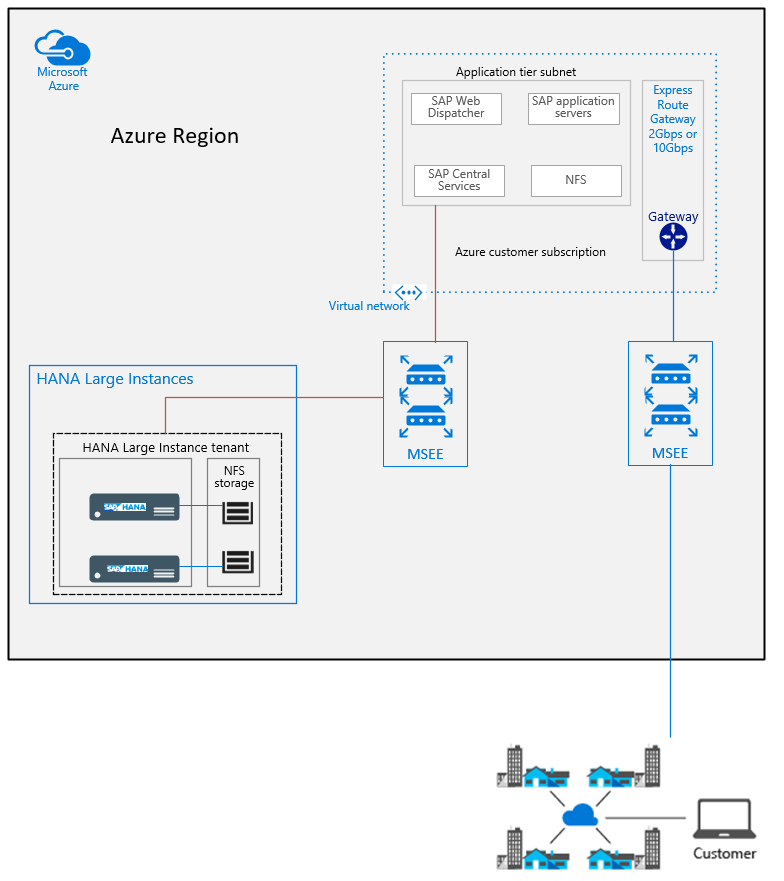
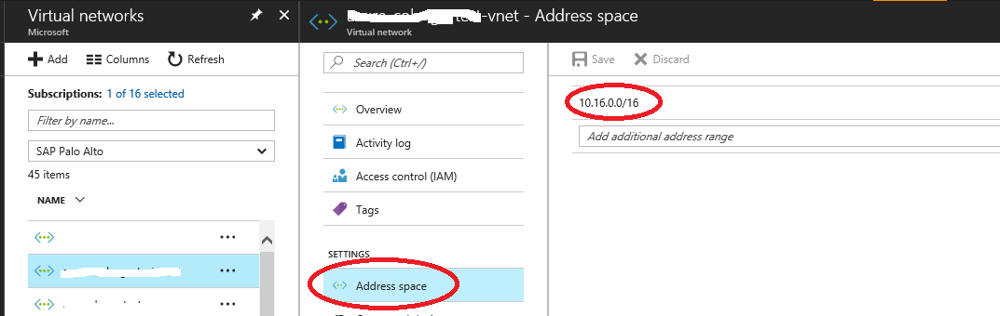
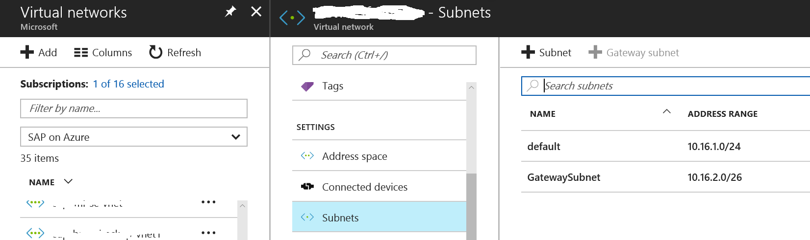
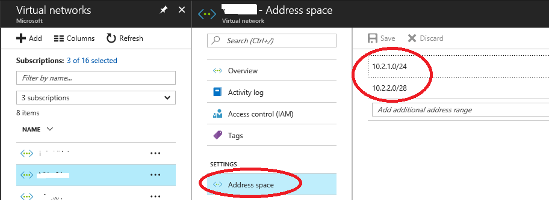
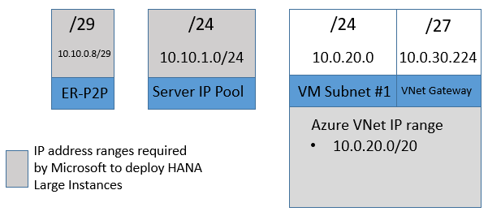

# Connecting Azure VMs to HANA Large Instances

In this article, we'll look at what's involved in connecting your Azure VMs to HANA Large Instances (otherwise known as BareMetal Infrastructure instances). 

The article [What is SAP HANA on Azure (Large Instances)?](./hana-overview-architecture.md) mentions that the minimal deployment of HANA Large Instances with the SAP application layer in Azure looks like this:

Looking closer at the Azure virtual network side, you'll need:

- The definition of an Azure virtual network into which you're going to deploy the VMs of the SAP application layer.
- The definition of a default subnet in the Azure virtual network that is really the one into which the VMs are deployed.
- The Azure virtual network that's created needs to have at least one VM subnet and one Azure ExpressRoute virtual network gateway subnet. These subnets should be assigned the IP address ranges as specified and discussed in the following sections.

## Create the Azure virtual network for HANA Large Instances

>[!Note]
>The Azure virtual network for HANA Large Instances must be created by using the Azure Resource Manager deployment model. The older Azure deployment model, commonly known as the classic deployment model, isn't  supported by the HANA Large Instance solution.

You can use the Azure portal, PowerShell, an Azure template, or the Azure CLI to create the virtual network. (For more information, see [Create a virtual network using the Azure portal](../../virtual-network/manage-virtual-network.md#create-a-virtual-network)). In the following example, we look at a virtual network that's created by using the Azure portal.

In this documentation, **address space** refers to the address space that the Azure virtual network is allowed to use. This address space is also the address range that the virtual network uses for BGP route propagation. This **address space** can be seen here:

In the previous example, with 10.16.0.0/16, the Azure virtual network was given a rather large and wide IP address range to use. All the IP address ranges of subsequent subnets within this virtual network can have their ranges within that address space. We  don't usually recommend such a large address range for a single virtual network in Azure. But let's look into the subnets defined in the Azure virtual network:

You see a virtual network with a first VM subnet (here called "default") and a subnet called "GatewaySubnet".

In the two previous images, the **virtual network address space** covers both **the subnet IP address range of the Azure VM** and that of the virtual network gateway.

You can restrict the **virtual network address space** to the specific ranges used by each subnet. You can also define the **virtual network address space** of a virtual network as multiple specific ranges, as shown here:

In this case, the **virtual network address space** has two spaces defined. They're the same as the IP address ranges defined for the subnet IP address range of the Azure VM and the virtual network gateway. 

You can use any naming standard you like for these tenant subnets (VM subnets). However, **there must always be one, and only one, gateway subnet for each virtual network** that connects to the SAP HANA on Azure (Large Instances) ExpressRoute circuit. **This gateway subnet has to be named "GatewaySubnet"** to make sure the ExpressRoute gateway is properly placed.

> [!WARNING] 
> It's critical that the gateway subnet always be named "GatewaySubnet".

You can use multiple VM subnets and non-contiguous address ranges. These address ranges must be covered by the **virtual network address space** of the virtual network. They can be in an aggregated form. They can also be in a list of the exact ranges of the VM subnets and the gateway subnet.

The following list summarizes important facts about Azure virtual networks that connect to HANA Large Instances:

- You must submit the **virtual network address space** to Microsoft when you're initially deploying HANA Large Instances. 
- The **virtual network address space** can be one larger range that covers the ranges for both the subnet IP address range of the Azure VM and the virtual network gateway.
- Or you can submit multiple ranges that cover the different IP address ranges of VM subnet IP address range(s) and the virtual network gateway IP address range.
- The defined **virtual network address space** is used for BGP routing propagation.
- The name of the gateway subnet must be: **"GatewaySubnet"**.
- The  address space is used as a filter on the HANA Large Instance side to allow or disallow traffic to the HANA Large Instance units from Azure. The BGP routing information of the Azure virtual network and the IP address ranges configured for filtering on the HANA Large Instance side should match. Otherwise, connectivity issues can occur.
- There are further important details about the gateway subnet. For more information, see [Connect a virtual network to HANA large instances](hana-connect-vnet-express-route.md).

## Different IP address ranges to be defined 

Some of the IP address ranges necessary for deploying HANA Large Instances have already been introduced. There are other important IP address ranges as well. Not all of the following IP address ranges need to be submitted to Microsoft. However, you do need to define them before sending a request for initial deployment:

- **Virtual network address space**: The **virtual network address space** is the IP address ranges that you assign to your address space parameter in the Azure virtual networks. These networks connect to the SAP HANA Large Instance environment. We recommend that this address space parameter is a multi-line value. It should consist of the subnet range of the Azure VM and the subnet range(s) of the Azure gateway. 
    
    This subnet range was shown in the previous graphics. It must NOT overlap with your on-premises or server IP pool or ER-P2P address ranges. How do you get these IP address range(s)? Your corporate network team or service provider should provide one or more IP address range(s) that aren't used inside your network. For example, the subnet of your Azure VM is 10.0.1.0/24, and the subnet of your Azure gateway subnet is 10.0.2.0/28.  We recommend that your Azure virtual network address space is defined as: 10.0.1.0/24 and 10.0.2.0/28. Although the  address space values can be aggregated, we recommend matching them to the subnet ranges. This way you can avoid accidentally reusing IP address ranges within larger address spaces elsewhere in your network. **The virtual network address space is an IP address range. It needs to be submitted to Microsoft when you ask for an initial deployment**.
- **Azure VM subnet IP address range:** This IP address range is the one you assign to the Azure virtual network subnet parameter. This parameter is in your Azure virtual network and connects to the SAP HANA Large Instance environment. This IP address range is used to assign IP addresses to your Azure VMs. The IP addresses out of this range are allowed to connect to your SAP HANA Large Instance server(s). If needed, you can use multiple Azure VM subnets. We recommend a /24 CIDR block for each Azure VM subnet. This address range must be a part of the values used in the Azure virtual network address space. How do you get this IP address range? Your corporate network team or service provider should provide an IP address range that isn't being used inside your network.
- **Virtual network gateway subnet IP address range:** Depending on the features that you plan to use, the recommended size is:
   - Ultra-performance ExpressRoute gateway: /26 address block--required for Type II class of SKUs.
   - Coexistence with VPN and ExpressRoute using a high-performance ExpressRoute virtual network gateway (or smaller): /27 address block.
   - All other situations: /28 address block. This address range must be a part of the values used in the "VNet address space" values. This address range must be a part of the values used in the Azure virtual network address space values that you submit to Microsoft. How do you get this IP address range? Your corporate network team or service provider should provide an IP address range that's not currently being used inside your network. 
- **Address range for ER-P2P connectivity:** This range is the IP range for your SAP HANA Large Instance ExpressRoute (ER) P2P connection. This range of IP addresses must be a /29 CIDR IP address range. This range must NOT overlap with your on-premises or other Azure IP address ranges. This IP address range is used to set up the ER connectivity from your ExpressRoute virtual gateway to the SAP HANA Large Instance servers. How do you get this IP address range? Your corporate network team or service provider should provide an IP address range that's not currently being used inside your network. **This range is an IP address range. It needs to be submitted to Microsoft when you ask for an initial deployment**.  
- **Server IP pool address range:** This IP address range is used to assign the individual IP address to HANA Large Instance servers. The recommended subnet size is a /24 CIDR block. If needed, it can be smaller, with as few as 64 IP addresses. From this range, the first 30 IP addresses are reserved for use by Microsoft. Make sure that you account for this when you choose the size of the range. This range must NOT overlap with your on-premises or other Azure IP addresses. How do you get this IP address range? Your corporate network team or service provider should provide an IP address range that's not currently being used inside your network.  **This range is an IP address range, which needs to be submitted to Microsoft when asking for an initial deployment**.

Optional IP address ranges to eventually submit to Microsoft:

- If you choose to use [ExpressRoute Global Reach](../../expressroute/expressroute-global-reach.md) to enable direct routing from on-premises to HANA Large Instance units, you need to reserve another /29 IP address range. This range may not overlap with any of the other IP addresses ranges you defined before.
- If you choose to use [ExpressRoute Global Reach](../../expressroute/expressroute-global-reach.md) to enable direct routing from a HANA Large Instance tenant in one Azure region to another HANA Large Instance tenant in another Azure region, you need to reserve another /29 IP address range. This range may not overlap with the other IP address ranges you defined before.

For more information about ExpressRoute Global Reach and usage around HANA large instances, see:

- [SAP HANA (Large Instances) network architecture](./hana-network-architecture.md)
- [Connect a virtual network to HANA large instances](./hana-connect-vnet-express-route.md)
 
You need to define and plan the IP address ranges previously described. However, you don't need to transmit all of them to Microsoft. The IP address ranges that you're required to name to Microsoft are:

- Azure virtual network address space(s)
- Address range for ER-P2P connectivity
- Server IP pool address range

If you add more virtual networks that need to connect to HANA Large Instances, submit the new Azure virtual network address space you're adding to Microsoft. 

The following example shows the different ranges and some example ranges you need to configure and eventually provide to Microsoft. The value for the Azure virtual network address space isn't aggregated in the first example. However, it's defined from the ranges of the first Azure VM subnet IP address range and the virtual network gateway subnet IP address range. 

You can use multiple VM subnets within the Azure virtual network when you configure and submit the other IP address ranges of the added VM subnet(s) as part of the Azure virtual network address space.

The preceding image doesn't show the added IP address range(s) required for the optional use of ExpressRoute Global Reach.

You can also aggregate the data that you submit to Microsoft. In that case, the address space of the Azure virtual network only includes one space. Using the IP address ranges from the earlier example, the aggregated virtual network address space could look like the following image:

In this example, instead of two smaller ranges that defined the address space of the Azure virtual network, we have one larger range that covers 4096 IP addresses. Such a large definition of the address space leaves some rather large ranges unused. Since the virtual network address space value(s) are used for BGP route propagation, using the unused ranges on-premises or elsewhere in your network can cause routing issues. The preceding graphic doesn't show the added IP address range(s) required for the optional use of ExpressRoute Global Reach.

We recommend that you keep the address space tightly aligned with the actual subnet address space that you use. If needed, you can always add new address space values later without incurring downtime on the virtual network.
 
> [!IMPORTANT] 
> Each IP address range in ER-P2P, the server IP pool, and the Azure virtual network address space must **NOT** overlap with one another or with any other range that's used in your network. Each must be discrete. As the two previous graphics show, they also can't be a subnet of any other range. If overlaps occur between ranges, the Azure virtual network might not connect to the ExpressRoute circuit.

## Next steps after address ranges have been defined
After the IP address ranges have been defined, the following things need to happen:

1. Submit the IP address ranges for the Azure virtual network address space, the ER-P2P connectivity, and server IP pool address range, together with other data that has been listed at the beginning of the document. At this point, you could also start to create the virtual network and the VM subnets. 
2. An ExpressRoute circuit is created by Microsoft between your Azure subscription and the HANA Large Instance stamp.
3. A tenant network is created on the Large Instance stamp by Microsoft.
4. Microsoft configures networking in the SAP HANA on Azure (Large Instances) infrastructure to accept IP addresses from your Azure virtual network address space that communicates with HANA Large Instances.
5. Depending on the specific SAP HANA on Azure (Large Instances) SKU that you bought, Microsoft assigns a compute unit in a tenant network. It also allocates and mounts storage, and installs the operating system (SUSE or Red Hat Linux). IP addresses for these units are taken out of the Server IP Pool address range you submitted to Microsoft.

At the end of the deployment process, Microsoft delivers the following data to you:
- Information that's needed to connect your Azure virtual network(s) to the ExpressRoute circuit that connects Azure virtual networks to HANA Large Instances:
     - Authorization key(s)
     - ExpressRoute PeerID
- Data for accessing HANA Large Instances after you establish the ExpressRoute circuit and Azure virtual network.

## Next steps

Learn about connecting a virtual network to HANA Large Instance ExpressRoute.

> [!div class="nextstepaction"]
> [Connect a virtual network to HANA large instances](hana-connect-vnet-express-route.md)
