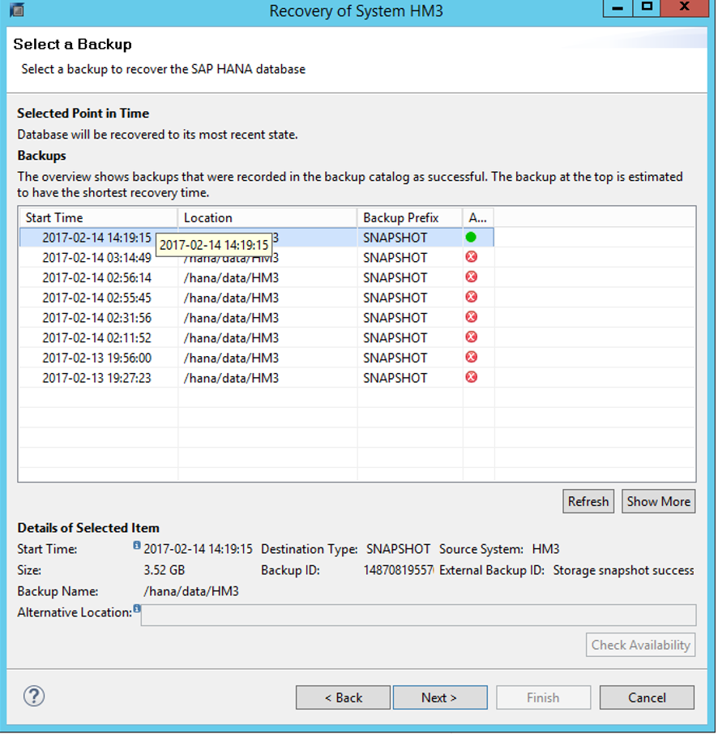

# Disaster recovery failover procedure

>[!IMPORTANT]
>This article isn't a replacement for the SAP HANA administration documentation or SAP Notes. We expect that you have a solid understanding of and expertise in SAP HANA administration and operations, especially for backup, restore, high availability, and disaster recovery (DR). In this article, screenshots from SAP HANA Studio are shown. Content, structure, and the nature of the screens of SAP administration tools and the tools themselves might change from SAP HANA release to release.

In this article, we'll walk through the steps of failover to a DR site for SAP HANA on Azure Large Instances (otherwise known as BareMetal Infrastructure). 

## Failover scenarios and options

There are two cases to consider when you fail over to a DR site:

- You need the SAP HANA database to go back to the latest status of data. In this case, there's a self-service script you can use to do the failover without the need to contact Microsoft. For the failback, you need to work with Microsoft.
- You want to restore to a storage snapshot that's not the latest replicated snapshot. In this case, you need to work with Microsoft. 

>[!NOTE]
>The following steps must be done on the HANA Large Instance in the DR site. 
 
To restore to the latest replicated storage snapshots, follow the steps in "Perform full DR failover - azure_hana_dr_failover" in [Microsoft snapshot tools for SAP HANA on Azure](https://github.com/Azure/hana-large-instances-self-service-scripts/blob/master/snapshot_tools_v4.3/Microsoft%20Snapshot%20Tools%20for%20SAP%20HANA%20on%20Azure%20v4.3.pdf). 

If you want to have multiple SAP HANA instances failed over, run the azure_hana_dr_failover command several times. When requested, enter the SAP HANA SID you want to fail over and restore. 

You can test the DR failover without impacting the actual replication relationship. To do a test failover, follow the steps in "Perform a test DR failover - azure_hana_test_dr_failover" in [Microsoft snapshot tools for SAP HANA on Azure](https://github.com/Azure/hana-large-instances-self-service-scripts/blob/master/snapshot_tools_v4.3/Microsoft%20Snapshot%20Tools%20for%20SAP%20HANA%20on%20Azure%20v4.3.pdf). 

>[!IMPORTANT]
>Do *not* run any production transactions on the instance that you created in the DR site through the process of **testing a failover**. The command azure_hana_test_dr_failover creates a set of volumes that have no relationship to the primary site. As a result, synchronization back to the primary site is *not* possible. 

If you want to test multiple SAP HANA instances, run the script several times. When requested, enter the SAP HANA SID of the instance you want to test for failover. 

## Set DR volumes to an earlier snapshot

Let's say you need to fail over to the DR site to rescue data deleted hours before and need the DR volumes to be set to an earlier snapshot. Then the following procedure applies: 

1. Shut down the nonproduction instance of HANA on the DR HANA Large Instance that you're running. A dormant HANA production instance is preinstalled.
1. Make sure that no SAP HANA processes are running. Use the following command for this check:

      `/usr/sap/hostctrl/exe/sapcontrol –nr <HANA instance number> - function GetProcessList`.

      The output should show you the **hdbdaemon** process in a stopped state and no other HANA processes in a running or started state.
1. Determine to which snapshot name or SAP HANA backup ID you want to have the disaster recovery site restored. In real disaster recovery cases, this snapshot is usually the latest snapshot. If you need to recover lost data, pick an earlier snapshot.
1. Contact Azure Support through a high-priority support request. Ask for the restore of that snapshot with the name and date of the snapshot. You can also identify it by the HANA backup ID on the DR site. The default is for the operations side to restore the /hana/data volume only. If you want to have the /hana/logbackups volumes too, you need to specifically state that. *Don't restore the /hana/shared volume.* Instead, choose specific files like global.ini out of the **.snapshot** directory and its subdirectories after you remount the /hana/shared volume for PRD. 

   Microsoft operations will take these steps:

   a. Stop the replication of snapshots from the production volume to the disaster recovery volumes. This disruption might have already happened if an outage at the production site caused the disaster.
   
   b. Restore the storage snapshot name or snapshot with the backup ID you chose on the disaster recovery volumes.
   
After the restore, the disaster recovery volumes are available to be mounted to the HANA Large Instances in the DR region.
      
1. Mount the disaster recovery volumes to the HANA Large Instance unit in the disaster recovery site. 
1. Start the dormant SAP HANA production instance.
1. Let's say you chose to copy transaction log backup logs to reduce the recovery point objective (RPO) time. Then merge the transaction log backups into the newly mounted DR /hana/logbackups directory. Don't overwrite existing backups. Copy newer backups that weren't replicated with the latest replication of a storage snapshot.
1. You can also restore single files out of the snapshots that weren't replicated to the /hana/shared/PRD volume in the DR Azure region.

## Recover the SAP HANA production instance

The following steps show how to recover the SAP HANA production instance from the restored storage snapshot and the available transaction log backups.

1. Change the backup location to **/hana/logbackups** by using SAP HANA Studio.

   

1. SAP HANA scans through the backup file locations and suggests the most recent transaction log backup to restore to. The scan can take a few minutes until a screen like the following appears:

   

1. Adjust some of the default settings:

      - Clear **Use Delta Backups**.
      - Select **Initialize Log Area**.

   

1. Select **Finish**.

   

A progress window, like the one shown here, should appear. Keep in mind that the example is of a disaster recovery restore of a three-node scale-out SAP HANA configuration.

If the restore stops responding at the **Finish** screen and doesn't show the progress screen, confirm that all the SAP HANA instances on the worker nodes are running. If necessary, start the SAP HANA instances manually.

## Failback from a DR to a production site

You can fail back from a DR site to a production site. Let's look at a scenario where failover into the DR site was caused by problems in the production Azure region and not by your need to recover lost data. 

You've been running your SAP production workload for a while in the disaster recovery site. As the problems in the production site are resolved, you want to fail back to your production site. Because you can't lose data, the step back into the production site involves several steps and close cooperation with the SAP HANA on Azure operations team. It's up to you to trigger the operations team to start synchronizing back to the production site after the problems are resolved.

Follow these steps:

1. The SAP HANA on Azure operations team gets the trigger to synchronize the production storage volumes from the DR storage volumes, which now represent the production state. In this state, the HANA Large Instance in the production site is shut down.
1. The SAP HANA on Azure operations team monitors the replication and makes sure that it's caught up before they inform you.
1. You shut down the applications that use the production HANA Instance in the disaster recovery site. You then do a HANA transaction log backup. Next, you stop the HANA instance that's running on the HANA Large Instances in the disaster recovery site.
1. Now the operations team manually synchronizes the disk volumes again.
1. The SAP HANA on Azure operations team starts the HANA Large Instance in the production site again. They hand it over to you. You make sure the SAP HANA instance is shut down at the startup time of the HANA Large Instance.
1. You take the same database restore steps you did when you previously failed over to the DR site.

## Monitor disaster recovery replication

To monitor the status of your storage replication progress, run the script `azure_hana_replication_status`. This command must be run from a unit that runs in the disaster recovery location to function as expected. The command works whether replication is active or not. The command can be run for every HANA Large Instance of your tenant in the DR location. It can't be used to obtain details about the boot volume. 

For more information on the command and its output, see "Get DR replication status - azure_hana_replication_status" in [Microsoft snapshot tools for SAP HANA on Azure](https://github.com/Azure/hana-large-instances-self-service-scripts/blob/master/snapshot_tools_v4.3/Microsoft%20Snapshot%20Tools%20for%20SAP%20HANA%20on%20Azure%20v4.3.pdf).

## Next steps

Learn about monitoring SAP HANA (Large Instances) on Azure.

> [!div class="nextstepaction"]
> [Monitor SAP HANA (large instances) on Azure](troubleshooting-monitoring.md)
