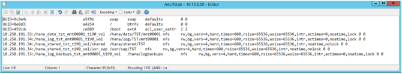
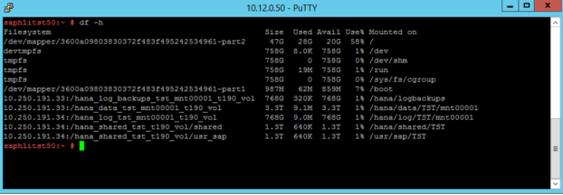

# Install and configure SAP HANA (Large Instances) on Azure

In this article, we'll walk through validating, configuring, and installing SAP HANA Large Instances (HLIs) on Azure (otherwise known as BareMetal Infrastructure).

## Prerequisites

Before reading this article, become familiar with:
- [HANA Large Instances common terms](hana-know-terms.md)
- [HANA Large Instances SKUs](hana-available-skus.md).

Also see:
- [Connecting Azure VMs to HANA Large Instances](hana-connect-azure-vm-large-instances.md)
- [Connect a virtual network to HANA Large Instances](hana-connect-vnet-express-route.md)

## Planning your installation

The installation of SAP HANA is your responsibility. You can start installing a new SAP HANA on Azure (Large Instances) server after you establish the connectivity between your Azure virtual networks and the HANA Large Instance unit(s). 

> [!Note]
> Per SAP policy, the installation of SAP HANA must be performed by a person who's passed the Certified SAP Technology Associate exam, SAP HANA Installation certification exam, or who is an SAP-certified system integrator (SI).

When you're planning to install HANA 2.0, see [SAP support note #2235581 - SAP HANA: Supported operating systems](https://launchpad.support.sap.com/#/notes/2235581/E). Make sure the operating system (OS) is supported with the SAP HANA release you're installing. The supported OS for HANA 2.0 is more restrictive than the supported OS for HANA 1.0. Confirm that the OS release you're interested in is supported for the particular HANA Large Instance. Use this [list](https://www.sap.com/dmc/exp/2014-09-02-hana-hardware/enEN/#/solutions?filters=v:deCertified;ve:24;iaas;v:125;v:105;v:99;v:120); select the HLI to see the details of the supported OS list for that unit. 

Validate the following before you begin the HANA installation:
- [HLI unit(s)](#validate-the-hana-large-instance-units)
- [Operating system configuration](#operating-system)
- [Network configuration](#networking)
- [Storage configuration](#storage)

## Validate the HANA Large Instance unit(s)

After you receive the HANA Large Instances from Microsoft, establish access and connectivity to them. Then validate the following settings and adjust as necessary.

1. Check in the Azure portal whether the instance(s) are showing up with the correct SKUs and OS. For more information, see [Azure HANA Large Instances control through Azure portal](./hana-li-portal.md).

2. Register the OS of the instance with your OS provider. This step includes registering your SUSE Linux OS in an instance of the SUSE Subscription Management Tool (SMT) that's deployed in a VM in Azure. 

    The HANA Large Instance can connect to this SMT instance. (For more information, see [How to set up SMT server for SUSE Linux](hana-setup-smt.md)). If you're using a Red Hat OS, it needs to be registered with the Red Hat Subscription Manager that you'll connect to. For more information, see the remarks in [What is SAP HANA on Azure (Large Instances)?](./hana-overview-architecture.md?toc=/azure/virtual-machines/linux/toc.json). 

    This step is necessary for patching the OS, which is your responsibility. For SUSE, see the documentation on [installing and configuring SMT](https://www.suse.com/documentation/sles-12/book_smt/data/smt_installation.html).

3. Check for new patches and fixes of the specific OS release/version. Verify that the HANA Large Instance has the latest patches. Sometimes the latest patches aren't included, so be sure to check.

4. Check the relevant SAP notes for installing and configuring SAP HANA on the specific OS release/version. Microsoft won't always configure an HLI completely. Changing recommendations or changes to SAP notes or configurations dependent on individual scenarios may make it impossible.  

    So be sure to read the SAP notes related to SAP HANA for your exact Linux release. Also check the configurations of the OS release/version and apply the configuration settings if you haven't already.

    Specifically, check the following parameters and eventually adjust to:

    - net.core.rmem_max = 16777216
    - net.core.wmem_max = 16777216
    - net.core.rmem_default = 16777216
    - net.core.wmem_default = 16777216
    - net.core.optmem_max = 16777216
    - net.ipv4.tcp_rmem = 65536 16777216 16777216
    - net.ipv4.tcp_wmem = 65536 16777216 16777216

    Starting with SLES12 SP1 and Red Hat Enterprise Linux (RHEL) 7.2, these parameters must be set in a configuration file in the /etc/sysctl.d directory. For example, a configuration file with the name 91-NetApp-HANA.conf must be created. For older SLES and RHEL releases, these parameters must be set in/etc/sysctl.conf.

    For all RHEL releases starting with RHEL 6.3, keep in mind: 
    - The sunrpc.tcp_slot_table_entries = 128 parameter must be set in/etc/modprobe.d/sunrpc-local.conf. If the file doesn't exist, create it first by adding the entry: 
        - options sunrpc tcp_max_slot_table_entries=128

5. Check the system time of your HANA Large Instance. The instances are deployed with a system time zone. This time zone represents the location of the Azure region in which the HANA Large Instance stamp is located. You can change the system time or time zone of the instances you own. 

    If you order more instances into your tenant, you need to adapt the time zone of the newly delivered instances. Microsoft has no insight into the system time zone you set up with the instances after the handover. So newly deployed instances might not be set in the same time zone as the one you changed to. It's up to you to adapt the time zone of the instance(s) that were handed over, as needed. 

6. Check etc/hosts. As the blades get handed over, they have different IP addresses assigned for different purposes. It's important to check the etc/hosts file when units are added into an existing tenant. The etc/hosts file of the newly deployed systems may not be maintained correctly with the IP addresses of systems delivered earlier. Ensure that a newly deployed instance can resolve the names of the units you deployed earlier in your tenant. 

## Operating system

The swap space of the delivered OS image is set to 2 GB according to the [SAP support note #1999997 - FAQ: SAP HANA memory](https://launchpad.support.sap.com/#/notes/1999997/E). If you want a different setting, you must set it yourself.

[SUSE Linux Enterprise Server 12 SP1 for SAP applications](https://www.suse.com/products/sles-for-sap/download/) is the distribution of Linux that's installed for SAP HANA on Azure (Large Instances). This distribution provides SAP-specific capabilities, including pre-set parameters for running SAP on SLES effectively.

For several useful resources related to deploying SAP HANA on SLES, see:
- [Resource library/white papers](https://www.suse.com/products/sles-for-sap/resource-library#white-papers) on the SUSE website.
- [SAP on SUSE](https://wiki.scn.sap.com/wiki/display/ATopics/SAP+on+SUSE) on the SAP Community Network (SCN).

These resources include information on setting up high availability, security hardening specific to SAP operations, and more.

Here are more resources for SAP on SUSE:

- [SAP HANA on SUSE Linux site](https://wiki.scn.sap.com/wiki/display/ATopics/SAP+on+SUSE)
- [Best Practice for SAP: Enqueue replication – SAP NetWeaver on SUSE Linux Enterprise 12](https://www.scribd.com/document/351887168/SLES4SAP-NetWeaver-ha-guide-EnqRepl-12-color-en-pdf)
- [ClamSAP – SLES virus protection for SAP](https://scn.sap.com/community/linux/blog/2014/04/14/clamsap--suse-linux-enterprise-server-integrates-virus-protection-for-sap) (including SLES 12 for SAP applications)

The following documents are SAP support notes applicable to implementing SAP HANA on SLES 12:

- [SAP support note #1944799 – SAP HANA guidelines for SLES operating system installation](http://service.sap.com/sap/support/notes/1944799)
- [SAP support note #2205917 – SAP HANA DB recommended OS settings for SLES 12 for SAP applications](https://launchpad.support.sap.com/#/notes/2205917/E)
- [SAP support note #1984787 – SUSE Linux Enterprise Server 12:  installation notes](https://launchpad.support.sap.com/#/notes/1984787)
- [SAP support note #171356 – SAP software on Linux:  General information](https://launchpad.support.sap.com/#/notes/1984787)
- [SAP support note #1391070 – Linux UUID solutions](https://launchpad.support.sap.com/#/notes/1391070)

[Red Hat Enterprise Linux for SAP HANA](https://www.redhat.com/en/resources/red-hat-enterprise-linux-sap-hana) is another offer for running SAP HANA on HANA Large Instances. Releases of RHEL 7.2 and 7.3 are available and supported. 
For more information on SAP on Red Hat, see [SAP HANA on Red Hat Linux site](https://wiki.scn.sap.com/wiki/display/ATopics/SAP+on+Red+Hat).

The following documents are SAP support notes applicable to implementing SAP HANA on Red Hat:

- [SAP support note #2009879 - SAP HANA guidelines for Red Hat Enterprise Linux (RHEL) operating system](https://launchpad.support.sap.com/#/notes/2009879/E)
- [SAP support note #2292690 - SAP HANA DB: Recommended OS settings for RHEL 7](https://launchpad.support.sap.com/#/notes/2292690)
- [SAP support note #1391070 – Linux UUID solutions](https://launchpad.support.sap.com/#/notes/1391070)
- [SAP support note #2228351 - Linux: SAP HANA Database SPS 11 revision 110 (or higher) on RHEL 6 or SLES 11](https://launchpad.support.sap.com/#/notes/2228351)
- [SAP support note #2397039 - FAQ: SAP on RHEL](https://launchpad.support.sap.com/#/notes/2397039)
- [SAP support note #2002167 - Red Hat Enterprise Linux 7.x: Installation and upgrade](https://launchpad.support.sap.com/#/notes/2002167)

### Time synchronization

SAP applications built on the SAP NetWeaver architecture are sensitive to time differences for the components of the SAP system. SAP ABAP short dumps with the error title of ZDATE\_LARGE\_TIME\_DIFF are probably familiar. That's because these short dumps appear when the system time of different servers or virtual machines (VMs) is drifting too far apart.

For SAP HANA on Azure (Large Instances), time synchronization in Azure doesn't apply to the compute units in the Large Instance stamps. It also doesn't apply to running SAP applications in native Azure VMs, because Azure ensures a system's time is properly synchronized. 

As a result, you need to set up a separate time server. This server will be used by SAP application servers running on Azure VMs. It will also be used by the SAP HANA database instances running on HANA Large Instances. The storage infrastructure in Large Instance stamps is time-synchronized with Network Time Protocol (NTP) servers.

## Networking
In designing your Azure virtual networks and connecting those virtual networks to the HANA Large Instances, be sure to follow the recommendations described in:

- [SAP HANA (Large Instance) overview and architecture on Azure](./hana-overview-architecture.md)
- [SAP HANA (Large Instances) infrastructure and connectivity on Azure](hana-overview-infrastructure-connectivity.md)

Here are some details worth mentioning about the networking of the single units. Every HANA Large Instance unit comes with two or three IP addresses assigned to two or three network interface controller (NIC) ports. Three IP addresses are used in HANA scale-out configurations and the HANA system replication scenario. One of the IP addresses assigned to the NIC of the unit is out of the server IP pool that's described in [SAP HANA (Large Instances) overview and architecture on Azure](./hana-overview-architecture.md).

For more information about Ethernet details for your architecture, see [HLI supported scenarios](hana-supported-scenario.md).

## Storage

The storage layout for SAP HANA (Large Instances) is configured by SAP HANA on Azure Service Management using SAP recommended guidelines.

The rough sizes of the different volumes with the different HANA Large Instances SKUs is documented in [SAP HANA (Large Instances) overview and architecture on Azure](hana-overview-architecture.md).

The naming conventions of the storage volumes are listed in the following table:

| Storage usage | Mount name | Volume name | 
| --- | --- | ---|
| HANA data | /hana/data/SID/mnt0000\<m> | Storage IP:/hana_data_SID_mnt00001_tenant_vol |
| HANA log | /hana/log/SID/mnt0000\<m> | Storage IP:/hana_log_SID_mnt00001_tenant_vol |
| HANA log backup | /hana/log/backups | Storage IP:/hana_log_backups_SID_mnt00001_tenant_vol |
| HANA shared | /hana/shared/SID | Storage IP:/hana_shared_SID_mnt00001_tenant_vol/shared |
| usr/sap | /usr/sap/SID | Storage IP:/hana_shared_SID_mnt00001_tenant_vol/usr_sap |

*SID* is the HANA instance System ID. 

*Tenant* is an internal enumeration of operations when deploying a tenant.

HANA usr/sap share the same volume. The nomenclature of the mountpoints includes the system ID of the HANA instances and the mount number. In scale-up deployments, there's only one mount, such as mnt00001. In scale-out deployments, you'll see as many mounts as you have worker and primary nodes. 

For scale-out environments, data, log, and log backup volumes are shared and attached to each node in the scale-out configuration. For configurations that are multiple SAP instances, a different set of volumes is created and attached to the HANA Large Instance. For storage layout details for your scenario, see [HLI supported scenarios](hana-supported-scenario.md).

HANA Large Instances come with generous disk volume for HANA/data and a volume HANA/log/backup. We made the HANA/data so large because the storage snapshots use the same disk volume. The more storage snapshots you do, the more space is consumed by snapshots in your assigned storage volumes. 

The HANA/log/backup volume isn't supposed to be the volume for database backups. It's sized to be used as the backup volume for the HANA transaction log backups. For more information, see [SAP HANA (Large Instances) high availability and disaster recovery on Azure](hana-overview-high-availability-disaster-recovery.md). 

You can increase your storage by purchasing extra capacity in 1-TB increments. This extra storage can be added as new volumes to a HANA Large Instance.

During onboarding with SAP HANA on Azure Service Management, you'll specify a user ID (UID) and group ID (GID) for the sidadm user and sapsys group (for example: 1000,500). During installation of the SAP HANA system, you must use these same values. Because you want to deploy multiple HANA instances on a unit, you get multiple sets of volumes (one set for each instance). So at deployment time, you need to define:

- The SID of the different HANA instances (sidadm is derived from it).
- The memory sizes of the different HANA instances. The memory size per instance defines the size of the volumes in each individual volume set.

Based on storage provider recommendations, the following mount options are configured for all mounted volumes (excludes boot LUN):

- nfs    rw, vers=4, hard, timeo=600, rsize=1048576, wsize=1048576, intr, noatime, lock 0 0

These mount points are configured in /etc/fstab as shown in the following screenshots:

The output of the command df -h on a S72m HANA Large Instance looks like:

The storage controller and nodes in the Large Instance stamps are synchronized to NTP servers. Synchronizing the SAP HANA on Azure (Large Instances) and Azure VMs against an NTP server is important. It eliminates significant time drift between the infrastructure and the compute units in Azure or Large Instance stamps.

To optimize SAP HANA to the storage used underneath, set the following SAP HANA configuration parameters:

- max_parallel_io_requests 128
- async_read_submit on
- async_write_submit_active on
- async_write_submit_blocks all
 
For SAP HANA 1.0 versions up to SPS12, these parameters can be set during the installation of the SAP HANA database, as described in [SAP note #2267798 - Configuration of the SAP HANA database](https://launchpad.support.sap.com/#/notes/2267798).

You can also configure the parameters after the SAP HANA database installation by using the hdbparam framework. 

The storage used in HANA Large Instances has a file size limitation. The [size limitation is 16 TB](https://docs.netapp.com/ontap-9/index.jsp?topic=%2Fcom.netapp.doc.dot-cm-vsmg%2FGUID-AA1419CF-50AB-41FF-A73C-C401741C847C.html) per file. Unlike file size limitations in the EXT3 file systems, HANA isn't aware implicitly of the storage limitation enforced by the HANA Large Instances storage. As a result, HANA won't automatically create a new data file when the file size limit of 16 TB is reached. As HANA attempts to grow the file beyond 16 TB, HANA will report errors and the index server will crash at the end.

> [!IMPORTANT]
> To prevent HANA from trying to grow data files beyond the 16 TB file size limit of HANA Large Instance storage, set the following parameters in the SAP HANA global.ini configuration file:
> 
> - datavolume_striping=true
> - datavolume_striping_size_gb = 15000
> - See also SAP note [#2400005](https://launchpad.support.sap.com/#/notes/2400005)
> - Be aware of SAP note [#2631285](https://launchpad.support.sap.com/#/notes/2631285)

With SAP HANA 2.0, the hdbparam framework has been deprecated. So the parameters must be set by using SQL commands. For more information, see [SAP note #2399079: Elimination of hdbparam in HANA 2](https://launchpad.support.sap.com/#/notes/2399079).

Refer to [HLI supported scenarios](hana-supported-scenario.md) to learn more about the storage layout for your architecture.

## Next steps

Go through the steps of installing SAP HANA on Azure (Large Instances).

> [!div class="nextstepaction"]
> [Install HANA on SAP HANA on Azure (Large Instances)](hana-example-installation.md)
