# Monitoring and troubleshooting from HANA side

In this article, we'll look at monitoring and troubleshooting your SAP HANA on Azure (Large Instances) using resources provided by SAP HANA. 

To analyze problems related to SAP HANA on Azure (Large Instances), you'll want to narrow down the root cause of a problem. SAP has published lots of documentation to help you. FAQs related to SAP HANA performance can be found in the following SAP Notes:

- [SAP Note #2222200 – FAQ: SAP HANA Network](https://launchpad.support.sap.com/#/notes/2222200)
- [SAP Note #2100040 – FAQ: SAP HANA CPU](https://launchpad.support.sap.com/#/notes/0002100040)
- [SAP Note #199997 – FAQ: SAP HANA Memory](https://launchpad.support.sap.com/#/notes/2177064)
- [SAP Note #200000 – FAQ: SAP HANA Performance Optimization](https://launchpad.support.sap.com/#/notes/2000000)
- [SAP Note #199930 – FAQ: SAP HANA I/O Analysis](https://launchpad.support.sap.com/#/notes/1999930)
- [SAP Note #2177064 – FAQ: SAP HANA Service Restart and Crashes](https://launchpad.support.sap.com/#/notes/2177064)

## SAP HANA alerts

First, check the current SAP HANA alert logs. In SAP HANA Studio, go to **Administration Console: Alerts: Show: all alerts**. This tab will show all SAP HANA alerts for values (free physical memory, CPU use, and so on) that fall outside the set minimum and maximum thresholds. By default, checks are automatically refreshed every 15 minutes.

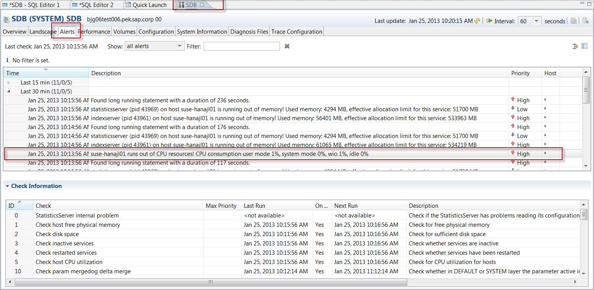

## CPU

For an alert triggered by improper threshold setting, reset to the default value or a more reasonable threshold value.

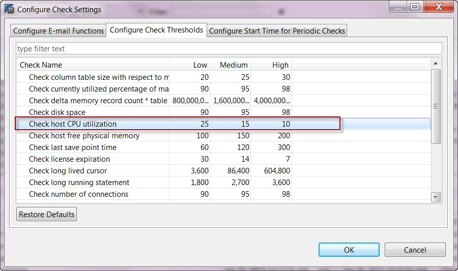

The following alerts may indicate CPU resource problems:

- Host CPU Usage (Alert 5)
- Most recent savepoint operation (Alert 28)
- Savepoint duration (Alert 54)

You may notice high CPU consumption on your SAP HANA database from:

- Alert 5 (Host CPU usage) is raised for current or past CPU usage
- The displayed CPU usage on the overview screen

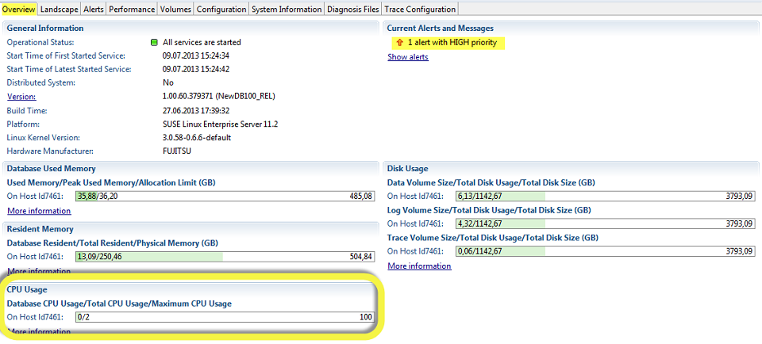

The Load graph might show high CPU consumption, or high consumption in the past:

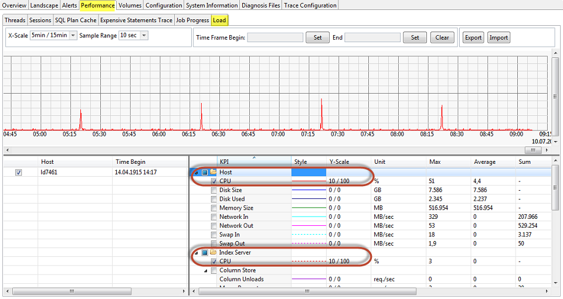

An alert triggered by high CPU use could be caused by several reasons:
- Execution of certain transactions
- Data loading
- Jobs that aren't responding
- Long-running SQL statements
- Bad query performance (for example, with BW on HANA cubes)

For detailed CPU usage troubleshooting steps, see [SAP HANA Troubleshooting: CPU Related Causes and Solutions](https://help.sap.com/viewer/bed8c14f9f024763b0777aa72b5436f6/2.0.05/en-US/4fbc915462db406aa2fe92b708b95189.html?q=%20SAP%20HANA%20Troubleshooting:%20CPU%20Related%20Causes%20and%20Solutions).

## Operating system (OS)

An important check for SAP HANA on Linux is to make sure Transparent Huge Pages are disabled. For more information, see [SAP Note #2131662 – Transparent Huge Pages (THP) on SAP HANA Servers](https://launchpad.support.sap.com/#/notes/2131662).

You can check whether Transparent Huge Pages are enabled through the following Linux command: **cat /sys/kernel/mm/transparent\_hugepage/enabled**
- If _always_ is enclosed in brackets, it means that the Transparent Huge Pages are enabled: [always] madvise never
- If _never_ is enclosed in brackets, it means that the Transparent Huge Pages are disabled: always madvise [never]

The following Linux command should return nothing: **rpm -qa | grep ulimit.** If it appears _ulimit_ is installed, uninstall it immediately.

## Memory

You may observe that the amount of memory allotted to the SAP HANA database is higher than expected. The following alerts indicate issues with high memory usage:

- Host physical memory usage (Alert 1)
- Memory usage of name server (Alert 12)
- Total memory usage of Column Store tables (Alert 40)
- Memory usage of services (Alert 43)
- Memory usage of main storage of Column Store tables (Alert 45)
- Runtime dump files (Alert 46)

For detailed memory troubleshooting steps, see [SAP HANA Troubleshooting: Root Causes of Memory Problems](https://help.sap.com/viewer/bed8c14f9f024763b0777aa72b5436f6/2.0.05/en-US/3a2ea5c4593b4b8d823b5b48152bd1d4.html).

## Network

Refer to [SAP Note #2081065 – Troubleshooting SAP HANA Network](https://launchpad.support.sap.com/#/notes/2081065) and do the network troubleshooting steps in this SAP Note.

1. Analyzing round-trip time between server and client.
    - Run the SQL script [_HANA\_Network\_Clients_](https://launchpad.support.sap.com/#/notes/1969700)_._
  
2. Analyze internode communication.
    - Run SQL script [_HANA\_Network\_Services_](https://launchpad.support.sap.com/#/notes/1969700)_._

3. Run Linux command **ifconfig** (the output shows whether any packet losses are occurring).
4. Run Linux command **tcpdump**.

Also, use the open-source [IPERF](https://iperf.fr/) tool (or similar) to measure real application network performance.

For detailed network troubleshooting steps, see [SAP HANA Troubleshooting: Network Performance and Connectivity Problems](https://help.sap.com/viewer/bed8c14f9f024763b0777aa72b5436f6/2.0.05/en-US/a3ccdff1aedc4720acb24ed8826938b6.html?q=Networking%20Performance%20and%20Connectivity%20Problems).

## Storage

Let's say there are issues with I/O performance. End users may then find applications, or the system as a whole, runs sluggishly, is unresponsive, or can even stop responding. In the **Volumes** tab in SAP HANA Studio, you can see the attached volumes and what volumes are used by each service.

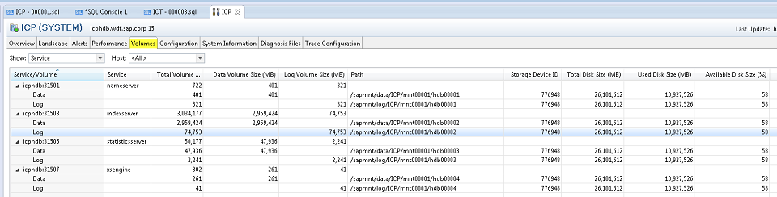

On the lower part of the screen (on the Volumes tab), you can see details of the volumes, such as files and I/O statistics.

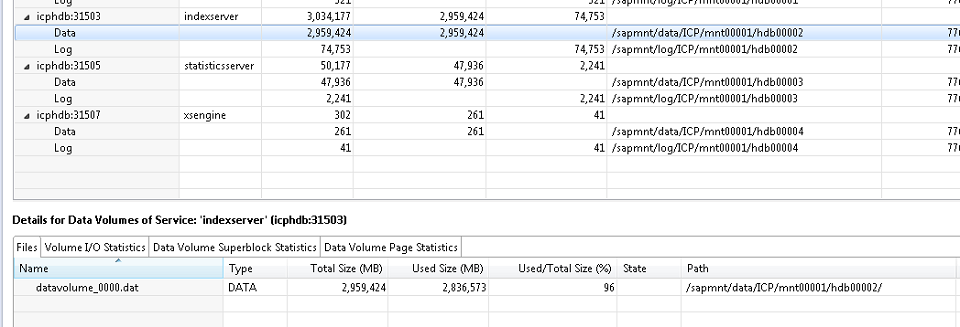

For I/O troubleshooting steps, see [SAP HANA Troubleshooting: I/O Related Root Causes and Solutions](https://help.sap.com/viewer/4e9b18c116aa42fc84c7dbfd02111aba/2.0.05/en-US/dc6ff98fa36541e997e4c719a632cbd8.html?q=I%2FO%20Related%20Root%20Causes%20and%20Solutions). For disk-related troubleshooting steps, see [SAP HANA Troubleshooting: Disk Related Root Causes and Solutions](https://help.sap.com/viewer/bed8c14f9f024763b0777aa72b5436f6/2.0.05/en-US/474cb08a715c42fe9f7cc5efdc599959.html?q=Disk%20Related%20Root%20Causes%20and%20Solutions).

## Diagnostic tools

Do an SAP HANA Health Check through HANA\_Configuration\_Minichecks. This tool returns potentially critical technical issues that should have already been raised as alerts in SAP HANA Studio.

1. Refer to [SAP Note #1969700 – SQL statement collection for SAP HANA](https://launchpad.support.sap.com/#/notes/1969700) and download the SQL Statements.zip file attached to that note. Store this .zip file on the local hard drive.

2. In SAP HANA Studio, on the **System Information** tab, right-click in the **Name** column and select **Import SQL Statements**.

    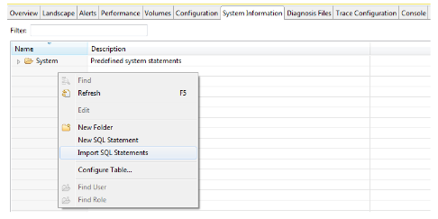

3. Select the SQL Statements.zip file stored locally; a folder with the corresponding SQL statements will be imported. At this point, the many different diagnostic checks can be run with these SQL statements.

    For example, to test SAP HANA System Replication bandwidth requirements, right-click the **Bandwidth** statement under **Replication: Bandwidth** and select **Open** in SQL Console.

    The complete SQL statement opens allowing input parameters (modification section) to be changed and then executed.

    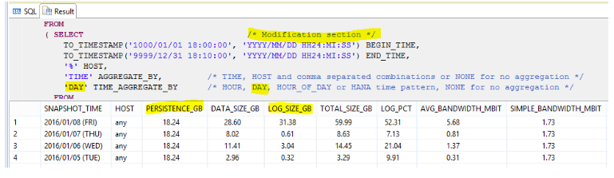

4. Another example is to right-click on the statements under **Replication: Overview**. Select **Execute** from the context menu:

    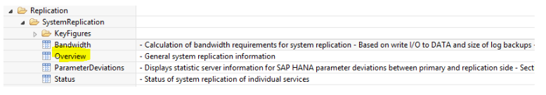

    You'll view information helpful with troubleshooting:

    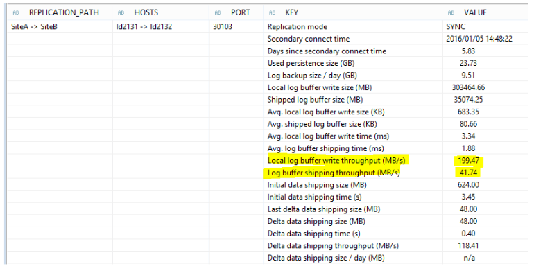

5. Do the same for HANA\_Configuration\_Minichecks and check for any _X_ marks in the _C_ (Critical) column.

    Sample outputs:

    **HANA\_Configuration\_MiniChecks\_Rev102.01+1** for general SAP HANA checks.

    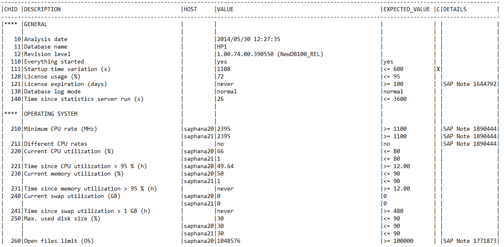

    **HANA\_Services\_Overview** for an overview of which SAP HANA services are currently running.

    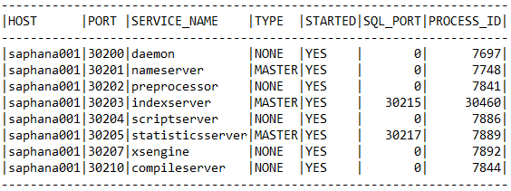

    **HANA\_Services\_Statistics** for SAP HANA service information (CPU, memory, and so on).

    

    **HANA\_Configuration\_Overview\_Rev110+** for general information on the SAP HANA instance.

    

    **HANA\_Configuration\_Parameters\_Rev70+** to check SAP HANA parameters.

    

## Next steps

Learn how to set up high availability on the SUSE operating system using the fencing device.

> [!div class="nextstepaction"]
> [High availability set up in SUSE using a fencing device](ha-setup-with-fencing-device.md)
