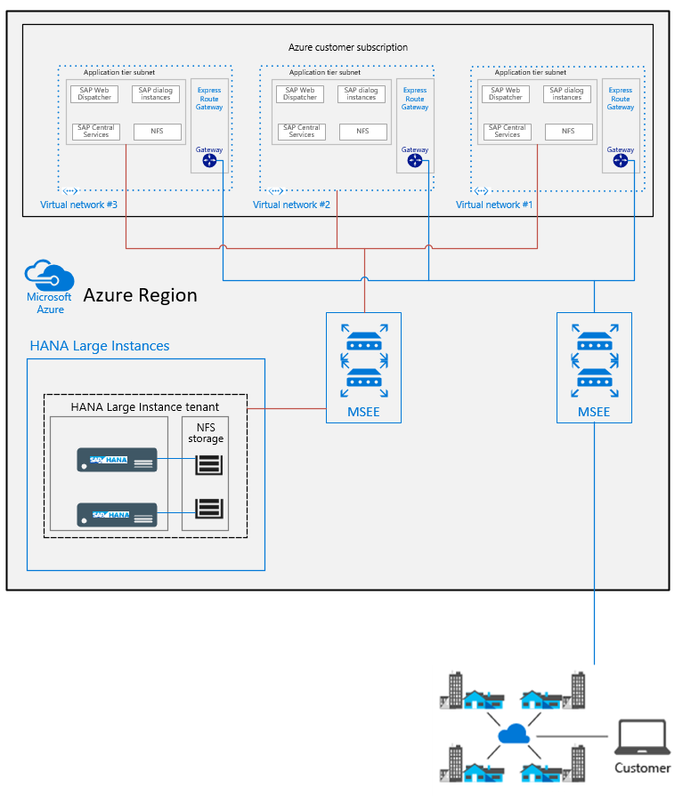

# SAP HANA (Large Instances) network architecture

In this article, we'll look at the network architecture for deploying SAP HANA on Azure Large Instances (otherwise known as BareMetal Infrastructure). 

The architecture of Azure network services is a key component of successfully deploying SAP applications on HANA Large Instance. Typically, SAP HANA on Azure (Large Instances) deployments have a larger SAP landscape. They likely include several SAP solutions with varying sizes of databases, CPU resource consumption, and memory use. 

It's likely that not all IT systems are located in Azure already. Your SAP landscape may be hybrid as well. Your database management system (DBMS) and SAP application may use a mixture of NetWeaver, S/4HANA, and SAP HANA. Your SAP application might even use another DBMS.

Azure offers different services that allow you to run the DBMS, NetWeaver, and S/4HANA systems in Azure. Azure offers network technology to make Azure look like a virtual data center to your on-premises software deployments. The Azure network functionality includes: 

- Azure virtual networks connected to the [ExpressRoute](https://azure.microsoft.com/services/expressroute/) circuit that connects to your on-premises network assets.
- An ExpressRoute circuit that connects on-premises to Azure with a minimum bandwidth of [1 Gbps or higher](https://azure.microsoft.com/pricing/details/expressroute/). This circuit allows adequate bandwidth for the transfer of data between on-premises systems and systems that run on virtual machines (VMs). It also allows adequate bandwidth for connection to Azure systems from on-premises users.
- All SAP systems in Azure set up in virtual networks to communicate with each other.
- Active Directory and DNS hosted on-premises are extended into Azure through ExpressRoute from on-premises. They may also run completely in Azure.

When integrating HANA Large Instances into the Azure data center network fabric, Azure ExpressRoute technology is used as well.

> [!NOTE] 
> Only one Azure subscription can be linked to only one tenant in a HANA Large Instance stamp in a specific Azure region. Conversely, a single HANA Large Instance stamp tenant can be linked to only one Azure subscription. This requirement is consistent with other billable objects in Azure.

If SAP HANA on Azure (Large Instances) is deployed in multiple Azure regions, a separate tenant is deployed in the HANA Large Instance stamp. You can run both under the same Azure subscription provided these instances are part of the same SAP landscape. 

> [!IMPORTANT] 
> Only the Azure Resource Manager deployment method is supported with SAP HANA on Azure (Large Instances).

## Extra virtual network information

To connect a virtual network to ExpressRoute, an Azure ExpressRoute gateway must be created. For more information, see [About Expressroute gateways for ExpressRoute](../../expressroute/expressroute-about-virtual-network-gateways.md). 

An Azure ExpressRoute gateway is used with ExpressRoute to an infrastructure outside of Azure or to an Azure Large Instance stamp. You can connect the Azure ExpressRoute gateway to a maximum of four ExpressRoute circuits, but only if those connections come from different Microsoft Enterprise Edge Routers (MSEEs). For more information, see [SAP HANA (Large Instances) infrastructure and connectivity on Azure](hana-overview-infrastructure-connectivity.md). 

> [!NOTE] 
> The maximum throughput you can achieve with a ExpressRoute gateway is 10 Gbps by using an ExpressRoute connection. Copying files between a VM that resides in a virtual network and a system on-premises (as a single copy stream) doesn't achieve the full throughput of the different gateway SKUs. To leverage the complete bandwidth of the ExpressRoute gateway, use multiple streams or copy different files in parallel streams of a single file.

## Networking architecture for HANA Large Instance
The networking architecture for HANA Large Instances can be separated into four parts:

- On-premises networking and ExpressRoute connection to Azure. This part is your (the customer's) domain and is connected to Azure through ExpressRoute. This ExpressRoute circuit is fully paid by you. The bandwidth should be large enough to handle the network traffic between your on-premises assets and the Azure region you're connecting with. See the lower right in the following figure.
- Azure network services, as previously discussed, with virtual networks, which again need ExpressRoute gateways added. For this part, you need to create the appropriate designs to meet your application, security, and compliance requirements. Consider whether to use HANA Large Instances given the number of virtual networks and Azure gateway SKUs to choose from. See the upper right in the figure.
- Connectivity of your HANA Large Instance through ExpressRoute into Azure. This part is deployed and handled by Microsoft. All you need to do is provide some IP address ranges after you've deployed your assets in the HANA Large Instance and connected the ExpressRoute circuit to the virtual networks. For more information, see [SAP HANA (Large Instances) infrastructure and connectivity on Azure](hana-overview-infrastructure-connectivity.md). There's no added fee for the connectivity between the Azure data center network fabric and HANA Large Instance units.
- Networking within the HANA Large Instance stamp, which is mostly transparent for you.

The following two requirements still hold even though you use Hana Large Instances:
- Your on-premises assets must connect through ExpressRoute to Azure.
- You need one or more virtual networks that run your VMs. These VMs host the application layer that connects to the HANA instances hosted in HANA Large Instances.

The differences in SAP deployments in Azure are:

- The HANA Large Instances of your tenant are connected through another ExpressRoute circuit into your virtual networks. The on-premises to Azure virtual network ExpressRoute circuits and the circuits between Azure virtual networks and HANA Large Instances don't share the same routers. Their load conditions remain separate.
- The workload profile between the SAP application layer and the HANA Large Instance is of a different nature. SAP HANA generates many small requests and bursts like data transfers (result sets) into the application layer.
- The SAP application architecture is more sensitive to network latency than typical scenarios where data is exchanged between on-premises and Azure.
- The Azure ExpressRoute gateway has at least two ExpressRoute connections. One circuit is connected from on-premises and one is connected from the HANA Large Instance. This configuration leaves only room for two more circuits from different MSEEs to connect to the ExpressRoute Gateway. This restriction is independent of the usage of ExpressRoute FastPath. All the connected circuits share the maximum bandwidth for incoming data of the ExpressRoute gateway.

With Revision 3 of HANA Large Instance stamps, the network latency between VMs and HANA Large Instance units can be higher than typical VM-to-VM network round-trip latencies. Depending on the Azure region, values can exceed the 0.7-ms round-trip latency classified as below average in [SAP Note #1100926 - FAQ: Network performance](https://launchpad.support.sap.com/#/notes/1100926/E). Depending on Azure Region and the tool to measure network round-trip latency between an Azure VM and HANA Large Instance, the latency can be up to 2 milliseconds. Still, customers successfully deploy SAP HANA-based production SAP applications on SAP HANA Large Instances. Make sure you test your business processes thoroughly with Azure HANA Large Instances. A new functionality, called ExpressRoute FastPath, can substantially reduce the network latency between HANA Large Instances and application layer VMs in Azure (see below). 

Revision 4 of HANA Large Instance stamps improves network latency between Azure VMs deployed in proximity to the HANA Large Instance stamp. Latency meets the average or better than average classification as documented in [SAP Note #1100926 - FAQ: Network performance](https://launchpad.support.sap.com/#/notes/1100926/E) if Azure ExpressRoute FastPath is configured (see below). 

To deploy Azure VMs in proximity to HANA Large Instances of Revision 4, you need to apply [Azure Proximity Placement Groups](../../virtual-machines/co-location.md). Proximity placement groups can be used to locate the SAP application layer in the same Azure datacenter as Revision 4 hosted HANA Large Instances. For more information, see [Azure Proximity Placement Groups for optimal network latency with SAP applications](../workloads/proximity-placement-scenarios.md).

To provide deterministic network latency between VMs and HANA Large Instance, using the ExpressRoute gateway SKU is essential. Unlike the traffic patterns between on-premises and VMs, the traffic patterns between VMs and HANA Large Instances can develop small but high bursts of requests and data volumes. To handle such bursts, we highly recommend using the UltraPerformance gateway SKU. For the Type II class of HANA Large Instance SKUs, using the UltraPerformance gateway SKU as a ExpressRoute gateway is mandatory.

> [!IMPORTANT] 
> Given the overall network traffic between the SAP application and database layers, only the HighPerformance or UltraPerformance gateway SKUs for virtual networks are supported for connecting to SAP HANA on Azure (Large Instances). For HANA Large Instance Type II SKUs, only the UltraPerformance gateway SKU is supported as a ExpressRoute gateway. Exceptions apply when using ExpressRoute FastPath (see below).

### ExpressRoute FastPath
In May 2019, we released ExpressRoute FastPath. FastPath lowers the latency between HANA Large Instances and Azure virtual networks that host the SAP application VMs. With FastPath, the data flows between VMs and HANA Large Instances aren't routed through the ExpressRoute gateway. The VMs assigned in the subnet(s) of the Azure virtual network directly communicate with the dedicated enterprise edge router. 

> [!IMPORTANT] 
> ExpressRoute FastPath requires that the subnets running the SAP application VMs are in the same Azure virtual network that is connected to the HANA Large Instances. VMs located in Azure virtual networks that are peered with the Azure virtual network connected to the HANA Large Instance units do not benefit from ExpressRoute FastPath. As a result, typical hub and spoke virtual network designs, where the ExpressRoute circuits connect against a hub virtual network and virtual networks containing the SAP application layer (spokes) are peered, the optimization by ExpressRoute FastPath won't work. ExpressRoute FastPath also doesn't currently support user defined routing rules (UDR). For more information, see [ExpressRoute virtual network gateway and FastPath](../../expressroute/expressroute-about-virtual-network-gateways.md). 

For more information on how to configure ExpressRoute FastPath, see [Connect a virtual network to HANA large instances](./hana-connect-vnet-express-route.md).    

> [!NOTE]
> An UltraPerformance ExpressRoute gateway is required to use ExpressRoute FastPath.

## Single SAP system

The on-premises infrastructure previously shown is connected through ExpressRoute into Azure. The ExpressRoute circuit connects into an MSEE. For more information, see [ExpressRoute technical overview](../../expressroute/expressroute-introduction.md). After the route is established, it connects into the Azure backbone.

> [!NOTE] 
> To run SAP landscapes in Azure, connect to the enterprise edge router closest to the Azure region in the SAP landscape. HANA Large Instance stamps are connected through dedicated enterprise edge routers to minimize network latency between VMs in Azure IaaS and HANA Large Instance stamps.

The ExpressRoute gateway for the VMs that host SAP application instances are connected to one ExpressRoute circuit that connects to on-premises. The same virtual network is connected to a separate enterprise edge router. That edge router is dedicated to connecting to Large Instance stamps. Again, with FastPath, the data flow from HANA Large Instances to the SAP application layer VMs isn't routed through the ExpressRoute gateway. This configuration reduces the network round-trip latency.

This system is a straightforward example of a single SAP system. The SAP application layer is hosted in Azure. The SAP HANA database runs on SAP HANA on Azure (Large Instances). The assumption is that the ExpressRoute gateway bandwidth of 2-Gbps or 10-Gbps throughput doesn't represent a bottleneck.

## Multiple SAP systems or large SAP systems

If you deploy multiple SAP systems or large SAP systems connecting to SAP HANA (Large Instances), the throughput of the ExpressRoute gateway might become a bottleneck. In that case, split the application layers into multiple virtual networks. You can also split the application layers if you want to isolate production and non-production systems in different Azure virtual networks. 

You might create a special virtual network that connects to HANA Large Instances when:

- Doing backups directly from the HANA instances in a HANA Large Instance to a VM in Azure that hosts NFS shares.
- Copying large backups or other files from HANA Large Instances to disk space managed in Azure.

Use a separate virtual network to host VMs that manage storage for mass transfer of data between HANA Large Instances and Azure. This arrangement avoids large file or data transfer from HANA Large Instances to Azure on the ExpressRoute gateway that serves the VMs running the SAP application layer. 

For a more expandable network architecture:

- Use multiple virtual networks for a single, larger SAP application layer.
- Deploy one separate virtual network for each SAP system deployed, compared to combining these SAP systems in separate subnets under the same virtual network.

    The following diagram shows a more expandable networking architecture for SAP HANA on Azure (Large Instances):

Depending on the rules and restrictions you want to apply between the different virtual networks hosting VMs of different SAP systems, you should peer those virtual networks. For more information about virtual network peering, see [Virtual network peering](../../virtual-network/virtual-network-peering-overview.md).

## Routing in Azure

By default deployment, three network routing considerations are important for SAP HANA on Azure (Large Instances):

- SAP HANA on Azure (Large Instances) can be accessed only through Azure VMs and the dedicated ExpressRoute connection, not directly from on-premises. Direct access from on-premises to the HANA Large Instance units, as delivered by Microsoft to you, isn't possible immediately. The transitive routing restrictions are because of the current Azure network architecture used for SAP HANA Large Instances. Some administration clients and any applications that need direct access, such as SAP Solution Manager running on-premises, can't connect to the SAP HANA database. For exceptions, see the following section, [Direct Routing to HANA Large Instances](#direct-routing-to-hana-large-instances).

- If you have HANA Large Instance units deployed in two different Azure regions for disaster recovery, the same transient routing restrictions apply as in the past. In other words, IP addresses of a HANA Large Instance in one region (for example, US West) weren't routed to a HANA Large Instance deployed in another region (for example, US East). This restriction is independent of the use of Azure network peering across regions or cross-connecting the ExpressRoute circuits that connect HANA Large Instances to virtual networks. For a graphic representation, see the figure in the section, [Use HANA Large Instance units in multiple regions](#use-hana-large-instance-units-in-multiple-regions). This restriction, which came with the deployed architecture, prohibited the immediate use of HANA system replication for disaster recovery. For recent changes, again, see [Use HANA Large Instance units in multiple regions](#use-hana-large-instance-units-in-multiple-regions). 

- SAP HANA on Azure Large Instances has an assigned IP address from the server IP pool address range that you submitted when requesting the HANA Large Instance deployment. For more information, see [SAP HANA (Large Instances) infrastructure and connectivity on Azure](hana-overview-infrastructure-connectivity.md). This IP address is accessible through the Azure subscriptions and circuit that connects Azure virtual networks to HANA Large Instances. The IP address assigned out of that server IP pool address range is directly assigned to the hardware unit. It's *not* assigned through network address translation (NAT) anymore, as was the case in the first deployments of this solution. 

### Direct Routing to HANA Large Instances

By default, the transitive routing doesn't work in these scenarios:

- Between HANA Large Instance units and an on-premises deployment.

- Between HANA Large Instance units deployed in different regions.

There are three ways to enable transitive routing in those scenarios:

- A reverse-proxy to route data, to and from. For example, F5 BIG-IP, NGINX with Traffic Manager deployed in the Azure virtual network that connects to HANA Large Instances and to on-premises as a virtual firewall/traffic routing solution.
- Using IPTables rules in a Linux VM to enable routing between on-premises locations and HANA Large Instance units, or between HANA Large Instance units in different regions. The VM running IPTables must be deployed in the Azure virtual network that connects to HANA Large Instances and to on-premises. The VM must be sized so that the network throughput of the VM is sufficient for the expected network traffic. For more information on VM network bandwidth, check the article [Sizes of Linux virtual machines in Azure](../../virtual-machines/sizes.md?toc=%2fazure%2fvirtual-network%2ftoc.json).
- [Azure Firewall](https://azure.microsoft.com/services/azure-firewall/) would be another solution to enable direct traffic between on-premises and HANA Large instance units. 

All the traffic of these solutions would be routed through an Azure virtual network. As such, the traffic could also be restricted by the soft appliances used or by Azure Network Security Groups. In this way, specific IP addresses or IP address ranges from on-premises could either be blocked or explicitly allowed access to HANA Large Instances. 

> [!NOTE]  
> Be aware that implementation and support for custom solutions involving third-party network appliances or IPTables isn't provided by Microsoft. Support must be provided by the vendor of the component used or by the integrator. 

#### Express Route Global Reach
Microsoft introduced a new functionality called [ExpressRoute Global Reach](../../expressroute/expressroute-global-reach.md). Global Reach can be used for HANA Large Instances in two scenarios:

- Enable direct access from on-premises to your HANA Large Instance units deployed in different regions.
- Enable direct communication between your HANA Large Instance units deployed in different regions.

##### Direct Access from on-premises
In Azure regions where Global Reach is offered, you can request enabling Global Reach for your ExpressRoute circuit. That circuit connects your on-premises network to the Azure virtual network that connects to your HANA Large Instances. There are costs for the on-premises side of your ExpressRoute circuit. For more information, see the pricing for [Global Reach Add-On](https://azure.microsoft.com/pricing/details/expressroute/). You won't pay added costs for the circuit that connects the HANA Large Instances to Azure. 

> [!IMPORTANT]  
> When using Global Reach to enable direct access between your HANA Large Instance units and on-premises assets, the network data and control flow is **not routed through Azure virtual networks**. Instead, network data and control flow is routed directly between the Microsoft enterprise exchange routers. So any NSG or ASG rules, or any type of firewall, NVA, or proxy you deployed in an Azure virtual network, won't be touched. **If you use ExpressRoute Global Reach to enable direct access from on-premises to HANA Large instance units, restrictions and permissions to access HANA large Instance units need to be defined in firewalls on the on-premises side.** 

##### Connecting HANA Large Instances in different Azure regions
Similarly, ExpressRoute Global Reach can be used to connect two HANA Large Instance tenants deployed in different regions. The isolation is the ExpressRoute circuits that your HANA Large Instance tenants use to connect to Azure in both regions. There are no added charges for connecting two HANA Large Instance tenants deployed in different regions. 

> [!IMPORTANT]  
> The data flow and control flow of the network traffic between the HANA Large instance tenants won't be routed through Azure networks. So you can't use Azure functionality or network virtual appliances (NVAs) to enforce communication restrictions between your HANA Large Instances tenants. 

For more information on how to enable ExpressRoute Global Reach, see [Connect a virtual network to HANA large instances](./hana-connect-vnet-express-route.md).

## Internet connectivity of HANA Large Instance
HANA Large Instances *don't* have direct internet connectivity. As an example, this limitation might restrict your ability to register the OS image directly with the OS vendor. You might need to work with your local SUSE Linux Enterprise Server Subscription Management Tool server or Red Hat Enterprise Linux Subscription Manager.

## Data encryption between VMs and HANA Large Instance
Data transferred between HANA Large Instances and VMs isn't encrypted. Purely for the exchange between the HANA DBMS side and JDBC/ODBC-based applications, however, you can enable encryption of traffic. For more information, see [Secure Communication Between SAP HANA and JDBC/ODBC Clients](https://help.sap.com/viewer/102d9916bf77407ea3942fef93a47da8/1.0.11/en-US/dbd3d887bb571014bf05ca887f897b99.html).

## Use HANA Large Instance units in multiple regions

For disaster recovery, you need to have HANA Large Instance units in multiple Azure regions. Using only Azure [Global Vnet Peering](../../virtual-network/virtual-network-peering-overview.md), by default the transitive routing won't work between HANA Large Instance tenants in different regions. Global Reach, however, opens up communication between HANA Large Instance units in different regions. This scenario using ExpressRoute Global Reach enables:

 - HANA system replication without any more proxies or firewalls.
 - Copying backups between HANA Large Instance units in different regions to make system copies or do system refreshes.

The preceding figure shows how the virtual networks in both regions are connected to two ExpressRoute circuits. The circuits are used to connect to SAP HANA on Azure (Large Instances) in both Azure regions (grey lines). The reason for the two cross connections is to protect from an outage of the MSEEs on either side. The communication flow between the two virtual networks in the two Azure regions is supposed to be handled over the [global peering](/archive/blogs/azureedu/how-to-setup-global-vnet-peering-in-azure) of the two virtual networks in the two different regions (blue dotted line). The thick red line describes the ExpressRoute Global Reach connection. This connection allows the HANA Large Instance units of your tenants in different regions to communicate with each other. 

> [!IMPORTANT] 
> If you used multiple ExpressRoute circuits, use AS Path prepending and Local Preference BGP settings to ensure proper routing of traffic.

## Next steps

Learn about the storage architecture of SAP HANA (Large Instances).

> [!div class="nextstepaction"]
> [SAP HANA (Large Instances) storage architecture](hana-storage-architecture.md)
