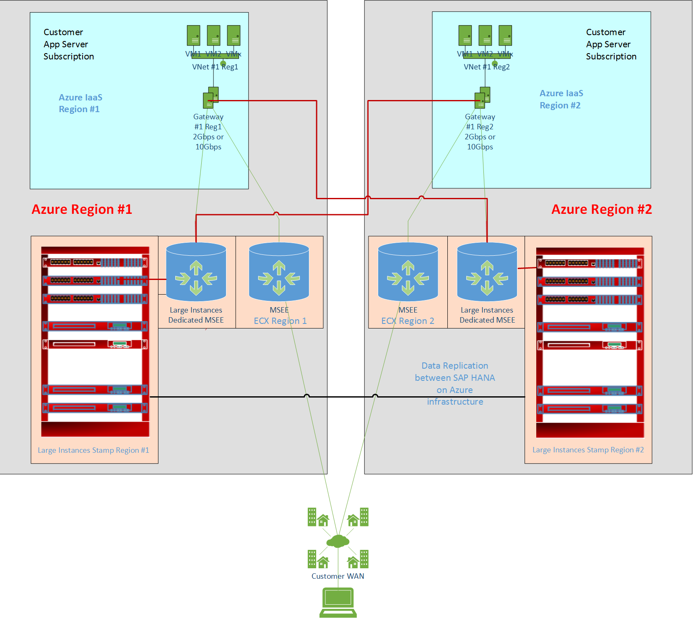

# SAP HANA Large Instances high availability and disaster recovery on Azure 

>[!IMPORTANT]
>This documentation doesn't replace the SAP HANA administration documentation or SAP Notes. We expect you have expertise in SAP HANA administration and operations, especially with the topics of backup, restore, high availability, and disaster recovery.

In this article, we'll give an overview of high availability (HA) and disaster recovery (DR) of SAP HANA on Azure Large Instances (otherwise known as BareMetal Infrastructure). We'll also detail some of the requirements and considerations related to HA and DR.

Some of the processes described in this documentation are simplified. They aren't intended as detailed steps to be included in operation handbooks. To create operation handbooks for your configurations, run and test your processes with your specific HANA versions and releases. You can then document the processes specific to your configurations.

## HA and DR

High availability and disaster recovery are crucial aspects of running your mission-critical SAP HANA on the Azure (Large Instances) server. It's important to work with SAP, your system integrator, or Microsoft to properly architect and implement the right high availability and disaster recovery strategies. Also consider the recovery point objective (RPO) and recovery time objective (RTO), which are specific to your environment.

Microsoft supports some SAP HANA high-availability capabilities with HANA Large Instances. These capabilities include:

- **Storage replication**: The storage system's ability to replicate all data to another HANA Large Instance stamp in another Azure region. SAP HANA operates independently of this method. This functionality is the default disaster recovery mechanism offered for HANA Large Instances.
- **HANA system replication**: The [replication of all data in SAP HANA](https://help.sap.com/viewer/6b94445c94ae495c83a19646e7c3fd56/2.0.01/en-US/b74e16a9e09541749a745f41246a065e.html) to a separate SAP HANA system. The RTO is minimized through data replication at regular intervals. SAP HANA supports asynchronous, synchronous in-memory, and synchronous modes. Synchronous mode is used only for SAP HANA systems within the same datacenter or less than 100 km apart. With the current design of HANA Large Instance stamps, HANA system replication can be used for high availability within one region only. HANA system replication requires a third-party reverse proxy or routing component for disaster recovery configurations into another Azure region. 
- **Host auto-failover**: A local fault-recovery solution for SAP HANA that's an alternative to HANA system replication. If the primary node becomes unavailable, you configure one or more standby SAP HANA nodes in scale-out mode, and SAP HANA automatically fails over to a standby node.

SAP HANA on Azure (Large Instances) is offered in two Azure regions in four geopolitical areas: US, Australia, Europe, and Japan. Two regions within a geopolitical area that host HANA Large Instance (HLI) stamps are connected to separate dedicated network circuits. These HLIs are used for replicating storage snapshots to provide disaster recovery methods. Replication isn't set up by default but only for customers who order disaster recovery functionality. Storage replication is dependent on the usage of storage snapshots for HANA Large Instances. You can't choose an Azure region as a DR region that's in a different geopolitical area.

## Currently supported options

The following table shows the currently supported high availability and disaster recovery methods and combinations:

| Scenario supported in HANA Large Instances | High availability option | Disaster recovery option | Comments |
| --- | --- | --- | --- |
| Single node | Not available. | Dedicated DR setup.  Multipurpose DR setup. | |
| Host automatic failover: Scale-out (with or without standby)  including 1+1 | Possible with the standby taking the active role.  HANA controls the role switch. | Dedicated DR setup.  Multipurpose DR setup.  DR synchronization by using storage replication. | HANA volume sets are attached to all the nodes.  DR site must have the same number of nodes. |
| HANA system replication | Possible with primary or secondary setup.  Secondary moves to primary role in a failover case.  HANA system replication and OS control failover. | Dedicated DR setup.  Multipurpose DR setup.  DR synchronization by using storage replication.  DR by using HANA system replication isn't yet possible without third-party components. | Separate set of disk volumes are attached to each node.  Only disk volumes of secondary replica in the production site get replicated to the DR location.  One set of volumes is required at the DR site. | 

A dedicated DR setup is where the HANA Large Instance unit in the DR site isn't used for running any other workload or non-production system. The unit is passive and is deployed only if a disaster failover is executed. This setup isn't the preferred option for most customers.

To learn about storage layout and ethernet details for your architecture, see [HLI supported scenarios](hana-supported-scenario.md).

> [!NOTE]
> Before HANA2.0 SPS4 it was not supported to take database snapshots of multi-tenant database container databases (more than one tenant). With SPS4 and newer SAP is fully supporting this snapshot feature.  

A multipurpose DR setup is where the HANA Large Instance unit on the DR site runs a non-production workload. If there's a disaster, shut down the non-production system, mount the storage-replicated (added) volume sets, and start the production HANA instance. Most customers who use the HANA Large Instance disaster recovery functionality use this configuration. 

You can find more information on SAP HANA high availability in the following SAP articles: 

- [SAP HANA High Availability Whitepaper](https://go.sap.com/documents/2016/05/f8e5eeba-737c-0010-82c7-eda71af511fa.html)
- [SAP HANA Administration Guide](https://help.sap.com/hana/SAP_HANA_Administration_Guide_en.pdf)
- [SAP HANA Academy Video on SAP HANA System Replication](https://scn.sap.com/community/hana-in-memory/blog/2015/05/19/sap-hana-system-replication)
- [SAP Support Note #1999880 – FAQ on SAP HANA System Replication](https://launchpad.support.sap.com/#/notes/1999880)
- [SAP Support Note #2165547 – SAP HANA Back up and Restore within SAP HANA System Replication Environment](https://websmp230.sap-ag.de/sap(bD1lbiZjPTAwMQ==)/bc/bsp/sno/ui_entry/entry.htm?param=69765F6D6F64653D3030312669765F7361706E6F7465735F6E756D6265723D3231363535343726)
- [SAP Support Note #1984882 – Using SAP HANA System Replication for Hardware Exchange with Minimum/Zero Downtime](https://websmp230.sap-ag.de/sap(bD1lbiZjPTAwMQ==)/bc/bsp/sno/ui_entry/entry.htm?param=69765F6D6F64653D3030312669765F7361706E6F7465735F6E756D6265723D3139383438383226)

## Network considerations for disaster recovery with HANA Large Instances

To take advantage of the disaster recovery functionality of HANA Large Instances, you need to design network connectivity to the two Azure regions. You need an Azure ExpressRoute circuit connection from on-premises in your main Azure region, and another circuit connection from on-premises to your disaster recovery region. This measure covers a situation in which there's a problem in an Azure region, including a Microsoft Enterprise Edge Router (MSEE) location.

You can also connect all Azure virtual networks that connect to SAP HANA on Azure (Large Instances) in one region to an ExpressRoute circuit that connects HANA Large Instances in the other region. With this *cross connect*, services running on an Azure virtual network in Region 1 can connect to HANA Large Instance units in Region 2, and the other way around. This measure addresses a case in which only one of the MSEE locations that connects to your on-premises location with Azure goes offline.

The following graphic illustrates a resilient configuration for disaster recovery cases:

## Other requirements with HANA Large Instances storage replication for disaster recovery

- Order SAP HANA on Azure (Large Instances) SKUs of the same size as your production SKUs and deploy them in the disaster recovery region. In current customer deployments, these instances are used to run non-production HANA instances. These configurations are referred to as *multipurpose DR setups*.   
- Order more storage on the DR site for each of your SAP HANA on Azure (Large Instances) SKUs that you want to recover in the disaster recovery site. Buying more storage lets you allocate the storage volumes. You can allocate the volumes that are the target of the storage replication from your production Azure region into the disaster recovery Azure region.
- You may have SAP HANA system replication set up on primary and storage-based replication to the DR site. Then you must purchase more storage at the DR site so the data of both primary and secondary nodes gets replicated to the DR site.

## Next steps

Learn about Backup and restore of SAP HANA on HANA Large Instances.

> [!div class="nextstepaction"]
> [Backup and restore of SAP HANA on HANA Large Instances](hana-backup-restore.md)
