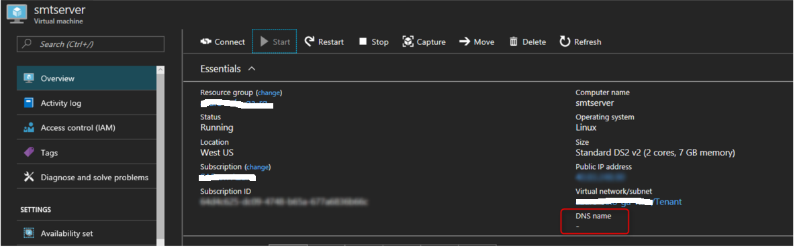
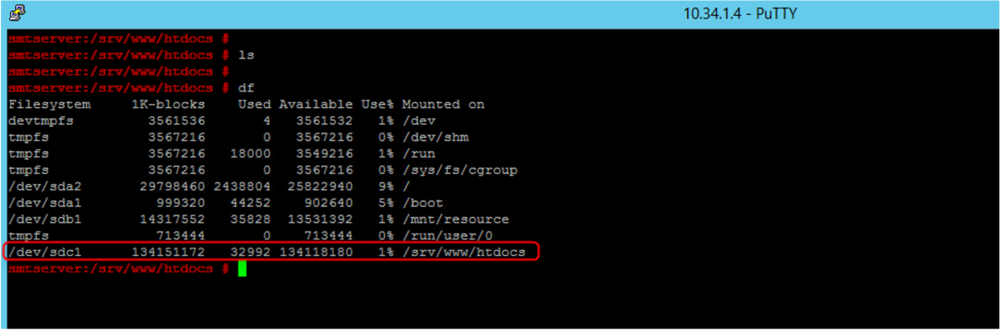
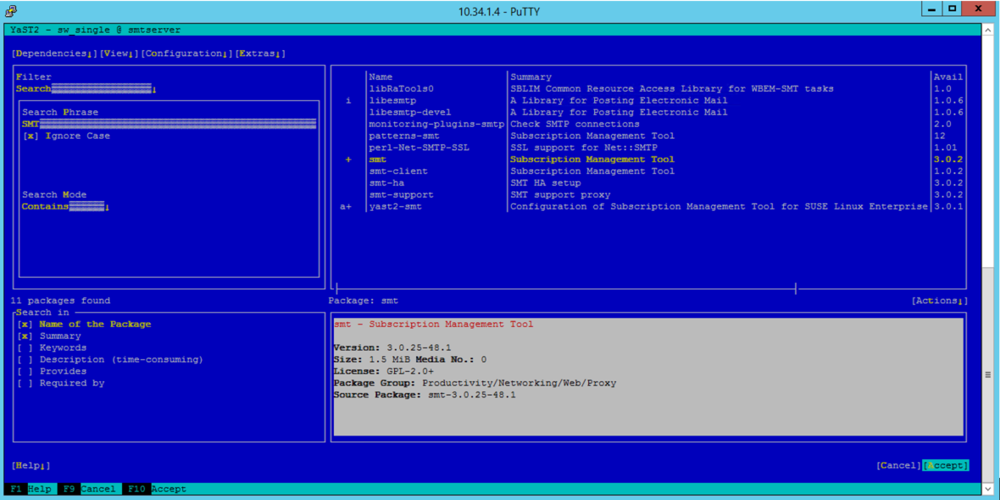
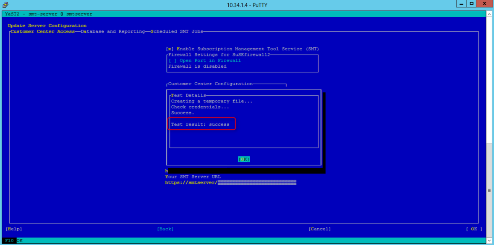
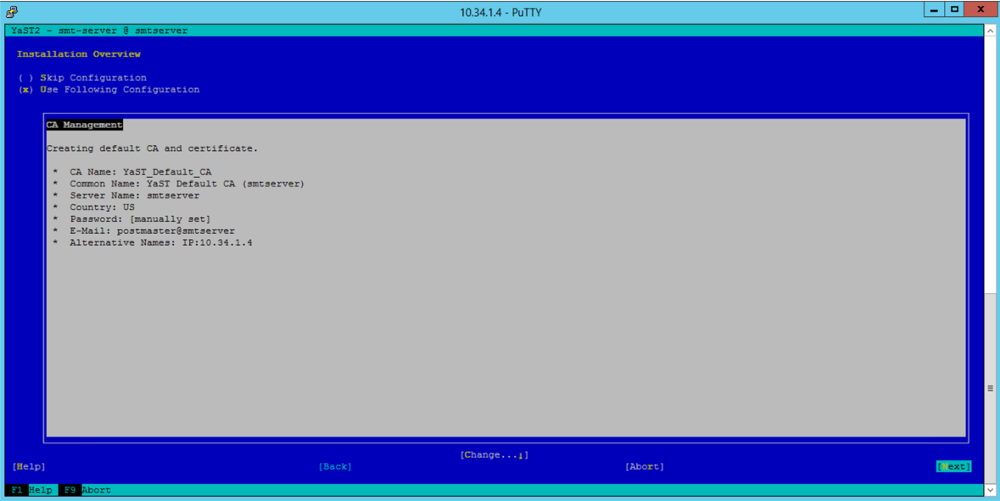
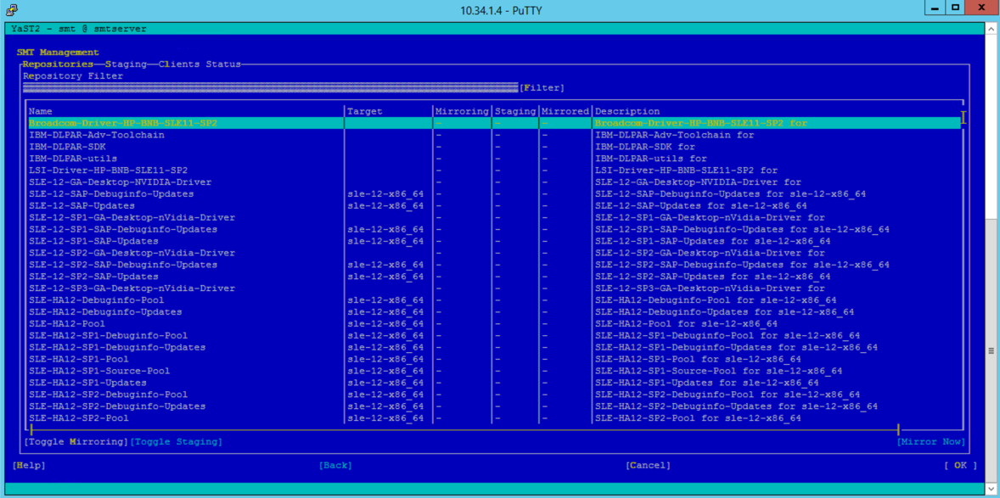
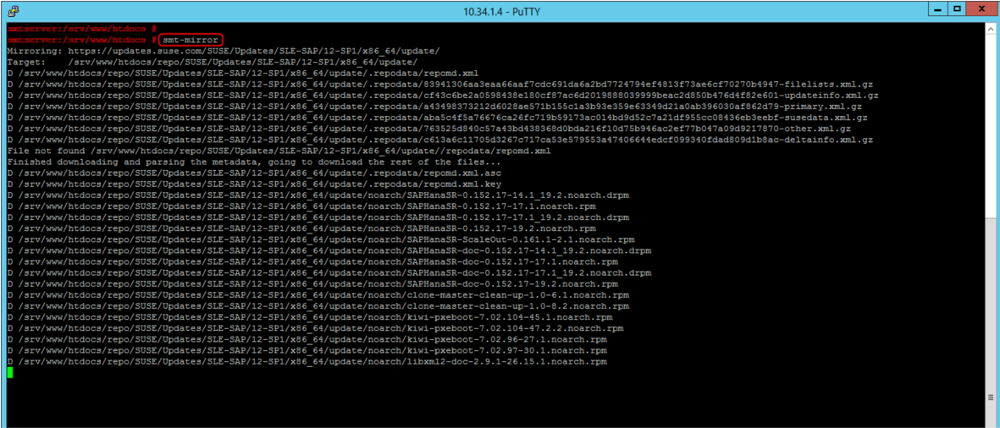
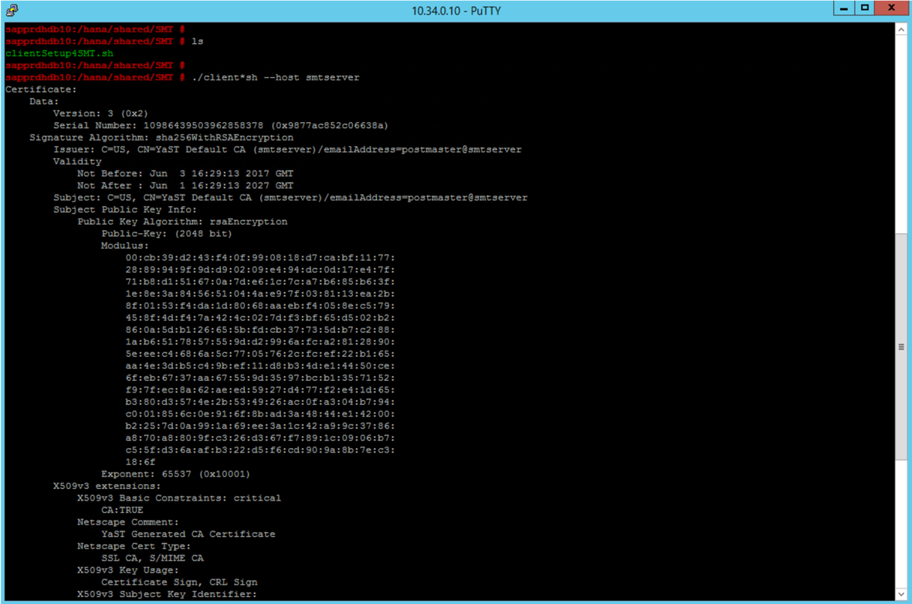
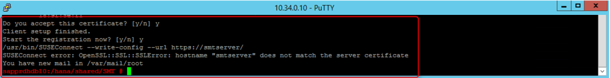
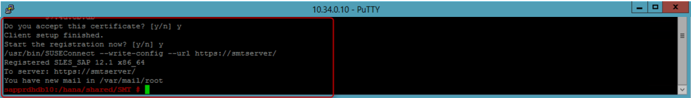

# Set up SMT server for SUSE Linux

In this article, we'll walk through the steps of setting up SMT server for SAP HANA on Azure Large Instances, otherwise known as BareMetal Infrastructure.

Large Instances of SAP HANA don't have direct connectivity to the internet. As a result, it isn't straightforward to register such a unit with the operating system provider and to download and apply updates. A solution for SUSE Linux is to set up an SMT server in an Azure virtual machine (VM). You'll host the virtual machine in an Azure virtual network connected to the HANA Large Instance (HLI). With the SMT server in place, the HANA Large Instance can register and download updates. 

For more information on SUSE, see their [Subscription Management Tool for SLES 12 SP2](https://www.suse.com/documentation/sles-12/pdfdoc/book_smt/book_smt.pdf). 

## Prerequisites

To install an SMT server for HANA Large Instances, you'll first need:

- An Azure virtual network connected to the HANA Large Instance ExpressRoute circuit.
- A SUSE account associated with an organization. The organization should have a valid SUSE subscription.

## Install SMT server on an Azure virtual machine

1. Sign in to the [SUSE Customer Center](https://scc.suse.com/). Go to **Organization** > **Organization Credentials**. In that section, you should find the credentials necessary to set up the SMT server.

2. Install a SUSE Linux VM in the Azure virtual network. To deploy the virtual machine, take an SLES 12 SP2 gallery image of Azure (select BYOS SUSE image). In the deployment process, don't define a DNS name, and don't use static IP addresses.

    

    The deployed virtual machine has the internal IP address in the Azure virtual network of 10.34.1.4. The name of the virtual machine is *smtserver*. After the installation, check connectivity to the HANA Large Instances. Depending on how you organized name resolution, you might need to configure resolution of the HANA Large Instances in etc/hosts of the Azure virtual machine. 

3. Add a disk to the virtual machine. You'll use this disk to hold the updates; the boot disk itself could be too small. Here, the disk is mounted to /srv/www/htdocs, as shown in the following screenshot. A 100-GB disk should suffice.

    

4. Sign in to the HANA Large Instances; maintain /etc/hosts. Check whether you can reach the Azure virtual machine that will run the SMT server over the network.

5. Sign in to the Azure virtual machine that will run the SMT server. If you're using putty to sign in to the virtual machine, run this sequence of commands in your bash window:

    ```
    cd ~
    echo "export NCURSES_NO_UTF8_ACS=1" >> .bashrc
    ```

6. Restart your bash to activate the settings. Then start YAST.

7. Connect your VM (smtserver) to the SUSE site.

    ```
    smtserver:~ # SUSEConnect -r <registration code> -e s<email address> --url https://scc.suse.com
    Registered SLES_SAP 12.2 x86_64
    To server: https://scc.suse.com
    Using E-Mail: email address
    Successfully registered system.
    ```
    
8. After the virtual machine is connected to the SUSE site, install the SMT packages. Use the following putty command to install the SMT packages.

    ```
    smtserver:~ # zypper in smt
    Refreshing service 'SUSE_Linux_Enterprise_Server_for_SAP_Applications_12_SP2_x86_64'.
    Loading repository data...
    Reading installed packages...
    Resolving package dependencies...
    ```
    
    You can also use the YAST tool to install the SMT packages. In YAST, go to **Software Maintenance**, and search for smt. Select **smt**, which switches automatically to yast2-smt.

    [](./media/hana-installation/image5_smt_in_yast.PNG#lightbox)

    Accept the selection for installation on the smtserver. 


9. After the installation completes, go to the SMT server configuration. Enter the organizational credentials from the SUSE Customer Center you retrieved earlier. Also enter your Azure virtual machine hostname as the SMT Server URL. In this example, it's https:\//smtserver.

    [](./media/hana-installation/image6_configuration_of_smtserver1.png#lightbox)

10. Now test whether the connection to the SUSE Customer Center works. As you see in the following screenshot, in this example, it did work.

    [](./media/hana-installation/image7_test_connect.png#lightbox)

11. After the SMT setup starts, provide a database password. Because it's a new installation, you should define that password as shown in the following screenshot.

    [](./media/hana-installation/image8_define_db_passwd.PNG#lightbox)

12. Create a certificate.

    [](./media/hana-installation/image9_certificate_creation.PNG#lightbox)

    At the end of the configuration, it might take a few minutes to run the synchronization check. After the installation and configuration of the SMT server, you should find the directory repo under the mount point /srv/www/htdocs/. There are also some subdirectories under the repo. 

13. Restart the SMT server and its related services with these commands.

    ```
    rcsmt restart
    systemctl restart smt.service
    systemctl restart apache2
    ```

## Download packages onto the SMT server

1. After all the services are restarted, select the appropriate packages in SMT Management by using YAST. The package selection depends on the operating system image of the HANA Large Instance server. The package selection doesn't depend on the SLES release or version of the virtual machine running the SMT server. The following screenshot shows an example of the selection screen.

    [](./media/hana-installation/image10_select_packages.PNG#lightbox)

2. Start the initial copy of the select packages to the SMT server you set up. This copy is triggered in the shell by using the command, smt-mirror.

   [ ](./media/hana-installation/image11_download_packages.PNG#lightbox)

    The packages should be copied into the directories created under the mount point /srv/www/htdocs. This process can take an hour or more, depending on how many packages you select. As this process finishes, move to the SMT client setup. 

## Set up the SMT client on HANA Large Instances

The client or clients in this case are the HANA Large Instances. The SMT server setup copied the script clientSetup4SMT.sh into the Azure virtual machine. 

Copy that script over to the HANA Large Instance you want to connect to your SMT server. Start the script with the -h option, and give the name of your SMT server as a parameter. In this example, the name is *smtserver*.

[](./media/hana-installation/image12_configure_client.PNG#lightbox)

It's possible that the load of the certificate from the server by the client succeeds. In this example, however, the registration fails, as shown in the following screenshot.

[](./media/hana-installation/image13_registration_failed.PNG#lightbox)

If the registration fails, see [SUSE support document](https://www.suse.com/de-de/support/kb/doc/?id=7006024), and run the steps described there.

> [!IMPORTANT] 
> For the server name, provide the name of the virtual machine (in this case, *smtserver*), without the fully qualified domain name. 
    
After running these steps, run the following command on the HANA Large Instance:
    
```
SUSEConnect –cleanup
```

> [!Note] 
> Wait a few minutes after that step. If you run clientSetup4SMT.sh immediately, you might get an error.

If you find a problem you need to fix based on the steps of the SUSE article, restart clientSetup4SMT.sh on the HANA Large Instance. Now it should finish successfully.

[](./media/hana-installation/image14_finish_client_config.PNG#lightbox)

You configured the SMT client of the HLI to connect to the SMT server installed on the Azure VM. Now take "zypper up" or "zypper in" to install OS updates to HANA Large Instances, or install other packages. You can only get updates that you previously downloaded on the SMT server.

## Next steps
Learn about migrating SAP HANA on Azure Large Instance to Azure Virtual Machines.

> [!div class="nextstepaction"]
> [SAP HANA on Azure Large Instance migration to Azure Virtual Machines](hana-large-instance-virtual-machine-migration.md)
