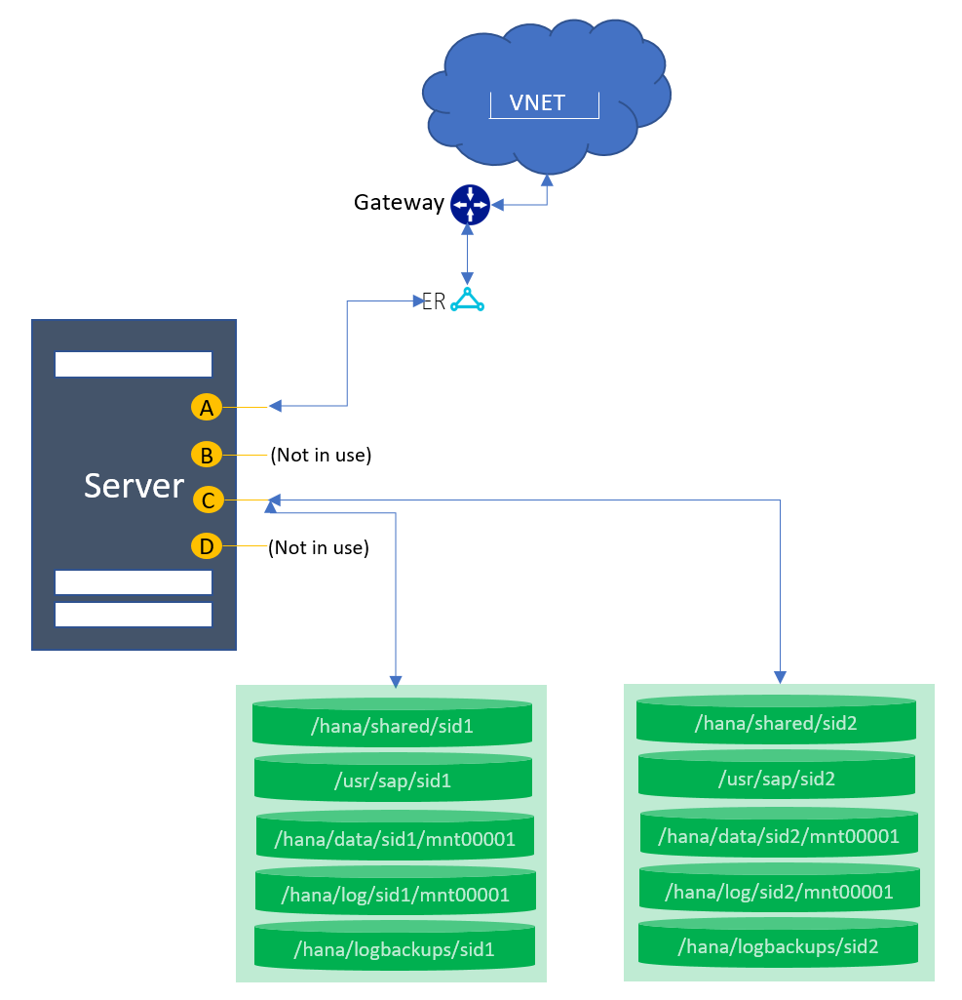
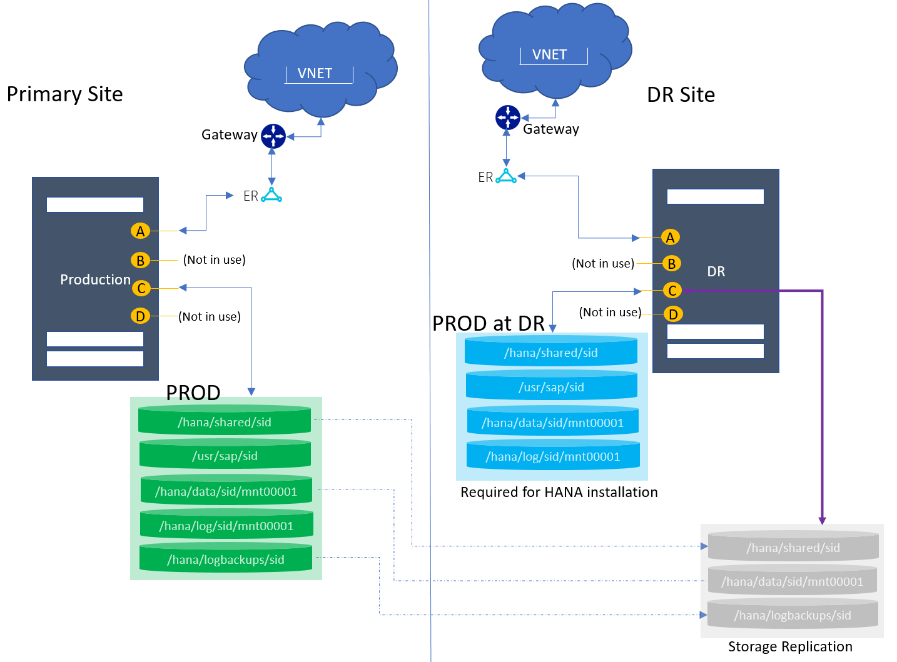
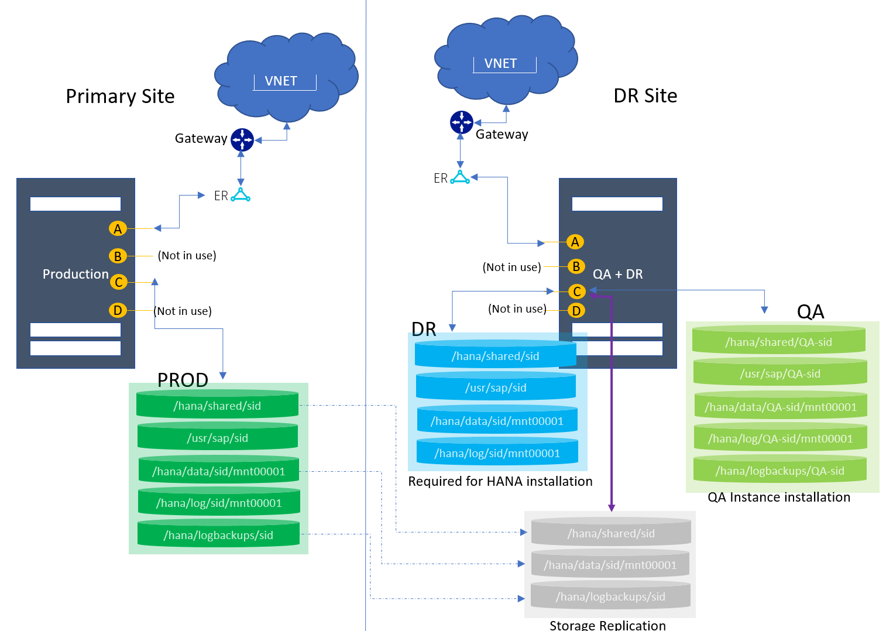
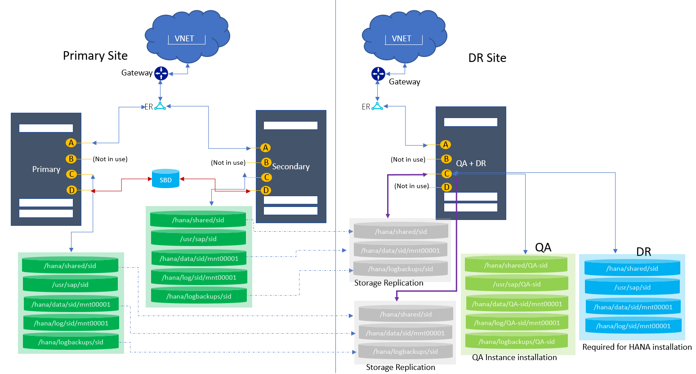
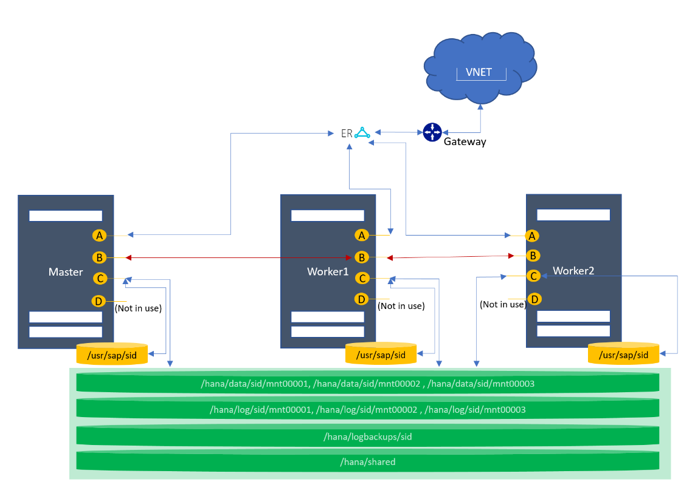
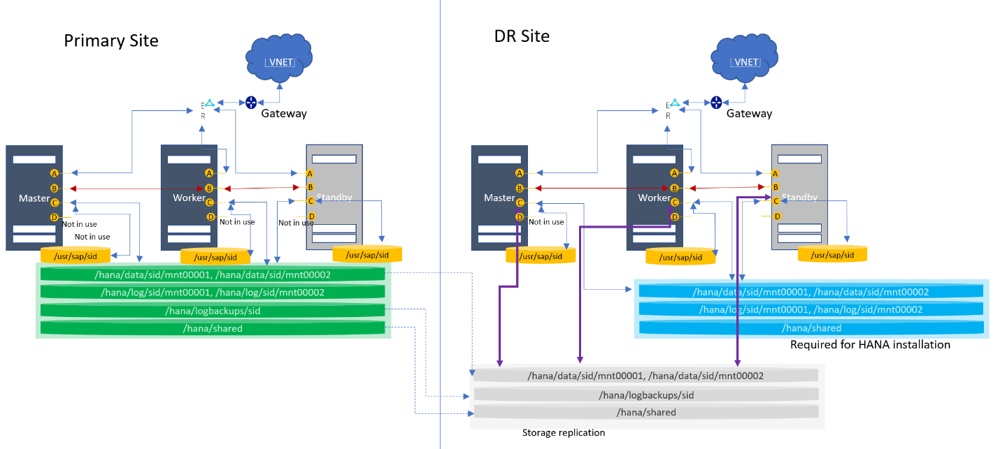
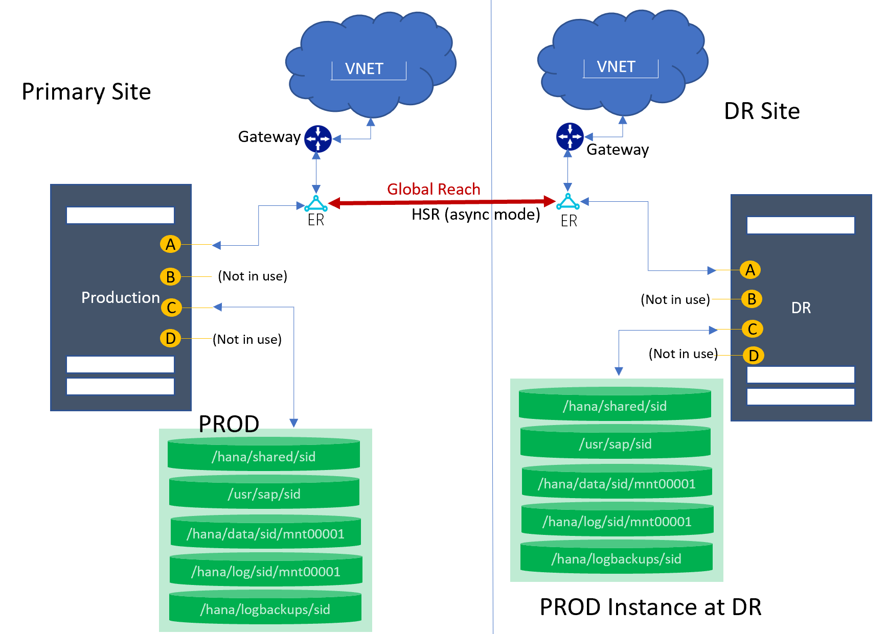
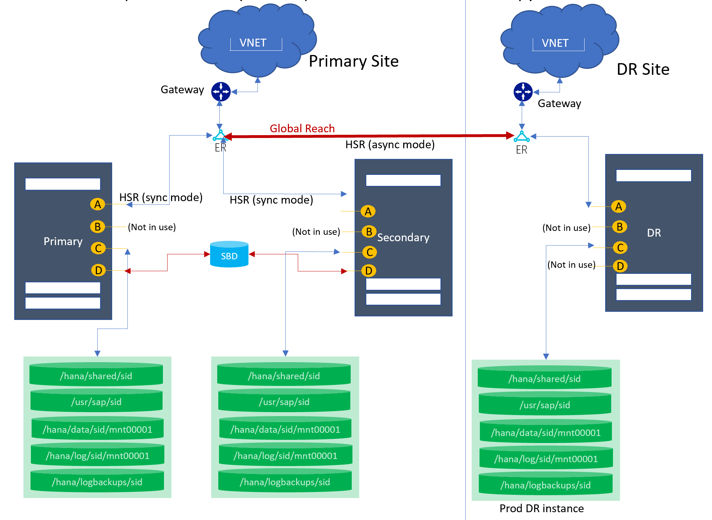
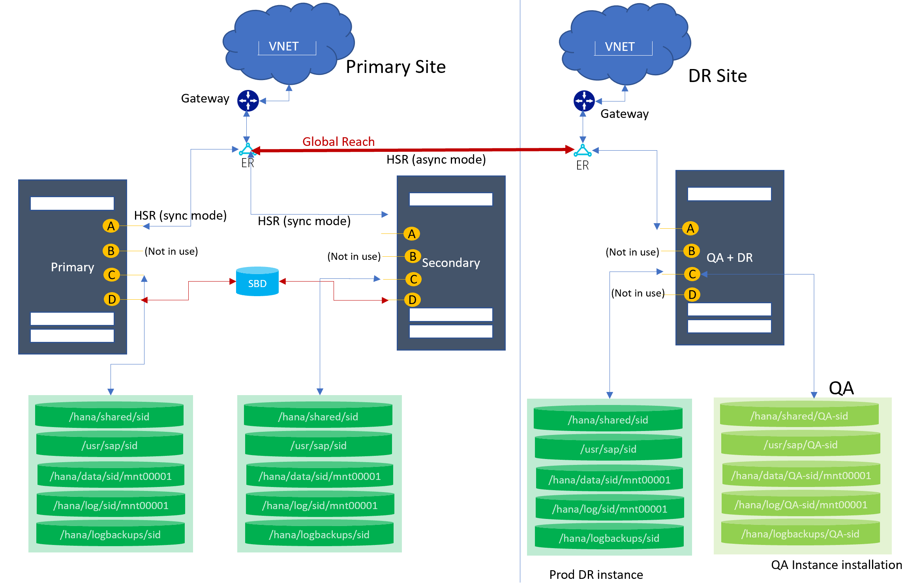

# Supported scenarios for HANA Large Instances
This article describes the supported scenarios and architectural details for HANA Large Instances (HLI).

>[!NOTE]
>If your scenario isn't mentioned in this article, contact the Microsoft Service Management team to assess your requirements.
Before you set up the HLI unit, validate the design with SAP or your service implementation partner.

## Terms and definitions
Let's understand the terms and definitions used in this article:

- **SID**: A system identifier for the HANA system.
- **HLI**: Hana Large Instances.
- **DR**: Disaster recovery (DR).
- **Normal DR**: A system setup with a dedicated resource for DR purposes only.
- **Multipurpose DR**: A DR site system that's configured to use a non-production environment alongside a production instance that's configured for a DR event. 
- **Single-SID**: A system with one instance installed.
- **Multi-SID**: A system with multiple instances configured; also called an MCOS environment.
- **HSR**: SAP HANA system replication.

## Overview
HANA Large Instances support various architectures to help you accomplish your business requirements. The following sections cover the architectural scenarios and their configuration details. 

The derived architectural designs are purely from an infrastructure perspective. Consult SAP or your implementation partners for the HANA deployment. If your scenarios aren't listed in this article, contact the Microsoft account team to review the architecture and derive a solution for you.

> [!NOTE]
> These architectures are fully compliant with Tailored Data Integration (TDI) design and are supported by SAP.

This article describes the details of the two components in each supported architecture:

- Ethernet
- Storage

### Ethernet

Each provisioned server comes preconfigured with sets of Ethernet interfaces. The Ethernet interfaces configured on each HLI unit are categorized into four types:

- **A**: Used for or by client access.
- **B**: Used for node-to-node communication. This interface is configured on all servers no matter what topology you request. However, it's used only for scale-out scenarios.
- **C**: Used for node-to-storage connectivity.
- **D**: Used for node-to-iSCSI device connection for fencing setup. This interface is configured only when an HSR setup is requested.  

| NIC logical interface | SKU type | Name with SUSE OS | Name with RHEL OS | Use case|
| --- | --- | --- | --- | --- |
| A | TYPE I | eth0.tenant | eno1.tenant | Client-to-HLI |
| B | TYPE I | eth2.tenant | eno3.tenant | Node-to-node|
| C | TYPE I | eth1.tenant | eno2.tenant | Node-to-storage |
| D | TYPE I | eth4.tenant | eno4.tenant | Fencing |
| A | TYPE II | vlan\<tenantNo> | team0.tenant | Client-to-HLI |
| B | TYPE II | vlan\<tenantNo+2> | team0.tenant+2 | Node-to-node|
| C | TYPE II | vlan\<tenantNo+1> | team0.tenant+1 | Node-to-storage |
| D | TYPE II | vlan\<tenantNo+3> | team0.tenant+3 | Fencing |

You choose the interface based on the topology that's configured on the HLI unit. For example, interface “B” is set up for node-to-node communication, which is useful when you have a scale-out topology configured. This interface isn't used for single node scale-up configurations. For more information about interface usage, review your required scenarios (later in this article). 

If necessary, you can define more NIC cards on your own. However, the configurations of existing NICs *can't* be changed.

>[!NOTE]
>You might find additional interfaces that are physical interfaces or bonding. 
Consider only the previously mentioned interfaces for your use case. Ignore any others.

The distribution for units with two assigned IP addresses should look as follows:

- Ethernet “A” should have an assigned IP address that's within the server IP pool address range that you submitted to Microsoft. This IP address should be maintained in the */etc/hosts* directory of the operating system (OS).

- Ethernet “C” should have an assigned IP address that's used for communication to NFS. You *don't* need to maintain this address in the *etc/hosts* directory to allow instance-to-instance traffic within the tenant.

For HANA system replication or HANA scale-out deployment, a blade configuration with two assigned IP addresses isn't suitable. If you have only two assigned IP addresses, and you want to deploy such a configuration, contact SAP HANA on Azure Service Management. They can assign you a third IP address in a third VLAN. For HANA Large Instances with three assigned IP addresses on three NIC ports, the following usage rules apply:

- Ethernet “A” should have an assigned IP address that's outside of the server IP pool address range that you submitted to Microsoft. This IP address shouldn't be maintained in the *etc/hosts* directory of the OS.

- Ethernet “B” should be maintained exclusively in the *etc/hosts* directory for communication between the various instances. Maintain these IP addresses in scale-out HANA configurations as the IP addresses that HANA uses for the inter-node configuration.

- Ethernet “C” should have an assigned IP address that's used for communication to NFS storage. This type of address shouldn't be maintained in the *etc/hosts* directory.

- Ethernet “D” should be used exclusively for access to fencing devices for Pacemaker. This interface is required when you configure HANA system replication and want to achieve auto failover of the operating system by using an SBD-based device.

### Storage
Storage is preconfigured based on the requested topology. The volume sizes and mount points vary depending on the number of servers and SKUs, and the configured topology. For more information, review your required scenarios (later in this article). If you require more storage, you can purchase it in 1-TB increments.

>[!NOTE]
>The mount point /usr/sap/\<SID> is a symbolic link to the /hana/shared mount point.

## Supported scenarios

The architectural diagrams in the next sections use the following notations:

Here are the supported scenarios:

* Single node with one SID
* Single node MCOS
* Single node with DR (normal)
* Single node with DR (multipurpose)
* HSR with fencing
* HSR with DR (normal/multipurpose) 
* Host auto failover (1+1) 
* Scale-out with standby
* Scale-out without standby
* Scale-out with DR

## Single node with one SID

This topology supports one node in a scale-up configuration with one SID.

### Architecture diagram  

### Ethernet
The following network interfaces are preconfigured:

| NIC logical interface | SKU type | Name with SUSE OS | Name with RHEL OS | Use case|
| --- | --- | --- | --- | --- |
| A | TYPE I | eth0.tenant | eno1.tenant | Client-to-HLI |
| B | TYPE I | eth2.tenant | eno3.tenant | Configured but not in use |
| C | TYPE I | eth1.tenant | eno2.tenant | Node-to-storage |
| D | TYPE I | eth4.tenant | eno4.tenant | Configured but not in use |
| A | TYPE II | vlan\<tenantNo> | team0.tenant | Client-to-HLI |
| B | TYPE II | vlan\<tenantNo+2> | team0.tenant+2 | Configured but not in use |
| C | TYPE II | vlan\<tenantNo+1> | team0.tenant+1 | Node-to-storage |
| D | TYPE II | vlan\<tenantNo+3> | team0.tenant+3 | Configured but not in use |

### Storage
The following mount points are preconfigured:

| Mount point | Use case | 
| --- | --- |
|/hana/shared/SID | HANA installation | 
|/hana/data/SID/mnt00001 | Data files installation | 
|/hana/log/SID/mnt00001 | Log files installation | 
|/hana/logbackups/SID | Redo logs |

### Key considerations
- /usr/sap/SID is a symbolic link to /hana/shared/SID.

## Single node MCOS

This topology supports one node in a scale-up configuration with multiple SIDs.

### Architecture diagram  

### Ethernet
The following network interfaces are preconfigured:

| NIC logical interface | SKU type | Name with SUSE OS | Name with RHEL OS | Use case|
| --- | --- | --- | --- | --- |
| A | TYPE I | eth0.tenant | eno1.tenant | Client-to-HLI |
| B | TYPE I | eth2.tenant | eno3.tenant | Configured but not in use |
| C | TYPE I | eth1.tenant | eno2.tenant | Node-to-storage |
| D | TYPE I | eth4.tenant | eno4.tenant | Configured but not in use |
| A | TYPE II | vlan\<tenantNo> | team0.tenant | Client-to-HLI |
| B | TYPE II | vlan\<tenantNo+2> | team0.tenant+2 | Configured but not in use |
| C | TYPE II | vlan\<tenantNo+1> | team0.tenant+1 | Node-to-storage |
| D | TYPE II | vlan\<tenantNo+3> | team0.tenant+3 | Configured but not in use |

### Storage
The following mount points are preconfigured:

| Mount point | Use case | 
| --- | --- |
|/hana/shared/SID1 | HANA installation for SID1 | 
|/hana/data/SID1/mnt00001 | Data files installation for SID1 | 
|/hana/log/SID1/mnt00001 | Log files installation for SID1 | 
|/hana/logbackups/SID1 | Redo logs for SID1 |
|/hana/shared/SID2 | HANA installation for SID2 | 
|/hana/data/SID2/mnt00001 | Data files installation for SID2 | 
|/hana/log/SID2/mnt00001 | Log files installation for SID2 | 
|/hana/logbackups/SID2 | Redo logs for SID2 |

### Key considerations
- /usr/sap/SID is a symbolic link to /hana/shared/SID.
- Volume size distribution is based on the database size in memory. To learn what database sizes in memory are supported in a multi-SID environment, see [Overview and architecture](./hana-overview-architecture.md).

## Single node with DR using storage replication
 
This topology supports one node in a scale-up configuration with one or multiple SIDs. Storage-based replication to the DR site is used for a primary SID. In the diagram, only a single-SID system is shown at the primary site, but MCOS systems are supported as well.

### Architecture diagram  

### Ethernet
The following network interfaces are preconfigured:

| NIC logical interface | SKU type | Name with SUSE OS | Name with RHEL OS | Use case|
| --- | --- | --- | --- | --- |
| A | TYPE I | eth0.tenant | eno1.tenant | Client-to-HLI |
| B | TYPE I | eth2.tenant | eno3.tenant | Configured but not in use |
| C | TYPE I | eth1.tenant | eno2.tenant | Node-to-storage |
| D | TYPE I | eth4.tenant | eno4.tenant | Configured but not in use |
| A | TYPE II | vlan\<tenantNo> | team0.tenant | Client-to-HLI |
| B | TYPE II | vlan\<tenantNo+2> | team0.tenant+2 | Configured but not in use |
| C | TYPE II | vlan\<tenantNo+1> | team0.tenant+1 | Node-to-storage |
| D | TYPE II | vlan\<tenantNo+3> | team0.tenant+3 | Configured but not in use |

### Storage
The following mount points are preconfigured:

| Mount point | Use case | 
| --- | --- |
|/hana/shared/SID | HANA installation for SID | 
|/hana/data/SID/mnt00001 | Data files installation for SID | 
|/hana/log/SID/mnt00001 | Log files installation for SID | 
|/hana/logbackups/SID | Redo logs for SID |

### Key considerations
- /usr/sap/SID is a symbolic link to /hana/shared/SID.
- For MCOS: Volume size distribution is based on the database size in memory. To learn what database sizes in memory are supported in a multi-SID environment, see [Overview and architecture](./hana-overview-architecture.md).
- At the DR site: The volumes and mount points are configured (marked as “Required for HANA installation”) for the production HANA instance installation at the DR HLI unit. 
- At the DR site: The data, log backups, and shared volumes (marked as “Storage Replication”) are replicated via snapshot from the production site. These volumes are mounted during failover only. For more information, see [Disaster recovery failover procedure](./hana-overview-high-availability-disaster-recovery.md).
- The boot volume for *SKU Type I class* is replicated to the DR node.

## Single node with DR (multipurpose) using storage replication
 
This topology supports one node in a scale-up configuration with one or multiple SIDs. Storage-based replication to the DR site is used for a primary SID. 

In the diagram, only a single-SID system is shown at the primary site, but multi-SID (MCOS) systems are supported as well. At the DR site, the HLI unit is used for the QA instance. Production operations run from the primary site. During DR failover (or failover test), the QA instance at the DR site is taken down.

### Architecture diagram  

### Ethernet
The following network interfaces are preconfigured:

| NIC logical interface | SKU type | Name with SUSE OS | Name with RHEL OS | Use case|
| --- | --- | --- | --- | --- |
| A | TYPE I | eth0.tenant | eno1.tenant | Client-to-HLI |
| B | TYPE I | eth2.tenant | eno3.tenant | Configured but not in use |
| C | TYPE I | eth1.tenant | eno2.tenant | Node-to-storage |
| D | TYPE I | eth4.tenant | eno4.tenant | Configured but not in use |
| A | TYPE II | vlan\<tenantNo> | team0.tenant | Client-to-HLI |
| B | TYPE II | vlan\<tenantNo+2> | team0.tenant+2 | Configured but not in use |
| C | TYPE II | vlan\<tenantNo+1> | team0.tenant+1 | Node-to-storage |
| D | TYPE II | vlan\<tenantNo+3> | team0.tenant+3 | Configured but not in use |

### Storage
The following mount points are preconfigured:

| Mount point | Use case | 
| --- | --- |
|**At the primary site**|
|/hana/shared/SID | HANA installation for production SID | 
|/hana/data/SID/mnt00001 | Data files installation for production SID | 
|/hana/log/SID/mnt00001 | Log files installation for production SID | 
|/hana/logbackups/SID | Redo logs for production SID |
|**At the DR site**|
|/hana/shared/SID | HANA installation for production SID | 
|/hana/data/SID/mnt00001 | Data files installation for production  SID | 
|/hana/log/SID/mnt00001 | Log files installation for production SID | 
|/hana/shared/QA-SID | HANA installation for QA SID | 
|/hana/data/QA-SID/mnt00001 | Data files installation for QA  SID | 
|/hana/log/QA-SID/mnt00001 | Log files installation for QA SID |
|/hana/logbackups/QA-SID | Redo logs for QA SID |

### Key considerations
- /usr/sap/SID is a symbolic link to /hana/shared/SID.
- For MCOS: Volume size distribution is based on the database size in memory. To learn what database sizes in memory are supported in a multi-SID environment, see [Overview and architecture](./hana-overview-architecture.md).
- At the DR site: The volumes and mount points are configured (marked as “Required for HANA installation”) for the production HANA instance installation at the DR HLI unit. 
- At the DR site: The data, log backups, and shared volumes (marked as “Storage Replication”) are replicated via snapshot from the production site. These volumes are mounted during failover only. For more information, see [Disaster recovery failover procedure](./hana-overview-high-availability-disaster-recovery.md). 
- At the DR site: The data, log backups, log, and shared volumes for QA (marked as “QA instance installation”) are configured for the QA instance installation.
- The boot volume for *SKU Type I class* is replicated to the DR node.

## HSR with fencing for high availability
 
This topology supports two nodes for the HANA system replication configuration. This configuration is supported only for single HANA instances on a node. MCOS scenarios *aren't* supported.

> [!NOTE]
> As of December 2019, this architecture is supported only for the SUSE operating system.

### Architecture diagram  

### Ethernet
The following network interfaces are preconfigured:

| NIC logical interface | SKU type | Name with SUSE OS | Name with RHEL OS | Use case|
| --- | --- | --- | --- | --- |
| A | TYPE I | eth0.tenant | eno1.tenant | Client-to-HLI |
| B | TYPE I | eth2.tenant | eno3.tenant | Configured but not in use |
| C | TYPE I | eth1.tenant | eno2.tenant | Node-to-storage |
| D | TYPE I | eth4.tenant | eno4.tenant | Used for fencing |
| A | TYPE II | vlan\<tenantNo> | team0.tenant | Client-to-HLI |
| B | TYPE II | vlan\<tenantNo+2> | team0.tenant+2 | Configured but not in use |
| C | TYPE II | vlan\<tenantNo+1> | team0.tenant+1 | Node-to-storage |
| D | TYPE II | vlan\<tenantNo+3> | team0.tenant+3 | Used for fencing |

### Storage
The following mount points are preconfigured:

| Mount point | Use case | 
| --- | --- |
|**On the primary node**|
|/hana/shared/SID | HANA installation for production SID | 
|/hana/data/SID/mnt00001 | Data files installation for production SID | 
|/hana/log/SID/mnt00001 | Log files installation for production SID | 
|/hana/logbackups/SID | Redo logs for production SID |
|**On the secondary node**|
|/hana/shared/SID | HANA installation for secondary SID | 
|/hana/data/SID/mnt00001 | Data files installation for secondary  SID | 
|/hana/log/SID/mnt00001 | Log files installation for secondary SID | 
|/hana/logbackups/SID | Redo logs for secondary SID |

### Key considerations
- /usr/sap/SID is a symbolic link to /hana/shared/SID.
- For MCOS: Volume size distribution is based on the database size in memory. To learn what database sizes in memory are supported in a multi-SID environment, see [Overview and architecture](./hana-overview-architecture.md).
- Fencing: An SBD is configured for the fencing device setup. However, the use of fencing is optional.

## High availability with HSR and DR with storage replication
 
This topology supports two nodes for the HANA system replication configuration. Both normal and multipurpose DRs are supported. These configurations are supported only for single HANA instances on a node. MCOS scenarios *aren't* supported with these configurations.

In the diagram, a multipurpose scenario is shown at the DR site, where the HLI unit is used for the QA instance. Production operations run from the primary site. During DR failover (or failover test), the QA instance at the DR site is taken down. 

### Architecture diagram  

### Ethernet
The following network interfaces are preconfigured:

| NIC logical interface | SKU type | Name with SUSE OS | Name with RHEL OS | Use case|
| --- | --- | --- | --- | --- |
| A | TYPE I | eth0.tenant | eno1.tenant | Client-to-HLI |
| B | TYPE I | eth2.tenant | eno3.tenant | Configured but not in use |
| C | TYPE I | eth1.tenant | eno2.tenant | Node-to-storage |
| D | TYPE I | eth4.tenant | eno4.tenant | Used for fencing |
| A | TYPE II | vlan\<tenantNo> | team0.tenant | Client-to-HLI |
| B | TYPE II | vlan\<tenantNo+2> | team0.tenant+2 | Configured but not in use |
| C | TYPE II | vlan\<tenantNo+1> | team0.tenant+1 | Node-to-storage |
| D | TYPE II | vlan\<tenantNo+3> | team0.tenant+3 | Used for fencing |

### Storage
The following mount points are preconfigured:

| Mount point | Use case | 
| --- | --- |
|**On the primary node at the primary site**|
|/hana/shared/SID | HANA installation for production SID | 
|/hana/data/SID/mnt00001 | Data files installation for production SID | 
|/hana/log/SID/mnt00001 | Log files installation for production SID | 
|/hana/logbackups/SID | Redo logs for production SID |
|**On the secondary node at the primary site**|
|/hana/shared/SID | HANA installation for secondary SID | 
|/hana/data/SID/mnt00001 | Data files installation for secondary  SID | 
|/hana/log/SID/mnt00001 | Log files installation for secondary SID | 
|/hana/logbackups/SID | Redo logs for secondary SID |
|**At the DR site**|
|/hana/shared/SID | HANA installation for production SID | 
|/hana/data/SID/mnt00001 | Data files installation for production  SID | 
|/hana/log/SID/mnt00001 | Log files installation for production SID | 
|/hana/shared/QA-SID | HANA installation for QA SID | 
|/hana/data/QA-SID/mnt00001 | Data files installation for QA  SID | 
|/hana/log/QA-SID/mnt00001 | Log files installation for QA SID |
|/hana/logbackups/QA-SID | Redo logs for QA SID |

### Key considerations
- /usr/sap/SID is a symbolic link to /hana/shared/SID.
- For MCOS: Volume size distribution is based on the database size in memory. To learn what database sizes in memory are supported in a multi-SID environment, see [Overview and architecture](./hana-overview-architecture.md).
- Fencing: An SBD is configured for the fencing setup. However, the use of fencing is optional.
- At the DR site: *Two sets of storage volumes are required* for primary and secondary node replication.
- At the DR site: The volumes and mount points are configured (marked as “Required for HANA installation”) for the production HANA instance installation at the DR HLI unit. 
- At the DR site: The data, log backups, and shared volumes (marked as “Storage Replication”) are replicated via snapshot from the production site. These volumes are mounted during failover only. For more information, see [Disaster recovery failover procedure](./hana-overview-high-availability-disaster-recovery.md). 
- At the DR site: The data, log backups, log, and shared volumes for QA (marked as “QA instance installation”) are configured for the QA instance installation.
- The boot volume for *SKU Type I class* is replicated to the DR node.

## Host auto failover (1+1)
 
This topology supports two nodes in a host auto failover configuration. There's one node with a primary/worker role and another as a standby. *SAP supports this scenario only for S/4 HANA.* For more information, see [OSS note 2408419 - SAP S/4HANA - Multi-Node Support](https://launchpad.support.sap.com/#/notes/2408419).

### Architecture diagram  

### Ethernet
The following network interfaces are preconfigured:

| NIC logical interface | SKU type | Name with SUSE OS | Name with RHEL OS | Use case|
| --- | --- | --- | --- | --- |
| A | TYPE I | eth0.tenant | eno1.tenant | Client-to-HLI |
| B | TYPE I | eth2.tenant | eno3.tenant | Node-to-node communication |
| C | TYPE I | eth1.tenant | eno2.tenant | Node-to-storage |
| D | TYPE I | eth4.tenant | eno4.tenant | Configured but not in use |
| A | TYPE II | vlan\<tenantNo> | team0.tenant | Client-to-HLI |
| B | TYPE II | vlan\<tenantNo+2> | team0.tenant+2 | Node-to-node communication |
| C | TYPE II | vlan\<tenantNo+1> | team0.tenant+1 | Node-to-storage |
| D | TYPE II | vlan\<tenantNo+3> | team0.tenant+3 | Configured but not in use |

### Storage
The following mount points are preconfigured:

| Mount point | Use case | 
| --- | --- |
|**On the primary and standby nodes**|
|/hana/shared | HANA installation for production SID | 
|/hana/data/SID/mnt00001 | Data files installation for production SID | 
|/hana/log/SID/mnt00001 | Log files installation for production SID | 
|/hana/logbackups/SID | Redo logs for production SID |

### Key considerations
- /usr/sap/SID is a symbolic link to /hana/shared/SID.
- On standby: The volumes and mount points are configured (marked as “Required for HANA installation”) for the HANA instance installation at the standby unit.
 

## Scale-out with standby
 
This topology supports multiple nodes in a scale-out configuration. There's one node with a primary role, one or more nodes with a worker role, and one or more nodes as standby. However, there can be only one primary node at any given time.

### Architecture diagram  

### Ethernet
The following network interfaces are preconfigured:

| NIC logical interface | SKU type | Name with SUSE OS | Name with RHEL OS | Use case|
| --- | --- | --- | --- | --- |
| A | TYPE I | eth0.tenant | eno1.tenant | Client-to-HLI |
| B | TYPE I | eth2.tenant | eno3.tenant | Node-to-node communication |
| C | TYPE I | eth1.tenant | eno2.tenant | Node-to-storage |
| D | TYPE I | eth4.tenant | eno4.tenant | Configured but not in use |
| A | TYPE II | vlan\<tenantNo> | team0.tenant | Client-to-HLI |
| B | TYPE II | vlan\<tenantNo+2> | team0.tenant+2 | Node-to-node communication |
| C | TYPE II | vlan\<tenantNo+1> | team0.tenant+1 | Node-to-storage |
| D | TYPE II | vlan\<tenantNo+3> | team0.tenant+3 | Configured but not in use |

### Storage
The following mount points are preconfigured:

| Mount point | Use case | 
| --- | --- |
|**On the primary, worker, and standby nodes**|
|/hana/shared | HANA installation for production SID | 
|/hana/data/SID/mnt00001 | Data files installation for production SID | 
|/hana/log/SID/mnt00001 | Log files installation for production SID | 
|/hana/logbackups/SID | Redo logs for production SID |

## Scale-out without standby
 
This topology supports multiple nodes in a scale-out configuration. There's one node with a primary role, and one or more nodes with a worker role. However, there can be only one primary node at any given time.

### Architecture diagram  

### Ethernet
The following network interfaces are preconfigured:

| NIC logical interface | SKU type | Name with SUSE OS | Name with RHEL OS | Use case|
| --- | --- | --- | --- | --- |
| A | TYPE I | eth0.tenant | eno1.tenant | Client-to-HLI |
| B | TYPE I | eth2.tenant | eno3.tenant | Node-to-node communication |
| C | TYPE I | eth1.tenant | eno2.tenant | Node-to-storage |
| D | TYPE I | eth4.tenant | eno4.tenant | Configured but not in use |
| A | TYPE II | vlan\<tenantNo> | team0.tenant | Client-to-HLI |
| B | TYPE II | vlan\<tenantNo+2> | team0.tenant+2 | Node-to-node communication |
| C | TYPE II | vlan\<tenantNo+1> | team0.tenant+1 | Node-to-storage |
| D | TYPE II | vlan\<tenantNo+3> | team0.tenant+3 | Configured but not in use |

### Storage
The following mount points are preconfigured:

| Mount point | Use case | 
| --- | --- |
|**On the primary and worker nodes**|
|/hana/shared | HANA installation for production SID | 
|/hana/data/SID/mnt00001 | Data files installation for production SID | 
|/hana/log/SID/mnt00001 | Log files installation for production SID | 
|/hana/logbackups/SID | Redo logs for production SID |

### Key considerations
- /usr/sap/SID is a symbolic link to /hana/shared/SID.

## Scale-out with DR using storage replication
 
This topology supports multiple nodes in a scale-out with a DR. Both normal and multipurpose DRs are supported. In the diagram, only the single purpose DR is shown. You can request this topology with or without the standby node.

### Architecture diagram  

### Ethernet
The following network interfaces are preconfigured:

| NIC logical interface | SKU type | Name with SUSE OS | Name with RHEL OS | Use case|
| --- | --- | --- | --- | --- |
| A | TYPE I | eth0.tenant | eno1.tenant | Client-to-HLI |
| B | TYPE I | eth2.tenant | eno3.tenant | Node-to-node communication |
| C | TYPE I | eth1.tenant | eno2.tenant | Node-to-storage |
| D | TYPE I | eth4.tenant | eno4.tenant | Configured but not in use |
| A | TYPE II | vlan\<tenantNo> | team0.tenant | Client-to-HLI |
| B | TYPE II | vlan\<tenantNo+2> | team0.tenant+2 | Node-to-node communication |
| C | TYPE II | vlan\<tenantNo+1> | team0.tenant+1 | Node-to-storage |
| D | TYPE II | vlan\<tenantNo+3> | team0.tenant+3 | Configured but not in use |

### Storage
The following mount points are preconfigured:

| Mount point | Use case | 
| --- | --- |
|**On the primary node**|
|/hana/shared | HANA installation for production SID | 
|/hana/data/SID/mnt00001 | Data files installation for production SID | 
|/hana/log/SID/mnt00001 | Log files installation for production SID | 
|/hana/logbackups/SID | Redo logs for production SID |
|**On the DR node**|
|/hana/shared | HANA installation for production SID | 
|/hana/data/SID/mnt00001 | Data files installation for production SID | 
|/hana/log/SID/mnt00001 | Log files installation for production SID | 

### Key considerations
- /usr/sap/SID is a symbolic link to /hana/shared/SID.
-  At the DR site: The volumes and mount points are configured (marked as “Required for HANA installation”) for the production HANA instance installation at the DR HLI unit. 
- At the DR site: The data, log backups, and shared volumes (marked as “Storage Replication”) are replicated via snapshot from the production site. These volumes are mounted during failover only. For more information, see [Disaster recovery failover procedure](./hana-overview-high-availability-disaster-recovery.md). 
- The boot volume for *SKU Type I class* is replicated to the DR node.

## Single node with DR using HSR
 
This topology supports one node in a scale-up configuration with one SID, with HANA system replication to the DR site for a primary SID. In the diagram, only a single-SID system is shown at the primary site, but multi-SID (MCOS) systems are supported as well.

### Architecture diagram  

### Ethernet
The following network interfaces are preconfigured:

| NIC logical interface | SKU type | Name with SUSE OS | Name with RHEL OS | Use case|
| --- | --- | --- | --- | --- |
| A | TYPE I | eth0.tenant | eno1.tenant | Client-to-HLI/HSR |
| B | TYPE I | eth2.tenant | eno3.tenant | Configured but not in use |
| C | TYPE I | eth1.tenant | eno2.tenant | Node-to-storage |
| D | TYPE I | eth4.tenant | eno4.tenant | Configured but not in use |
| A | TYPE II | vlan\<tenantNo> | team0.tenant | Client-to-HLI/HSR |
| B | TYPE II | vlan\<tenantNo+2> | team0.tenant+2 | Configured but not in use |
| C | TYPE II | vlan\<tenantNo+1> | team0.tenant+1 | Node-to-storage |
| D | TYPE II | vlan\<tenantNo+3> | team0.tenant+3 | Configured but not in use |

### Storage
The following mount points are preconfigured on both HLI units (Primary and DR):

| Mount point | Use case | 
| --- | --- |
|/hana/shared/SID | HANA installation for SID | 
|/hana/data/SID/mnt00001 | Data files installation for SID | 
|/hana/log/SID/mnt00001 | Log files installation for SID | 
|/hana/logbackups/SID | Redo logs for SID |

### Key considerations
- /usr/sap/SID is a symbolic link to /hana/shared/SID.
- For MCOS: Volume size distribution is based on the database size in memory. To learn what database sizes in memory are supported in a multi-SID environment, see [Overview and architecture](./hana-overview-architecture.md).
- The primary node syncs with the DR node by using HANA system replication. 
- [Global Reach](../../expressroute/expressroute-global-reach.md) is used to link the ExpressRoute circuits together to make a private network between your regional networks.

## Single node HSR to DR (cost optimized) 
 
 This topology supports one node in a scale-up configuration with one SID. HANA system replication to the DR site is used for a primary SID. In the diagram, only a single-SID system is shown at the primary site, but multi-SID (MCOS) systems are supported as well. At the DR site, an HLI unit is used for the QA instance. Production operations run from the primary site. During DR failover (or failover test), the QA instance at the DR site is taken down.

### Architecture diagram  

### Ethernet
The following network interfaces are preconfigured:

| NIC logical interface | SKU type | Name with SUSE OS | Name with RHEL OS | Use case|
| --- | --- | --- | --- | --- |
| A | TYPE I | eth0.tenant | eno1.tenant | Client-to-HLI/HSR |
| B | TYPE I | eth2.tenant | eno3.tenant | Configured but not in use |
| C | TYPE I | eth1.tenant | eno2.tenant | Node-to-storage |
| D | TYPE I | eth4.tenant | eno4.tenant | Configured but not in use |
| A | TYPE II | vlan\<tenantNo> | team0.tenant | Client-to-HLI/HSR |
| B | TYPE II | vlan\<tenantNo+2> | team0.tenant+2 | Configured but not in use |
| C | TYPE II | vlan\<tenantNo+1> | team0.tenant+1 | Node-to-storage |
| D | TYPE II | vlan\<tenantNo+3> | team0.tenant+3 | Configured but not in use |

### Storage
The following mount points are preconfigured:

| Mount point | Use case | 
| --- | --- |
|**At the primary site**|
|/hana/shared/SID | HANA installation for production SID | 
|/hana/data/SID/mnt00001 | Data files installation for production SID | 
|/hana/log/SID/mnt00001 | Log files installation for production SID | 
|/hana/logbackups/SID | Redo logs for production SID |
|**At the DR site**|
|/hana/shared/SID | HANA installation for production SID | 
|/hana/data/SID/mnt00001 | Data files installation for production  SID | 
|/hana/log/SID/mnt00001 | Log files installation for production SID | 
|/hana/logbackups/SID | Redo logs for production SID |
|/hana/shared/QA-SID | HANA installation for QA SID | 
|/hana/data/QA-SID/mnt00001 | Data files installation for QA  SID | 
|/hana/log/QA-SID/mnt00001 | Log files installation for QA SID |
|/hana/logbackups/QA-SID | Redo logs for QA SID |

### Key considerations
- /usr/sap/SID is a symbolic link to /hana/shared/SID.
- For MCOS: Volume size distribution is based on the database size in memory. To learn what database sizes in memory are supported in a multi-SID environment, see [Overview and architecture](./hana-overview-architecture.md).
- At the DR site: The volumes and mount points are configured (marked as “PROD Instance at DR site”) for the production HANA instance installation at the DR HLI unit. 
- At the DR site: The data, log backups, log, and shared volumes for QA (marked as “QA instance installation”) are configured for the QA instance installation.
- The primary node syncs with the DR node by using HANA system replication. 
- [Global Reach](../../expressroute/expressroute-global-reach.md) is used to link the ExpressRoute circuits together to make a private network between your regional networks.

## High availability and disaster recovery with HSR 
 
 This topology support two nodes for the HANA system replication configuration for the local regions' high availability. For the DR, the third node at the DR region syncs with the primary site by using HSR (async mode). 

### Architecture diagram  

### Ethernet
The following network interfaces are preconfigured:

| NIC logical interface | SKU type | Name with SUSE OS | Name with RHEL OS | Use case|
| --- | --- | --- | --- | --- |
| A | TYPE I | eth0.tenant | eno1.tenant | Client-to-HLI/HSR |
| B | TYPE I | eth2.tenant | eno3.tenant | Configured but not in use |
| C | TYPE I | eth1.tenant | eno2.tenant | Node-to-storage |
| D | TYPE I | eth4.tenant | eno4.tenant | Configured but not in use |
| A | TYPE II | vlan\<tenantNo> | team0.tenant | Client-to-HLI/HSR |
| B | TYPE II | vlan\<tenantNo+2> | team0.tenant+2 | Configured but not in use |
| C | TYPE II | vlan\<tenantNo+1> | team0.tenant+1 | Node-to-storage |
| D | TYPE II | vlan\<tenantNo+3> | team0.tenant+3 | Configured but not in use |

### Storage
The following mount points are preconfigured:

| Mount point | Use case | 
| --- | --- |
|**At the primary site**|
|/hana/shared/SID | HANA installation for production SID | 
|/hana/data/SID/mnt00001 | Data files installation for production SID | 
|/hana/log/SID/mnt00001 | Log files installation for production SID | 
|/hana/logbackups/SID | Redo logs for production SID |
|**At the DR site**|
|/hana/shared/SID | HANA installation for production SID | 
|/hana/data/SID/mnt00001 | Data files installation for production  SID | 
|/hana/log/SID/mnt00001 | Log files installation for production SID | 
|/hana/logbackups/SID | Redo logs for production SID |

### Key considerations
- /usr/sap/SID is a symbolic link to /hana/shared/SID.
- At the DR site: The volumes and mount points are configured (marked as “PROD DR instance”) for the production HANA instance installation at the DR HLI unit. 
- The primary site node syncs with the DR node by using HANA system replication. 
- [Global Reach](../../expressroute/expressroute-global-reach.md) is used to link the ExpressRoute circuits together to make a private network between your regional networks.

## High availability and disaster recovery with HSR (cost optimized)
 
 This topology supports two nodes for the HANA system replication configuration for the local regions' high availability. For the DR, the third node at the DR region syncs with the primary site by using HSR (async mode), while another instance (for example, QA) is already running out from the DR node. 

### Architecture diagram  

### Ethernet
The following network interfaces are preconfigured:

| NIC logical interface | SKU type | Name with SUSE OS | Name with RHEL OS | Use case|
| --- | --- | --- | --- | --- |
| A | TYPE I | eth0.tenant | eno1.tenant | Client-to-HLI/HSR |
| B | TYPE I | eth2.tenant | eno3.tenant | Configured but not in use |
| C | TYPE I | eth1.tenant | eno2.tenant | Node-to-storage |
| D | TYPE I | eth4.tenant | eno4.tenant | Configured but not in use |
| A | TYPE II | vlan\<tenantNo> | team0.tenant | Client-to-HLI/HSR |
| B | TYPE II | vlan\<tenantNo+2> | team0.tenant+2 | Configured but not in use |
| C | TYPE II | vlan\<tenantNo+1> | team0.tenant+1 | Node-to-storage |
| D | TYPE II | vlan\<tenantNo+3> | team0.tenant+3 | Configured but not in use |

### Storage
The following mount points are preconfigured:

| Mount point | Use case | 
| --- | --- |
|**At the primary site**|
|/hana/shared/SID | HANA installation for production SID | 
|/hana/data/SID/mnt00001 | Data files installation for production SID | 
|/hana/log/SID/mnt00001 | Log files installation for production SID | 
|/hana/logbackups/SID | Redo logs for production SID |
|**At the DR site**|
|/hana/shared/SID | HANA installation for production SID | 
|/hana/data/SID/mnt00001 | Data files installation for production  SID | 
|/hana/log/SID/mnt00001 | Log files installation for production SID | 
|/hana/logbackups/SID | Redo logs for production SID |
|/hana/shared/QA-SID | HANA installation for QA SID | 
|/hana/data/QA-SID/mnt00001 | Data files installation for QA  SID | 
|/hana/log/QA-SID/mnt00001 | Log files installation for QA SID |
|/hana/logbackups/QA-SID | Redo logs for QA SID |

### Key considerations
- /usr/sap/SID is a symbolic link to /hana/shared/SID.
- At the DR site: The volumes and mount points are configured (marked as “PROD DR instance”) for the production HANA instance installation at the DR HLI unit. 
- At the DR site: The data, log backups, log, and shared volumes for QA (marked as “QA instance installation”) are configured for the QA instance installation.
- The primary site node syncs with the DR node by using HANA system replication. 
- [Global Reach](../../expressroute/expressroute-global-reach.md) is used to link the ExpressRoute circuits together to make a private network between your regional networks.

## Scale-out with DR using HSR
 
This topology supports multiple nodes in a scale-out with a DR. You can request this topology with or without the standby node. The primary site node syncs with the DR site node by using HANA system replication (async mode).

### Architecture diagram  

### Ethernet
The following network interfaces are preconfigured:

| NIC logical interface | SKU type | Name with SUSE OS | Name with RHEL OS | Use case|
| --- | --- | --- | --- | --- |
| A | TYPE I | eth0.tenant | eno1.tenant | Client-to-HLI/HSR |
| B | TYPE I | eth2.tenant | eno3.tenant | Node-to-node communication |
| C | TYPE I | eth1.tenant | eno2.tenant | Node-to-storage |
| D | TYPE I | eth4.tenant | eno4.tenant | Configured but not in use |
| A | TYPE II | vlan\<tenantNo> | team0.tenant | Client-to-HLI/HSR |
| B | TYPE II | vlan\<tenantNo+2> | team0.tenant+2 | Node-to-node communication |
| C | TYPE II | vlan\<tenantNo+1> | team0.tenant+1 | Node-to-storage |
| D | TYPE II | vlan\<tenantNo+3> | team0.tenant+3 | Configured but not in use |

### Storage
The following mount points are preconfigured:

| Mount point | Use case | 
| --- | --- |
|**On the primary node**|
|/hana/shared | HANA installation for production SID | 
|/hana/data/SID/mnt00001 | Data files installation for production SID | 
|/hana/log/SID/mnt00001 | Log files installation for production SID | 
|/hana/logbackups/SID | Redo logs for production SID |
|**On the DR node**|
|/hana/shared | HANA installation for production SID | 
|/hana/data/SID/mnt00001 | Data files installation for production SID | 
|/hana/log/SID/mnt00001 | Log files installation for production SID | 
|/hana/logbackups/SID | Redo logs for production SID |

### Key considerations
- /usr/sap/SID is a symbolic link to /hana/shared/SID.
- At the DR site: The volumes and mount points are configured for the production HANA instance installation at the DR HLI unit. 
- The primary site node syncs with the DR node by using HANA system replication. 
- [Global Reach](../../expressroute/expressroute-global-reach.md) is used to link the ExpressRoute circuits together to make a private network between your regional networks.

## Next steps

Learn about deploying HANA Large Instances.

> [!div class="nextstepaction"]
> [SAP HANA (Large Instances) deployment](./hana-overview-infrastructure-connectivity.md)
