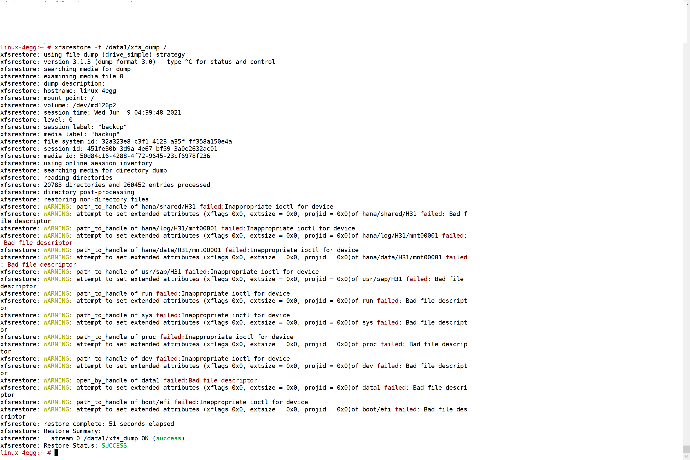
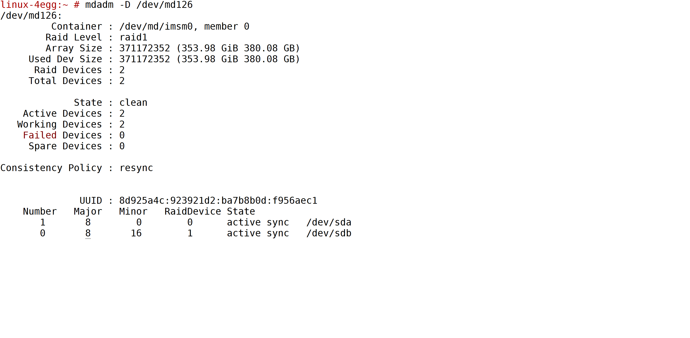

# OS backup and restore for Type II SKUs of Revision 3 stamps

This document describes the steps to perform an operating system file level backup and restore for the **Type II  SKUs** of the HANA Large Instances of Revision 3. 

>[!Important]
> **This article does not apply to Type II SKU deployments in Revision 4 HANA Large Instance stamps.** Boot LUNS of Type II HANA Large Instance units which are deployed in Revision 4 HANA Large Instance stamps can be backed up with storage snapshots as this is the case with Type I SKUs already in Revision 3 stamps


>[!NOTE]
> * The OS backup scripts uses xfsdump utility.  
> * This document supports complete Root filesystem backup and **no incremental** backups.
> * Ensure that while creating a backup, no files are being written to the same system.  Otherwise, files being written during the backup may not be included in the backup.
> * ReaR backup is deprecated for Type II SKUs of the HANA Large Instances of Revision 3.
> * We've tested this procedure inhouse against multiple OS corruption scenarios. However, since you, as customer, are solely responsible for the OS, we recommend you thoroughly test before relying on this documentation for your scenario.
> * We've tested this process on SLES OS.
> * Major versions upgrades, such as SLES 12.x to SLES 15x, aren't supported.
> * To complete an OS restore with this process, you'll need Microsoft assistance since the recovery requires console access. Please create a support ticket with Microsoft to assist in recovery.


## How to take a manual backup?

To perform a manual backup:

1. Install the backup tool.
   ```
   zypper in xfsdump
   ```

2. Create a complete backup. 
   ```
   xfsdump -l 0 -f /data1/xfs_dump /
   ```

   The following screen show shows the sample manual backup:
   
    [](media/HowToHLI/OSBackupTypeIISKUs/dump-capture.png#lightbox)


3. Important: Save a copy of backup in NFS volumes as well, in the scenario where data1 partition also gets corrupted.
   ```
   cp /data1/xfs_dump /osbackup/
   ```

4. For excluding regular directories and files from dump, please tag files with chattr.
   * chattr -R +d directory
   * chattr +d file
   * Run xfsdump with “-e” option
   * Note, It is not possible to exclude nfs filesystems [ntfs]


## How to restore a backup?

>[!NOTE]
> * This step requires engaging the Microsoft operations team.
> * To complete an OS restore with this process, Microsoft assistance is required since the recovery requires console access. Please create a support ticket with Microsoft to assist in recovery.
> * We will be restoring the complete filesystem:

1. Mount OS iso on the system.

2. Enter rescue mode.

3. Mount data1 (or nfs volume, wherever the dump is stored) partition in read/write mode.
   ```
   mount -o rw /dev/md126p4 /mnt1
   ```
4. Mount Root in read/write mode.
   ```
   mount -o rw /dev/md126p2 /mnt2
   ```
5. Restore Filesystem.
   ```
   xfsrestore -f /mnt1/xfs_dump /mnt2
   ```
   [](media/HowToHLI/OSBackupTypeIISKUs/restore-screenshot.png#lightbox)
6. Reboot the system.
   ```
   reboot
   ```

If any post checks fail, please engage the OS vendor and Microsoft for console access.

## Post Restore check

1. Ensure the system has complete attributes restored.
   * Network is up.
   * NFS volumes are mounted.
2. Ensure RAID is configured; please replace with your RAID device.
   ```
   mdadm -D /dev/md126
   ```
   [](media/HowToHLI/OSBackupTypeIISKUs/raid-status.png#lightbox)

3. Ensure that RAID disks are synced and the configuration is in a clean state.
   * RAID disks take sometime in syncing; sync may continue for a few minutes before it is 100% synced.

4. Start HANA DB and verify HANA is operating as expected.

5. Ensure HANA comes up and there are no errors.
   ```
   hdbinfo
   ```
   [](media/HowToHLI/OSBackupTypeIISKUs/hana-status.png#lightbox)

6. If any post checks fail, please engage OS vendor and Microsoft for console access.