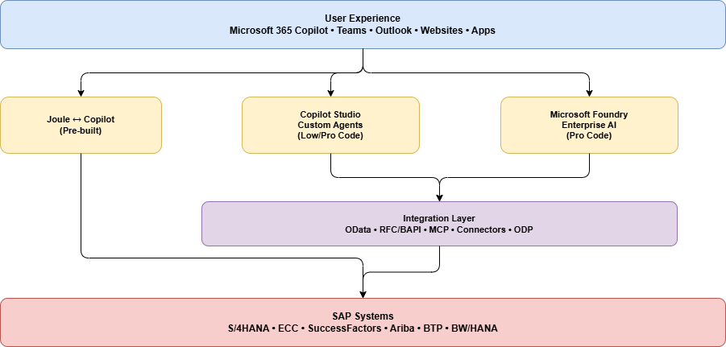

# About SAP with Microsoft AI

> [!IMPORTANT]
> When you're consuming SAP APIs and interfaces, always ensure that your usage complies with [SAP's API policy](https://help.sap.com/doc/sap-api-policy/latest/en-US/API_Policy_latest.pdf). If you have questions about permitted API usage in your specific scenario, check with your SAP contact or account team.

*SAP with Microsoft AI* refers to the combination of Microsoft's AI platform and tools (including Microsoft 365 Copilot, Copilot Studio, and Foundry) with SAP's enterprise systems. This combination can help you create intelligent, AI-powered business experiences on top of SAP data and processes.

SAP systems are the operational backbone of many organizations. Organizations use them to manage financials, supply chain, procurement, HR, and more. Microsoft AI enables organizations to unlock the value in these systems by:

- Bringing *natural language interfaces* to SAP data. You can ask questions and get answers without needing any transaction codes.
- Building *AI agents* that can reason over SAP data and take action across business processes.
- Enabling *agentic automation* that can orchestrate multistep SAP workflows.

## What are the benefits?

### For users

- **Stay in your flow of work**. Interact with SAP from Teams, Outlook, Excel, or Copilot Chat without switching to SAP GUI or Fiori.
- **Natural language access**. Ask "What is the status of PO 4500001234?" instead of navigating ME23N.
- **Faster decisions**. Get insights from SAP data combined with emails, documents, and other sources in one place.

### For organizations

- **Reduce training overhead**. Users interact with SAP through natural language, not complex UIs.
- **Accelerate processes**. AI agents can automate multistep workflows that previously required manual SAP transactions
- **Enable citizen developers**. Business users can build agents with low-code tools in Copilot Studio.
- **Maintain governance**. Enterprise-grade security, compliance, and access controls across all AI interactions with SAP.

### Common business scenarios

| Area | Example | Source |
| --- | --- | --- |
| Finance | "Show me the trial balance for cost center 1000." | Answered from SAP S/4HANA |
| Procurement | "What purchase orders are pending approval?" | Queried from SAP Ariba or S/4HANA |
| HR | "What is my remaining leave balance?" | Retrieved from SAP SuccessFactors |
| Supply Chain | "What is the delivery status for sales order 800123?" | Checked in SAP |

## What can you do?

Microsoft offers three complementary layers for bringing AI to SAP environments.

### Use out of the box: Joule and Microsoft 365 Copilot

The managed integration between SAP Joule and Microsoft 365 Copilot provides a prebuilt, bidirectional connection. Users in Microsoft 365 Copilot or Teams can ask SAP-related questions, and the request is routed to SAP Joule for processing. No custom development is required.

[Learn more about Joule and Copilot](./joule/joule-copilot-overview.md).

### Extend with custom agents: Copilot Studio

Use Copilot Studio to build company-specific agents that access SAP data through connectors, APIs, or custom plugins. You can deploy these agents in Microsoft Teams, Microsoft 365 Copilot, websites, or other channels. Options range from low-code (Agent Builder) to pro-code (Microsoft 365 Agents SDK).

[Learn more about Copilot Studio and SAP](./copilot-studio/copilot-with-sap-overview.md).

### Build enterprise AI solutions: Foundry

Microsoft Foundry is the full AI platform for advanced scenarios. These scenarios include custom models, multi-agent orchestration, Model Context Protocol (MCP) tools, and deep integration with SAP APIs (OData, RFC, BAPIs). Build sophisticated agents that can reason, plan, and execute complex multistep workflows.

[Learn more about Foundry AI and SAP](./foundry/foundry-ai-sap.md).

## How do these pieces fit together?

## How do you get started?

| Goal | Start with | Details |
| --- | --- | --- |
| You want quick value with minimal setup. | [Joule and Copilot](./joule/joule-copilot-overview.md) | If your organization already has Microsoft 365 Copilot licenses and SAP Joule enabled, the managed integration gets you started without custom development. Users can ask SAP questions directly in Teams or Copilot Chat. |
| You want to build a custom agent by using low-code development for a specific process that needs information from an SAP system. | [Copilot Studio](./copilot-studio/copilot-with-sap-overview.md) | Use Copilot Studio to build agents that are tailored to your business processes. Connect to SAP via OData connectors, custom connectors, or Microsoft Power Platform connectors. Deploy to Teams, Microsoft 365 Copilot, or websites. |
| You want advanced AI agents with multistep workflows that include SAP systems | [Foundry](./foundry/foundry-ai-sap.md) | For complex scenarios that involve multi-agent orchestration, custom models, or deep SAP integration (BAPIs, RFCs, multistep transactions), Foundry provides the full platform. |
| You want all of the preceding items | A combination of the preceding layers | They all work together. |

## Key principles

- **These options are complementary, not competing**. Most organizations use a combination based on the use case.
- **Start simple, grow complex**. Begin with Joule or a simple Copilot Studio agent, and then expand to Foundry for advanced scenarios.
- **SAP stays the system of record**. Microsoft AI adds an intelligence layer on top. It doesn't replace SAP.
- **Security and governance are built in**. All integrations respect SAP authorizations, Microsoft Entra ID, and enterprise compliance requirements.

## Related content

- [Microsoft and SAP partnership](/training/modules/microsoft-sap-partnership/)
- [Microsoft Foundry](https://ai.azure.com/)
- [Microsoft Copilot Studio](https://www.microsoft.com/en-us/microsoft-copilot/microsoft-copilot-studio)
- [Microsoft Fabric](https://www.microsoft.com/en-us/microsoft-fabric)
- [Integrating Joule with Microsoft 365 Copilot](https://help.sap.com/docs/joule/integrating-joule-with-sap/integrating-joule-with-microsoft-365-copilot)
